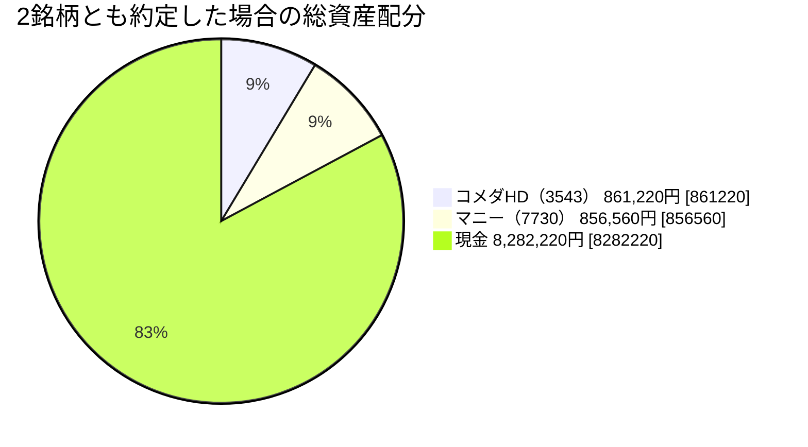

# AI株価予測検証
## Claude ChatGPT Geminiに今後の株価を予測してもらう。
### プロンプトを決める

**前提**
1. あなたには日本の株価を予測してもらいます。
1. 予測範囲は東京証券取引所のプライム・スタンダード・グロースが対象です。
1. 元本は1000万とします。
1. 現物取引のみとします。
1. 取引時間は平日の午前9時から午後3時30分(11時30分から12時30分は昼休憩)
1. 常に何かしら株を保有しなければならないわけではありません。
1. ルールの不明点がある際は私に聞いてください。

**注文を出すタイミング**
1. 日曜日に売買の判断をしてもらいます。
1. 売買の銘柄,曜日,執行条件,購入額を決めてもらいます。
1. 執行条件は、月曜日以降の「前場寄り付き」「前場引け」「後場寄り付き」「後場引け」の4つから選んでください。

**1銘柄の投資上限**
1. 1銘柄あたり最大100万円とします。
1. 銘柄数に制限はありません。

**利確・損切のルール**
1. 毎週日曜日に判断するルールだが、「購入時から〇%下落したら損切」「〇%上昇したら利確」といったルールを設けてもよいとします。
1. ルールを設けた際は必ず出力すること。

**投資理由**
1. なぜそれを買ったのかを根拠をもって説明してください。
1. 銘柄を選定した理由
1. 金額の理由
1. 日時の理由

**口座と手数料について**
1. 口座は特定口座を指定します。
1. 手数料は無料とします。

**必ず出力するもの**
1. 提案する銘柄名と銘柄コード
1. 売買アクション(新規購入/売却/継続保有)
1. 購入予定額
1. {初回以降}現在の保有銘柄一覧とそれぞれの評価損益（％）
1. {初回以降}現在の総資産残高（保有株の時価評価額 ＋ 残現金の合計）
1. {初回以降}前週比での総資産の増減率（％）
1. 総資産の内訳（保有株の時価評価額、残りの現金）

### ChatGPT 5.6 Think deeperの場合
-------------ここからはChatGPT 5.6 Think deeperの出力になります-----------------
初回は、以下の2銘柄を新規購入候補としました。

1. コメダホールディングス（3543）
2. マニー（7730）

最大購入額は合計1,717,780円です。

2銘柄とも指値上限で約定した場合でも、株式への投資比率は約17.18％にとどまります。

残りの約82.82％は現金として保有します

今回の基本方針は、次のとおりです。

- 決算内容を確認できた銘柄に限定する
- 相場全体が大幅上昇した翌日の寄り付きでは買わない
- 前場の値動きを確認してから判断する
- 指値を上回った場合は購入しない
- 初回から資金を大量に投入しない
- 購入時点で利確・損切り条件を設定する
- 指値に届かなかった銘柄を後場で追いかけない

#### 初回の注文内容

#### 注文1：コメダホールディングス（3543）

- 市場：東証プライム
- アクション：新規購入
- 注文日：2026年7月16日（木）
- 執行タイミング：前場引け
- 注文方法：指値
- 指値上限：2,890円
- 株数：298株
- 最大購入額：861,220円
- 注文有効期間：前場引けの板寄せのみ
- 未約定時：購入見送り

##### 銘柄を選んだ理由

コメダホールディングスの2027年2月期第1四半期は、売上収益が154億1,300万円となり、前年同期比で12.7％増加しました。

営業利益は26億4,600万円となり、前年同期比15.5％増でした。

売上と営業利益がともに2桁成長となっており、決算内容は良好と判断しました。

コメダホールディングスは、国内外で店舗を展開する外食関連企業です。

半導体株や証券株とは異なる要因で業績や株価が変動するため、ポートフォリオを特定のテーマに偏らせない効果も期待できます。

今回の市場上昇をけん引した半導体株や金融株をそのまま追いかけるのではなく、業績を確認できた内需系銘柄を組み入れる方針です。

##### 投資金額の理由

最大購入額は861,220円としました。

初期資金1,000万円に対する投資比率は、約8.61％です。

決算内容は良好ですが、外食産業には以下のリスクがあります。

- 原材料価格の上昇
- 人件費の上昇
- 光熱費の上昇
- 消費者の節約志向
- 店舗拡大に伴う先行費用
- 既存店売上高の伸び悩み

このため、1銘柄あたりの上限である100万円を使い切らず、約86万円に抑えます。

仮に損切り条件へ到達した場合でも、総資産への影響を限定できる金額にしています。

##### 前場引けを選んだ理由

決算発表翌日の寄り付きは、取引時間外に蓄積した売買注文により、株価が一時的に大きく変動する可能性があります。

好決算を受けて買い注文が集中した場合、寄り付き直後だけ高値になり、その後に利益確定売りで下落する可能性もあります。

そのため、前場寄り付きの成行注文は利用しません。

午前中の売買を通じて、決算に対する市場の評価がある程度形成された後の前場引けを選択します。

ただし、前場引け価格が2,890円を上回る場合は購入しません。

好決算であっても、設定した価格を超えて追いかけない方針です。

##### 指値価格の理由

2026年7月15日の終値は2,875円でした。

同日の高値は2,890円、安値は2,867円でした。

今回の指値上限は、決算発表日の高値と同じ2,890円です。

前日の高値を超える水準で追いかけて購入することを避けつつ、前日終値付近であれば購入できる価格として設定しました。

##### 利確・損切りルール

約定後は、実際の取得単価を基準に次のルールを適用します。

- 損切り：取得単価から6.0％下落
- 利確：取得単価から10.0％上昇
- 損切り条件到達時：全株売却
- 利確条件到達時：全株売却
- 週の途中でも逆指値などを利用して執行
- 売却後の資金は現金残高へ戻す
- 売却益が発生した場合は税率20.315％を考慮する

仮に2,890円で約定した場合の目安は以下です。

- 取得額：861,220円
- 損切り価格：約2,716円
- 利確価格：約3,179円

実際の利確価格と損切り価格は、確定した約定単価を基準に再計算します。

#### 注文2：マニー（7730）

- 市場：東証プライム
- アクション：新規購入
- 注文日：2026年7月16日（木）
- 執行タイミング：前場引け
- 注文方法：指値
- 指値上限：1,720円
- 株数：498株
- 最大購入額：856,560円
- 注文有効期間：前場引けの板寄せのみ
- 未約定時：購入見送り

##### 銘柄を選んだ理由

マニーは、2026年8月期の通期連結業績予想を上方修正しました。

主な修正内容は以下のとおりです。

- 売上高：328億円から329億円
- 営業利益：92億円から97億円
- 経常利益：89億5,000万円から101億5,000万円
- 親会社株主に帰属する当期純利益：64億5,000万円から68億円
- 1株当たり当期純利益：65.48円から69.03円

営業利益は前回予想から5.4％、経常利益は13.4％、当期純利益は5.4％引き上げられました。

上方修正の主な理由は、次のとおりです。

- 中国におけるダイヤバーの再販売が当初の想定を上回った
- 製品構成が改善した
- 円安の進行による為替差益が発生した
- 好調な販売が継続した

また、直近第3四半期までの売上高は前年同期比9.5％増、営業利益は同22.0％増となりました。

増収率より営業増益率が高く、利益率の改善が進んでいる点を評価しました。

財務面では自己資本比率が90％を超えており、事業環境の変化に対する耐久力も比較的高いと判断しています。

##### 投資金額の理由

最大購入額は856,560円としました。

初期資金1,000万円に対する投資比率は約8.57％です。

業績予想の上方修正と高い自己資本比率を評価していますが、以下のリスクがあります。

- 株価指標に強い割安感がない
- 上方修正に円安効果が含まれている
- 為替相場が円高方向へ変化した場合、利益が下振れする可能性がある
- 中国市場における販売動向の影響を受ける
- 業績上方修正がすでに株価へ織り込まれている可能性がある
- 好材料発表後に利益確定売りが出る可能性がある

特に、今回の業績予想では為替前提が見直されています。

このため、上方修正をそのまま全面的な買い材料とはせず、1銘柄上限の100万円より少ない約85万7,000円に抑えます。

##### 前場引けを選んだ理由

マニーについても、決算および業績予想修正後の寄り付きで成行購入することは避けます。

2026年7月15日の東証終値は1,732円でしたが、同日夜間のPTSでは東証終値を下回る価格で取引される場面がありました。

好材料が発表されたにもかかわらずPTS価格が下落している場合、市場参加者が材料を十分に評価していない、または好材料が事前に織り込まれていた可能性があります。

そのため、翌朝の寄り付きでは買わず、前場の価格形成を確認します。

前場引けまでに1,720円以下にならなければ、今回は購入しません。

##### 指値価格の理由

2026年7月15日の東証終値は1,732円でした。

同日20時54分時点の夜間PTSは1,717円で、東証終値を15円下回っていました。

今回の指値上限は、そのPTS価格に近い1,720円としました。

終値の1,732円を上回って追いかけるのではなく、好材料発表後の売りを受け止められる価格帯でのみ購入します。

前場引け価格が1,720円を超えている場合は、業績改善が株価に織り込まれている可能性が高いと判断し、今回は見送ります。

##### 利確・損切りルール

約定後は、実際の取得単価を基準に次のルールを適用します。

- 損切り：取得単価から6.5％下落
- 利確：取得単価から11.0％上昇
- 損切り条件到達時：全株売却
- 利確条件到達時：全株売却
- 週の途中でも逆指値などを利用して執行
- 売却後の資金は現金残高へ戻す
- 売却益が発生した場合は税率20.315％を考慮する

仮に1,720円で約定した場合の目安は以下です。

- 取得額：856,560円
- 損切り価格：約1,608円
- 利確価格：約1,909円

マニーは為替や海外販売の影響を受けるため、コメダホールディングスより値動きが大きくなる可能性を考慮し、損切り幅と利確幅をやや広く設定しています。

実際の利確価格と損切り価格は、確定した約定単価を基準に再計算します。

#### 未約定の場合の扱い

今回の注文は、2026年7月16日（木）の前場引けに限って有効な指値注文として扱います。

指値条件を満たさなかった場合は未約定とします。

未約定になった場合のルールは以下のとおりです。

- 後場へ注文を持ち越さない
- 後場寄り付きで買い直さない
- 成行注文へ変更しない
- 指値を引き上げない
- 翌日に同じ注文を自動的に出さない
- 未使用の資金は現金として維持する
- 次回判断日の2026年7月19日にあらためて判断する

好材料が出た銘柄であっても、設定価格を上回った場合は無理に購入しません。

購入機会を逃すことより、高値で購入して直後の下落に巻き込まれることを避ける方針です。

#### 注文前のポートフォリオ

初回判断時点では株式を保有していません。

- 保有銘柄：なし
- 保有株数：0株
- 保有株の時価評価額：0円
- 評価損益：算定対象外
- 残現金：10,000,000円
- 総資産：10,000,000円
- 前週比：初回のため算定対象外
- 運用開始時比：0.00％
- 株式比率：0.00％
- 現金比率：100.00％

2銘柄とも指値上限で約定した場合、総資産1,000万円の予定配分は以下のとおりです。

- コメダホールディングス：861,220円（約8.61％）
- マニー：856,560円（約8.57％）
- 保有株取得額合計：1,717,780円（約17.18％）
- 残現金：8,282,220円（約82.82％）
- 総資産：10,000,000円

> この図は、2銘柄とも指値上限で約定した場合の予定資産配分です。実際の資産配分は、注文の約定状況および約定価格によって変わります。

#### 今回見送った値動き

2026年7月15日は、半導体株や証券株が大きく上昇しました。

例えば、野村ホールディングスは前日比4.70％上昇し、終値は1,626円となりました。

同日の高値は1,631.5円で、年初来高値を更新しました。

活況な株式市場は証券会社の収益拡大につながる可能性がありますが、急上昇した当日に新規購入すると、翌日の利益確定売りに巻き込まれるリスクがあります。

半導体関連についても、ASMLの好決算などを背景に大きく買われた銘柄がありました。

市場の上昇モメンタムは強いものの、初回から大幅上昇した銘柄を追いかけることは避けました。

今回は、値上がり率の大きさではなく、決算内容と購入価格を重視しています。

#### 今回のリスク管理

初回は以下の方針を採用します。

1. 決算内容を確認できた銘柄だけを購入候補にする
2. 大幅上昇翌日の寄り付きで成行購入しない
3. 前場の値動きを確認してから判断する
4. 指値を上回った場合は購入しない
5. 最大投資額を総資産の約17％に抑える
6. 現金を約83％残す
7. 1銘柄の購入額を約86万円に抑える
8. 購入時点で損切り条件を決める
9. 購入時点で利確条件を決める
10. 未約定銘柄を後場で追いかけない
11. 週の途中でも逆指値などによる損切りを実行する
12. 利益確定時には特定口座の税率20.315％を考慮する

初回から利益を最大化することよりも、大きな損失を避けながら運用データを蓄積することを優先します。

#### まとめ

第1回の売買判断では、コメダホールディングスとマニーを新規購入候補としました。

ただし、相場全体が大幅に上昇した直後であることから、寄り付きの成行注文は使いません。

両銘柄とも、2026年7月16日（木）の前場引けに指値注文を出します。

- コメダホールディングス：298株、2,890円以下
- マニー：498株、1,720円以下

2銘柄とも指値上限で約定した場合の最大投資額は1,717,780円です。

残りの8,282,220円は現金として維持します。

初回の目標は、短期間で大きな利益を狙うことではありません。

決算内容、購入価格、資金配分、損切りルールを明確にし、再現可能な運用記録を残すことを優先します。

次回は2026年7月19日（日）に、注文結果と保有状況を確認したうえで次の売買判断を行います。

### Claude Sonnet 5(高)の場合
使用制限がかかってしまったので制限が解除されたのち記載します。
-----------ここからはClaude Sonnet 5(高)の出力になります-----------------------------------

### Gemini 3.5 Flash(強化思考モード)

Geminiは正確な情報を調べることができなかったため除外します。

## 免責事項
本記事は、特定の金融商品や個別銘柄の購入・売却を推奨するものではありません。 掲載している株価予測、売買判断、利確条件および損切り条件は、将来の運用成果を保証するものではありません。 株式投資には、以下のようなリスクがあります。 - 株価変動リスク - 業績悪化リスク - 為替変動リスク - 金利変動リスク - 流動性低下リスク - 決算発表後の価格急変リスク - 市場全体の急落リスク - 元本割れリスク 実際の投資判断は、ご自身の責任で行ってください。
