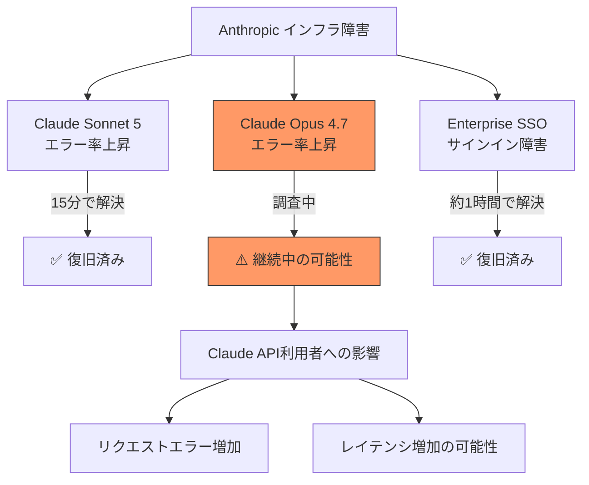
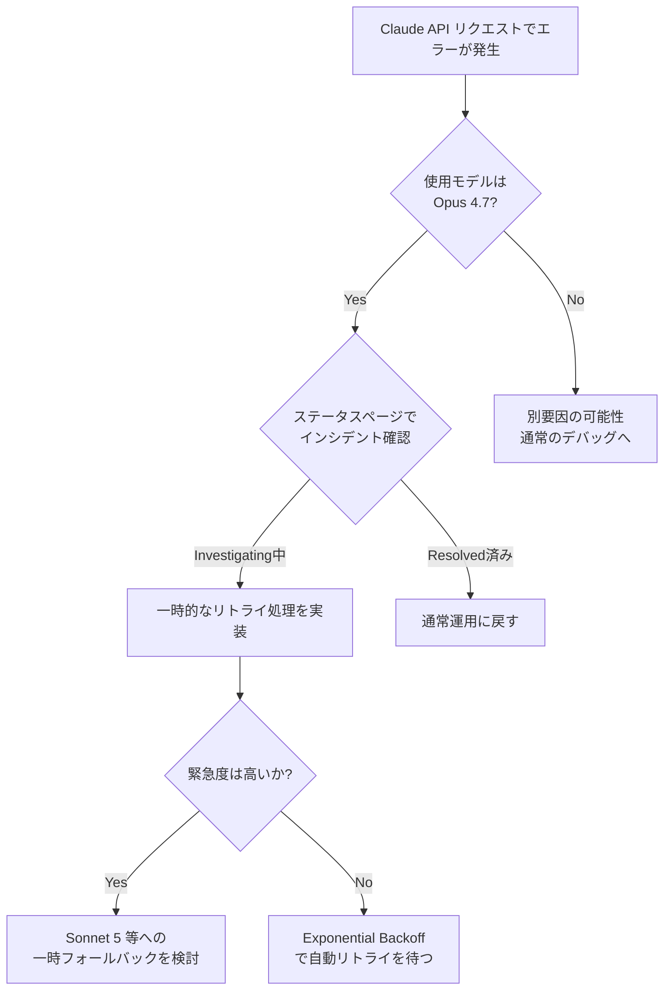

## はじめに

2026年7月16日、Anthropicのステータスページ（status.claude.com）にて、短時間のうちに**3件のインシデント**が報告されました。

- Enterprise SSO サインイン障害（解決済み）
- Claude Sonnet 5 のエラー率上昇（解決済み）
- **Claude Opus 4.7 のエラー率上昇（調査中）**

このうち2件はすでに解決済みですが、**Claude Opus 4.7 のエラー率上昇は本記事執筆時点でまだ「Investigating（調査中）」ステータス**であり、Claude APIを本番運用しているエンジニアにとっては見過ごせない状況です。特にOpus 4.7を用いたリクエストで一時的な失敗が増える可能性があるため、リトライ設計やフォールバック戦略を確認しておく価値があります。

本記事では3件の障害内容を整理し、それぞれが「誰に」「どう」影響するのか、そして開発者が今すぐ取れる対応策をまとめます。

> **📌 影響を受ける人**
> - Claude API で `claude-opus-4.7` を利用しているプロダクション環境の開発者
> - Claude.ai の Enterprise プランで SSO ログインを使っているユーザー・管理者
> - Sonnet 5 / Opus 4.7 を組み合わせたモデルルーティングを行っているシステム

## 変更の全体像

3件のインシデントの時系列と影響範囲を図にまとめました。Opus 4.7 と Sonnet 5 のエラー率上昇はほぼ同時間帯に発生しており、関連するインフラ障害だった可能性があります。

```mermaid
timeline
    title 2026-07-16 Anthropic インシデントタイムライン (UTC)
    08:39 : Sonnet 5 エラー率上昇を調査開始
    08:53 : Sonnet 5 インシデント解決
    08:58 : Opus 4.7 エラー率上昇を調査開始（継続中）
    09:23 : Enterprise SSO 障害を特定・修正開始
    10:27 : Enterprise SSO インシデント解決
```

影響範囲を整理すると以下のようになります。



## 変更内容

3件のインシデントの詳細を表にまとめます。

| ID | タイトル | Severity | ステータス | 影響対象 | 対応要否 |
|---|---|---|---|---|---|
| change-002 | Claude Opus 4.7 でエラー率上昇 | 🔴 High | 調査中 | Claude API (Opus 4.7) | ✅ 必要 |
| change-003 | Claude Sonnet 5 でエラー率上昇 | 🟡 Medium | 解決済み | Claude API (Sonnet 5) | ー |
| change-001 | Enterprise SSO サインイン障害 | 🟡 Medium | 解決済み | Claude.ai Enterprise | ー |

### Claude Opus 4.7 のエラー率上昇（調査中）

- **発生**: 2026-07-16 08:58 UTC に「Investigating」ステータスで公開
- **現状**: 提供データの時点で解決報告がなく、**継続中の可能性**あり
- **影響**: `claude-opus-4.7` を呼び出す API リクエストでエラーが増加
- **参照**: https://status.claude.com/incidents/vjfp60ngq2zj

> **⚠️ Breaking Change ではありませんが要注意**
> 機能的な破壊的変更ではなく一時的な可用性の問題ですが、本番トラフィックがOpus 4.7に集中している場合はSLA/エラーレートの監視アラートが発報する可能性があります。

### Claude Sonnet 5 のエラー率上昇（解決済み）

- 08:39 UTC に調査開始、08:53 UTC に解決済みとしてクローズ（約15分間の影響）
- Opus 4.7 と同時間帯の障害であり、関連するインフラ障害だった可能性が示唆されています
- 現在は正常稼働

### Enterprise SSO サインイン障害（解決済み）

- 09:23 UTC に問題を特定、修正を実装
- 10:27 UTC に解決済みとしてクローズ
- Enterprise プランで SSO サインインを利用しているユーザーが対象
- Claude API自体には影響なし（Claude.aiのログイン機能のみ）

## 影響と対応

Claude Opus 4.7 を利用しているシステムでは、以下の判断フローで対応を検討することをおすすめします。



> **💡 Tips**
> - 本番環境では [status.claude.com](https://status.claude.com) をポーリング、またはRSS/Webhook連携で監視することをおすすめします
> - Opus 4.7 のエラー率上昇が長引く場合は、Sonnet 5 など他モデルへの一時的なフォールバックをコード側で用意しておくと安全です
> - 解決済みの2件（SSO、Sonnet 5）については追加対応は不要です

## コード例

Opus 4.7 でのエラー増加に備えて、リトライとフォールバックを組み込む例です。

**Before（リトライなし・単一モデル固定）**

```python
import anthropic

client = anthropic.Anthropic()

response = client.messages.create(
    model="claude-opus-4-7",
    max_tokens=1024,
    messages=[{"role": "user", "content": "こんにちは"}]
)
```

**After（リトライ + フォールバックモデル）**

```python
import anthropic
import time

client = anthropic.Anthropic()

def call_with_fallback(prompt, primary_model="claude-opus-4-7", fallback_model="claude-sonnet-5", max_retries=3):
    for attempt in range(max_retries):
        try:
            return client.messages.create(
                model=primary_model,
                max_tokens=1024,
                messages=[{"role": "user", "content": prompt}]
            )
        except anthropic.APIStatusError as e:
            if attempt == max_retries - 1:
                # 最終試行でも失敗した場合はフォールバックモデルへ切り替え
                return client.messages.create(
                    model=fallback_model,
                    max_tokens=1024,
                    messages=[{"role": "user", "content": prompt}]
                )
            time.sleep(2 ** attempt)  # Exponential Backoff

response = call_with_fallback("こんにちは")
```

Opus 4.7 のエラー率が高止まりしている間だけ Sonnet 5 に切り替える、という運用が可能になります。障害解消後はフォールバック処理を無効化するか、常時のセーフティネットとして残しておくかはプロダクトの要件次第です。

## まとめ

- 2026-07-16、Anthropicで3件のインシデントが発生し、**うち2件（Enterprise SSO、Sonnet 5）は解決済み**
- **Claude Opus 4.7 のエラー率上昇は調査中**であり、本番でOpus 4.7を利用している場合は最新のステータスを確認する必要がある
- Opus 4.7 と Sonnet 5 のエラー上昇はほぼ同時間帯に発生しており、共通のインフラ要因の可能性がある
- 対応としては、①ステータスページの継続監視、②Exponential Backoffによるリトライ、③必要に応じたフォールバックモデルへの切り替え、が有効
- 障害情報は変動するため、最終的な状況は必ず [status.claude.com](https://status.claude.com) で確認してください
