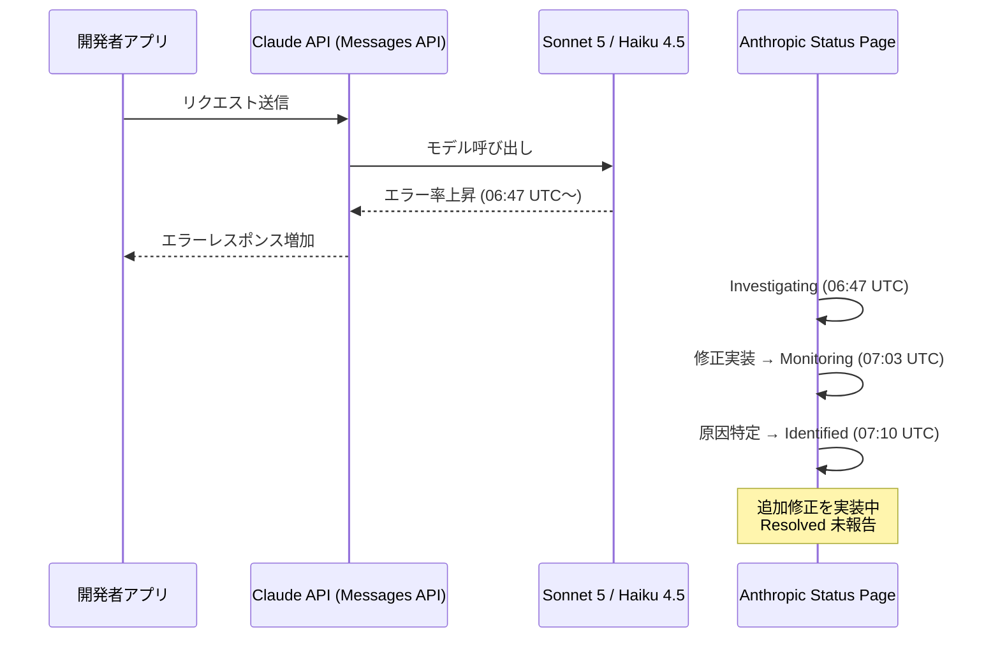
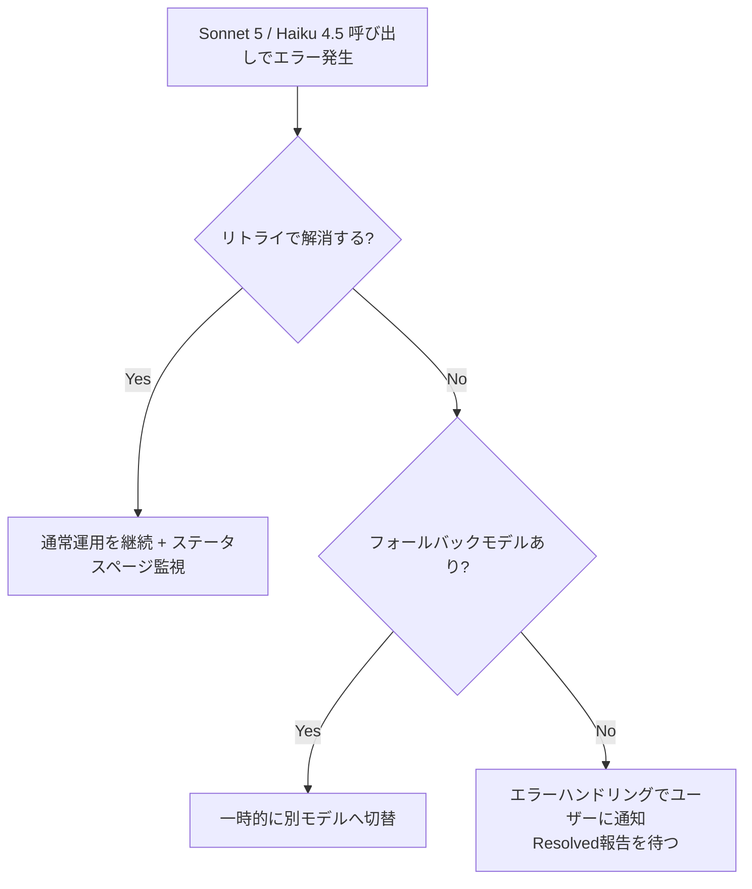

## はじめに

2026年7月17日、Anthropicのステータスページにて、**Claude Sonnet 5** および **Claude Haiku 4.5** の両モデルでエラー率が上昇するインシデントが報告されました。Claude APIを本番環境で利用している開発者にとっては、リクエスト失敗やレイテンシ増加といった形で直接影響が出る可能性がある事象です。

本記事では、公式ステータスページに掲載された情報をもとに、インシデントの経緯・影響範囲・開発者側で取るべき対応をまとめます。

> **📌 影響を受ける人**
> - Claude API (Messages API) 経由で **Sonnet 5** または **Haiku 4.5** を呼び出しているアプリケーション運用者
> - 本番トラフィックでリトライ処理やフォールバックを実装していないシステムの担当者
> - SLA/エラーレートを監視しているオンコール担当者

## 変更の全体像

今回のインシデントは「調査開始 → 修正実装 → 原因特定・追加対応」という流れで進行しています。記事執筆時点では **完全復旧（Resolved）はまだ報告されていません**。



## 変更内容

ステータスページに記録されたタイムラインは以下の通りです。

| 時刻 (UTC) | ステータス | 内容 |
|---|---|---|
| 06:47 | Investigating | Sonnet 5 / Haiku 4.5 のエラー率上昇を調査開始 |
| 07:03 | Monitoring | 修正を実装し、経過を監視するフェーズへ移行 |
| 07:10 | Identified | 問題の原因が特定され、追加の修正を実装中 |
| - | Resolved | **未報告**（記事執筆時点） |

- **影響モデル**: Sonnet 5、Haiku 4.5
- **影響API**: Claude API（Messages API）
- **影響の性質**: モデル呼び出し時にエラーが発生する可能性がある状態が継続中
- **重大度**: high（Anthropic/Claude双方に対する影響度スコア70点、critical要因として分類）

> **⚠️ Breaking Change**
> 本インシデントはAPI仕様の変更ではなく、一時的な可用性障害です。ただし「Resolved」報告が出るまではエラー発生の可能性が残るため、本番運用への影響は無視できません。

## 影響と対応

現時点でAnthropicから明示的な「対応必須（action required）」のアナウンスはありませんが、可用性に関わる問題であるため、以下の対応を推奨します。

1. **リトライ・バックオフの実装確認**
   Sonnet 5 / Haiku 4.5 呼び出し箇所で、指数バックオフ付きリトライが実装されているか再確認する。
2. **フォールバックモデルの検討**
   クリティカルなワークフローでは、一時的に他モデル（例: Opus系）への切り替えや、エラー時のグレースフルデグラデーションを用意する。
3. **監視の強化**
   [Anthropic Status Page](https://status.claude.com/incidents/7gpjd8n56rlq) を継続的にウォッチし、Resolvedステータスへの更新を確認する。
4. **ユーザー影響の説明準備**
   自社サービスのユーザーに向けて、Claude API起因のエラー増加が発生しうる旨を一時的にアナウンスできるよう準備しておく。



## コード例

エラー発生時に備え、リトライとフォールバックを組み込んだ呼び出し例です。

**Before（リトライなし）**

```python
import anthropic

client = anthropic.Anthropic()

response = client.messages.create(
    model="claude-sonnet-5",
    max_tokens=1024,
    messages=[{"role": "user", "content": "こんにちは"}]
)
```

**After（リトライ + フォールバックモデル）**

```python
import time
import anthropic

client = anthropic.Anthropic()

def call_with_fallback(primary_model, fallback_model, messages, max_retries=3):
    for attempt in range(max_retries):
        try:
            return client.messages.create(
                model=primary_model,
                max_tokens=1024,
                messages=messages
            )
        except anthropic.APIStatusError as e:
            wait = 2 ** attempt
            print(f"エラー発生（{attempt+1}/{max_retries}）: {e}. {wait}秒後にリトライ")
            time.sleep(wait)

    # プライマリモデルが失敗し続けた場合はフォールバック
    print(f"{primary_model} が失敗続き。{fallback_model} にフォールバックします")
    return client.messages.create(
        model=fallback_model,
        max_tokens=1024,
        messages=messages
    )

response = call_with_fallback(
    primary_model="claude-sonnet-5",
    fallback_model="claude-haiku-4-5-20251001",  # 状況に応じて別系統モデルを検討
    messages=[{"role": "user", "content": "こんにちは"}]
)
```

> **💡 Tips**
> インシデントがSonnet 5とHaiku 4.5の両方に影響しているため、フォールバック先を同じインシデントの影響下にあるモデルにしないよう注意してください。可能であれば影響を受けていない別系統のモデルを選定するのが安全です。

## まとめ

- 2026年7月17日、Sonnet 5とHaiku 4.5でエラー率上昇のインシデントが発生し、Anthropicが調査・対応中
- 06:47 UTCの調査開始から07:10 UTCの原因特定まで進行しているが、**Resolved（完全復旧）はまだ報告されていない**
- 影響はClaude API（Messages API）経由のモデル呼び出し全般に及ぶ可能性がある
- 開発者側ではリトライ処理の確認、フォールバックモデルの用意、ステータスページの継続監視を推奨
- 最新状況は必ず[公式ステータスページ](https://status.claude.com/incidents/7gpjd8n56rlq)で確認すること
