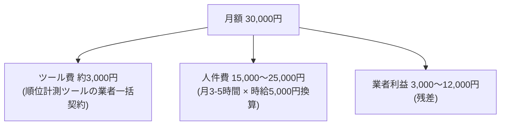
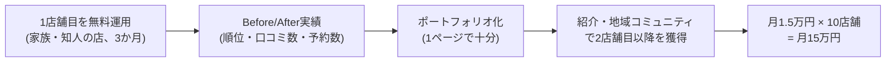

エンジニアの友人から、こんな話を聞きました。実家のラーメン屋を手伝ったら、Googleマップの検索で地元1位になった。新規客が2倍になり、同じやり方を近隣の店にも提供したら、月10万円の副業収入になった、と。

一方、世の中の店舗の多くはMEO代行業者に月3万円前後を払っています。請求書には「Googleビジネスプロフィール運用代行費」とだけ書かれていて、何の作業への対価なのか、店主は知りません。

この「月3万円」の中身は何なのか。私は書籍執筆のために、業者ヒアリングと公開情報から作業項目を分解してみました。結果は13作業・月3〜5時間。AIを併用すると月1.7〜3.3時間まで縮みます。この記事では分解の中身を公開して、エンジニアの副業として成立するのかを数字で検証します。

なお、MEOはローカル検索(Googleマップ)での上位表示施策のことです。SEOのマップ版と考えてください。市場規模は214億円あります(出典: [GMO TECH/デジタルインファクト調査](https://gmotech.jp/semlabo/meo/market-research/meo-market-size/))。

## 月3万円の中身は13作業だった

MEO代行の標準的なパッケージ(月3万円前後)で業者が行う作業を、すべて列挙します。日本のMEO市場にはツール・代行サービスが32社以上あり、価格レンジは月1,500円から5万円まで(出典: [起業LOG SaaS MEO対策ツール比較32選](https://kigyolog.com/service.php?id=362))。多くの店舗が契約しているのは月3万円前後の中央値帯です。

| # | 作業項目 | 月の頻度 | 1回あたり | 月合計 |
|---|---|---|---|---|
| 1 | 順位計測の自動取得 | 毎日(ツール) | 0分 | 0分(自動) |
| 2 | 順位データの確認・グラフ化 | 月1回 | 20分 | 20分 |
| 3 | GBPへの投稿作成 | 月4-8回 | 10-15分 | 40-120分 |
| 4 | 投稿の予約配信設定 | 月4-8回 | 3-5分 | 12-40分 |
| 5 | 写真の追加(店主撮影分のアップ) | 月10-20回 | 2分 | 20-40分 |
| 6 | 口コミ返信ドラフト作成 | 月10-30件 | 3-5分 | 30-150分 |
| 7 | 口コミ返信の投稿 | 月10-30件 | 1-2分 | 10-60分 |
| 8 | Q&Aの確認・回答 | 月1-3回 | 5-10分 | 5-30分 |
| 9 | 競合店3-5店の動向チェック | 月1回 | 20-30分 | 20-30分 |
| 10 | NAPの定期点検 | 月1回 | 10分 | 10分 |
| 11 | 月次レポート作成 | 月1回 | 30-60分 | 30-60分 |
| 12 | 月次MTG・電話説明 | 月1回 | 30-60分 | 30-60分 |
| 13 | 緊急対応(炎上、急な変更等) | 随時 | - | 平均30分 |

合計すると月3〜5時間です。GBPはGoogleビジネスプロフィール、NAPは店名・住所・電話番号の表記整合のことです。

正直、「少ない」と思いました。

月3万円という金額から、私はもっと重厚な作業を想像していたからです。でも冷静に考えると、1店舗のGoogleマップ運用でやれることは、これで全部です。順位計測はツールが自動で回し、人間の作業は投稿と口コミ返信とレポートに集中している。この作業構成が分かるだけでも、店主側の交渉力は変わります。

## AI代替で仕分けると月1.7〜3.3時間になる

13作業を「AIで代替できるか」で仕分けます。ここがエンジニアにとっての本題です。

| # | 作業項目 | AI代替 | AI併用後の時間 |
|---|---|---|---|
| 2 | 順位データ確認 | △(ツール側で大半自動) | 5分 |
| 3 | 投稿作成 | ✅ | 5-10分 |
| 6 | 口コミ返信ドラフト | ✅ | 20-50分 |
| 8 | Q&A対応 | ✅ | 5-15分 |
| 9 | 競合動向チェック | ✅ | 10-15分 |
| 11 | 月次レポート | ✅ | 10分 |
| 4,5,7,10 | 投稿予約・写真アップ・返信投稿・NAP点検 | ✖(手動操作必須) | 35-60分 |
| 12 | 月次MTG | 対人対応 | 代行側のみ発生 |

時間が一番かかる「口コミ返信ドラフト」は、プロンプトを固定すればほぼ流れ作業になります。私が使っている型はこんな形です。

```text
あなたは飲食店「◯◯食堂」の店主です。以下の口コミに店主として返信を書いてください。

制約:
- 120字以内
- 口コミで言及された具体的な内容(メニュー名、接客など)に必ず触れる
- 定型文(「貴重なご意見」「またのご来店を」)は使わない
- 事実にない特典・メニューには言及しない

口コミ: (ここに貼り付け)
```

ポイントは最後の制約です。AIが親切心で「次回は10%オフでご提供します」のような架空の特典を書いてしまうと、後述する虚偽コンテンツの問題になります。生成は自由、投稿前の事実確認は人間。この分担は崩せません。

仕分けの結果、全13作業はAI併用で月100〜200分、つまり1.7〜3.3時間に収まります。業者の月3〜5時間より短いのは、説明・MTG・レポートという「対顧客コミュニケーション」が業者側にしか発生しないからです。

## 原価構造: 9割が人件費と利益

作業時間に時給を掛けると、月3万円の内訳が見えてきます。



時給5,000円は、賞与・福利厚生・諸経費込みの企業側コストとしての仮定です。つまり月3万円のうち約9割が「業者スタッフの人件費+利益」で、ツールの原価は1割です。SaaSの原価率を見たときの既視感がありました。

もちろん、この構造は仮定に依存します。前提を動かした場合の幅も出しておきます。

| 項目 | 低ケース | 中ケース | 高ケース |
|---|---|---|---|
| 業者の月作業時間 | 3時間 | 4時間 | 5時間 |
| 時給換算 | 4,000円 | 5,000円 | 6,000円 |
| ツール卸価格 | 1,500円 | 3,000円 | 5,000円 |
| 人件費 | 12,000円 | 20,000円 | 30,000円 |
| 業者利益 | 16,500円 | 7,000円 | -5,000円(赤字) |

高ケースでは業者は赤字すれすれです。「業者はぼったくり」と切り捨てるのは早くて、丁寧にMTGをやる業者ほど利益が薄くなる構造だ、というのが分解して分かったことです。

これは批判よりも、参入余地の話として読んでください。対顧客コミュニケーションを軽くできる関係性(たとえば知人の店)から始めれば、個人はこの原価構造に勝てます。

## 副業として成立するか: 3モデルの損益

では、エンジニアが個人でこれをやったらどうなるか。価格×店舗数で3モデルを置きます。

| モデル | 価格 × 店舗数 | 月収 | 月の作業時間 |
|---|---|---|---|
| エントリー | 1.5万円 × 10店舗 | 15万円 | 10-15時間 |
| 専業フリー | 2万円 × 20店舗 | 40万円 | 15-20時間 |
| 価格訴求 | 1万円 × 30店舗 | 30万円 | 15-20時間 |

副業ならエントリーモデルが現実的です。月15万円を10〜15時間で回すと、時給換算で1万〜1.5万円。受託の副業案件の相場と比べても悪くない水準です。

ただし、この表には営業と関係構築の時間が入っていません。ここを無視すると絵に描いた餅になるので、立ち上げの流れを正直に描くとこうなります。



最初の1店舗は無料でやります。実績ゼロで月1.5万円の契約は取れないからです。3か月運用して「順位3位→1位、口コミ20件追加」のような数字を作って営業資料に仕立て、横のつながりが強い地域の店主コミュニティで1店舗目の信頼を種にして紹介を広げていく、というのが現実的な線です。

逆に言うと、無料で試させてもらえる1店舗目のアテがない人には、この副業は向いていません。

技術的なハードルは低いです。GBPの管理画面とClaude/ChatGPTが使えれば足ります。

ではエンジニアの優位性はどこにあるのか。コードを書く力より、13作業をテンプレ化・仕組み化して量産に耐える形にする設計力のほうです(ここまで分解しておいて言うのもなんですが、分解グセはエンジニアの職業病だと思います)。

## ここを外すと即死する法的ライン

収益の話だけでは片手落ちです。リスクも数字で書きます。

2024年6月、消費者庁が景品表示法のステマ告示に基づく初の措置命令を出しました。対象は東京都内のクリニックで、違反内容は「Googleマップに星4以上の口コミを投稿した患者にワクチン接種費用を550円割引」。対象期間の投稿は269件でした(出典: [AdverTimes 解説記事](https://www.advertimes.com/20240620/article464268/))。550円の割引で、行政から名指しの違反認定です。

境界線はシンプルで、「特定の評価値を条件にインセンティブを出す」と違反になります(出典: [消費者庁 ステルスマーケティング告示](https://www.caa.go.jp/policies/policy/representation/fair_labeling/stealth_marketing))。全顧客にフラットに口コミをお願いするのは合法。星4以上と条件を付けた瞬間に違反です。

代行する側に特に効いてくるのは次の3点です。

- 顧客が「サクラレビューを増やして」と言ってきたら断る。実行すると代行者自身が違反幇助を問われます
- AIで口コミの「返信」を作るのは合法、AIで口コミの「投稿」を作るのは違反。この区別を崩さない
- GBP規約違反(店舗名へのキーワード詰め込み、なりすまし等)はアカウント停止があり得ます。顧客のビジネスの生命線を預かっている自覚が必要です

契約書に「虚偽口コミ・ステマ規制違反の施策は受託対象外」と明記しておくと、断る場面で自分を守れます。規制を答えられる代行者は、答えられない業者との差別化にもなります。

## まとめ: 成立する。ただし条件付きで

月3万円のMEO代行を分解した結論です。

- 中身は13作業・月3〜5時間。約9割が人件費と利益で、ツール原価は1割
- AI併用なら月1.7〜3.3時間。作業自体の参入障壁は低い
- エントリーモデル(1.5万円×10店舗)で時給換算1万〜1.5万円。副業として成立する水準
- ただし前提が3つ: 無料で試せる1店舗目のアテ、13作業をテンプレ化する仕組み化、ステマ規制とGBP規約の理解

試しに、あなたの最寄りの店をGoogleマップで検索してみてください。上位3件の口コミ返信を見れば、その商圏の運用レベルが分かります。全部テンプレ返信だったら、それがそのまま空き地です。

> この記事は書籍『AIに選ばれる店をつくる — 店舗オーナーのための AI Native MEO 実践』の第12章・第16章・第17章を、エンジニア向けに再構成したものです。GBP整備の手順、投稿・口コミ返信のプロンプト集、業者ツール32社のカタログ、複数店舗管理の実務は書籍で扱っています。
> [AIに選ばれる店をつくる (Amazon Kindle)](https://www.amazon.co.jp/dp/B0H3VX2YZC)

## 参考文献

- [GMO TECH/デジタルインファクト MEO市場規模調査](https://gmotech.jp/semlabo/meo/market-research/meo-market-size/)
- [起業LOG SaaS MEO対策ツール比較32選](https://kigyolog.com/service.php?id=362)
- [AdverTimes ステマ規制初の措置命令解説](https://www.advertimes.com/20240620/article464268/)
- [消費者庁 ステルスマーケティング告示](https://www.caa.go.jp/policies/policy/representation/fair_labeling/stealth_marketing)
- [Gyro-n MEO 料金](https://www.gyro-n.com/meo/price/)
