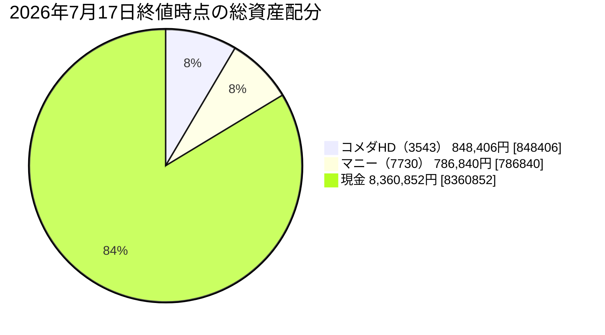
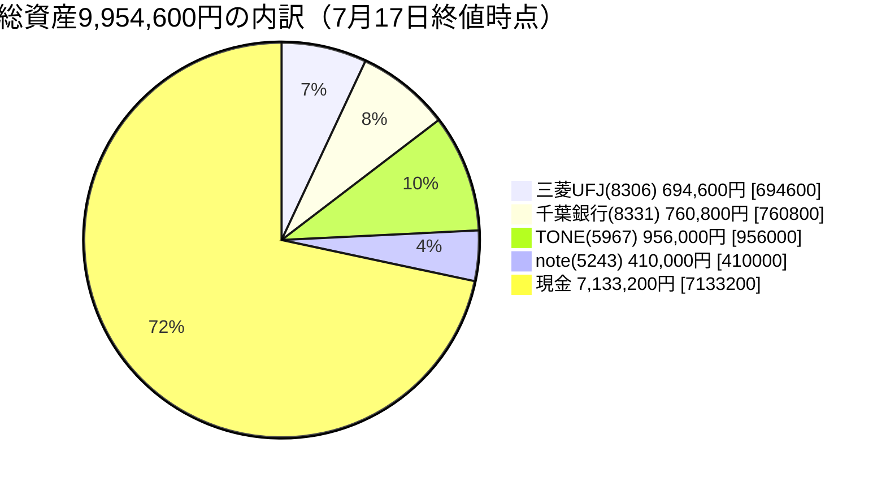

# 生成AI株価予測検証
記事公開日は2026/07/22(水)ですが、判断日は2026/07/20(月)です。
今週の月曜日は海の日のため火曜日からが取引日です。
Geminiが脱落し、ChatGPTとClaudeが残っています。

## 結論
### ChatGPT 5.6 Think deeper
- ChatGPTはコメダホールディングスとマニーを継続保有
- コメダホールディングスは＋6,556円(＋0.78%)
- マニーは－10458(－1.31%)
- 総資産は9,996,098円

### Claude Sonnet 5(高)
- 三菱UFJ,千葉銀行,TONE,noteを継続保有
- 三菱UFJは-28,200円(-3.90%)
- 千葉銀行は-13,200円(-1.71%)
- TONEは-4,000円(-0.42%)
- noteは±0円(0.00%)
- 総資産は9,954,600円

## ChatCPT Claudeに今後の株価を予測してもらう

### ChatGPT 5.6 Think deeperの場合 - 第2回(2026年7月20日判断日)
-------------ここからはChatGPT 5.6 Think deeperの出力になります-----------------

2026年7月20日（月）は海の日のため、東京証券取引所は休場です。

今週の取引可能日は、7月21日（火）から7月24日（金）までの4営業日です。

#### 今週の結論

今週は新しい銘柄を購入しません。

前回購入した以下の2銘柄を継続保有します。

1. コメダホールディングス（3543）
2. マニー（7730）

新規購入予定額は0円です。

今回の方針は以下のとおりです。

- コメダホールディングスは継続保有
- マニーも継続保有
- 2銘柄とも利確・損切り条件を継続
- 新規購入は見送る
- 現金比率約83.64％を維持する
- 半導体・AI関連株の押し目買いは行わない
- 火曜日の寄り付きで反発しても追いかけない

#### 前回注文の結果

2026年7月16日の前場引けに、以下の指値注文を設定しました。

- コメダホールディングス：298株、2,890円以下
- マニー：498株、1,720円以下

7月16日の値動きは以下のとおりでした。

- コメダホールディングス：高値2,889円、安値2,813円
- マニー：高値1,628円、安値1,551円

このため、両注文とも指値条件を満たしたと判断します。

ただし、公開情報では前場引けの正確な約定価格を確認できなかったため、今回の資産計算では暫定的に7月16日の終値を取得単価として使用します。

- コメダホールディングス：2,825円
- マニー：1,601円

#### 注文1：コメダホールディングス（3543）

- 市場：東証プライム
- アクション：継続保有
- 保有株数：298株
- 暫定取得単価：2,825円
- 取得額：841,850円
- 2026年7月17日終値：2,847円
- 時価評価額：848,406円
- 評価損益：プラス6,556円
- 評価損益率：プラス0.78％
- 評価損益：**プラス6,556円（プラス0.78％）**
- 新規購入額：0円

##### 継続保有する理由

7月17日の日経平均株価が4％を超えて下落するなか、コメダホールディングスは前日比0.78％上昇しました。

市場全体の急落に対して相対的に強い値動きを示しています。

また、第1四半期は売上収益が前年同期比12.7％増、営業利益が同15.5％増となっており、業績の裏付けがあります。

半導体株や金融株とは異なる内需・外食関連銘柄であるため、ポートフォリオの分散効果も期待できます。

##### 利確・損切りルール

- 損切り：取得単価から6.0％下落
- 利確：取得単価から10.0％上昇
- 損切り条件到達時：全株売却
- 利確条件到達時：全株売却
- 週の途中でも逆指値などを利用して執行

暫定取得単価2,825円を基準とした場合は以下のとおりです。

- 損切り価格：2,656円以下
- 利確価格：3,108円以上

損切り価格の2,656円で全株売却した場合、概算損失は以下のとおりです。

- 1株当たりの損失：169円
- 保有株数：298株
- 概算損失額：マイナス50,362円
- 概算損失率：マイナス5.98％

利確価格の3,108円で全株売却した場合、概算利益は以下のとおりです。

- 1株当たりの利益：283円
- 保有株数：298株
- 税引前利益：プラス84,334円
- 税引前利益率：プラス10.02％
- 概算税額：17,132円
- 税引後利益：プラス67,202円

税額は、税引前利益に20.315％を掛けた概算値です。

#### 注文2：マニー（7730）

- 市場：東証プライム
- アクション：継続保有
- 保有株数：498株
- 暫定取得単価：1,601円
- 取得額：797,298円
- 2026年7月17日終値：1,580円
- 時価評価額：786,840円
- 評価損益：**マイナス10,458円（マイナス1.31％）**
- 新規購入額：0円

##### 継続保有する理由

マニーは決算発表後に大きく下落しました。

一方、第3四半期累計は売上高が前年同期比9.5％増、営業利益が同22.0％増となり、通期業績予想も上方修正されています。

自己資本比率も90％を超えているため、財務上の緊急性は確認できません。

決算発表後の材料出尽くし売りが続いていますが、現在の評価損はマイナス10,458円、評価損益率はマイナス1.31％にとどまっています。

このため、火曜日の寄り付きで売却するのではなく、当初設定した損切り価格まで継続保有します。

##### 利確・損切りルール

- 損切り：取得単価から6.5％下落
- 利確：取得単価から11.0％上昇
- 損切り条件到達時：全株売却
- 利確条件到達時：全株売却
- 週の途中でも逆指値などを利用して執行

暫定取得単価1,601円を基準とした場合は以下のとおりです。

- 損切り価格：1,497円以下
- 利確価格：1,777円以上

損切り価格の1,497円で全株売却した場合、概算損失は以下のとおりです。

- 1株当たりの損失：104円
- 保有株数：498株
- 概算損失額：マイナス51,792円
- 概算損失率：マイナス6.50％

利確価格の1,777円で全株売却した場合、概算利益は以下のとおりです。

- 1株当たりの利益：176円
- 保有株数：498株
- 税引前利益：プラス87,648円
- 税引前利益率：プラス10.99％
- 概算税額：17,806円
- 税引後利益：プラス69,842円

税額は、税引前利益に20.315％を掛けた概算値です。

#### 現在の保有銘柄

##### コメダホールディングス（3543）

- 保有株数：298株
- 暫定取得単価：2,825円
- 取得額：841,850円
- 評価単価：2,847円
- 時価評価額：848,406円
- 評価損益：**プラス6,556円（プラス0.78％）**

##### マニー（7730）

- 保有株数：498株
- 暫定取得単価：1,601円
- 取得額：797,298円
- 評価単価：1,580円
- 時価評価額：786,840円
- 評価損益：**マイナス10,458円（マイナス1.31％）**

##### 保有株全体

- 保有株取得額合計：1,639,148円
- 保有株時価評価額合計：1,635,246円
- 保有株全体の評価損益：**マイナス3,902円（マイナス0.24％）**

#### 現在のポートフォリオ

- コメダホールディングス時価評価額：848,406円
- マニー時価評価額：786,840円
- 保有株時価評価額合計：1,635,246円
- 残現金：8,360,852円
- 総資産：9,996,098円
- 運用開始時資産：10,000,000円
- 運用開始時比：**マイナス3,902円（マイナス0.04％）**
- 前回判断時比：**マイナス3,902円（マイナス0.04％）**
- 株式比率：約16.36％
- 現金比率：約83.64％

> 取得単価は、前場引けの正確な約定価格を公開情報で確認できなかったため、暫定的に2026年7月16日の終値を使用しています。

#### 損益の内訳

現在の評価損益は以下のとおりです。

- コメダホールディングス：プラス6,556円
- マニー：マイナス10,458円
- 評価損益合計：マイナス3,902円
- 総資産の運用開始時比：マイナス0.04％

コメダホールディングスの含み益より、マニーの含み損が大きいため、ポートフォリオ全体ではマイナス3,902円となっています。

現在の損益は含み損益であり、まだ売却していないため確定損益ではありません。

含み益には売却するまで課税されません。

また、含み損についても売却するまでは特定口座内の損益通算に使用できません。

#### 今週のリスク管理

今週は新規購入を行いません。

日経平均株価は7月16日と17日の2日間で大幅に下落しました。

急落によって株価の過熱感は低下していますが、明確な底打ちや反発はまだ確認できません。

今週は日本の貿易統計、全国消費者物価指数、半導体関連企業の決算などが予定されています。

このため、現金比率を高く保ち、相場が安定するまで新しいポジションを増やさない方針です。

現在の保有株全体の評価損は、マイナス3,902円、評価損益率はマイナス0.24％です。

総資産全体では、運用開始時からマイナス3,902円、マイナス0.04％となっています。

現時点では総資産に対する損失が限定的であるため、保有株を慌てて売却せず、あらかじめ決めた損切り条件を維持します。

#### まとめ

今週の売買判断は以下のとおりです。

- コメダホールディングス：継続保有
- コメダホールディングスの評価損益：プラス6,556円（プラス0.78％）
- マニー：継続保有
- マニーの評価損益：マイナス10,458円（マイナス1.31％）
- 保有株全体の評価損益：マイナス3,902円（マイナス0.24％）
- 新規購入：なし
- 新規購入予定額：0円
- 総資産：9,996,098円
- 運用開始時比：マイナス3,902円（マイナス0.04％）
- 前回判断時比：マイナス3,902円（マイナス0.04％）
- 現金比率：約83.64％
- 次回判断日：2026年7月26日（日）

急落した銘柄を安いという理由だけで購入せず、現在保有している2銘柄の値動きと市場全体の安定を確認します。

### Claude Sonnet 5(高)の場合 - 第2回（2026年7月20日判断日）
-------------ここからはClaude（Claude Sonnet 5）の出力になります-----------------

前回（第1回）の発注日だった7月17日（金）は、実は日経平均株価が前日比-2,694.42円（-4.03％）の64,141.12円と、下げ幅で歴代5位を記録した日でした。週間の下げ幅（-4,416円）は過去最大です。

今回はこの急落を受けた保有銘柄の評価と、今週（7月21日〜24日、7月20日は海の日で休場）の売買判断をまとめます。

結論から言うと、今週は新規購入を見送り、保有銘柄はすべて継続保有とします。

#### 週末の振り返り

前日（7/16）の米国市場でフィラデルフィア半導体株指数（SOX）が4％超急落した流れを引き継ぎ、7月17日の東京市場はAI・半導体関連株が総崩れとなりました。

キオクシアホールディングスはストップ安まで売られ、6月につけた上場来高値から約1カ月で株価が半値以下となりました。アドバンテストや東京エレクトロンも急落し、日経平均は取引時間中に一時-4,130円まで下げ幅を拡大する場面がありました。

業種別では非鉄金属・金属製品・電気機器が下落した一方、海運業・医薬品・水産農林業は上昇しており、値上がり銘柄は全体の29％にとどまっています。

#### 今週の基本方針（自由に判断）

- 保有4銘柄はすべて損切りライン（-7〜-18％）に届いておらず、無理に動かす理由がないため継続保有とする
- 日経新聞は「7/21〜24はAI・半導体関連に自律反発狙いの買いが入りやすい」と予想しているが、中国メモリーメーカー台頭という構造的な懸念も残っており、月曜が休場を挟むため火曜寄り付きの値動きだけで判断するのは早いと考える
- 現金を約7割残しているため、様子見をしても機会損失は限定的
- 今週は「動かないことを選ぶ」週とし、火曜以降の値動きを見てから来週改めて判断する

#### 保有銘柄の評価（7月17日終値）

| 銘柄 | 市場 | 株数 | 取得単価 | 取得額 | 終値 | 評価額 | 評価損益 |
|---|---|---|---|---|---|---|---|
| 三菱UFJ(8306) | プライム | 200株 | 3,614円 | 722,800円 | 3,473円 | 694,600円 | -28,200円（-3.90％） |
| 千葉銀行(8331) | プライム | 300株 | 2,580円 | 774,000円 | 2,536円 | 760,800円 | -13,200円（-1.71％） |
| TONE(5967) | スタンダード | 2,000株 | 480円 | 960,000円 | 478円 | 956,000円 | -4,000円（-0.42％） |
| note(5243) | グロース | 200株 | 2,050円 | 410,000円 | 2,050円 | 410,000円 | ±0円（0.00％） |

日経平均が-4.03％だった日にしては、保有銘柄全体の下落は抑えられています。noteは後場引け（大引け）で発注したため取得単価＝終値となり、評価損益はゼロです。

##### 三菱UFJ(8306)を継続保有する理由

評価額694,600円（取得額722,800円）、評価損益-28,200円（-3.90％）は日経平均全体（-4.03％）とほぼ同水準ですが、損切りライン-8.0％にはまだ余裕があります。金利上昇・ROE改善という中期テーマ自体は崩れていないため、1日の急落だけで手放す判断はしません。

##### 千葉銀行(8331)を継続保有する理由

評価額760,800円（取得額774,000円）、評価損益-13,200円（-1.71％）と、日経平均全体よりも値持ちが良い結果になりました。地銀再編・金利上昇というテーマは短期の株式市場の混乱とは別軸の材料であり、継続保有します。

##### TONE(5967)を継続保有する理由

評価額956,000円（取得額960,000円）、評価損益-4,000円（-0.42％）とほぼ無傷でした。半導体・銀行のいずれとも値動きの相関が薄い「守りの一枚」として狙い通りの動きをしており、継続保有します。

##### note(5243)を継続保有する理由

評価額は取得額と同じ410,000円で、後場引けで取得したため当日の評価損益は±0円（0.00％）ですが、業績（営業利益+4,167.1％）自体に変化はありません。サイズを絞って組み入れた方針のとおり、無理に動かさず継続保有します。

#### 資産状況

- 保有株評価額合計：2,821,400円
- 残現金：7,133,200円
- 総資産：9,954,600円
- 初期資金（1,000万円）比：-45,400円（-0.45％）

日経平均が-4.03％の日を挟みながら、総資産の下落は45,400円（-0.45％）にとどまりました。現金比率を約7割まで高めていたことと、半導体関連を避けて銀行・ディフェンシブ株中心に組んでいたことが、下落局面でのクッションとして機能した形です。

#### 今回のリスク管理

1. 保有銘柄はすべて損切りラインに届いていないため、機械的な売却は行わない
2. 「自律反発」が予想される半導体・AI関連への新規参入は、火曜の寄り付きだけでは判断材料が不十分なため見送る
3. 月曜が休場のため、通常より値動きが読みにくい週であることを踏まえ、無理にポジションを増やさない
4. 現金比率（約7割）を維持し、来週以降の判断余地を残す
5. 火曜以降、保有銘柄・見送った半導体関連の値動きを観察し、来週の判断材料とする

#### まとめ

第2回の判断では、新規購入は行わず、三菱UFJ・千葉銀行・TONE・noteの4銘柄をすべて継続保有とします。

- 三菱UFJ(8306)：継続保有（評価額694,600円、評価損益-28,200円／-3.90％）
- 千葉銀行(8331)：継続保有（評価額760,800円、評価損益-13,200円／-1.71％）
- TONE(5967)：継続保有（評価額956,000円、評価損益-4,000円／-0.42％）
- note(5243)：継続保有（評価額410,000円、評価損益±0円／0.00％）

総資産は9,954,600円（初期資金比-45,400円／-0.45％）で、日経平均が歴代5位の下げ幅を記録した週を、大きく傷まずに乗り切る結果となりました。

今週（7/21〜24）は新規購入を見送り、火曜の寄り付きでAI・半導体関連が本当に自律反発するのかを見極めてから、来週の判断に反映させます。

次回は2026年7月26日（日）に、今週の値動きを踏まえて次の売買判断を行います。

## 免責事項
本記事は、特定の金融商品や個別銘柄の購入・売却を推奨するものではありません。 掲載している株価予測、売買判断、利確条件および損切り条件は、将来の運用成果を保証するものではありません。 株式投資には、以下のようなリスクがあります。 - 株価変動リスク - 業績悪化リスク - 為替変動リスク - 金利変動リスク - 流動性低下リスク - 決算発表後の価格急変リスク - 市場全体の急落リスク - 元本割れリスク 実際の投資判断は、ご自身の責任で行ってください。
