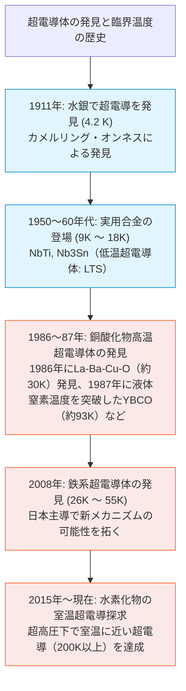

Google Antigravity 2.0 を利用して、超電導記事の作成を試してみました。
テーマや章立てをプロンプトで与え、生成された初稿がどこまで体系的な解説に仕上がるのかを検証しています。
今回は、興味のあるテーマについて読み物としてまとめてもらい、その内容をレビューしながら記事として整えていきました。

本記事は、Google Antigravity 2.0（2026年5月、Google I/O 2026で発表）で初稿を生成し、その後 Claude と Codex を用いて多角的にレビューしました。

# 超電導の極限と未来：完全総合ガイドブック

超電導（Superconductivity）は、特定の物質が極低温に冷却された際に、電気抵抗が完全にゼロになり、磁力線を排除するなどの特異な量子力学的現象を示す性質です。

本書は、超電導の基本原理から、地上・海洋での応用、宇宙や天体物理における極限状態、そして「室温超電導」を巡る歴史的な挑戦と課題までを体系的かつ美しく整理した完全総合ガイドブックです。

---

## 目次
* [第1章：超電導の基本特性と物理的起源](#第1章超電導の基本特性と物理的起源)
* [第2章：超電導体の分類・歴史と材料カタログ](#第2章超電導体の分類歴史と材料カタログ)
* [第3章：地上の応用分野と海洋・核融合テクノロジー](#第3章地上の応用分野と海洋核融合テクノロジー)
* [第4章：宇宙環境における超電導の利用可能性](#第4章宇宙環境における超電導の利用可能性)
* [第5章：超電導の空間的・天体物理的スケール限界](#第5章超電導の空間的天体物理的スケール限界)
* [第6章：超電導の実用課題と悪夢の「クエンチ」](#第6章超電導の実用課題と悪夢のクエンチ)
* [第7章：コラム：近年の「室温超電導」ブームと検証の結末](#第7章コラム近年の室温超電導ブームと検証の結末)

---

## 第1章：超電導の基本特性と物理的起源

超電導状態に達した物質は、単に「電気抵抗が低くなる」だけでなく、物理的に極めてユニークな3つの主特性を示します。

### 1.1 超電導の3大特性

| 特性 | 概要 | 具体的な現象・メリット |
| :--- | :--- | :--- |
| **電気抵抗ゼロ** (Zero Resistance) | 臨界温度（$T_c$）以下で、直流電流に対する電気抵抗が理想的には完全に $0$ になります。 | 直流送電においては導体の直流抵抗損が原理的にゼロになり、一度流した直流電流は永久電流として流れ続けます。ただし、実用上は交流損失や磁束の運動による発熱、接続部の抵抗、および冷却システムの自己消費電力を考慮する必要があります。 |
| **完全反磁性** (Meissner Effect) | 外部からの磁束（磁力線）を内部から排除し、内部の磁束密度をゼロにします（マイスナー状態）。 | 磁石の上に超電導体を置くと浮上する「マイスナー効果」として知られます。第二種超電導体では、下部臨界磁場 $H_{c1}$ 以下で磁束を排除し、それを超えると磁束量子が侵入する混合状態に入りますが、「ピン留め効果」によって磁束が固定されるため、磁石に対して空間に安定して浮上・固定されます。 |
| **ジョセフソン効果** (Josephson Effect) | 薄い絶縁体を2つの超電導体で挟んだ構造において、電圧をかけなくても超電導電流（クーパー対）が流れます。 | 高速なスイッチング動作や、微小な磁場変化の検出（SQUID）を可能にし、量子コンピュータの量子ビットなどに利用されています。 |

:::note info
**量子力学的起源：クーパー対（Cooper Pair）**
主に金属などの従来型超電導体において、2つの電子が格子の振動（フォノン）を介して互いに引き合い、ペア（対）を形成した状態です（BCS理論）。
通常、個々の電子は同じ状態を共有できない「フェルミ粒子」ですが、ペアを組むことでスピンが相殺され、同じ量子状態にいくらでも群がることができる「ボース粒子」のような振る舞いを獲得します。これにより、散乱によるエネルギー散逸（電気抵抗）が抑制され、超流動的に流れることが可能になります。
※この「格子振動が対形成の糊である」ことの歴史的な実験証明が、同位体の質量によって臨界温度が変わる**「同位体効果」**の発見でした。

なお、このフォノンを媒介とするBCS機構は従来型超電導（LTSなど）に適用されるものであり、銅酸化物や鉄系などの「非従来型超電導（Unconventional Superconductivity）」では、スピンゆらぎ等の非フォノン的な対形成機構が有力視されていますが、その詳細な機構は現在も物性物理学の未解明フロンティアです。
:::

### 1.2 Q&A：超電導状態での「電子の速さ」と「電気（信号）の速さ」
「電気の抵抗がゼロなのだから、電子は光速で流れているのか？」という疑問に対する物理学的な結論は、**「3つの異なる速さ」**を区別して考える必要があります。

1.  **個々の電子自体の動き：「フェルミ速度」（約 1,000 km/s / 光速の1%弱：約0.3%〜0.5%）**
    電流の有無に関わらず、電子は量子力学的なルールに従って常に猛烈なスピードでランダムに飛び回っています。クーパー対の電子も、それぞれこの超高速でお互いに逆向きに走りながらペアを維持しています。
2.  **電流としての実質的な移動速度：「ドリフト速度」（秒速数十メートル以下）**
    通常の銅線では**秒速 0.1 mm 〜 1 mm** 程度（カタツムリより遅い）です。超電導体では、抵抗はゼロですが、電子が一定以上の速度を超えると、クーパー対の運動エネルギーがペアの結合力（エネルギーギャップ）を上回り、ペアが壊れて超電導が崩壊します。この限界を**「臨界速度」**と呼び、通常**秒速数十メートル〜数百メートル**程度です。
3.  **電気信号が伝わる速度：「信号伝搬速度」（約 10万 〜 24万 km/s / 光速の約30%〜80%）**
    スイッチを入れた瞬間に電気が伝わるのは、電子の走る速度ではなく、導線の周囲の空間を伝わる「電磁波の電場変化」の速度です。超電導体は直流抵抗がゼロであり、高周波の電気信号を送る場合においても、通常導体（銅や銀など）に比べて圧倒的に低損失かつ低歪みで伝えることができるのが大きな強みです。

### 1.3 Q&A：極小・極限のハイスピード領域でも、なぜ「時間」がかかるのか？
どれほど小さく、どれほど高速な世界であっても、時間がゼロになること（瞬間移動や超光速伝搬）を阻む、**宇宙を支配する4つの絶対的な物理障壁**が存在します。

*   **光速 $c$ の有限性（相対性理論の壁）**:
    情報や力が伝わる速度は光速を超えることができません。1ナノメートル（$10^{-9}$ m、分子1個分）という極微の隙間であっても、光が横切るためには絶対にゼロではない時間（約 3.3 アト秒 = $10^{-18}$ 秒）が必要です。
*   **電子の質量（慣性）による加速の遅れ（力学の壁）**:
    抵抗がゼロでも電子には「質量」があり、その場に留まろうとする「慣性」があります。電圧をかけて動かそうとしたとき、瞬時に目標速度に達することはできず、加速する時間が必要です（**動的インダクタンス**）。
*   **量子力学的な状態遷移の時間（不確定性原理の壁）**:
    量子力学において、エネルギーと時間は不確定性関係（$\Delta E \cdot \Delta t \ge \hbar / 2$）によって縛り合っています。ある状態から別の超電導状態へ変化（遷移）する際には、エネルギーの差（エネルギーギャップ $\Delta$）があるため、遷移には絶対にゼロにできない最低限の時間（ニオブなどの超電導体では約1ピコ秒 = 1兆分の1秒）が必要になります。
*   **回路としての静電容量（電気回路の壁）**:
    ジョセフソン接合のように極薄の絶縁体を挟んだ構造は、ミクロなコンデンサ（キャパシタンス $C$）になります。この電荷を充放電する物理的なプロセスがあるため、切り替えには必ず時間遅れが生じます。

### 1.4 Q&A：超電導における電流・磁気・電波の相互関係とは？（交流損失と量子電圧標準）

電流・磁気・電波（電磁波）は、古典物理学においても密接に結びついていますが、超電導の中に入ると、量子力学の効果によってその関係性はより深く、劇的になります。

#### ① 電流と磁気の関係：表面での一体化と「磁束の量子化」
超電導体において、電流（クーパー対）と磁気は切り離せない「表裏一体」の関係になります。
*   **表面に縛られる電流と磁場**:
    完全反磁性（マイスナー状態）において、超電導体の内部には磁場が入れません。磁場が超電導体に入ろうとすると、その表面の極めて薄い領域（ロンドン侵入長 $\lambda \approx 50\text{ nm} \sim 500\text{ nm}$）に**シールド電流（遮蔽電流）が流れ、磁場を相殺**します。電流と磁場は、この薄皮一枚の領域にのみ「セット」で存在し、内部では両方ともほぼゼロになります（第二種超電導体の混合状態では、後述のように内部に磁束量子が部分的に侵入します）。
*   **磁化のデジタル化（磁束量子化）**:
    第二種超電導体の内部、あるいは超電導で作ったリング（輪）の中を通り抜ける磁力線は、どんな強さでも取れるわけではありません。必ず **$\Phi_0 = h/2e \approx 2.07 \times 10^{-15}\text{ Wb}$** という**「磁束量子（Fluxon）」**の整数倍という、飛び飛び（デジタル）の量に固定されます。これは「巨視的な電流ループ」が「ミクロな物理定数（プランク定数 $h$ と電子の電荷 $e$）」と直接結びついている、最も美しい量子現象の一つです。

#### ② 電流と電波（電磁波）の関係：交流（高周波）での「わずかな抵抗の発生」
超電導体は「電気抵抗ゼロ」ですが、これは**直流（DC）のときだけ**です。電波（高周波の交流）が加わると、実は**ごくわずかな抵抗（損失）が発生します**。物理学ではこれを「二流体モデル」で説明します。
*   **なぜ高周波で抵抗が出るのか？**:
    絶対零度（$0\text{ K}$）でない限り、超電導体の中にはクーパー対になれなかった「普通の電子（常伝導電子）」が少しだけ残っています。直流電流を流すときは、抵抗ゼロのクーパー対がすべての電流をバイパス（ショートカット）するため、普通の電子には電気が流れず、抵抗はゼロになります。
    しかし、電波（交流）が流れると、目まぐるしく変化する電磁場によってクーパー対が加速・減衰を繰り返します。クーパー対には「質量（慣性）」があるため、電磁場の変化に対して応答がわずかに遅れ、超電導体内部に一瞬だけ微小な「電場」が生じます。この電場が、残っていた**「普通の電子」を揺さぶって散乱を起こし、わずかな熱（交流損失）を発生させます**。
*   **実用上の意味**:
    高周波（マイクロ波や電波）領域での超電導の抵抗はゼロではありません。しかし、その値は**純銅や純金などの良導体に比べて数千分の1以下**と圧倒的に小さいため、超高感度な電波アンテナや、加速器用の電磁空洞（SRF）として極めて優れています。

#### ③ 磁気と電波の連動：直流電圧を電波に変える「交流ジョセフソン効果」
超電導の最も驚くべき特性の一つが、ジョセフソン接合（超電導体で薄い絶縁体を挟んだ素子）において、**「直流の電気」を「超高周波の電波」に直接変換できる**という性質です。
*   **電圧を電波に変える**:
    ジョセフソン接合に一定の直流電圧（$V$）をかけると、接合部を流れるクーパー対の量子力学的な位相が時間とともに変化し、電流が非常に高い周波数で細かく振動し始めます（**交流ジョセフソン効果**）。この振動電流から、直接マイクロ波やテラヘルツ波などの**電波（電磁波）が放射されます**。
    その周波数 $f$ は以下の通り電圧に完全に比例します。
    $$f = \frac{2e}{h} V \approx 483.6\text{ GHz/mV}$$
    わずか $1\text{ mV}$ （1000分の1ボルト）の電圧をかけるだけで、約 $483.6\text{ GHz}$ という超高周波の電波が生まれます。
*   **世界の電圧の基準（国家標準）**:
    逆に、この接合部に特定の周波数 $f$ の電波を照射すると、電流-電圧特性に非常に平坦で正確な電圧の階段（**シャピロステップ**）が現れます。
    $$V_n = n \frac{h}{2e} f$$
    この電圧はプランク定数 $h$ と電子の電荷 $e$、そして照射した「電波の周波数」だけで決定されるため、理論的に極めて高い不確かさの低さ（狂いのなさ）を誇ります。現在、日本を含む世界中の多くの**「電圧標準」は、この超電導と電波のコラボレーション（ジョセフソン効果を用いたジョセフソン電圧標準）によって定義・維持されています**。

### 1.5 Q&A：超電導は「摩擦ゼロ」のようなものか？（超流動との深い関係性）

「電気抵抗がゼロである超電導は、物理的な『摩擦ゼロ』と同じようなものなのか？」という疑問は、物理学の本質を突いた極めて鋭い着眼点です。

結論から言うと、**「概念的にも、背後にある量子力学的なメカニズム（数式）的にも、超電導は『電子の摩擦ゼロ流動』そのものです。また、超電導のピン留め効果を利用することで、マクロな機械部品としての『接触摩擦が原理的にほぼゼロの軸受』を実現することもできます」**。

#### ① 物理的な本質：「超電導」は「電子の超流動」である
物理学において、**電気抵抗の正体は「電子が受ける摩擦」**です。
*   通常の金属（銅など）の中を電子が走るとき、電子は結晶格子の熱振動や不純物に絶えずぶつかり、散乱（衝突）を起こします。これが「摩擦」となってエネルギーが熱として奪われるのが電気抵抗（ジュール熱）の正体です。
*   超電導状態では、超電流を担う凝縮成分（クーパー対の波動）において、格子振動や結晶欠陥による散乱から生じるエネルギー散逸（摩擦）が原理的に消失します。

この「摩擦ゼロで流れる極限状態」を、物理学では**「超流動（Superfluidity）」**と呼びます。
*   **超流動**: **「電気を持たない中性原子（ヘリウム4など）」**が極低温で示す、粘性（液体の摩擦）が測定限界以下（ゼロ）になる現象。どれほど極細の隙間でもほぼ摩擦なく通り抜け、コップの壁を這い上がって外に漏れ出します。
*   **超電導**: **「電気を持った電子」**が金属の中で示す超流動現象。

つまり、**「超電導とは、金属の中で発生している『電子の超流動（摩擦ゼロ流動）』である」**というのが物理学的な正しい理解です。

#### ② 摩擦をゼロにする量子力学の魔法：「ボース・アインシュタイン凝縮」
なぜ摩擦がゼロになるのでしょうか？それは、電子（またはヘリウム原子）が**「量子力学的な集団行動」**を始めるからです。
*   **クーパー対によるボース粒子化**:
    電子は本来、同じ量子状態に1個しか入れない「フェルミ粒子」ですが、2個の電子がペアを組んで「クーパー対」になると、同じ量子状態をいくらでも占有（群がることが）できる**「ボース粒子」**へと性質が変わります。
*   **一つの巨大な波になる（ボース凝縮）**:
    ボース粒子となった無数のクーパー対は、極低温になると全員が**「同じ量子状態（基底状態）」**に落ち込み（※BCS状態のペア形成とBECの凝縮は熱力学的に共通する特徴を持ちます）、まるで一個の巨大な「波」のように一体化します。
*   **散乱（摩擦）の禁止**:
    一体化した巨大な波（クーパー対の集団）から、たった1個の電子だけを「格子に衝突させて進路を変える（＝摩擦を起こす）」ことは、量子力学のルール（エネルギーギャップ）によって厳しく禁止されます。ペアを壊すほどの巨大な力を外から与えない限り、全員が完全に手を取り合って障害物を滑り抜けるため、摩擦（抵抗）が完全にゼロになります。

#### ③ 実用上の応用：機械的な接触摩擦を原理的にほぼゼロにする超電導軸受
超電導の「ピン留め効果（第二種超電導体）」を利用すると、SFの世界のような**「機械的に全く接触しない、接触摩擦が原理的にほぼゼロの軸受」**を作ることができます。
*   **非接触のロック（ピン留め効果）**:
    第二種超電導体の上に磁石を置くと、磁力線が超電導体内に突き刺さって固定され、磁石が空中に「完全に浮いた状態でロック」されます（超電導浮上）。
*   **回転時の非接触による摩擦低減**:
    宙に浮いて固定された磁石は、前後左右にはビクとも動きませんが、**「自転（回転）」だけは邪魔する力がないため、完全にスムーズに回すことができます**。
*   非接触であるため、金属同士の擦れ合い（機械的摩擦）が原理的にほぼゼロになり、真空中に置けば空気抵抗すらなくなります。これを利用したのが、充放電ロスが極めて少ない「超電導フライホイール蓄電システム」の磁気軸受です。

### 1.6 Q&A：超電導と「光」にはどのような関係があるか？（単一光子検出と光誘起超電導）

一見すると、電気の現象である「超電導」と、電磁波の極小単位である「光（可視光、赤外線、X線など）」には接点がないように見えます。しかし、現代の量子工学や最先端の物性物理学において、**超電導と光は驚くほど深く、そして超ハイテクな関係**で結ばれています。

主に以下の3つの劇的なシナジーがあります。

#### ① 光を1粒残らず捕まえる世界最強の目：超電導単一光子検出器（SNSPD）
光は「光子（フォトン）」という極小の粒の集まりです。超電導を使うと、**光の粒を「1粒単位」で極めて高いシステム検出効率で検出する、世界屈指の感度を持つ光センサー**を作ることができます。
*   **仕組み**: 臨界電流（超電導が壊れるギリギリの電流）を流した、極めて細い超電導ナノワイヤ（幅数十ナノメートル）を用意します。
*   **光子の衝突による超電導破壊**: ここに光の粒（光子）が1個だけ衝突すると、そのエネルギーによってクーパー対が局所的に引き裂かれ、超電導が壊れて一瞬だけ普通の「電気抵抗がある状態」になります。
*   **超高速検出**: 抵抗が発生した極めて短い時間内に電圧パルスが発生し、「光子が1個通った」ことを超高速・超高感度で検出します。※SNSPD自体は時間分解能に極めて優れますが、単体でのエネルギー（色）の分解能には制限があります。高精度なエネルギー分解能が必要な用途では、**TES（遷移エッジセンサー）**や**MKID（マイクロ波キネティックインダクタンス検出器）**などの超電導検出器が活躍します。
*   **用途**: この**超電導ナノワイヤ単一光子検出器（SNSPD）**は、高い秘匿性を持つ**「量子暗号通信」**の受信機や、宇宙の深宇宙探査船からの超長距離レーザー通信の受信機として、最先端のセキュリティと通信の基盤技術となっています。

#### ② 光で超電導を「創り出す」フロンティア：光誘起超電導（超電導様応答）
これは現代の物性物理学における最もエキサイティングなフロンティア（最前線）の一つです。
*   **レーザーで物質の温度を上げるのではなく「超電導を誘起する」**:
    通常、物質に強いレーザー光を当てると、温度が上がって超電導は壊れてしまいます。しかし、**「特定の波長の超短パルスレーザー（フェムト秒レーザー）」**を特定の物質（銅酸化物など）に極めて短い時間だけ照射すると、光の電場が結晶格子の原子を特定のパターンで強制的に振動させます。
*   **過渡的な「室温超電導的振る舞い」の報告**:
    この原子の強制的な振動が、電子をペアにする力を一時的に劇的に強めることで、本来なら極低温でしか超電導を示さない物質において、**「光が当たっている極めて短い時間（ピコ秒間）だけ、室温で超電導様応答（低周波光学伝導度の劇的な増大や過渡的な反射率変化など）を示す」**という驚くべき実験結果が報告されています。
*   光を使って超電導を自在に制御する超高速光スイッチング技術や、新しい室温超電導の動作原理の解明に向けて、世界中で熱心な研究が進められています。

#### ③ 宇宙の始まりの光を観測する「超電導テラヘルツ検出器」
宇宙から地球に届く「最も古い光（ビッグバン直後の赤外線やサブミリ波などの弱い電磁波）」は、宇宙の膨張によって引き伸ばされ、目に見えない極めて弱い電波（テラヘルツ波）になっています。
*   このかすかな「宇宙の産声」を検出するために、超電導転移端の急激な抵抗変化を利用した超高感度な熱量計（**TES**）や、ジョセフソン接合の非線形性を利用した**SISミキサ**などが、ハワイや南極の天文台、宇宙望遠鏡に搭載され、宇宙論の謎解きに貢献しています。

### 1.7 Q&A：光子を1つ捕まえたとしても、他の光子と区別できないのでは？（状態の区別と量子の不可区別性）

「すべての光子は宇宙の基本粒子として全く同じ性質を持っているのに、光子を1つ捕まえたところで、どうやって他の光子と区別して情報通信（量子暗号など）に使えるのか？」という疑問は、**量子力学における最も本質的な概念である「全同粒子の不可区別性（全同性）」**に真っ向から迫る、非常に高度で知的な問いです。

結論から言うと、**「光子という『粒子そのものの身元（名前）』を区別することはできませんが、光子が載せている『量子状態（偏光、波長、到着時間など）』は、適切な測定器によって明確に区別（測定）することができます。さらに、光子同士が『区別不可能（不可区別）であること』そのものが、量子通信や量子コンピュータにおける強力な物理的リソースになります」**。

#### ① 「粒子の身元」は区別できないが、「量子状態」は区別できる
宇宙にあるすべての光子は、質量ゼロ、スピン1という全く同じ基本スペックを持っており、個々の光子に「A君」「B君」という名前や名札を貼って区別することは不可能です。これを物理学で**「不可区別な粒子（全同粒子）」**と呼びます。

しかし、光子が持っている**「量子状態（パラメータ）」**は測定によって明確に区別できます。情報通信では、光子そのものではなく、光子が帯びている以下の「状態」に情報を乗せます。

1.  **偏光（光の振動方向）★量子暗号の主役**:
    光子が縦に振動しているか（縦偏光）、横に振動しているか（横偏光）、あるいは斜めか（斜め偏光）という状態です。超電導検出器（SNSPD）の手前に偏光フィルターを置くことで、「縦偏光の光子が来た」「横偏光の光子が来た」という状態の違いを原理的に区別して検出できます（例えば、縦＝「1」、横＝「0」と定義します）。
2.  **波長・エネルギー（光の色）**:
    赤い光子（エネルギーが低い）と、青い光子（エネルギーが高い）は、同じ光子でも状態が異なります。TESやMKIDなどの超電導検出器は、光子が衝突した際に生じる抵抗変化やインダクタンス変化の大きさ（あるいはホットスポットの広がり方）を電気的・熱量計的に測定することで、光子の「色（エネルギー）」を非常に高精度に区別できます。
3.  **到着時間（タイムビン）**:
    「時刻 $t_1$ に到着した光子」と「時刻 $t_2$ に到着した光子」は、時間的に区別されます。これを利用してデジタル信号の「0」と「1」を表現します。

#### ② 量子暗号（QKD）における「盗聴の検知」の仕組み
量子暗号通信（代表例：BB84プロトコル）では、この偏光状態を利用して情報を送ります。
*   送信者（アリス）は、光子の偏光状態（例えば縦・横・斜めの4種類の角度）にランダムに「0」か「1」を乗せて送信します。
*   受信者（ボブ）は、手元のフィルターと超電導検出器でその偏光を測定し、鍵を共有します。
*   もし途中で盗聴者（イブ）が光子を盗み見よう（測定・複製しよう）とすると、量子力学の基本原理（非直交状態の不可複製性）により、**光子の偏光状態に不可逆な変化（乱れ）が必ず生じます**。
*   ボブが超電導検出器で受信・測定した際、イブの干渉によって一定の割合でエラーが発生します。この通信後にアリスとボブが一部のキーを公開し合って照合するプロセス（古典通信による誤り訂正・プライバシー増幅）により、**「通信途中で盗聴行為による統計的エラーの上昇があった」ことが確実に検出されます**。超電導検出器が極めて高い効率で1粒ずつの状態を正確に測定することで、この安全性の統計的検証を実用的な速度で支えることができます。

#### ③ 「区別できないこと」こそが量子テクノロジーの武器になる
実は、光子が「完全に区別できない（不可区別である）」という性質は、不便どころか、量子情報技術においては極めて重要な資源（エネルギー）になります。

*   **ホン・オウ・マンデル効果（HOM効果）**:
    「完全に同一（不可区別）な2つの光子」を、ハーフミラー（50:50のビームスプリッター）に左右から同時に1個ずつ入射させると、2個の光子は**必ず同じ方向へペアになって進む（別々の方向へ分かれて進む確率がゼロになる）**という、不思議な量子干渉現象が起きます。
*   もし光子にわずかでも「区別できる違い（波長の違い、数ピコ秒の到着ズレなど）」があると、この効果は消え去り、別々に分かれて進むようになります。
*   この「不可区別な光子による干渉」は、量子テレポート、量子ルーター、量子インターネットなどの高度なネットワークを構築するための**絶対条件**です。

:::note info
**まとめ**
私たちは「光子そのもの」を区別しているのではなく、光子が運んできた**「偏光や時間、エネルギーという名の『手紙（量子状態）』」**を、超電導という極限のセンサーで開封して読み分けています。便箋（光子）が区別不可能な全く同じ物理的性質（全同性）を持っているからこそ、量子特有の強力な干渉効果（量子暗号の統計的検証や量子演算）を高い精度で機能させることができるのです。
:::

### 1.8 Q&A：超電導状態の電子は「同じ位置」にいられないのか？（パウリの排他原理とクーパー対の空間的重なりパラドックス）

物理の基本原則である**「パウリの排他原理」**と、超電導特有の**「コヒーレントな凝縮状態（ボース凝縮）」**の間には、空間的・量子力学的な面白いパラドックスが存在します。この仕組みを詳しく紐解くことで、超電導体がなぜ「全員が一丸となって流れる」ことができるのか、その深層が見えてきます。

#### ① 個々の電子は「パウリの排他原理」を絶対に破らない
電子はスピン $1/2$ を持つ「フェルミ粒子」です。宇宙の鉄則として、**「2つ以上のフェルミ粒子が、完全に同一の量子状態を共有することはできない」**というのがパウリの排他原理です。これは超電導状態の金属であっても、**1ミリも破られることはありません**。個々の電子は常に、互いに異なる微視的量子状態（軌道やスピン状態など）を維持しています。

#### ② クーパー対が創り出す「ボース粒子化」の魔法
しかし、2つの電子が格子振動（フォノン）を介して引き合い、ペア（クーパー対）を結成すると、状況は劇的に変化します。
*   通常、上向きスピン（$+1/2$）の電子と、下向きスピン（$-1/2$）の電子がペアを組むため、ペア全体の合成スピンは **$0$**（スピン一重項状態）になります。
*   合成スピンが整数（$0, 1, 2...$）の複合粒子は、物理学的に**「ボース粒子」**の振る舞いを獲得します。
*   ボース粒子はパウリの排他原理の制約を受けません。そのため、極低温において物質中の無数（アボガドロ定数規模）のクーパー対が、**「宇宙で最もエネルギーの低い、完全に同一の巨視的量子状態（基底状態）に群がって一体化する（ボース・アインシュタイン凝縮に類似した状態）」**ことが可能になります。

#### ③ 空間的パラドックス：クーパー対は「巨大な雲」である
電子同士がペアを組むと聞くと、多くの人は「2つの電子がくっついて、小さな1つの粒になっている」姿を想像するでしょう。しかし、これは誤りです。

クーパー対を構成する2つの電子の間の平均的な距離（**コヒーレンス長 $\xi$**）は、アルミニウムで約 $1,600\text{ nm}$（$1.6\text{ }\mu\text{m}$）、ニオブで約 $40\text{ nm}$ と物質によって幅がありますが、金属系超電導体では**数十 nm 〜 数 \mu m 程度**にも達します。原子の大きさが約 $0.1\text{ nm}$ ですから、クーパー対のサイズは**原子数百〜数万個分という途方もない広がりを持つ「スカスカな電子の雲」**なのです。

物理的に計算すると、この巨大なクーパー対が占める体積の内部には、**他の異なるクーパー対の電子が「数万〜数百万個」も互いに空間的に重なり合って存在している**ことになります。

#### ④ なぜ重なり合ってもパウリの排他原理と矛盾しないのか？
これほど高密度に電子が重なり合っているにもかかわらず、パウリの排他原理と共存できる理由は、重なり合っている個々の電子たちが、**「走る方向（運動量）」や「スピンの向き」において、それぞれわずかに異なるミクロな状態を取っているから**です。

同じ部屋（同じ空間）に無数の人がひしめき合っていても、全員が異なる「名札（運動量やスピン）」を持っているため、パウリのルールは完璧に守られています。

しかし、彼らの「動きのタイミング（位相）」は、マクロな波動関数 $\Psi(\mathbf{r}) = |\Psi(\mathbf{r})|e^{i\theta}$ によって完全に統一されています。
例えるなら、**「広大なスタジアムで、数万人の観客がそれぞれ異なる席（状態）に座りながらも、完璧に一糸乱れぬタイミングで同じ曲を大合唱している（ウェーブを起こしている）」**ようなものです。

全員が完全に調和し、同じタイミングで波打って動くため、前方に不純物や欠陥という「障害物（摩擦の原因）」があっても、集団全体のコヒーレンスによって滑らかに回り込み、何事もなかったかのように抵抗ゼロで流れ続けることができるのです。

---

### 1.9 Q&A：超電導状態に「なる瞬間」と「抜ける瞬間」には何が起きているのか？（相転移の熱力学とダイナミクス）

物質が超電導状態へと出入りする瞬間には、ミクロな量子力学とマクロな熱力学が激しく交差する**「相転移（Phase Transition）」**の劇的なドラマが起こっています。

#### ① 超電導に「なる瞬間」（$T$ が $T_c$ を下回る一瞬）
温度をゆっくりと下げて臨界温度 $T_c$ をまたぐその瞬間、物質はただの「よく電気を通す金属（フェルミ液体）」から「マクロな巨大量子（超電導相）」へと変貌を遂げます。

*   **ミクロ：秩序パラメータの誕生とエネルギーギャップ（盾）の形成**:
    臨界温度 $T_c$ 以下になると、電子たちがクーパー対を自発的に形成し始め、位相のそろった巨視的な波動関数（秩序パラメータ $\Psi$）が生まれます。同時に、常伝導電子が超電導状態（凝縮状態）へ落ちることで、フェルミ準位付近に**「エネルギーギャップ $\Delta$」**と呼ばれる禁制帯（盾）が形成されます。これによってクーパー対は小さな熱振動や結晶不純物による散乱から物理的に保護され、電気抵抗ゼロの流れが維持されます。
*   **熱力学：比熱の不連続なジャンプ**:
    この瞬間のエントロピー（物質の乱雑さ）自体は連続的ですが、その変化率である**「比熱（熱容量）」が突然、不連続に跳ね上がります（二次相転移）**。
    これは、バラバラに動き回っていた自由電子たちが、一斉に「超電導」という高度に組織化された新しい相（状態）へ移行した物理的な特異点です。
*   **電磁気：表面での「シールド電流」の自発的な湧き上がり**
    外部磁場が存在する状態で $T_c$ をまたぐと、超電導体の表面（ロンドン侵入長 $\lambda$）に、**外部磁場を相殺するための「超電導遮蔽電流」が自発的に湧き上がります**。これにより、物質内部から磁力線が締め出されます（マイスナー効果の発現）。

#### ② 超電導から「抜ける瞬間」（超電導が崩壊する一瞬）
超電導状態から常伝導（普通の金属）に戻る瞬間は、**「熱で壊すか」「力づく（磁場や電流）で壊すか」**によって熱力学的な挙動が180度異なります。

##### パターンA：ゆっくり温めて $T_c$ を超える場合（穏やかな二次相転移）
1.  **熱振動によるペアの融解**:
    温度が $T_c$ に近づくにつれ、熱による格子の不規則な振動が強まり、クーパー対の結合を揺さぶります。盾であるエネルギーギャップ $\Delta(T)$ は徐々に縮まり、**$T_c$ の瞬間、ジャスト $0$ に達して消失**します。
2.  **コヒーレンスの完全な喪失（デコヒーレンス）**:
    クーパー対の位相ロックが完全に解け、全員が一瞬にして「バラバラの個人（単一電子）」へと戻り、マクロな波動関数は完全に消滅します。
3.  **抵抗の復活と磁束の再侵入**:
    遮蔽電流を維持していた位相コヒーレンスが消えるため、表面の電流は一瞬で消失し、排除されていた磁力線が**物質内部へ再侵入**します。電気抵抗も、その物質が元々持っている常伝導抵抗へ戻ります。

##### パターンB：限界以上の強磁場（$H_c$）や大電流（$J_c$）をかける場合（急激な常伝導転移・熱暴走）
これは温度上昇による緩やかな変化とは異なり、システム全体の電磁気学的・熱力学的な不連続的変化を伴う現象です（特に第一種超電導体が外部磁場によって常伝導化する現象は、熱力学的に**一次相転移**に分類され、潜熱を伴います）。

1.  **エネルギーバランスの逆転**:
    磁場や電流が限界値を超えたその瞬間、超電導状態で踏ん張る（磁場を排除する）よりも、「超電導を諦めて常伝導に戻り、磁場を中に通した方が、システム全体のエネルギー（自由エネルギー）が低くて安定する」という物理的逆転が起きます。
2.  **ミリ秒以下の急速な相の崩壊**:
    限界値を超えた領域（特に第二種超電導体における常伝導コアの急激な拡大など）では、超電導状態は**ミリ秒以下の極めて短い時間内に急速に崩壊**へと向かいます。
3.  **熱暴走（runaway）現象である「クエンチ」との直結**:
    大電流が流れる実用的な大型電磁石において、この局所的な常伝導化（トリガー）が一度発生すると、そこに電流が集中して凄まじいジュール熱（$I^2R$）が発生し、それが周囲をドミノ倒しのように常伝導化させて磁石全体の破壊を招く熱的・電磁気学的な熱暴走（runaway）現象である**「クエンチ」**に直結します。

---

## 第2章：超電導体の分類・歴史と材料カタログ

超電導体は、磁場に対する挙動や動作温度によって分類されます。

### 2.1 第一種超電導体 vs 第二種超電導体

*   **第一種超電導体**: 
    臨界磁場 $H_c$ 以下で外部磁場を完全に排除（マイスナー効果）しますが、臨界磁場に達すると超電導状態が消失し、常伝導に遷移します。主に純金属（水銀、鉛、スズなど）が該当し、強い磁場に耐えられないため強磁場発生用としては実用できません。
*   **第二種超電導体**: 
    磁場が徐々に部分侵入する「混合状態」の領域（下部臨界磁場 $H_{c1}$ 〜 上部臨界磁場 $H_{c2}$）を持ちます。侵入した磁力線（磁束量子）が物質内の不純物や欠陥に捕捉される**「ピン留め効果（Flux Pinning）」**が生じることで、混合状態（$H_{c1}$ 〜 $H_{c2}$）という強い磁場の中であっても超電導領域を維持して大電流を流すことができます。**強磁場・大電流を扱う実用超電導技術の大半は第二種超電導体に基づいています（ただし、超電導量子ビットのように極低磁場・微小電流で動作する素子では、アルミニウムなどの第一種超電導体も広く利用されています）。**

### 2.2 第一種と第二種を分ける境界：GL理論とパラメーター κ

「なぜ物質によって第一種と第二種に分かれるのか？」という疑問に完璧な答えを出したのが、ヴィタリー・ギンツブルグとレフ・ランダウによる**「GL理論（Ginzburg-Landau Theory）」**です。
超電導体の電磁気学的特性を記述する2つの指標：
1.  **ロンドン侵入長（$\lambda$）**: 磁束が表面から内部へ侵入できる深さ。
2.  **コヒーレンス長（$\xi$）**: クーパー対の空間的な「広がり（サイズ）」。これより狭い空間では超電導が崩壊します。

この2つの比率を表す無次元量 **$\kappa = \lambda / \xi$** を **「GLパラメーター」** と呼びます。
*   **$\kappa < 1/\sqrt{2} \approx 0.707$ （第一種超電導体）**:
    コヒーレンス長が侵入長に比べて長い状態です。この場合、超電導領域と常伝導領域の「境界エネルギー（界面エネルギー）」が**正（プラス）**になります。システムは境界の面積を最小限にしようとするため、磁束を部分的に受け入れる境界を作らず、マイスナー効果によって磁場を完全に締め出すか、さもなくば一気に超電導を全崩壊させる（第一種）という極端な挙動を取ります。
*   **$\kappa > 1/\sqrt{2}$ （第二種超電導体）**:
    侵入長がコヒーレンス長に比べて長い（クーパー対のサイズが相対的に極小な）状態です。この場合、常伝導領域と超電導領域の境界（界面）エネルギーが**負（マイナス）**になります。システムは界面の面積を最大化して安定化を図ろうとするため、外部磁場がある値（下部臨界磁場 $H_{c1}$）を超えると、磁力線をあえて細かく切り刻み、無数の細い「常伝導の芯（磁束量子ボルテックス）」として物質内に受け入れる（混合状態）ことで、より強い磁場（上部臨界磁場 $H_{c2}$）に達するまで超電導領域を生き残らせる（第二種）という極めて巧妙な戦略を取ります。

### 2.3 低温超電導体（LTS） vs 高温超電導体（HTS）

*   **低温超電導（LTS）**:
    臨界温度が一般に数十K以下。冷媒として高価で希少な**液体ヘリウム（4.2 K / -269℃）**などの極低温技術が必要です。代表例：NbTi（ニオブチタン）、$Nb_3Sn$。
*   **高温超電導（HTS）**:
    臨界温度が比較的高い。安価で扱いやすい**液体窒素（77 K / -196℃）**や、冷凍機による冷却が利用可能です。代表例：YBCO（イットリウム系銅酸化物）、BSCCO（ビスマス系銅酸化物）。

### 2.4 代表的超電導材料カタログ

実用化されている（あるいは実用化が期待される）代表的な超電導材料のスペック表です。

| 分類 | 材料名 | 臨界温度 $T_c$ | 主な特徴・用途 | 課題・加工性 |
| :--- | :--- | :--- | :--- | :--- |
| **低温 (LTS)** | **NbTi** (ニオブチタン合金) | **9.2 K** | **【実用数No.1】** 極めてしなやかで加工しやすく、MRIや超電導リニアのほぼ全てで採用。強磁場特性も良好。 | 液体ヘリウム(4.2 K)冷却が必須であり、インフラ依存度が高い。 |
| **低温 (LTS)** | **$Nb_3Sn$** (ニオブスズ化合物) | **18.3 K** | 高磁場特性がNbTiより優れ、CERN加速器や核融合実験炉(ITER)の強磁場コイルに使用。 | 金属間化合物で非常に脆く、巻線後に約650℃で熱処理（化合）する必要があり加工が困難。 |
| **中間** | **$MgB_2$** (二ホウ化マグネシウム) | **39 K** | 2001年に秋光純教授らによって発見。安価なホウ素とマグネシウムが原料。中程度の冷凍機冷却で動く。 | 金属的だがやや脆い。臨界電流密度の向上が進められている。 |
| **高温 (HTS)** | **BSCCO** (ビスマス系銅酸化物) | **108 K** (Bi-2223) | 液体窒素温度(77 K)で動作。初めて商業用の超電導送電ケーブルや高磁場磁石として実用化。 | セラミックス製のため脆く、銀シース（鞘）の中に多芯線として詰めて加工する高価な製法が必要。 |
| **高温 (HTS)** | **YBCO / REBCO** (イットリウム・希土類系) | **93 K** | 実用線材の中でも最高級の磁場中電流維持能力。次世代の超小型強磁場核融合炉や、超高速推進の切り札。 | 脆いセラミックスを極薄のハステロイ等の金属テープ上に多層精密薄膜蒸着する「第2世代(2G)線材」製造が極めて高コスト。 |

### 2.5 臨界温度と発見の歴史

---

## 第3章：地上の応用分野と海洋・核融合テクノロジー

強力な磁場や電気抵抗ゼロの特性は、多様な地上産業、さらに海洋分野で応用・研究されています。

### 3.1 地上の主要分野

1.  **医療分野（MRI / MEG）**:
    低温超電導線を用いた電磁石により強力で極めて安定した均一磁場を発生させ、体内の水素原子の共鳴信号を捉えて高精細な断層画像（がんや脳血管障害の診断）を取得します。さらに、ジョセフソン効果による超高感度磁気センサー**SQUID（超電導量子干渉素子）**を用い、人間の脳が発する極微小な磁場（地磁気の10億分の1レベル）を捉える**脳磁図（MEG）**や心磁図（MCG）などの生体磁気診断への応用も実用化されています。
2.  **交通・輸送（超電導リニア）**:
    車載超電導磁石と地上コイルの反発・吸引力を利用し、車体を約10cm浮上させて接触摩擦が原理的にほぼゼロの状態で時速500km以上の超高速・安全走行を実現します。
3.  **エネルギー・環境（ロスフリー電力網）**:
    液体窒素で冷却した高温超電導ケーブルにより、直流送電においては導体の抵抗損失（熱ロス）を原理的にゼロにし、従来の銅線等に比べ送電損失を極めて低く抑えた高効率送電ネットワークを構築します。
4.  **情報・エレクトロニクス（量子コンピュータ）**:
    ジョセフソン接合を利用した「超電導量子ビット」により、電気的に量子状態（重ね合わせ・もつれ）を制御し、特定の複雑な計算を超高速に実行します。
5.  **科学・基礎研究（巨大加速器・核融合発電）**:
    CERNの巨大加速器による素粒子実験や、次世代エネルギーの候補である**核融合発電**において、プラズマを閉じ込める強磁場磁石として使用されます。
    *   **洋上・核融合のHTS革命**:
        従来の核融合プロジェクト（ITERなど）は巨大な低温超電導磁石（$Nb_3Sn$、約12テスラ）を使用していましたが、2021年、MITとCommonwealth Fusion Systemsの共同チームが、次世代の高温超電導線材である **REBCOテープ** を用いて **20テスラ** という驚異的な強磁場を発生する実用規模の超電導マグネットの開発に成功しました。
        核融合出力密度は磁場強度に非常に強く依存し、代表的には $B^4$ に比例するため、高磁場化は装置の小型化に直結します。MITとCommonwealth Fusion Systemsの共同チームは、この20テスラ級HTS磁石により、従来の低温超電導磁石を用いる同等性能の装置に比べて、はるかに小型な核融合システム（体積比で約40分の1という極めてコンパクトな設計）を構想可能にしたと説明しており、核融合の実用化スケジュールを数十年単位で前倒しする可能性を拓いています。

### 3.2 海上・海洋分野（船舶推進・洋上風力発電）

*   **次世代「超電導推進船」**:
    船舶用推進モーターを高温超電導化（HTS）することで、従来の銅線モーターに比べ**重量・サイズを3分の1以下に軽量化し、設計試算上は効率98%以上を達成することが期待されています**。船体の軽量化により、貨物積載量を増やし、燃料消費とCO2排出を大幅に削減します。
*   **超大型「洋上風力発電」のナセル軽量化**:
    風車最上部にある重い発電機（ナセル）を**半分以下に軽量化できると試算されており**、支柱や海底の基礎部分を細く・軽く設計できるようになるため、洋上風力発電の設置コストを劇的に引き下げます。
*   **液化水素運搬船と
