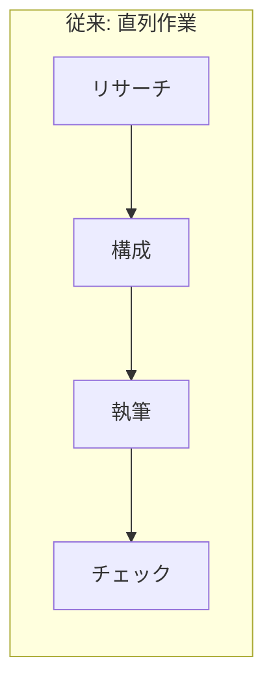

## はじめに

Claude Codeの「Agent Teams」は、複数のAIエージェントがチームを組んで並列に作業する機能です。1体のAIにすべてを任せるのではなく、リサーチ係・ライティング係・レビュー係のように役割を分担させることで、成果物の質が大きく向上します。

この記事では、Agent Teamsの仕組みから導入手順、実際に使ってみた比較結果、実践的な活用パターンまでを解説します。

## Agent Teamsとは

### 従来のAIとの違い

従来のClaude利用は「1体のAIが順番にすべてをこなす」直列作業でした。Agent Teamsでは、リーダー役のClaudeが指揮を執り、複数の担当エージェントが同時に動く並列作業になります。



```mermaid
graph TD
    subgraph Agent Teams: 並列作業
