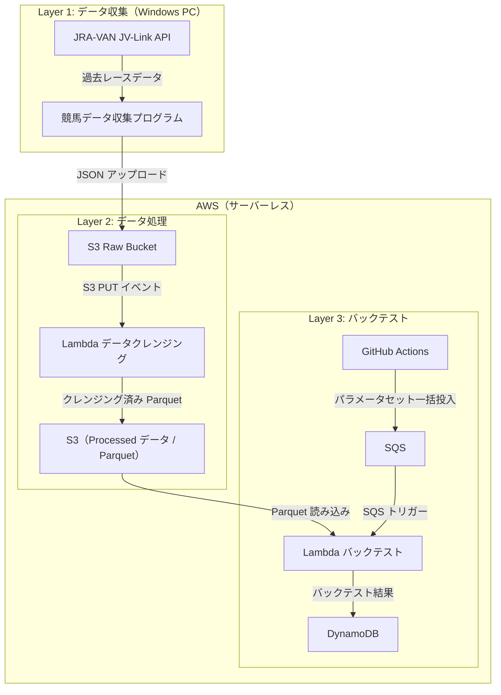

## なぜ競馬システムを個人開発したのか

趣味です。

本業ではインフラ・バックエンド・フロント領域を担当しており、要件定義から設計書、開発に携わっています。
最近では AIDD が流行っているので、私の知識をエージェントに詰め込むことで、一人開発を行えるのでは？と思い至りました。
そこで、「AIDD」と趣味の「競馬」を組み合わせて、「馬券提案システム」を作成することにしました。

先に断っておくと、目的は **「馬券で儲ける」ことではありません**。

目的は 2 つです。

1. **AI Driven Development（AIDD）の実用性検証** — AI に設計・コード生成・レビューを任せ、人間はアーキテクチャ判断と品質管理に集中するスタイルが個人開発でも通用するか検証する
2. **AWS サーバーレスのベストプラクティス実践** — 業務では触れる機会が少ない S3 イベント駆動・SQS + Lambda の大規模並列処理・DynamoDB 設計を、制約のない個人プロジェクトで徹底的に実践する

競馬を題材に選んだ理由は「データが公開されており、明確な正解（着順）があるため、バックテストで仮説検証がしやすい」からです。

「AI × AWS サーバーレス」の組み合わせがどこまで機能するか、実際の設計・構成を公開します。

---

## 1. システムの全体アーキテクチャ

### 3 層構成のサーバーレスアーキテクチャ



### 3 層の役割

| 層 | コンポーネント | 役割 |
|---|---|---|
| Layer 1 | 競馬データ収集プログラム | JRA-VAN の制約（Windows 必須）をクリアするためローカルで収集し S3 へ転送 |
| Layer 2 | データクレンジング Lambda | S3 PUT をトリガーにデータクレンジング → Parquet 変換を自動実行 |
| Layer 3 | バックテスト処理 Lambda | SQS 経由で受け取ったパラメータでバックテストを最大 1,000 並列実行 |

### 大規模トラフィックを想定した設計のこだわり

サーバーレスアーキテクチャを採用することで、様々な買い目パターンのバックテストを大規模に並列処理できる設計を実現しています。以下はその設計のポイントです。

**SQS + Lambda による最大 1,000 並列のバックテスト**

Grid Search では最大 729 通りのパラメータセットを SQS に一括投入し、Lambda がそれを並列で消化します。バッチ処理の一部が失敗しても DLQ に退避させ、成功分は正常完了とする設計です。業務でよく見る「1 件失敗でバッチ全体が巻き戻る」パターンを避けています。

このシステムがどのように構成されているかを把握したところで、次は AI をどのように組み込んで開発したかを紹介します。

---

## 2. AI 主導開発（AIDD）の具体的なフロー

### 利用した AI と使い分け

本プロジェクトでは **Claude** と **Gemini** を役割で使い分けています。

| AI | 主な用途 |
|---|---|
| **Gemini** | 要件の壁打ち・アーキテクチャの選択肢整理・初期設計のたたき台作成 |
| **Claude (Claude Code)** | 設計書の生成・実装・レビュー・テスト作成（エージェント群として動作） |

Gemini を「思考の整理役」、Claude を「実行役」として位置付けています。Gemini は会話ベースでアイデアを広げるのに向いており、Claude Code はファイルの読み書きを伴う実装タスクとの相性が良いため、この組み合わせにしました。

### AIDD とは何か

一般的に「AI にコードを書かせる」というと、単純なコード補完や部分的な自動生成を指すことが多いです。

本プロジェクトで実践した AIDD はそれとは異なります。AI が **設計書の生成・レビュー・品質管理** まで担い、人間は「何を作るか」の判断と「プロセスの設計」に集中するスタイルです。

### 開発フロー

下記のステップはあくまでサンプルですが、人間がやることを AI にやらせてみました。

**ステップ 1: 壁打ち**

まず Gemini に対して「こういうシステムを作りたいが、アーキテクチャの選択肢はどれが適切か」「このデータスキーマで問題はないか」といった疑問を投げかけます。要件の整理と選択肢の洗い出しを AI との対話で行います。

**ステップ 2: 設計書を書かせる**

Gemini で整理した要件を Claude のエージェントに渡し、詳細設計書の生成を指示します。承認後、後続のステップへ進みます。

**ステップ 3: コアロジックの検証をさせる**

コアロジックが含まれる場合、専門家に確認依頼を出すようにします。今回のケースだと、競馬の買い目最適化手法やゼロ除算・オーバーフロー・境界値の問題がないかを実装前に確認させます。

**ステップ 4: 設計レビューをさせる**

コアロジックの検証が通った設計書をレビューさせます。具体的には、設計ルールの準拠・設計書と既存コードの整合性を確認し、問題がなければ実装フェーズへ進みます。人が行う場合でも、設計段階で問題を潰しておくことで、実装後の手戻りを最小化できます。

**ステップ 5: 実装をさせる**

レビューされた設計書をもとにコードを生成させます。

**ステップ 6: ソースコードレビューをさせる**

コード品質・セキュリティ・システム目線でレビューさせます。

### 実際に AI に投げた指示の例

以下は Claude に対して実際に送った指示の一部です。

```
Aコンポーネントに、JV-Link の O1 レコード（data_kubun=1: 前売り）
を収集して morning_odds フィールドを補完する機能を追加してください。

対象コンポーネント: Aコンポーネント
参考ファイル: Aコンポーネント/詳細設計書.md
```

このように、エンジニアが自然言語で意図を伝えるだけで、設計書参照・実装・テスト作成・品質チェックまでが自動的に流れます。

### AI に設計・実装を任せるコツ

今まで培った品質管理の知見を AI 駆動開発に応用した結果、以下の 3 点が特に効いていると感じています。

**1. 設計書を先に固める**

AI にいきなりコードを書かせると、仕様の解釈ブレや設計ルールの無視が起きやすい。先に詳細設計書を作成し、AI はそれを「仕様書」として読んだうえで実装させる。

**2. マルチエージェント**

設計と実装を同一エージェントに担わせると、設計段階で誘惑に負けて実装を先走るケースが出ました。なので、例えば `設計エージェント` と `開発エージェント` を分離し、前者は設計書ファイルしか変更できない制約を持たせることで役割の逸脱を防いでいます。

**3. CLAUDE.md でルールを全エージェントに適用する**

CLAUDE.md はプロジェクトルートに置かれた Claude Code の設定ファイルです。コーディング規約・設計ルール・禁止事項をここに明文化することで、どのエージェントがどの文脈で呼ばれても同一のルールに従わせることができます。

---

## 3. 開発環境・技術スタック

本プロジェクトを再現するために必要な環境と技術スタックを整理します。

### 開発環境

| 項目 | 内容 |
|---|---|
| OS | Windows 11（JRA-VAN の JV-Link が Windows 専用のため必須） + WSL2（Python 開発用） |
| エディタ | Visual Studio Code（WSL2 リモート接続） |
| AI ツール | Claude Code（CLI）、Gemini（Web UI / CLI） |
| バージョン管理 | Git + GitHub |
| CI/CD | GitHub Actions |

### JRA-VAN 利用に必要なもの

JRA-VAN のデータを取得するには以下が必要です。

- JRA-VAN の有料会員契約（月額課金）
- Windows PC（JV-Link の動作要件）
- JV-Link のインストールと初期設定

JV-Link の詳細な利用方法は JRA-VAN の公式ドキュメントを参照してください。

これらの技術スタックと制約のなかで、AI 主導で開発を進めた 1 ヶ月の総括を次でまとめます。

---

## 4. まとめ — AI と設計書を軸にした開発スタイルは本番でも通用する

### やってみての正直な感想

1 ヶ月ほど AIDD スタイルで開発を続けた結果、以下の変化を実感しています。

**良かったこと**
- **設計品質の底上げ**: AI が設計書のドラフトを生成し、アーキテクチャレビュー専任エージェントが整合性をチェックするため、見落としが格段に減った
- **レビュー工数の削減**: コードレビューの 8 割は AI エージェントが担う。人間は「本当に重要な判断」に集中できる
- **ドキュメントの陳腐化が起きにくい**: 設計書の変更とコードの変更を同一コミットに含めるルールを AI が遵守するため、ドキュメントとコードがずれにくい

**難しかったこと**
- **エージェント定義の設計が最も難しい**: どのエージェントに何を委任するかの境界設計が曖昧だと、エージェントが迷走したり役割を越境する。この設計は完全に人間の仕事
- **AI への「指示の精度」が品質に直結する**: 自然言語で曖昧に伝えると、AI も曖昧に解釈する。業務でいう「要件定義の品質」がそのまま AI の出力品質に影響する

### 「AI に任せると品質が下がる」への答え

よく聞く懸念ですが、私の経験では **逆** でした。

AI に任せると品質が下がるのは「AI を監視する仕組みがない場合」です。設計書・レビュープロセス・CLAUDE.md のルールを人間が丁寧に設計しておけば、AI はそのルールを守ります。むしろ「疲れたから今日はレビューをざっくりにしよう」という人間の怠惰は AI には存在しません。

AIDD は「AI に全部任せる」のではなく「AI が規律を守れる環境を人間が設計する」スタイルです。エンタープライズで培った品質管理の知見は、AI 駆動開発でも十分に活きることが確認できました。

---

### この記事を書いた人

もしこの記事を読んで気になっていただけたら、下記サービスにて質問や相談を受け付けます。

- **AI 駆動開発の実践的な進め方を学びたい方** → [MENTA でメンタリングを受け付けています]( https://menta.work/plan/20377/57841 )
