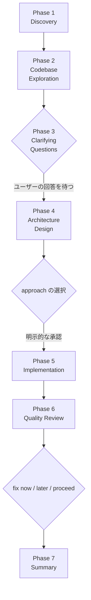
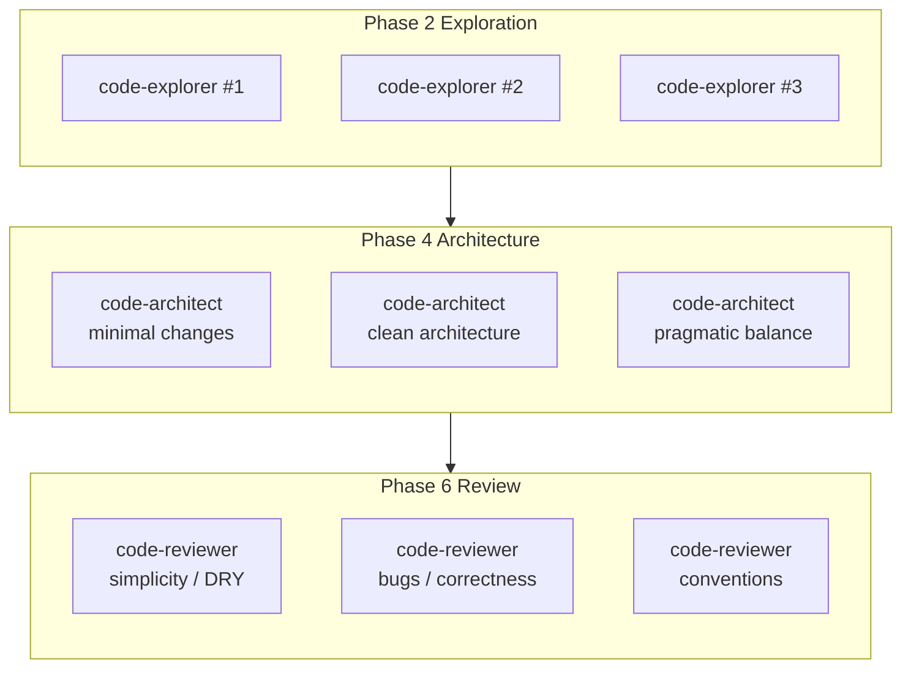
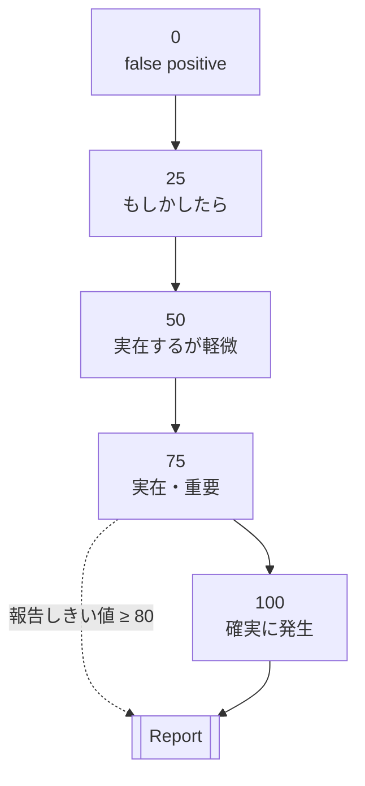

執筆者：森松 祐樹（AIエンジニア）


## 🧭 はじめに

Anthropic が公式に配布しているプラグインマーケットプレイス claude-plugins-official には、feature-dev という名前のプラグインが登録されています。配布カタログは anthropics/claude-plugins-official リポジトリにあり、実体は anthropics/claude-code/plugins/feature-dev に置かれています。plugin.json のバージョンは 1.0.0 です。

このプラグインが対象とするのは、AI コーディング環境で起きやすい「要件を曖昧にしたまま、いきなりコードを書き始めてしまう」問題です。/feature-dev と入力すると、Claude Code は **7 つのフェーズ** に沿って開発者をガイドし、要件の明確化、既存コードの把握、複数案の設計、実装、品質レビュー、最後のサマリまでを順番に進めます。

各フェーズの終わりには「ここで必ず停止してユーザーに確認する」ポイントが明示的に埋め込まれていて、そのまま実装フェーズへ飛ぶことを構造的に抑制しています。

本記事では、配布されている plugin.json / commands/feature-dev.md / 3 つのサブエージェント定義ファイルを参照しながら、/feature-dev がどのようなワークフローを提供しているのか、どこで停止するのか、なぜ 3 種類のサブエージェントを使い分けているのかを整理していきます。

記事の目的は、**/feature-dev を使うべきタスクの見極めと、同様の設計パターンを自分のプラグインに取り込む際の指針**を提示することです。

> 用語メモ：本記事では「サブエージェント」という言葉が頻出します。これは、親である Claude Code が必要に応じて呼び出す「特定の役割に特化した別の Claude」だと考えてください。

## 🚀 まずは動かす

claude-plugins-official は、Claude Code を起動した時点で自動的に利用可能な公式マーケットプレイスです。追加操作は通常不要ですが、/plugin install で「プラグインが見つからない」と表示された場合は、次のコマンドでリフレッシュまたは手動追加を行います。

```
# 通常は不要。見つからない旨のエラーが出たときのみ
/plugin marketplace update claude-plugins-official

# まだ追加されていない環境であれば
/plugin marketplace add anthropics/claude-plugins-official
```

インストール自体は 1 行です。

```
/plugin install feature-dev@claude-plugins-official
```

セッション内で即座に有効化する場合は /reload-plugins を実行します。その後、Claude Code のプロンプトから次のように呼び出せます。

```
/feature-dev Add OAuth login with Google and GitHub
```

引数なしで /feature-dev とだけ入力する呼び出し方も可能です。その場合は対話形式で「何を作るのか」を先に質問してくる動作になります。

最初のフェーズで必ず要件確認に入る設計のため、Discovery フェーズの挙動を観察したい場合は引数なしで呼び出す方法が適しています。

なお、公式ドキュメントにも記載されている通り、**プラグインはインストール先のマシンでコードを実行する仕組み**です。インストール可否は利用者側で判断する必要があります。feature-dev は Anthropic が運用する claude-plugins-official マーケットプレイスから配布されているため、その点で素性の確認は容易です。

## 🧩 7 つのフェーズの俯瞰

/feature-dev のワークフローは、次の 7 つのフェーズから構成されます。

1. **Discovery** — 何を作るのかを明確にする
2. **Codebase Exploration** — 既存コードとパターンを把握する
3. **Clarifying Questions** — 設計前にすべての曖昧さを潰す
4. **Architecture Design** — 複数案を並列で設計する
5. **Implementation** — 承認を待ってから実装する
6. **Quality Review** — 観点を分けて並列にレビューする
7. **Summary** — 何を作ったかをドキュメント化する

フェーズ間の接続には、「読み込む」「質問する」「並列エージェントを起動する」「ユーザーの承認を待つ」という 4 種類のステップが繰り返し現れます。

Phase 3、Phase 4、Phase 6 の終わりには **明示的な停止ポイント** が配置されており、ユーザーの回答や選択を待たずに次のフェーズへ進まない構造になっています。

```

```

図中の菱形は「ユーザー入力を待つ停止ポイント」を表しています。**この明示的な停止ポイントの有無が、素の Claude Code との機能的な違いを決定づける要素**です。

## 🤖 3 つのサブエージェント

/feature-dev のもう 1 つの柱が、専門化された 3 種類のサブエージェントです。いずれも model: sonnet で動作し、共通のツールセット（Glob Grep LS Read NotebookRead WebFetch TodoWrite WebSearch KillShell BashOutput）を持ちます。

3 つのエージェントのいずれにも **編集系のツール（Edit や Write）は含まれていません**。観察と提案に役割が限定されており、ファイルの書き換えは親である Claude Code の責任として残されています。

**🔍 code-explorer（Phase 2 で起動）**  
既存コードの挙動を追跡するための探索エージェントです。エントリポイント、呼び出しチェーン、抽象化レイヤ、データの流れ、依存関係を把握し、「この機能を理解するために読むべきファイル」のリストを返します。定義ファイルによれば、返答には file:line 形式の参照が必ず含まれる想定です。

**🏛 code-architect（Phase 4 で起動）**  
設計ブループリントを提示するエージェントです。既存パターンを抽出したうえで、「どのファイルを新規作成し、どのファイルを変更するか」「どのフェーズで段階的に実装するか」を具体的に示します。

このエージェントは「複数案を並べる」のではなく **「ひとつの案にコミットする」設計** です。複数案の並行検討は commands/feature-dev.md 側で行われ、観点の異なる 2〜3 個の code-architect を並列起動することによって実現されます。

**🧪 code-reviewer（Phase 6 で起動）**  
コードレビューに特化したエージェントです。CLAUDE.md に書かれたプロジェクト規約への準拠、バグ、品質課題、セキュリティ懸念を 0〜100 の confidence score（指摘の確からしさを表すスコア）で評価し、「confidence ≥ 80 のものだけを報告する」というルールに従います。しきい値は定義ファイルに明記されています。

```

```

Phase 2 / Phase 4 / Phase 6 ではそれぞれ複数のサブエージェントが並列で走ります。**同じ種類のエージェントに異なる観点を割り当てることで、単一エージェントの視点の偏りを補正する構造** になっています。

## 🔬 前半フェーズの中身

前半 3 フェーズの目的は、「実装フェーズに入る前に、未解決の曖昧さを残さない」ことに集約されます。ここでの取りこぼしが Phase 5 以降の手戻りを生むため、プラグイン側もこの前半に強い制約を課しています。

**🗣 Phase 1: Discovery**

ユーザーが /feature-dev Add caching のように短く依頼した場合、Phase 1 は「何をキャッシュするのか」「どの程度のパフォーマンスを狙うのか」「好みのソリューションはあるか」といった質問を返します。

要件が曖昧なまま Phase 2 に進むと、並列起動したエージェントの探索対象がぼやけ、得られる理解も薄くなります。Phase 1 は後続フェーズのための **最低限の足場を作る役割** を担います。

**🧭 Phase 2: Codebase Exploration**

Phase 2 では、2〜3 個の code-explorer を並列で起動し、それぞれに異なる観点を割り当てます。commands/feature-dev.md には次のようなプロンプト例が記載されています。

* "Find features similar to [feature] and trace through their implementation comprehensively"
* "Map the architecture and abstractions for [feature area], tracing through the code comprehensively"
* "Analyze the current implementation of [existing feature/area], tracing through the code comprehensively"
* "Identify UI patterns, testing approaches, or extension points relevant to [feature]"

並列エージェントの返答には、キーファイル 5〜10 件のリストが含まれます。

プラグインの運用ルールでは、**サブエージェントが返してきた主要ファイルを親である Claude Code が実際に Read することが明示的に要求** されています。サマリのみに基づいて設計へ進むのではなく、実ファイルを読んだ上で次フェーズに進むことで、以降のフェーズの判断根拠が強化されます。

**❓ Phase 3: Clarifying Questions**

commands/feature-dev.md の中で、CRITICAL という言葉まで使って強調されているのはこのフェーズです。原文には CRITICAL: This is one of the most important phases. DO NOT SKIP. と明記されており、プラグインとして「飛ばしてはいけない」と宣言しています。

実装開始を止める DO NOT START WITHOUT USER APPROVAL は Phase 5 にも存在しますが、「そのフェーズ自体を飛ばすな」と大文字で言明されているのは Phase 3 のみです。

このフェーズでは、エッジケース、エラー処理、統合ポイント、スコープの境界、後方互換性、パフォーマンス要求といった「曖昧なまま残りがちな論点」を洗い出し、整理したリストとしてユーザーに提示します。その後、ユーザーの回答を待ちます。

ユーザーが「任せる」と答えた場合でも、そのまま進むのではなく、**推奨案を提示したうえで明示的な確認を取る** ように指示されています。「沈黙の同意」での進行は構造的に禁止されています。

OAuth 追加の例では、公式 README に次の質問例が掲載されています。

```
1. OAuth provider: Which OAuth providers? (Google, GitHub, custom?)
2. User data: Store OAuth tokens or just user profile?
3. Existing auth: Replace current auth or add alongside?
4. Sessions: Integrate with existing session management?
5. Error handling: How to handle OAuth failures?
```

いずれも「実装に入ってから気づくと手戻りが大きくなる論点」です。これらの質問は Phase 2 の並列探索結果を踏まえて生成されるため、既存コードの文脈に即した問いが形成されます。

## 🏗️ 設計とレビューの仕組み

後半のフェーズでは、「設計の選択肢」と「品質のしきい値」という 2 つの軸が明確に分離されています。複数案から選ばせる Phase 4 と、ノイズの少ない指摘だけを残す Phase 6 が、それぞれ異なる仕組みで作業効率を担保しています。

**🗺 Phase 4: Architecture Design — 3 アプローチを並走させる**

Phase 4 では、code-architect を 2〜3 個並列で起動します。それぞれに次のフォーカスが渡されます。

* **Minimal Changes**: 変更を最小化し、既存コードの再利用を最大化する
* **Clean Architecture**: 保守性とエレガントな抽象化を優先する
* **Pragmatic Balance**: スピードと品質のバランスを取る

公式 README の OAuth 例では、各アプローチに Pros / Cons が並び、そのうえで「Recommendation: Approach 3」のように 1 案を推奨として提示し、最後に「Which approach would you like to use?」と明示的に選択を求める構成になっています。

選択肢の列挙のみで終わらせず、**推奨案と選択依頼をワンセットで出力する設計** です。

個々の code-architect は「複数案を並べるのではなく、一つの案にコミットする」ように設計されています。多様性は、エージェント側の迷いからではなく、オーケストレータ側（つまり commands/feature-dev.md 側）の起動パラメータから生じる構造です。

**🛠 Phase 5: Implementation — 明示承認のあとに始まる**

実装フェーズは、ユーザーが Phase 4 で選択したアプローチを承認してから開始されます。公式ドキュメントには DO NOT START WITHOUT USER APPROVAL と明記されており、暗黙の承認での開始は禁止されています。

実装中は TodoWrite で進捗を追跡し、Phase 2 で読んだファイル、Phase 4 で決定した設計、プロジェクトの既存パターンに従ってコードを書き進めます。

設計フェーズで選ばれたアプローチを遵守することが繰り返し強調されており、**実装中にアーキテクチャ上の判断が再決定される事態を避ける** 構造になっています。

**🧮 Phase 6: Quality Review — Confidence Score でノイズを落とす**

Phase 6 では、観点を分けた 3 つの code-reviewer を並列で起動します。観点はそれぞれ次のとおりです。

* **simplicity / DRY / elegance**: コード品質と保守性
* **bugs / correctness**: 機能的な正しさとロジックエラー
* **project conventions / abstractions**: プロジェクト標準への準拠

code-reviewer の定義ファイルには、すべての指摘に 0〜100 の confidence score が付与される仕組みが記述されています。スケールは次のように定義されています。

```

```

報告されるのは confidence 80 以上の指摘のみです。「実在性は高いが重要度は低い可能性がある」レベル以下は自動的に除外されます。

**レビュー出力をノイズで埋めないことで、指摘の可読性と実効性を保つ設計** です。

最終的に、Critical と Important の 2 層に分類された指摘と、それぞれの file:line 参照、具体的な修正案が返されます。続けて、「いま直す / あとで直す / このまま進める」の 3 択がユーザーに提示され、その回答に従って次の対応が決まります。

**📒 Phase 7: Summary — 作ったものを明文化する**

最後のフェーズは、実装の事実関係を記録する役割を担います。TodoWrite で全タスクを完了状態に更新し、「作ったもの」「判断したこと」「変更したファイル」「次に提案したいステップ」を簡潔にまとめます。振り返りの工程を欠落させないことが目的であり、この出力をもってワークフローが完了します。

## 🧰 いつ使い、いつ使わないか

公式 README では、このプラグインが合うタスクと合わないタスクが明示されています。

**使うべき場面**

* 複数ファイルに触れる新機能
* アーキテクチャ上の判断を伴うもの
* 既存コードとの複雑な統合が必要なもの
* 要件がまだ十分に固まっていないもの

**使うべきでない場面**

* 1 行修正のバグ対応
* 軽微なリファクタリング
* 定義がはっきりしたシンプルなタスク
* 緊急のホットフィックス

ホットフィックスに適用した場合、Phase 1〜4 をすべて経由してから実装に入るため、結果としてリードタイムが増加します。判断基準は「**構造化プロセスのコストに見合うかどうか**」であり、README も「シンプルな変更には使わない」と明記しています。

適用対象としては、機能単位の中規模タスクが最も効率的です。

## 🆚 隣接アプローチとの違い

/feature-dev の立ち位置を明確化するため、2 つの代表的な隣接アプローチと比較します。


素の Claude Code との差分は「プロセスに停止ポイントがあるかどうか」、Kiro 風 Spec-Driven Development との差分は「仕様をファイルとして永続化するかどうか」です。**3 つは競合関係ではなく補完関係** にあります。

ドキュメントとしての永続化が必要なら Kiro 風、1 機能の実装を順序立てて進めたいなら /feature-dev、軽いタスクなら素の Claude Code、という棲み分けが可能です。

/feature-dev はプラグインとして配布されているため、中身を読んで自分用に改造することもできます。commands/feature-dev.md をフォークし、チームが重視する観点を Phase 4 や Phase 6 に追加する運用が想定できます。たとえば、セキュリティレビュー観点を 4 つ目の code-reviewer として追加する拡張は実装可能な範囲に収まります。

## 🧠 設計上のヒント

/feature-dev のファイル群を通読すると、「AI にプロセスを持たせる」ための設計パターンがいくつか確認できます。自分のプロジェクトで Skill やエージェントを構築する際の参考になる観点を列挙します。

1. **停止ポイントを文書に埋め込む**: CRITICAL ... DO NOT SKIP や DO NOT START WITHOUT USER APPROVAL のように、大文字の指示で明示的に停止を指示する。曖昧な表現では LLM が進行してしまうため、止めたい場所は断定形で記述する必要がある。
2. **並列度はオーケストレータ側で保持する**: code-architect 自身は 1 つの案にコミットする。複数案は、commands/feature-dev.md 側で観点を変えた複数起動として実現する。この責務分離により、個々のエージェントの挙動のぶれを抑制できる。
3. **ツールセットで役割を縛る**: 3 つのサブエージェントには Edit / Write が付与されていない。観察と提案のみに能力を限定することで、「書いてはいけないフェーズで意図せずファイルを書く」事故を防止できる。
4. **ノイズにしきい値を引く**: code-reviewer の confidence ≥ 80 ルールは、レビュー結果を実用サイズに保つための実装として再利用しやすい。プロジェクトの成熟度に応じて 70 や 85 に調整する選択肢もある。
5. **出力フォーマットを指示する**: 各エージェントの定義には「file:line を含めること」「Critical と Important に分類すること」など、出力整形の要求が明文化されている。この指示がないと、並列エージェントの返答形式が揃わず、統合コストが増加する。

## 📝 まとめ

/feature-dev の構造を整理すると、次の 4 点が骨格として浮かび上がります。

* **プロセスをコマンドに閉じ込めている**: /feature-dev ひとつで、7 フェーズと 3 種類のサブエージェントが起動する
* **並列性を設計している**: Phase 2 / 4 / 6 でそれぞれ 2〜3 個のエージェントが走り、観点の偏りを減らしている
* **停止ポイントを仕込んでいる**: Phase 3 の質問、Phase 4 のアプローチ選択、Phase 5 の開始承認、Phase 6 の対応方針が、いずれもユーザーの明示的な判断を要求する
* **ノイズにしきい値を置いている**: code-reviewer の confidence ≥ 80 ルールにより、レビュー結果を実用的なサイズに絞り込む

自チームへの取り込みを検討する際の着眼点は、大きく 2 つあります。

1 つ目は、Phase 3 の clarifying questions を自プロジェクトでも制度として残せるかどうか。/feature-dev では、このフェーズを飛ばさない構造がプロセス全体の実効性を担保しています。

2 つ目は、code-reviewer のような confidence ベースのフィルタを、チームのコードレビュー観点に合わせて調整できるかどうか。公式はしきい値を 80 に固定していますが、プロジェクトの成熟度や規模に応じて値を動かす運用も成立します。

/feature-dev は、**「設計してから書く」という順序を AI コーディング環境でも維持するための足場** として設計されています。ワークフローの構造そのものを読み解くことで、プラグインの機能面と、同様の設計を自プロジェクトに応用する際の参照点の両方が得られます。

## 📚 参考資料
