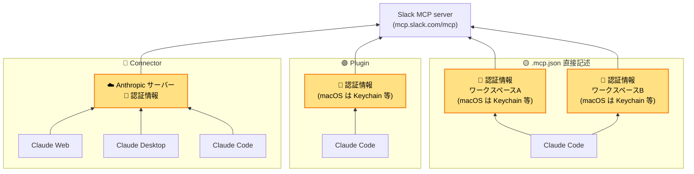

## はじめに

リンクアンドモチベーションのエンジニアのいとまどです！
Claude CodeなどのAI Agent系のネタを中心に、普段発信しております〜。

### 本テーマ執筆の経緯

Claude から Slack を操作してメッセージを取得・送信すること自体は元々やっていました。
ただ、どうやって実現しているか分からないまま使っていたら、気が付いたらローカルに似たような設定が複数乱立していて、もやもやしていました。

「これって何がどう違うんだろう?」と思って調査を始めたところ、**Connector の他に Plugin や `.mcp.json` 直接記述という似た仕組みがあって、全部で3種類**ありました。
そこで、Claude から Slack を操作する方法を一気に整理してみることにしました。

### 整理の仕方

以下のように、前編・後編に分けます。

|             | 内容                                                                 | セットアップ                      | 自由度         |
| ----------- | ------------------------------------------------------------------ | --------------------------- | ----------- |
| **前編(本記事)** | Slack App を自作する必要が**ない**もの<br>(公式Slack MCP を経由する方法)                | 簡単                          | できることはやや限定的 |
| **後編**      | Slack App を自作する必要が**ある**もの<br>(Bot Token / User Token を curl 等で叩く) | Slack 開発者コンソールで App を作る必要あり | 自由度が高い      |

セットアップが軽い順、という位置づけです。

そのため、**前編で済みそうなら後編はスルーで OK**。前編だけでは足りなさそうなら後編も読んでください。

### 対象読者

- Claude(Claude Code / Claude.ai / Claude Desktop)を日常的に使っているエンジニア
- Slack を業務で使っている
- 「Connector」「Plugin」「`.mcp.json`」がそれぞれ何なのか、人に説明できない
- Claude から Slack を操作したいが、選択肢が多すぎて何から始めればいいか迷っている

---

## 3つのやり方

### 全体像

| 方法                   | ざっくり言うと                                           |
| -------------------- | ------------------------------------------------- |
| **Connector**        | claude.ai の設定画面でポチッと有効化する方法                       |
| **Plugin**           | Claude Code の `/plugin install` コマンドで一発インストールする方法 |
| **`.mcp.json` 直接記述** | プロジェクトの設定ファイルに、自分で MCP サーバー情報を手書きする方法             |

それぞれの詳細は次の通りです。

1. **Claude.ai Connector**: claude.ai の「コネクタを追加」ボタンから追加する方法。**すべての Claude UI(claude.ai / Desktop / Code)で使える**
2. **Claude Code Plugin**: Claude Code で `/plugin install slack` を実行する方法。**Claude Code 専用**
3. **`.mcp.json` 直接記述**: プロジェクト直下の `.mcp.json` に MCP サーバー情報を自分で書く方法。**Claude Code 専用**

Connectorの設定導線はこれ:


3つとも、最終的に接続する先は **Slack 公式 MCP server**(`https://mcp.slack.com/mcp`)で同じです。違いは「どの Claude UI から使えるか」「認証情報をどこに保存するか」だけ。詳しくは後の「同じところ・違うところ」で整理します。

<details>
<summary>📘 MCPサーバーの理解があやふやな人へ(クリックで開く)</summary>

#### この記事を読む上での最低限の整理

- **MCP(Model Context Protocol)**: AI(Claude など)が外部ツール(Slack / GitHub など)を操作するための標準プロトコル
- **MCP サーバー**: そのプロトコルを実装した、外部ツール側の窓口
- **Slack 公式 MCP server**(`https://mcp.slack.com/mcp`): Slack 社が公式に用意した、AI から Slack を操作するための窓口

つまりこの記事で扱う3つの方法は、すべて「**Slack 社が用意した同じ窓口に、Claude のどこから・どう繋ぐか**」の話です。

#### 公式ドキュメント

- [Model Context Protocol 公式サイト](https://modelcontextprotocol.io/)
- [Anthropic 公式ドキュメント — Connect Claude Code to tools via MCP](https://code.claude.com/docs/en/mcp)

</details>

#### セットアップ手順の参考リンク

各方法のセットアップは外部記事・公式ドキュメントが詳しいので、本記事ではリンクのみ示します。

- ① Claude.ai Connector: [Getting started with Claude in Slack(Anthropic公式)](https://support.claude.com/en/articles/11506255-getting-started-with-claude-in-slack)
- ② Claude Code Plugin: [Claude Code × Slack公式MCP Server セットアップガイド(Zenn / gura105)](https://zenn.dev/gura105/articles/f447a9a3cc3c99)
- ③ `.mcp.json` 直接記述: [Slack MCP Server — Slack Developer Docs](https://docs.slack.dev/ai/slack-mcp-server/)

### 同じところ

3つはすべて **同じ Slack 公式 MCP server (`https://mcp.slack.com/mcp`) に接続している** ため、できることは基本同じです。具体的には以下の4つの観点で一致します。

#### ① 必要な前提条件

3つとも以下を満たす必要があります。

| 項目              | 要件                                     | 根拠                                                                                                                                                                                                                                   |
| --------------- | -------------------------------------- | ------------------------------------------------------------------------------------------------------------------------------------------------------------------------------------------------------------------------------------ |
| Anthropic 側のプラン | 有料プラン (Free 不可。詳細は補足を参照)               | [Use connectors to extend Claude's capabilities(Anthropic公式)](https://support.claude.com/en/articles/11176164-use-connectors-to-extend-claude-s-capabilities) / [Claude Code Setup(公式ドキュメント)](https://code.claude.com/docs/en/setup) |
| Slack 側のプラン     | 有料プラン(Free 不可)                         | [Getting started with Claude in Slack(Anthropic公式)](https://support.claude.com/en/articles/11506255-getting-started-with-claude-in-slack):「The Claude app is available to users on paid Slack plans」と明記                              |
| ワークスペース管理者の承認   | Slack ワークスペース管理者が App 連携を承認している必要がある   | [Slack MCP Server — Slack Developer Docs](https://docs.slack.dev/ai/slack-mcp-server/):「Workspace admins can approve and manage all MCP client integrations」                                                                         |

<details>
<summary>📘 補足: なぜ「Anthropic 有料プラン」が必要なのか(3つで理由が微妙に違う)</summary>

3つの方法はすべて Anthropic の有料プランを必要としますが、必要になる理由が違います。

| 方法 | なぜ有料プランが必要か |
|---|---|
| Connector | **Connector 機能自体**が Pro / Max / Team / Enterprise でしか使えない |
| Plugin | Plugin 機能自体に制限はないが、**そもそも Claude Code を使うのに** Pro / Max / Team / Enterprise / Console(API課金)が必要 |
| `.mcp.json` 直接記述 | Plugin と同じ(Claude Code を使うのに有料プランが必要) |

つまり Connector は「Connector 機能の制限」、Plugin と `.mcp.json` 直接記述は「Claude Code 自体の制限」が原因です。Plugin / `.mcp.json` 直接記述だけ Console(API 課金) でも使えるのはこのため。

根拠:
- Connector: [Use connectors to extend Claude's capabilities](https://support.claude.com/en/articles/11176164-use-connectors-to-extend-claude-s-capabilities)
- Claude Code: [Claude Code Setup](https://code.claude.com/docs/en/setup)

</details>

#### ② 使えるツール(13種類)

Slack 公式 MCP server が提供するツールは13個あり、3つの方法すべてで同じものが使えます。

| カテゴリ     | ツール(実装名)                          | 何ができるか                  |
| -------- | --------------------------------- | ----------------------- |
| 🔍 検索    | `slack_search_public`             | パブリックチャンネル内のメッセージを検索    |
| 🔍 検索    | `slack_search_public_and_private` | パブリック+プライベート両方のメッセージを検索 |
| 🔍 検索    | `slack_search_channels`           | チャンネル名・説明で検索            |
| 🔍 検索    | `slack_search_users`              | ユーザーを名前・メール・ID で検索      |
| 💬 メッセージ | `slack_send_message`              | メッセージを送信                |
| 💬 メッセージ | `slack_send_message_draft`        | Slack に下書きを作る           |
| 💬 メッセージ | `slack_schedule_message`          | スケジュール送信                |
| 💬 メッセージ | `slack_read_channel`              | チャンネル履歴を取得              |
| 💬 メッセージ | `slack_read_thread`               | スレッドを取得                 |
| 📄 キャンバス | `slack_create_canvas`             | キャンバス作成                 |
| 📄 キャンバス | `slack_update_canvas`             | キャンバス編集                 |
| 📄 キャンバス | `slack_read_canvas`               | キャンバスを Markdown で取得     |
| 👤 ユーザー  | `slack_read_user_profile`         | プロフィール取得                |

> **注: 公式ドキュメントとの差分**
>
> [Slack MCP Server Overview(公式ドキュメント)](https://docs.slack.dev/ai/slack-mcp-server/) の説明文には11種類が記載されていますが、実装上は上記13種類が利用できます (確認方法: ローカルの plugin から tool 一覧を取得)。
>
> 差分は2点:
>
> - 公式の `Search messages & files` が実装では2つに分かれている (`slack_search_public` と `slack_search_public_and_private`)
> - `slack_schedule_message` (スケジュール送信) が公式の一覧に未掲載

#### ③ Slack 側で見える挙動が一致する

3つの方法はすべて、**同じ Slack App**(App 名: Claude / client_id: `1601185624273.8899143856786`)を経由して、**OAuth で認可したユーザー本人として** 投稿します。そのため、Slack 側で見える投稿の表示は3つとも完全に一致します。


| 観点 | Slack 側で見える挙動 |
|---|---|
| 投稿者名 | OAuth で認可したユーザー本人の名前 |
| アイコン | ユーザー本人のアイコン |
| フッター | 「使用して送信されました @ Claude」 |
| App 管理画面 | ワークスペースの Apps 一覧に「Claude」として1件のみ表示される |

#### ④ OAuth とトークン管理を自動でやってくれる

3つすべて、**MCPクライアント側(Claude Code / Claude Desktop / claude.ai の MCP 接続部分)が OAuth 認可フローとトークン管理を肩代わりしてくれます**。具体的には:

- ブラウザで OAuth 認可画面を開く
- access_token / refresh_token を保存する
- 期限切れになったら自動で refresh する
- API リクエストにトークンを乗せて送る

これら全部が自動です。ユーザーは「Connect」ボタンを押すか `/plugin install slack` を実行するだけ。

逆に言うと、**この自動化を諦めて自由度を取りに行くのが後編** という構図です(後編ではトークンを自分で発行・管理する必要が出てきます)。

### 違うところ

3つの方法は、**認証情報の保管場所**と、それに伴う**運用の柔軟性**が違います。

#### 全体像(Mermaid 図)

下の図は、認証情報がどこに保存され、どの Claude UI から Slack 公式 MCP server に繋がるかを示したものです(黄色のノードが認証情報の保存場所)。


> **注**: 認証情報のローカル保存場所は OS によって異なります (Windows なら Credential Manager、Linux なら libsecret 等)。
#### 観点ごとの比較表
認証情報以外も含めて、それぞれの手法の違いをまとめました。

| 観点                 | Connector                                      | Plugin                                  | `.mcp.json` 直接記述           |
| ------------------ | ---------------------------------------------- | --------------------------------------- | -------------------------- |
| **認証情報の保存場所**      | Anthropic クラウド                                 | ローカル PC (macOS は Keychain)              | ローカル PC (macOS は Keychain) |
| **使える Claude UI**  | claude.ai (Web) / Claude Desktop / Claude Code | Claude Code 専用                          | Claude Code 専用             |
| **複数ワークスペース対応**    | 1アカウント = 1ワークスペース固定                            | 1 plugin = 1ワークスペース(構造的制約)              | 複数登録可能                     |
| **同梱されるスラッシュコマンド** | なし                                             | 5個 (`/slack:standup` など)                | なし                         |
| **同梱される skill**    | なし                                             | 2個 (`slack-messaging` / `slack-search`) | なし                         |
| **バージョン管理・更新**     | Anthropic 側で自動                                 | `/plugin update` で管理                    | 手動                         |
|                    |                                                |                                         |                            |


「複数ワークスペースで使いたい」というニーズがなければ、複数 UI で使える Connector か、便利コマンドが付いてくる Plugin が良さそうです。

<details>
<summary>📘 補足: Plugin だけが提供する4つの追加価値 (クリックで開く)</summary>

`.mcp.json` 直接記述は MCP サーバー設定だけを書くシンプルな仕組みです。一方 Plugin は **MCP 設定 + 周辺の便利機能** を1パッケージにまとめて配布する仕組みで、Slack Plugin の場合は以下が同梱されています。

1. **ワークフロー化されたスラッシュコマンド (5個)**: `/slack:standup` / `/slack:summarize-channel` / `/slack:find-discussions` / `/slack:draft-announcement` / `/slack:channel-digest`。例えば `/slack:standup` は「自分の user_id を取得 → 直近メッセージを検索 → スレッドを展開 → Done/Doing/Blockers に整理」を1コマンドで自動化してくれる
2. **Slack の使い方を教える skill (2個)**: `slack-messaging`(Slack mrkdwn 整形ガイド)と `slack-search`(検索戦略)。MCP ツールを呼ぶときに自動で文脈に読み込まれるので、整形ルールや検索 modifier を毎回プロンプトで教える必要がない
3. **バージョン管理と更新通知**: `/plugin update` で更新確認・適用ができる。`.mcp.json` は自分で書き直すしかない
4. **ワンコマンドで有効化/無効化**: `/plugin disable` で一時停止、`/plugin uninstall` で削除。設定ファイルを残したまま機能だけ切れる

つまり Plugin は **「Slack MCP の入り口」+「使い方ガイド」+「便利ワークフロー」をセットで持ってきてくれる** イメージ。`.mcp.json` 直接記述は前者だけ手書きする最小構成です。

> 参考: [Plugin の構造 (Anthropic 公式)](https://code.claude.com/docs/en/plugins) / [Slack Plugin 公式紹介](https://claude.com/plugins/slack)

</details>


<details>
<summary>📘 補足: <code>.mcp.json</code> で複数ワークスペースに繋ぐ設定例 (クリックで開く)</summary>

`.mcp.json` ではエントリ名を自由に付けられるので、同じ Slack MCP server を別名で複数登録すれば、それぞれ独立したワークスペースに OAuth で繋げます。

```json
{
  "mcpServers": {
    "slack-workspace-a": {
      "type": "http",
      "url": "https://mcp.slack.com/mcp",
      "oauth": {
        "clientId": "1601185624273.8899143856786",
        "callbackPort": 3118
      }
    },
    "slack-workspace-b": {
      "type": "http",
      "url": "https://mcp.slack.com/mcp",
      "oauth": {
        "clientId": "1601185624273.8899143856786",
        "callbackPort": 3118
      }
    }
  }
}
```

詳細 (`oauth.clientId` の意味、Slack MCP server が DCR(Dynamic Client Registration)に対応していない仕様の話など) は割愛しますが、**上記をそのままコピペすれば動きます**。

各エントリを順に Authenticate すると、それぞれ別のワークスペースに OAuth 認可できます。ツール呼び出し時は `slack-workspace-a:slack_send_message` のようにエントリ名で切り分けられます。

</details>

---

## ツールの詳細・できること

### 個別ツールの仕様で気になったもの

ツール一覧の中で仕様が気になったものを2つ深掘りしてみました。

#### `slack_search_public_and_private`

自分が所属するチャンネル(public / private / DM / グループDM)を横断して検索できるツールです。

サポートされている検索構文は、Slack の検索窓で使うものとほぼ同じでした。`from:`、`in:`、`before:`、`"完全一致"`、`-除外` などの modifier がそのまま使えます。

> 参考: ツールのパラメータ説明は Claude Code で `/mcp` → 該当 MCP server を選択 → ツール一覧から確認できます。

#### `slack_send_message_draft`

メッセージを送信せずに、Slack の「下書き＆送信済み」に下書きとして保存するツールです。


`thread_ts` を渡せば、特定スレッドへの返信下書きも作れます。

> ⚠️ **注意点**: 「下書きを作ったと思ったのに、作れてなかった…」が発生する可能性があります。
>
> - **症状**: 同じ宛先に既存の下書きがある場合、Slack MCP 経由では新しい下書きが作れない
> - **やっかいな点**: 失敗しても Claude Code 自身は気づかない (サイレント失敗)
> - **推測される原因**: tool description と実際の仕様が一致していないため (2026年4月時点)

下記のスクショは、Claude Code 自身は「下書き作成成功」と認識しているが、実際には作成されていない状態。


### Claude Code 機能との組み合わせでできること

メッセージの検索、取得、送信など基本的なことは大体できます。
そのため、Slack MCP と Claude Code の既存機能 (skills や loop など) を組み合わせれば、以下のようなことが実現できます。

- 特定のチャンネルの投稿を自分の代わりに取得 → 要約を生成
- 自分宛のメンションに自動 (もしくはドラフト + 手動) で返信
- あの内容どこで話したっけ？を検索

### Slack App を自作しないとできないこと

ここまでの3つの方法は便利ですが、以下のような「もっと細かいことをやりたい」場合には対応できません。

- **リアクション(絵文字)を付けたい / 取得したい**
  - 公式 MCP には `add_reaction` のようなツールがない
- **チャンネル一覧をまとめて取得したい**
  - 検索はできるが「全チャンネルの一覧」のような取り方はない
- **Bot として投稿したい**(チームの自動化用 Bot を作りたい等)
  - 公式 MCP は認可したユーザー本人として投稿するため、「専用 Bot として動かす」用途には使えない

これらをやりたい場合は、自分で Slack App を作って Bot Token / User Token を発行し、API を叩く必要があります。**この続きは後編で扱います。**

---

## おわりに

ここまで読んでくださってありがとうございました！
何か見落としてる部分や、間違ってる部分があったら教えてください！

---

## 付録: 各種機能の時系列の整理

いつ、どの機能が出たのか分からなくなったので、時系列で整理してみました！

| 日付         | Anthropic 側                                  | Slack 側                                                    |
| ---------- | -------------------------------------------- | ---------------------------------------------------------- |
| 2025-05-01 | Connector 機能 初リリース(Max/Team/Enterprise、beta) |                                                            |
| 2025-06-03 | Connector を Pro プランへ拡張                       |                                                            |
| 2025-10-01 |                                              | Slack Connector 初リリース(Team/Enterprise 限定)                  |
| 2025-10-09 | Claude Code Plugin機能 public beta 開始          |                                                            |
| 2025-10-13 |                                              | Slack 公式 MCP server **closed beta 開始**(招待制、Anthropic 等が参加) |
| 2026-01-26 |                                              | Slack Connector を Pro/Max プランへ拡張                           |
| 2026-02-17 |                                              | **Slack 公式 MCP server GA** (一般公開)                          |
| 2026-04-23 | Claude Code Plugin機能 全ユーザーへ拡大                |                                                            |
