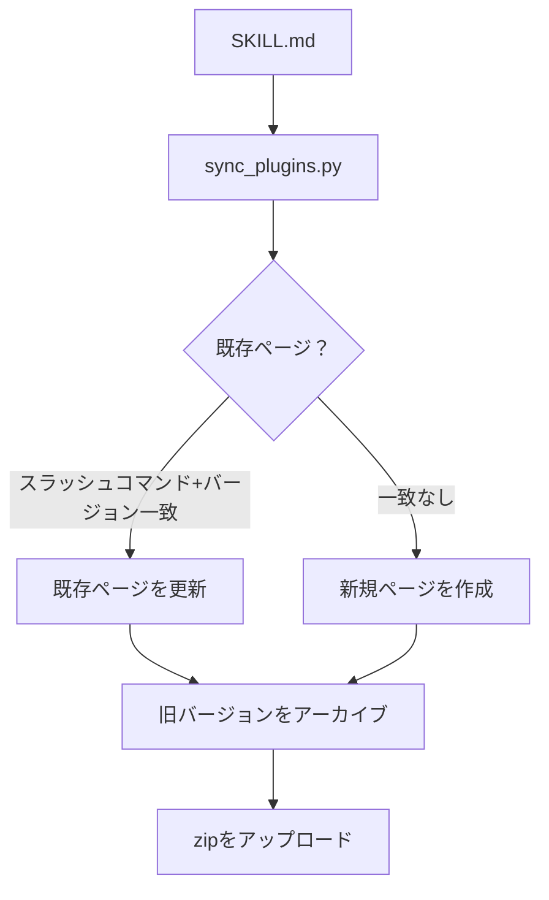

> この記事は [Zenn](https://zenn.dev/taroh_7/articles/2026-04-20-claude-skill-notion-management) でも公開しています。

## はじめに

Claude Code や Codex を使っていると、自分専用のスキル（SKILL.md）が増えていく。20本を超えたあたりで「どのスキルが最新か」「どこに置いてあるか」「使えるバージョンはどれか」を把握するのが難しくなってきた。

この記事では、スキルのメタデータ・バージョン・zipパッケージを **Notion DB で一元管理する仕組み** を作った話をまとめる。

## 作ったもの：全体像

```
SKILL.md（正本）
    │
    ├── sync_plugins.py ──────→ Notion DB_スキル管理
    │       スラッシュコマンド＋バージョンで同定         スキル台帳＋zipパッケージ
    │
    └── deploy_skill_manage.ps1 ──→ 配布先
                                    ~/.claude/skills/<name>
                                    ~/.agents/skills/<name>
```

大きく3つのコンポーネントがある。

| コンポーネント | 役割 |
|---|---|
| SKILL.md（正本） | スキルの実体。frontmatterにメタデータを書く |
| sync_plugins.py | 正本をNotion DBへ同期するスクリプト |
| Notion DB_スキル管理 | スキル台帳＋zipパッケージの保管場所 |

## Notion DB のスキーマ

`DB_スキル管理` には以下のプロパティを持たせている。**同期スクリプトが不足プロパティを自動作成する**ので、初回実行前に手動でDBを整備する必要はない。

| プロパティ | 型 | 用途 |
|---|---|---|
| スキル名 | タイトル | 日本語の表示名 |
| スラッシュコマンド | リッチテキスト | `/skill-manage` のような検索キー。**同定キーの一部** |
| バージョン | リッチテキスト | `1.0`、`2.0` など。**同定キーの一部** |
| スキルID | リッチテキスト | 英語 slug（`name` から自動生成） |
| リリースID | リッチテキスト | `skill-manage@2.2` のような安定した識別子 |
| ステータス | セレクト | 下書き / 運用中 / 非推奨 / アーカイブ |
| 実行環境 | マルチセレクト | Claude Code / Codex / Antigravity など |
| 配置場所 | リッチテキスト | SKILL.md の絶対パス |
| 説明 | リッチテキスト | frontmatter の `description` |
| 更新内容 | リッチテキスト | frontmatter の `update_note` |
| パッケージ | ファイル | 同期時に zip 化して添付 |
| パッケージSHA256 | リッチテキスト | zip の整合性チェック用ハッシュ |
| 作成元 | セレクト | local / claude / codex / antigravity |
| 同期日時 | 日付 | 最終同期時刻 |

## SKILL.md の frontmatter

スキルのメタ情報は SKILL.md の YAML frontmatter に書く。

```yaml
---
name: skill-manage              # 英語slug。スキルID として使う
display_name: スキル管理         # Notion 上の表示名（日本語）
slash_command: /skill-manage    # 同定キー。省略時は /<name> を自動生成
version: "2.2"
status: 運用中
description: スキルをNotion DBで一括管理するスキル
update_note: v2.2 更新手順を標準化
notion_page_id: ""              # 後方互換のキャッシュ。同期判定には使わない
---
```

`notion_page_id` は主キーとして使わない。**同定は `スラッシュコマンド + バージョン` の組み合わせで行う**。これにより、バージョンアップのたびにローカルファイルを書き換えなくても、新しいリリースとして別行に登録できる。

## 同期の使い方

```bash
# 指定スキルを Notion DB に同期
cd ~/AI/shared/skill_manage/skill-manage
uv run scripts/sync_plugins.py ~/.claude/skills/<name>/SKILL.md

# デフォルトルート（.claude/skills, .agents/skills, .claude/plugins）の全スキルを一括同期
uv run scripts/sync_plugins.py --all

# Notion DB の一覧を表示
uv run scripts/sync_plugins.py --list

# ステータスを変更
uv run scripts/sync_plugins.py --status /skill-manage 非推奨
```

### 同期時に何が起きるか

1. DBに必要なプロパティが足りなければ**自動作成**する
2. frontmatter を読み取る
3. スキルフォルダを **zip 化**して SHA256 を計算する
4. zip を Notion にアップロードしてページに添付する
5. `スラッシュコマンド + バージョン` で既存ページを検索する
6. 既存があれば**更新**、なければ**新規作成**する
7. 同じ `スキルID` の他の「運用中」バージョンを**アーカイブ**に変更する



## 正本と配布先の管理

`skill-manage` 自体も1つのスキルとして管理している。正本は `shared/` に置き、`.claude` と `.agents` の2箇所に配布する。

```
正本:
  ~/AI/shared/skill_manage/skill-manage/   ← ここだけ編集する

配布先:
  ~/.claude/skills/skill-manage/           ← Claude Code が読む
  ~/.agents/skills/skill-manage/           ← Codex が読む
```

配布はスクリプト1本で行う。

```powershell
cd ~/AI/shared/skill_manage/skill-manage
powershell -ExecutionPolicy Bypass -File .\scripts\deploy_skill_manage.ps1
```

### スキルを更新するときの流れ

1. 正本の SKILL.md を編集し、`version` と `update_note` を更新する
2. UTF-8 で読めることを確認する
3. `deploy_skill_manage.ps1` で配布先に同期する
4. `sync_plugins.py` で Notion DB に同期する

**配布先を直接編集しない**。正本を編集してから配布する運用を徹底する。

## バージョン管理の仕組み

バージョンアップは `version` を変更して同期するだけでよい。

- `スラッシュコマンド + バージョン` が新しい組み合わせであれば、Notion に**新しい行**として追加される
- 同じ `スキルID` を持つ旧バージョンの「運用中」レコードは**自動的にアーカイブ**になる
- リリースID（`skill-manage@2.2` など）で各リリースを一意に識別できる

Notion 上で全バージョンの履歴が残るので、「いつ何が変わったか」を後から確認できる。

## zipパッケージの保管

同期のたびにスキルフォルダを zip 化して Notion ページに添付する。

- `SKILL.md` 単体スキル → `SKILL.md` の親ディレクトリを zip 化
- Claude/Codex plugin → `plugin.json` があるプラグインルートを zip 化

機密ファイルや生成物（`.env`、`*.pem`、`__pycache__`、`.venv` など）は除外する。

Notion の「パッケージ」列にファイルが添付されるので、ローカル環境なしでもスキルを復元できる。

## 実際の Notion DB の見え方

Notion 上では、1スキルにつき複数のリリースが行として並ぶ。

| スキル名 | リリースID | ステータス | 実行環境 | 同期日時 |
|---|---|---|---|---|
| スキル管理 | skill-manage@2.2 | 運用中 | Claude Code | 2026-05-01 |
| スキル管理 | skill-manage@2.0 | アーカイブ | Claude Code | 2026-04-30 |
| スキル管理 | skill-manage@1.0 | アーカイブ | Claude Code | 2026-04-21 |

ステータスのフィルタで「運用中」だけを絞り込めば、現在有効なスキル一覧になる。

## まとめ

Claude Code / Codex のスキルが増えたとき、ファイルを置くだけの管理は破綻しやすい。Notion DB を台帳として使うことで、次の問題が解決できた。

| 問題 | 解決方法 |
|---|---|
| どのバージョンが最新かわからない | ステータス「運用中」でフィルタ |
| どこに置いてあるかわからない | 「配置場所」プロパティで確認 |
| スキルを別環境でも使いたい | zipパッケージをNotionからダウンロード |
| バージョン更新の履歴を残したい | 旧バージョンがアーカイブとして残る |

同期は `uv run scripts/sync_plugins.py <path>` の1コマンドで済む。スキルを作ったら同期する、という習慣だけ守れば台帳が常に最新に保たれる。

---

## おまけ：作るときに詰まったところ

**notion_page_id を主キーにすると運用がつらい**

最初は SKILL.md に書いた `notion_page_id` で対応するNotionページを引くつもりだった。しかし実際には `~/.claude/plugins/` が git 管理外のため書き戻しがスキップされ、ほとんどのレコードが空になった。

同定キーを `スラッシュコマンド + バージョン` に変えてから安定した。

**Notion の `databases.query` vs `data_sources.query`**

Notion Python クライアント v3 系では `databases.query` ではなく `data_sources.query` を使い、IDもページIDではなくコレクションIDが必要。環境変数に間違ったIDを入れていてしばらく詰まった。

**ファイルパスが Notion で消えた**

新スキーマに移行したとき、既存の Notion ビューが参照している「ファイルパス」列にパスを書かなくなってしまった。新しいプロパティ名「配置場所」に書いていたため。互換のために両方の列に同じ値を書くようにして解決した。
