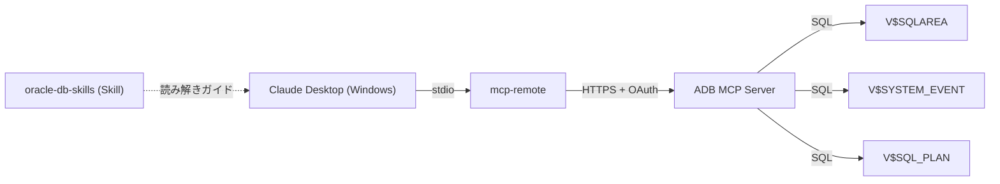

# 1. はじめに

[記事①](https://qiita.com/asahide/items/53cfdab083905fedeed5)では、AWR レポートを静的に読み込ませて Skill（oracle-db-skills）の有無が解析品質をどれだけ変えるかを検証しました。結論は「Skill の効果がモデルサイズより解析品質に影響する」でした。

[記事②](https://qiita.com/asahide/items/1c3c369effc01f96bee9)では、Oracle Autonomous AI Database（ADB）の MCP サーバを Claude Desktop に接続し、`GET_TOP_SQL_TOOL` で「いま重い SQL 上位 N 件」を自然言語で聞けるようにしました。待機イベントや実行計画の深掘りは「今後の活用方法」として予告だけしていました。

本記事はその両方を統合する第3回です。追加ツール 2 本（`GET_WAIT_EVENTS_TOOL` / `GET_SQL_PLAN_TOOL`）を実装して MCP を完成させ、Skill の ON/OFF で解析品質がどう変わるかを検証します。

### 検証ゴール
- MCP で取得したリアルタイムデータに Skill を乗せると、静的 AWR 解析（記事①）と同じ品質向上が起きるか？

### 結論（先出し）

* MCP 単体でも主要な問題（NL ジョイン × フルスキャン・CPU 独占・ハードパース）は検出できる
* Skill を加えると「Oracle 固有の解釈（Exadata STORAGE FULL の説明）」「待機クラス別集計」「チューニング後の期待実行計画」など**構造化と深化**が起きる
* AWR 固有の集計指標（Execute to Parse %・Work Area）は V$ リアルタイムビューには存在しない。MCP と AWR は**競合でなく補完関係**であることが浮き彫りになった


---

# 2. 検証設計

## 2.1. 比較パターン

モデルは Sonnet 固定。MCP は両パターンで常時 ON。

| パターン | MCP | Skill | 検証の焦点 |
|----------|:---:|:-----:|-----------|
| A | ✅ | ❌ | MCP 単体でどこまで読み解けるか |
| B | ✅ | ✅ | Skill を加えると何が変わるか |

## 2.2. 検証する観点

記事① の比較軸をリアルタイム MCP 環境に持ち込みます。ただし AWR 固有の集計指標（Execute to Parse %・Work Area）は、MCP がリアルタイムに参照する V$ ビューには存在しない可能性があります。これ自体が「記事① の軸を持ち込んだことで気づく発見」として検証します。

| 観点 | 記事①での結果 | 本記事で確認すること |
|------|-------------|-------------------|
| Execute to Parse % 検出 | Skill なしは見落とし | V$ ビューで取得できるか（指標の有無から確認） |
| Work Area 定量化 | Skill あり → 数値化 | V$ ビューで取得できるか |
| ハードパース優先度評価 | Skill なし → 過大評価 | MCP 単体でも過大評価が起きるか |
| 次アクションの具体性 | — | 1 スレッドで「TOP SQL → 待機イベント → 実行計画」を深掘りできるか |

---

# 3. 環境準備

## 3.1. 検証環境

| 項目 | 内容 |
|------|------|
| DB | Oracle Autonomous AI Database (Serverless) / ap-tokyo-1 |
| Oracle バージョン | 23.26.x（Oracle 26ai） |
| MCP クライアント | Claude Desktop (Windows) |
| モデル | Claude Sonnet 4.6 |
| Skill | oracle-db-skills（oracle/skills リポジトリ準拠） |
| DB ユーザ | `dba_copilot`（最小権限） |



## 3.2. 追加ツールの実装

記事② で作成した `GET_TOP_SQL_TOOL` に加え、今回は 2 本を追加実装します。SQL 全文は別途公開予定です。

**ADMIN で追加 GRANT（記事②と同じ理由で直接 GRANT が必要）**

```sql
GRANT SELECT ON SYS.V_$SYSTEM_EVENT TO dba_copilot;
GRANT SELECT ON SYS.V_$SQL_PLAN     TO dba_copilot;
GRANT SELECT ON SYS.V_$SQL          TO dba_copilot;
```

:::note warn
PL/SQL 定義者権限ブロックではロール経由の権限が効きません。V$ ビューは直接 GRANT が必要です。
:::

**(以前作成した)`dba_copilot` ユーザで Function 作成 → `DBMS_CLOUD_AI_AGENT.CREATE_TOOL` で登録**

| ツール名 | 対象ビュー | 追加パラメータ |
|----------|-----------|--------------|
| `GET_TOP_SQL_TOOL` | V$SQLAREA | 記事②から流用 |
| `GET_WAIT_EVENTS_TOOL` | V$SYSTEM_EVENT | `P_TOP_N`（最大 100）|
| `GET_SQL_PLAN_TOOL` | V$SQL_PLAN | `P_SQL_ID`（必須） |

Claude Desktop を再起動し、「コネクタを管理」画面で 3 ツールが揃っていることを確認します。


---

# 4. 負荷シナリオの準備

比較のため、3 種類の問題を意図的に発生させます（SQL 全文は省略）。

| シナリオ | 発生させる問題 | 手法 | 5章での該当 SQL |
|----------|--------------|------|----------------|
| ① ハードパース | バインド変数なしリテラルを連続発行 | `EXECUTE IMMEDIATE` ループ | `2fzr48rh6jrnp`（TOP SQL 3位） |
| ② 重いソート | 50 万行に複数ウィンドウ関数 + ORDER BY | PL/SQL ループで繰り返し | `c59rh9b27yv9h`（TOP SQL 2位） |
| ③ CPU 集中（NL ジョイン） | インデックスなし同士に `USE_NL` で NL ジョインを優先 | PL/SQL ループで繰り返し | `6var1rj5w7949`（TOP SQL 1位） |


---

# 5. 検証結果と比較

同一プロンプト 3 本を、Skill OFF（パターン A）・Skill ON（パターン B）それぞれ別チャットで実行し、応答を対比します。

---

## 5.1. TOP SQL — A vs B

**共通プロンプト**: `重い SQL 上位 3 件を教えて`

### パターン A（Skill なし）

| # | SQL_ID | スキーマ | 経過時間/回 (秒) | バッファ Get/回 | 主な問題 |
|---|--------|----------|----------------:|---------------:|---------|
| 1 | `6var1rj5w7949` | SCOTT | 73.4 | 13,055,591 | NL ジョイン × フルスキャン |
| 2 | `c59rh9b27yv9h` | SCOTT | 55.4 | 20,289,000 | PL/SQL ループ内クエリ連続実行 |
| 3 | `2fzr48rh6jrnp` | SCOTT | 7.4 | 22,893 | **ハードパース多発**（動的 SQL ループ） |

Claude の所見（Skill なし）:
> `2fzr48rh6jrnp` は `EXECUTE IMMEDIATE` で SQL を文字列結合して連続発行しており、**バインド変数未使用によるハードパースが多発**している可能性が高い。バインド変数化を強く推奨。

優先度評価：🔴高（NL ジョイン・PL/SQL ループ）/ 🟡中（ハードパース）

### パターン B（Skill あり）

| # | SQL_ID | スキーマ | 経過時間/回 (秒) | バッファ Get/回 | 主な問題 |
|---|--------|----------|----------------:|---------------:|---------|
| 1 | `6var1rj5w7949` | SCOTT | 84.8 | 15,477,998 | NL ジョイン × フルスキャン |
| 2 | `c59rh9b27yv9h` | SCOTT | 55.4 | 20,289,000 | PL/SQL ループ内クエリ連続実行 |
| 3 | `5rn3zncgru5y9` | DBA_COPILOT | 5.1 | 55 | ツール自身の V$SQLAREA クエリ（内部処理） |

Claude の所見（Skill あり）:
> `5rn3zncgru5y9` は**本ツール自身が発行する `V$SQLAREA` 参照クエリ**。`dba_copilot` ユーザが `DBMS_CLOUD_AI_AGENT` を呼び出す内部処理も含め、バッファ取得が少なく対応不要。

パターン B の実行時には、ハードパース多発 SQL（`2fzr48rh6jrnp`）が既に `V$SQLAREA` の TOP 3 から外れていました。これは V&#36; ビューがリアルタイム値を返すという MCP の特性上避けられない**時間差の問題**であり、Skill の能力差ではないと考えてます（とはいえ対象をSCOTTスキーマに絞ればきちんと取得できたかも・・・）

両方ともモデルはSonnetということもあるかもしれませんが、ここではSkillの有無による差分はあまりありませんでした。

---

## 5.2. 待機イベント — A vs B

**共通プロンプト**: `いま何の待機イベントが多い？`

### パターン A（Skill なし）— 10 件取得

| # | イベント | 待機クラス | 合計待機時間 (秒) | 平均待機 (ms) |
|---|----------|-----------|----------------:|:------------:|
| 1 | `resmgr:cpu quantum` | Scheduler | **28.767** | 359.6 |
| 2 | `cell statistics gather` | User I/O | 3.804 | 0.4 |
| 3 | `library cache: bucket mutex X` | Concurrency | 2.251 | 1.1 |
| 4 | `cursor: pin S wait on X` | Concurrency | 1.866 | 16.2 |
| 5 | `library cache load lock` | Concurrency | 1.591 | 11.4 |

Claude の所見（Skill なし）:
> `resmgr:cpu quantum` は Resource Manager による CPU スロットリングが発生している。SCOTT スキーマの重い SQL（NL ジョイン・PL/SQL ループ）が主因と推定される。  
> `library cache: bucket mutex X` / `library cache load lock` は**ハードパースの多発が疑われる**。動的 SQL ループ（`2fzr48rh6jrnp`）のバインド変数未使用が起因の可能性が高い。

### パターン B（Skill あり）— 15 件取得

Skill あり版では待機クラス別の合計秒数集計表が追加されました。

| 待機クラス | 累計待機時間 (秒) |
|-----------|:-----------------:|
| Scheduler | **28.767** |
| User I/O | 7.487 |
| Concurrency | 4.765 |
| System I/O | 1.431 |
| Other | 3.721 |
| **合計** | **46.171** |

Claude の所見（Skill あり）:
> `resmgr:cpu quantum` が全体の約 **62%**（合計 46.2 秒中 28.8 秒）を占めており、CPU スケジューリング競合が現在の最大ボトルネック。重い SQL（`dba_copilot` スキーマの LOAD_TEST_NOIDX 系クエリ）の改善が最優先。  
> `library cache: bucket mutex X`（2.251 秒）/ `library cache load lock`（1.591 秒）はハードパース多発の典型的なシグナル。バインド変数化で解消できる。

### A vs B の差分

| 観点 | パターン A（Skill なし） | パターン B（Skill あり） |
|------|------------------------|------------------------|
| 取得イベント数 | 10 件 | **15 件** |
| 待機クラス別集計 | ❌ なし | ✅ 合計秒数 + 全体比率（62%）を表示 |
| ハードパース↔待機イベントの紐付け | ✅ あり | ✅ あり（同等） |

---

## 5.3. 実行計画 — A vs B

**共通プロンプト**: `1 位の SQL の実行計画を見せて`

前のプロンプトで特定した SQL_ID `6var1rj5w7949` を文脈から引き継ぎ、両パターンとも正しく `GET_SQL_PLAN_TOOL` を呼び出しました。

**取得された実行計画（両パターン共通）**:

```
Id  Operation                       Object Name       Cardinality  Cost
----------------------------------------------------------------------
 0  SELECT STATEMENT                                               6,278,839
 1    SORT AGGREGATE                                          1
 2      NESTED LOOPS                                     11,592    6,278,839
 3        TABLE ACCESS STORAGE FULL  LOAD_TEST_NOIDX     3,364        1,868
 4        TABLE ACCESS STORAGE FULL  LOAD_TEST_NOIDX         3        1,866
```


### パターン A（Skill なし）の所見

> 外側テーブル（A）から 3,364 行を取得し、その各行に対して内側テーブル（B）をフルスキャンする。`USE_NL(a b)` ヒントにより、オプティマイザが本来選択するはずの HASH JOIN が抑止されている。`SCORE` 列へのインデックス作成またはヒント除去を推奨。

### パターン B（Skill あり）の所見

Skill なしの分析に加えて、以下が追加されました。

**① Exadata 固有の解釈（Oracle 固有知識）**:
> `TABLE ACCESS STORAGE FULL` は Exadata の**スマートスキャン（Smart Scan）が有効**であることを示す。ただし、NL ジョインで内側テーブルを 3,364 回フルスキャンする構造では Smart Scan の恩恵が薄い。

**② `NO_RESULT_CACHE` を独立した問題として分離**:
> `NO_RESULT_CACHE` ヒントにより結果キャッシュが無効化されているため、同一条件での繰り返し実行でも毎回フルコンピュートが走る。

**③ チューニング後の期待実行計画を提示**:
```
-- ヒント除去 + SCORE 列インデックス作成後の期待計画
SELECT STATEMENT
└─ SORT AGGREGATE
   └─ HASH JOIN
      ├─ INDEX RANGE SCAN  idx_load_test_score
      └─ INDEX RANGE SCAN  idx_load_test_score
```

### A vs B の差分

| 観点 | パターン A（Skill なし） | パターン B（Skill あり） |
|------|------------------------|------------------------|
| TABLE ACCESS FULL 検出・問題指摘 | ✅ | ✅（同等） |
| インデックス追加の提案 | ✅ | ✅（同等） |
| Exadata STORAGE FULL の解釈 | ❌ | ✅ Smart Scan の文脈で説明 |
| `NO_RESULT_CACHE` への言及 | ❌ 触れず | ✅ 独立した問題として分離 |
| チューニング後の期待実行計画 | ❌ | ✅ ヒント除去 + インデックス後の計画ツリーを提示 |
| 1 スレッド深掘りの文脈引き継ぎ | ✅ | ✅（同等） |

---

# 6. 考察

## 6.1. 観点別まとめ

| 観点 | パターン A（Skill なし） | パターン B（Skill あり） |
|------|----------------------|--------------------------|
| ハードパース検出 | ✅ 特定・バインド変数化推奨 | △ 時間差で対象 SQL が TOP 外（観測限界） |
| 待機イベント取得数 | 10 件 | **15 件** |
| 待機クラス別集計 | ❌ | ✅ 合計秒数 + 比率 |
| ハードパース↔待機イベントの紐付け | ✅ | ✅ |
| Exadata STORAGE FULL の解釈 | ❌ | ✅ |
| 改善後の期待実行計画 | ❌ | ✅ |
| 1 スレッド深掘りの完成度 | ✅ | ✅ |

## 6.2. 「MCP × Skill」の役割分担

| レイヤー | 担当 | 役割 |
|----------|------|------|
| **何を取るか** | MCP ツール | V$ ビューを自然言語で呼び出せるリアルタイムアクセス経路 |
| **どう読むか** | oracle-db-skills Skill | Oracle 固有の解析観点（Exadata・リソースマネージャ・ライブラリキャッシュ）を補強 |

:::note info
Skill の効果は「何が起きているかを見つける」（AWR 環境）だけでなく、「今何が起きているかを**正しく読む**」（MCP 環境）でも一貫して有効
:::

---

# 7. まとめ

## 7.1. シリーズの総括

| 回 | テーマ | 主な結論 |
|----|--------|---------|
| 記事① | AWR × Skill 比較 | Skill の効果がモデルサイズより品質に影響。Haiku + Skill が Sonnet 単体を上回るケースあり |
| 記事② | ADB MCP × Claude Desktop | データベースの状況をリアルタイム・自然言語で確認可能 |
| 本記事 | MCP × Skill 統合検証 | MCP が「取得経路」、Skill が「読み解き」を担う分業が可能。1 スレッド深掘りが完成 |

## 7.2. まとめ

| ポイント | 理由 |
|----------|------|
| **MCP 単体でも主要問題は検出可能** | NL × フルスキャン・CPU 独占・ハードパースを Skill なしで特定 |
| **Skill が加わると Oracle 固有文脈が補強される** | Exadata STORAGE FULL の解釈・改善後の期待計画など DBA 視点の深化 |
| **待機クラス別集計は Skill ありで自動化** | Scheduler / Concurrency / User I/O の合計秒数比較表が追加 |
| **Skill の効果は MCP 環境でも記事①と一貫** | 解析手段が AWR からリアルタイム MCP に変わっても、構造化・Oracle 固有解釈の補強は同じように働く |
| **1 スレッド深掘りは実用レベル** | TOP SQL → 待機イベント → 実行計画を同一スレッドで文脈引き継ぎ可能 |

純粋な AWR や ADDM でもレポートに推奨事項は出してくれますが、LLM と一緒に調査することで、わからないところも補強しながら深堀できるのが良いところだと個人的には考えています。

## 参考

* [ADB MCP Server 公式ドキュメント](https://docs.oracle.com/ja-jp/iaas/autonomous-database-serverless/doc/use-mcp-server.html)
* [oracle/skills リポジトリ](https://github.com/oracle/skills)
* [記事①：AWR × Skill 比較](https://qiita.com/asahide/items/53cfdab083905fedeed5)
* [記事②：ADB MCP × Claude Desktop](https://qiita.com/asahide/items/1c3c369effc01f96bee9)
