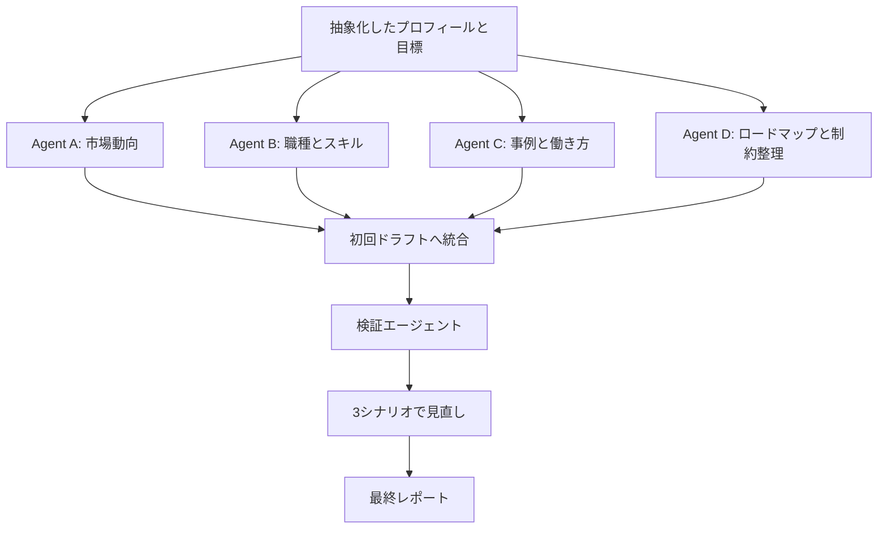

> この記事は [Zenn](https://zenn.dev/taroh-7/articles/2026-04-18-ai-career-strategy-multiagent) でも公開しています。

## はじめに

AIにキャリア相談をすると、だいたい前向きな答えが返ってくる。

それ自体は悪くない。選択肢を広げてくれるし、背中も押してくれる。ただ、キャリア戦略として使うなら、前向きなだけでは少し危ない。市場の現実、スキル習得にかかる時間、継続できる行動量、シナリオの上振れと下振れまで見たい。

そこで今回は、Claude Codeで複数のエージェントを並列に動かし、自分向けのキャリア戦略レポートを作った。

ポイントは、調査エージェントだけで終わらせず、最後に **批判専用の検証エージェント** を入れたこと。これにより、初回ドラフトに含まれていた楽観バイアスをかなり現実寄りに補正できた。

この記事では、個人情報や細かい数値は伏せたうえで、マルチエージェントを使ったキャリア分析の設計、躓いたところ、再利用できるプロンプトの形をまとめる。具体的なプロフィール、所属、収入、生活上の目標は公開用に抽象化している。

## 作ったもの: 自分専用キャリア戦略レポート生成フロー

作ったのは、データ/AI活用領域で働く人向けの、個人最適化キャリア戦略レポート。

入力したのは、おおまかに次のような情報です。

| 入力カテゴリ | 内容の粒度 |
|---|---|
| 現在地 | 業務経験、得意領域、使える技術の大まかな棚卸し |
| 目標 | 中長期で職能や選択肢を広げたい、という方向性 |
| 制約 | 学習や活動に使える時間、優先順位、避けたい働き方 |
| 関心 | 伸ばしたい専門性、関わりたい領域、将来の働き方 |

個人を特定できる会社名、年齢、具体的な収入、クライアント名、生活上の目標などは、この記事では扱わない。

最終的な成果物は、複数章構成の長めのレポートになった。市場分析、職種別のスキルギャップ、キャリアシナリオ、学習ロードマップ、リスク分析までをまとめたものです。

重要なのは、「AIに相談した」ではなく「AIに役割を分けて、最後に疑わせた」ことだった。

## なぜマルチエージェントにしたのか

キャリア戦略は、1つの観点だけでは決めにくい。

たとえば市場だけ見れば「伸びている領域に行く」が正解に見える。でも、本人のスキル、学習時間、活動に使える余力、働き方の希望まで入れると、話はかなり変わる。

1つのエージェントに全部を任せると、出力は長くなるが、論点が混ざりやすい。市場の話をしていたはずが、途中で学習計画に飛ぶ。働き方の話をしていたはずが、いつの間にか職種比較になる。読めるけれど、判断材料としては少し使いづらい。

そこで、観点ごとにエージェントを分けた。

| 設計 | メリット | 弱点 |
|---|---|---|
| 1エージェントに全部任せる | 早い、会話が単純 | 論点が混ざる、検証が甘くなりやすい |
| 役割別に並列化する | 観点ごとの深掘りがしやすい | 統合作業が必要 |
| 検証専用を追加する | 楽観バイアスを潰しやすい | 手間と時間は増える |

今回は、多少手間が増えても、意思決定に使えるレポートにしたかった。だから「広げるエージェント」と「疑うエージェント」を分けた。

## 全体像: 4並列エージェント + 検証エージェント

構成はシンプルで、4つの調査エージェントを並列に走らせ、その後に統合と検証を行う形にした。



この図でいちばん大事なのは、最後の検証エージェントです。

調査エージェントは、基本的に「どうすれば達成できるか」を考える。つまり、性質としては推進派になりやすい。一方で、検証エージェントには「その前提は本当に現実的か」を見てもらう。推進派と批判派を同じ会話の中に置くのではなく、役割として分離した。

## エージェント分担と進捗管理

今回の分担は次のようにした。

| エージェント | 役割 | 期待した出力 |
|---|---|---|
| Agent A: 市場動向 | 採用市場、職種トレンド、AIによる変化を見る | 伸びる領域、避けたい領域 |
| Agent B: 職種とスキル | 関連職種の差分と必要スキルを見る | スキルギャップ表 |
| Agent C: 事例と働き方 | 現実的な成長パターンと働き方の選択肢を見る | 選択肢と制約の整理 |
| Agent D: ロードマップ | 時間制約込みで実行計画に落とす | 短期、中期、長期の行動 |
| 検証エージェント | 初回ドラフトを批判的に見る | 楽観バイアス、抜け漏れ、見直し案 |

各エージェントには、担当範囲をかなり狭く伝えた。

```text
あなたはキャリア戦略レポート作成チームの調査エージェントです。

対象者:
- データ/AI活用領域での業務経験がある
- 使える技術や得意領域は、公開時には抽象化する
- 中長期で職能や選択肢を広げたい
- 学習や活動に使える時間には現実的な制約がある

担当:
- 市場動向だけを分析する
- 職種別の需要、伸びる領域、避けるべき過密領域を見る
- 断定しすぎず、不確実性も書く

出力:
- 重要な市場変化
- 狙うべき職種候補
- リスク
- 次の調査に渡す前提
```

実際には、これを市場、職種、事例、ロードマップの4系統に分けて走らせた。

進捗管理には、簡単な `progress.md` を使った。長めのバックグラウンド作業では、状態が見えなくなると不安になるので、各エージェントの完了状況と次の作業を残すだけでもかなり助かる。

```md
## Progress

- [x] ヒアリング完了
- [x] Agent A: 市場動向
- [x] Agent B: 職種とスキル
- [x] Agent C: 事例と働き方
- [x] Agent D: ロードマップ
- [x] 初回ドラフト統合
- [x] 検証エージェントレビュー
- [x] シナリオ再計算
- [x] 最終レポート作成
```

この進捗ファイルは、凝った仕組みではない。でも、マルチエージェントのように並列で作業を進めるときは、「今どこまで終わっているか」が見えるだけで扱いやすさが変わる。

## 楽観バイアスをどう潰したか

今回いちばん効いたのは、最後に検証エージェントを入れたことだった。

AIにキャリア戦略を書かせると、どうしても「うまくいく前提」の文章になりやすい。活動が順調に進む。学習も続く。良い機会にも出会える。すべてが順調に進めば、たしかに良い結果になる。

でも現実には、活動が長引くこともある。学習時間が取れない月もある。新しい取り組みがすぐ成果につながるとは限らない。だから、初回ドラフトをそのまま採用せず、別エージェントに批判させた。

検証エージェントには、次の5軸でレビューさせた。

```text
1. 現実性:
   目標時期や必要な行動量は、本当に現実的か。

2. 網羅性:
   見落としているリスクや、スキル陳腐化の可能性はないか。

3. 論理整合性:
   シナリオ間で矛盾していないか。楽観的な前提を重ねすぎていないか。

4. 課題抽出:
   実際に直面しそうな壁を具体化できているか。

5. シナリオの見直し:
   楽観、現実、保守の3パターンに分け、前提の強さを見直す。
```

このプロンプトで重要なのは、「良い感じにレビューして」ではなく、レビュー観点を明示したことです。特に、最後にシナリオの見直しを入れたことで、単なるコメントではなく、前提の置き方まで踏み込めた。

## 3シナリオで前提を見直す

初回ドラフトでは、かなり順調に進んだ場合の見通しが中心になっていた。

ただ、検証エージェントに批判させると、いくつかの前提が強すぎることが見えてきた。活動が短期で進む前提、新しい取り組みが早めに成果へつながる前提、学習が継続する前提が重なっていた。

そこで、最終レポートでは楽観、現実、保守の3シナリオに分けた。

| シナリオ | 前提 | 使いどころ |
|---|---|---|
| 楽観 | 活動、学習、新しい機会がかなり順調に進む | 目標として見る |
| 現実 | 前進はするが、時間制約や停滞もある | 行動計画の中心にする |
| 保守 | 活動が長引く、学習や新しい取り組みが想定より進まない | リスク管理に使う |

ここで大事なのは、楽観シナリオを消さなかったことです。消すのではなく、「上振れした場合」「現実的に進んだ場合」「遅れた場合」を分けた。

結果として、初回ドラフトの見通しはかなり上振れしていることがわかった。セッションログ上では、楽観寄りの見立てから、より現実的な見立てへ大きく補正された。

公開記事では細かい数値は出さない。大事なのは、補正の理由だった。

- 活動に使える時間には上限がある
- キャリア上の意思決定は必ずしも最短で進まない
- スキル習得には遅延が起きる
- 市場評価は本人の努力だけでは決まらない
- 成果には再現性と不確実性が混ざる

最終レポートでは、楽観シナリオと補正後シナリオを両方残した。これにより、「夢を見る部分」と「意思決定に使う部分」を分けられた。

## 躓いたところ: WebSearch権限

最初の設計では、各エージェントがWeb検索を使って最新情報を集める予定だった。

ただ、実行時に権限の問題で検索が使えず、全エージェントがフォールバックを必要とした。

> 自分: 「最新の市場情報も見ながら分析したい」
>
> AI: 「検索権限が通らないため、手元の知識ベースで分析し、最新性が必要な箇所は要確認として分けます」

この判断は、むしろ良かった。

キャリアや採用市場は変化が速いので、古い知識を最新情報として断定するのは危ない。そこで、レポート内では「この部分は最新の公開情報や実際の募集情報で確認する」と明記する形にした。

マルチエージェント設計では、最初からフォールバック方針を持たせておくと強い。

```text
Web検索が使えない場合:
- 最新の募集状況や報酬レンジは断定しない
- 一般的な市場構造と、確認すべき観点に分ける
- 最終レポートに「最新データ要確認」と明記する
```

## コード例: 批判的レビュー用プロンプト

今回のパターンで再利用しやすいのは、検証エージェントへの指示です。

キャリア分析に限らず、「いったん前向きに作った案を、別視点から疑う」用途に使える。

```text
あなたは、初回ドラフトを批判的にレビューする検証エージェントです。

目的:
- 初回ドラフトの楽観バイアスを取り除く
- 見落とされた制約、リスク、不確実性を洗い出す
- 実行可能な計画に補正する

レビュー観点:
1. 現実性
   達成時期、必要スキル、行動量は現実的か。

2. 網羅性
   見落としているリスクや前提はないか。

3. 論理整合性
   シナリオ間で矛盾していないか。
   都合のよい前提を重ねすぎていないか。

4. 課題抽出
   実際に直面しそうな壁を具体的に列挙する。

5. シナリオ見直し
   楽観、現実、保守の3シナリオに分ける。
   それぞれの前提と結果を置き、強すぎる仮定を見直す。

出力:
- 問題点
- 修正案
- 3シナリオ表
- 最終レポートに残すべき注意書き
```

さらに、統合後のレポートに次のような注記を入れると、読者や自分が誤解しにくくなる。

```md
このレポートの内容は、キャリア上の意思決定を補助するための仮説です。
最新の募集状況、報酬レンジ、市場環境は、公開情報や実際の募集情報で別途確認してください。
```

## 実践するときの注意点

この設計を他のテーマに使うなら、次の点に気をつけるとよさそうです。

| 注意点 | 理由 |
|---|---|
| 調査エージェントの担当を狭くする | 出力の論点が混ざりにくい |
| 進捗ファイルを作る | 並列作業の状態を追いやすい |
| 検証エージェントを別にする | 推進役と批判役を分けられる |
| 最新情報が必要な箇所を明記する | 古い知識の断定を避けられる |
| 楽観シナリオを消さない | 目標と現実を分けて扱える |

このパターンは、キャリア分析に限らず使える。

| 用途 | なぜ向いているか |
|---|---|
| キャリア戦略 | 楽観バイアスが入りやすく、制約条件が多い |
| 事業アイデア検討 | 市場、競合、実装、リスクを分けて見られる |
| 技術選定 | 推進派と批判派を分けると判断が安定する |
| 長期ロードマップ | 実行計画とリスク検証を分離できる |

特に、「自分に都合のいい答えが返ってきやすいテーマ」では、検証エージェントを入れる価値が高い。キャリア、お金、事業、学習計画あたりはまさにそうだと思う。

## 画像案

この記事に画像を入れるなら、抽象的なアイキャッチよりも、次のような構造図がよさそうです。

たとえば、次のような構造図です。

- alt: 4つの調査エージェントと検証エージェントでキャリア戦略を作る流れ
- path: `images/ai-career-strategy-multiagent-flow.png`

画像で伝えたいことは、単に「AIが考えた」ではなく、調査担当と批判担当を分けている点です。読者が一目で「なるほど、最後に検証専門を置くのか」とわかる図にしたい。

noteへ転載する場合は、複雑な表はそのまま貼るより、画像化するか箇条書きに変換した方が読みやすいかもしれない。

## まとめ

今回やってみて、マルチエージェントの使いどころが少し見えた。

単にエージェントを増やすだけなら、出力が長くなるだけで終わる。でも、役割を分けると意味が出る。

- 調査担当は広げる
- 統合担当はまとめる
- 検証担当は疑う
- 最終レポートでは、楽観と現実を分けて残す

この流れにすると、AIの前向きさを活かしつつ、意思決定に使える形へ近づけられる。

キャリア戦略は、正解を一発で当てるものではない。むしろ、仮説を作り、制約を見て、定期的に見直すものだと思う。

Claude Codeのマルチエージェントは、その「仮説を作って、疑って、更新する」流れと相性がいい。

次にやるなら、最新の公開情報や募集情報を別途確認し、レポートの前提部分だけを定期更新できる形にしたい。
