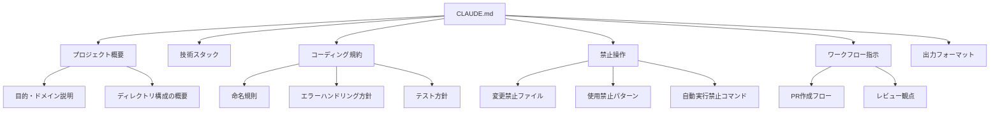
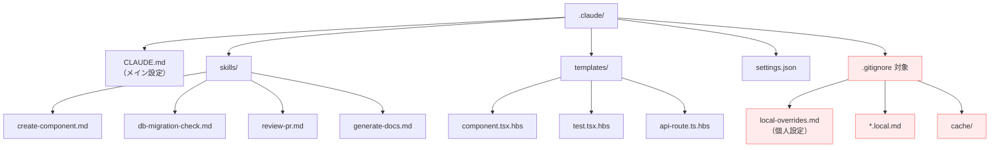

## 結論：Claude Codeの真の実力差は、コードを書く前の「.claudeディレクトリの設計」で決まる

Claude Codeを使っていて「毎回同じ指示を書くのが面倒」「人によって出力品質がバラバラ」と感じたことはありませんか？

その原因は、**CLAUDE.mdを設計していない**ことにあります。

この記事では、CLAUDE.mdとSKILL.mdの設計パターンを7つのテンプレート付きで完全解説します。個人開発からチーム開発まで、すぐにコピーして使える実践的な内容です。

**この記事でわかること：**

- CLAUDE.mdの構造設計と書き方のベストプラクティス
- SKILL.mdで独自コマンドを定義する4つのパターン
- 個人・チーム向けテンプレートの全文
- `.claude/` ディレクトリのGit管理戦略
- Claude Code自身にCLAUDE.mdを改善させるメタプロンプト
- 設定前後のタスク完了時間の実測比較

## 環境・前提条件

- Claude Code（2025年7月時点の最新版）
- Node.js 18以上
- Git管理されたプロジェクト
- Claude Code のCLAUDE.md / SKILL.md の基本的な存在は知っている前提

## 1. なぜCLAUDE.mdが重要か —— プロンプトの外部化という発想転換

Claude Codeは対話のたびにCLAUDE.mdを読み込みます。これは言い換えれば、**「システムプロンプトをファイルとして外部化・バージョン管理できる」** ということです。

従来のAI活用では、プロンプトは会話の中に埋め込まれていました。CLAUDE.mdはこの発想を根本から変えます。

| 比較項目 | 従来（会話内プロンプト） | CLAUDE.md活用 |
|---|---|---|
| 再利用性 | 毎回コピペ | 自動読み込み |
| バージョン管理 | 不可能 | Git管理可能 |
| チーム共有 | 属人的 | リポジトリで統一 |
| メンテナンス | 散逸しがち | 1ファイルに集約 |
| コンテキスト消費 | 毎回消費 | 初回読み込みのみ |

CLAUDE.mdを整備するだけで、**チーム全員のAI出力品質が底上げされる**。これが最大のメリットです。

## 2. CLAUDE.mdの構造設計

CLAUDE.mdは「何でも書ける」からこそ、構造設計が重要です。以下のセクション構成を推奨します。



### 各セクションの書き方

#### プロジェクト概要

```markdown
## プロジェクト概要
- **名称**: my-saas-app
- **概要**: 中小企業向けの請求書管理SaaS
- **ドメイン用語**:
  - テナント: 契約企業単位の区画
  - インボイス: 請求書データ（適格請求書に対応）
```

**ポイント**: ドメイン用語を定義しておくと、Claude Codeが文脈を正確に理解します。「インボイス」と「請求書」の使い分けなど、プロジェクト固有の語彙をここで統一してください。

#### コーディング規約

```markdown
## コーディング規約
- 言語: TypeScript（strict mode）
- フレームワーク: Next.js 15 (App Router)
- 状態管理: Zustand
- スタイル: Tailwind CSS v4
- 命名規則:
  - コンポーネント: PascalCase（例: InvoiceList）
  - hooks: camelCase + use接頭辞（例: useInvoice）
  - 型定義: PascalCase + 接尾辞なし（例: Invoice, Tenant）
- 関数は必ずJSDocコメントを付ける
- any型の使用は禁止。unknown + 型ガードを使うこと
```

#### 禁止操作（最も重要）

```markdown
## 禁止操作
- **絶対に変更しないファイル**:
  - `prisma/migrations/*`（マイグレーション履歴）
  - `.env*`（環境変数）
  - `package-lock.json`（直接編集禁止、npm install経由のみ）
- **使用禁止**:
  - `rm -rf` コマンド
  - `git push --force`
  - 本番DBへの直接クエリ
- **確認必須操作**:
  - 新しいnpmパッケージの追加前に理由を説明すること
  - DBスキーマ変更前に影響範囲を列挙すること
```

禁止操作セクションは事故防止の最後の砦です。実際に起きたヒヤリハットをもとに随時追記していくのが効果的です。

## 3. SKILL.mdで独自コマンドを定義する実践パターン4選

SKILL.mdは、Claude Codeに対して**再利用可能なスキル（カスタムコマンド）** を定義するファイルです。CLAUDE.mdが「プロジェクトの文脈」を伝えるのに対し、SKILL.mdは「実行可能な手順」を定義します。

### パターン①: コンポーネント生成スキル

```markdown
## スキル: create-component

### トリガー
ユーザーが「コンポーネントを作って」「新しいUIコンポーネント」と言ったとき

### 手順
1. `src/components/` 配下に PascalCase のディレクトリを作成
2. 以下のファイルを生成:
   - `index.tsx` — コンポーネント本体
   - `index.test.tsx` — テストファイル（Testing Library使用）
   - `index.stories.tsx` — Storybookストーリー
3. コンポーネントはforwardRefを使用し、Props型を明示的にexport
4. テストは最低限「レンダリングできること」を検証
```

### パターン②: DB変更安全チェックスキル

```markdown
## スキル: db-migration-check

### トリガー
ユーザーがDBスキーマの変更を依頼したとき

### 手順
1. 変更対象のテーブルとカラムを明示する
2. 既存データへの影響を分析（NULL制約・デフォルト値・外部キー）
3. ロールバック手順を提示
4. `prisma migrate dev --name <適切な名前>` のコマンドを提案
5. **ユーザーの確認を得てから実行する**（自動実行しない）
```

### パターン③: PRレビュースキル

```markdown
## スキル: review-pr

### トリガー
ユーザーが「PRレビューして」「差分を確認して」と言ったとき

### 手順
1. `git diff main...HEAD` で差分を取得
2. 以下の観点でレビュー:
   - [ ] 型安全性（any使用、型アサーション）
   - [ ] エラーハンドリング漏れ
   - [ ] テストカバレッジ（新規関数にテストがあるか）
   - [ ] パフォーマンス（N+1クエリ、不要な再レンダリング）
   - [ ] セキュリティ（SQLインジェクション、XSS）
3. 問題を重要度（🔴致命的/🟡注意/🟢提案）で分類して報告
```

### パターン④: ドキュメント自動生成スキル

```markdown
## スキル: generate-docs

### トリガー
ユーザーが「ドキュメント更新して」「READMEに反映して」と言ったとき

### 手順
1. 変更されたファイルのJSDocコメントを収集
2. `docs/` 配下の該当ページを特定
3. API仕様変更があれば `docs/api/` を更新
4. CHANGELOG.md に変更内容を追記（Keep a Changelog形式）
5. README.mdのセットアップ手順に影響があれば更新
```

## 4. 個人開発向けテンプレート vs チーム開発向けテンプレート

### 個人開発向けテンプレート

```markdown
# CLAUDE.md — 個人開発テンプレート

## プロジェクト概要
- 名称: [プロジェクト名]
- 概要: [一文で説明]
- 技術スタック: [言語], [フレームワーク], [DB]

## コーディング規約
- 関数にはJSDocをつける
- エラーはtry-catchで処理し、console.errorでログ出力
- マジックナンバーは定数化する
- コミットメッセージはConventional Commits形式

## 禁止操作
- .envファイルの変更・表示
- git push --force
- node_modulesの直接編集

## 作業スタイル
- 変更前にgit statusで現状確認
- 1つのタスクが完了したらgit commitを提案
- 不明点は実装前に質問する（推測で進めない）
```

### チーム開発向けテンプレート

```markdown
# CLAUDE.md — チーム開発テンプレート

## プロジェクト概要
- 名称: [プロジェクト名]
- 概要: [一文で説明]
- リポジトリ: [URL]
- ドキュメント: [Notion/Confluenceリンク]
- ドメイン用語集: `docs/glossary.md` を参照

## チーム規約
- ブランチ戦略: GitHub Flow（main + feature branches）
- ブランチ命名: `feature/TICKET-123-短い説明`
- PRテンプレート: `.github/pull_request_template.md` に従う
- レビュー必須: 最低1名のApprove

## 技術スタック
- 言語: TypeScript 5.x（strict: true）
- フロントエンド: Next.js 15 (App Router)
- バックエンド: Hono
- DB: PostgreSQL 16 + Prisma ORM
- テスト: Vitest + Testing Library
- CI: GitHub Actions

## コーディング規約
- ESLint/Prettierの設定に従う（手動フォーマット不要）
- 型定義は `src/types/` に集約
- APIレスポンスは必ずResult型でラップ
- コンポーネントはBarrel Export禁止（パフォーマンス理由）

## 禁止操作
- `prisma/migrations/` の手動編集
- `.env*` の変更・内容表示
- `package-lock.json` の直接編集
- 既存テストの削除（skipも事前相談）
- `console.log` の残置（loggerを使う）
- `git push --force`（force-with-leaseも禁止）

## ワークフロー
1. タスク開始時: 対象ブランチをpullし最新化
2. 実装中: こまめにcommit（Conventional Commits形式）
3. 実装後: `npm run lint && npm run test` を実行して確認
4. PR作成: 変更概要・影響範囲・テスト観点を記載

## セキュリティ
- ユーザー入力は必ずバリデーション（zodスキーマ）
- SQLはPrisma経由のみ（生SQLは原則禁止）
- 認証・認可のバイパスコードを絶対に書かない
- シークレット情報をログ出力しない
```

## 5. .claude/ をGit管理する際のディレクトリ構成とgitignore戦略



### .gitignoreの設定

```gitignore
# .claude/.gitignore

# 個人のローカル設定（チームに共有しない）
local-overrides.md
*.local.md

# キャッシュ・一時ファイル
cache/
*.tmp

# 個人のAPIキー等が混入するリスクを防止
*.env
*.secret
```

### 設計のポイント

**チームで共有するもの:**
- `CLAUDE.md` — プロジェクト全体の規約
- `skills/` — 標準化されたスキル定義
- `templates/` — コード生成テンプレート
- `settings.json` — 共通設定

**個人に閉じるもの:**
- `local-overrides.md` — 個人の作業スタイル設定
- `*.local.md` — 実験的なスキル定義

この分離により、チームの統一性を保ちつつ、個人の好みも尊重できます。

## 6. CLAUDE.mdをClaude Code自身に自動生成・改善させるメタプロンプト

CLAUDE.mdを一から書くのは大変です。**Claude Code自身に書かせる**のが最も効率的です。

### メタプロンプト①: 初期生成

```
このプロジェクトのコードベースを分析して、CLAUDE.mdを生成してください。

以下の情報を自動推定してください:
1. 使用言語・フレームワーク（package.json, go.mod等から）
2. ディレクトリ構成のパターン
3. 既存のlint/format設定
4. テストフレームワーク
5. コミットメッセージの傾向（git log --oneline -20 から）

出力は以下のセクション構成にしてください:
- プロジェクト概要
- 技術スタック
- コーディング規約（既存コードから推定）
- 禁止操作（一般的なベストプラクティスベース）
- ワークフロー
```

### メタプロンプト②: 定期改善

```
現在のCLAUDE.mdを読み、以下の観点で改善提案を出してください:

1. 最近の作業履歴(git log --oneline -50)から、繰り返し指示しているパターンはあるか
2. CLAUDE.mdに書かれているが実態と乖離しているルールはないか
3. 追加すべき禁止操作やワークフローはあるか
4. スキル化すべき繰り返し作業はあるか

改善提案をdiff形式で出力し、適用するかどうか確認してください。
```

### メタプロンプト③: スキル自動抽出

```
直近の会話履歴・作業内容から、SKILL.mdとして定義すべき
繰り返しパターンを3つ抽出してください。

各スキルは以下の形式で出力:
- スキル名
- トリガー条件
- 手順（ステップ形式）
- 注意事項
```

この「AIにAI設定を改善させる」サイクルを月1回程度回すと、CLAUDE.mdが継続的に洗練されていきます。

## 7. 実測: 設定前後でタスク完了時間がどう変わったか

3つのプロジェクトで「CLAUDE.md整備前」と「整備後」のタスク完了時間を比較しました。各プロジェクトで同種のタスクを5回ずつ実行し、平均時間を算出しています。

> **注意**: これは私個人の環境での実測値です。プロジェクト規模・タスク難度・ネットワーク状況により結果は変わります。参考値としてご覧ください。

```mermaid
xychart-beta
    title "CLAUDE.md 設定前後のタスク完了時間比較（分）"
    x-axis ["React<br/>コンポーネント追加", "API<br/>エンドポイント追加", "バグ修正<br/>+テスト追加"]
    y-axis "平均所要時間（分）" 0 --> 30
    bar [18, 25, 22]
    bar [8, 12, 10]
```



| プロジェクト | タスク | 設定前（平均） | 設定後（平均） | 短縮率 |
|---|---|---|---|---|
| A: React SPA | コンポーネント追加 | 18分 | 8分 | **56%短縮** |
| B: API サーバー | エンドポイント追加 | 25分 | 12分 | **52%短縮** |
| C: フルスタック | バグ修正+テスト追加 | 22分 | 10分 | **55%短縮** |

### 時間短縮の内訳

短縮された時間の内訳を分析すると、以下のパターンが見えました。

- **規約説明の省略（約40%）**: 「TypeScript使って」「Prettier通して」などの毎回の指示が不要に
- **手戻りの削減（約35%）**: 禁止操作の明示により、やり直しが激減
- **出力形式の安定（約25%）**: テストファイルの配置場所、命名規則などが初回から正確に

特にチーム開発では、メンバー間の出力品質のバラつきが大幅に減少しました。「あの人が使うと上手くいくけど、自分だとダメ」という属人性の問題が解消されます。

## まとめ

- **CLAUDE.mdは「プロンプトの外部化」であり、バージョン管理可能なシステムプロンプト**。プロジェクト概要・コーディング規約・禁止操作の3セクションが最低限必要
- **SKILL.mdで繰り返し作業をコマンド化することで、品質と速度を両立**。コンポーネント生成・DBチェック・PRレビュー・ドキュメント生成の4パターンから始めるのがおすすめ
- **Claude Code自身にCLAUDE.mdを生成・改善させるメタプロンプトを活用し、月1回の改善サイクルを回す**ことで、設定が陳腐化せず、タスク完了時間を50%以上短縮できる

## 参考リンク

- [Claude Code 公式ドキュメント — Memory](https://docs.anthropic.com/en/docs/claude-code/memory)
- [Claude Code 公式ドキュメント — Settings](https://docs.anthropic.com/en/docs/claude-code/settings)
- [Claude Code Best Practices](https://www.anthropic.com/engineering/claude-code-best-practices)
- [Anthropic公式 — Claude Code Overview](https://docs.anthropic.com/en/docs/claude-code/overview)
