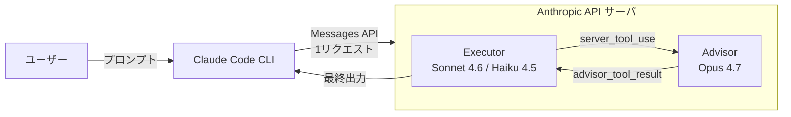
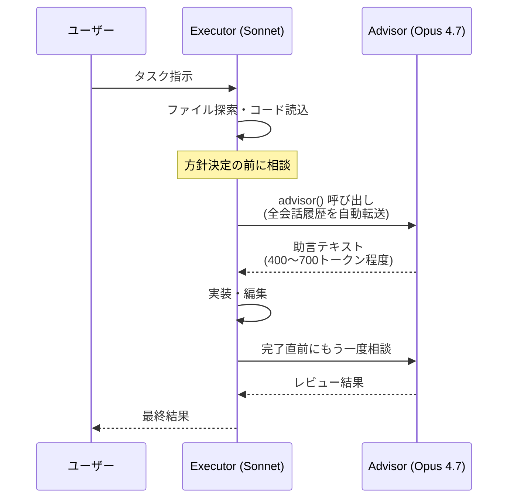

## はじめに

Claude Code で長めのタスクを回していると、ふだんは Sonnet で十分なのに「ここだけは Opus に判断してほしい」という瞬間がたまにあります。そういうときにモデル全体を Opus に切り替えるとコストも待ち時間も跳ね上がりますし、かといって Sonnet のままだと判断が浅いまま走り続けてしまいます。

**`/advisor`** は、この「要所だけ Opus に効かせたい」を綺麗に解決してくれるコマンドです。実行は Sonnet（または Haiku）に任せたまま、**要所でだけ Opus 4.7 をアドバイザーとして自動呼び出し** する仕組みで、Anthropic の発表によると SWE-bench Multilingual で Sonnet 単体比 +2.7pp、コスト -11.9% という結果が出ているようです。

## 忙しい人のための要約

- `/advisor` は実行モデル（Sonnet / Haiku）が要所で **Opus 4.7 に相談しに行く** ためのコマンド
- アドバイザー呼び出しは実行モデルが自律的に判断（手動でも `advisor()` 呼出は可能）
- アドバイザーは **ツールも外部出力も持たない**。会話履歴を読んで指示テキストを返すだけ

## /advisor とは

Claude Code v2.x 系列に追加された slash コマンドで、現在のセッションに **アドバイザーモデル（Opus 4.7 固定）** を紐付けます。一度有効化すると、実行モデルが「ここは助言が欲しい」と判断したタイミングで Opus にサーバ側サブ推論が走り、結果が実行モデルの文脈に差し込まれます。

### モデルの組み合わせ

executor（top-level の `model`）と advisor（tool 定義側の `model`）には組み合わせ制約があります。

| Executor | Advisor |
| --- | --- |
| Claude Haiku 4.5 (`claude-haiku-4-5-20251001`) | Claude Opus 4.7 (`claude-opus-4-7`) |
| Claude Sonnet 4.6 (`claude-sonnet-4-6`) | Claude Opus 4.7 |
| Claude Opus 4.6 (`claude-opus-4-6`) | Claude Opus 4.7 |
| Claude Opus 4.7 (`claude-opus-4-7`) | Claude Opus 4.7 |

不正な組み合わせを投げると 400 が返ります。Advisor は **executor 以上の知性を持つモデル** が条件です。

### アーキテクチャ



CLI 側からは「`/v1/messages` を 1 回叩いた」ようにしか見えませんが、サーバ側では Executor の生成が一時停止して Advisor の推論が挟まり、戻ってきた助言を文脈に取り込んでから Executor が生成を続ける、という流れになっています。

### 呼び出しシーケンス



Advisor が呼ばれるのは典型的に **タスク序盤（方針確定前）** と **タスク終盤（完了申告前）** の 2 回前後で、長い loop ほど効きやすいというのが Anthropic 側の評価です。

## ベンチマーク結果

Anthropic 公式ブログから抜粋すると、おおむね以下のような結果が出ているようです。

| 構成 | ベンチマーク | スコア | 備考 |
| --- | --- | --- | --- |
| Sonnet 単体 | SWE-bench Multilingual | 基準値 | — |
| Sonnet + Opus advisor | SWE-bench Multilingual | **+2.7pp** | コスト **-11.9%** |
| Haiku 単体 | BrowseComp | 19.7% | — |
| Haiku + Opus advisor | BrowseComp | **41.2%** | スコア倍以上、コストは Sonnet 単体の約 15% |

Haiku 系の構成は「Sonnet 単体に対して -29% のスコアで -85% のコスト」というラインに乗ってくるようで、コスト最適化を強めたいワークロードでは選択肢になりそうです。

## 使い方

### Claude Code 内での有効化

セッション内で `/advisor` を叩くとアドバイザーモデル選択 UI が立ち上がります。現状の選択肢は **Sonnet 4.6 を executor にして Opus 4.7 を advisor にする**（または Haiku を executor にする）構成が中心です。

```text
> /advisor

? Pick an advisor model
  ❯ claude-opus-4-7   (recommended)
    off
```

有効化後はそのセッションを通じて Executor が自律的に Advisor を呼び出します。手動で「advisor に聞いて」と指示する必要はありません。

### API から直接使う

SDK 側では tool として宣言します。ベータヘッダが必要な点だけ注意です。

```python
import anthropic

client = anthropic.Anthropic()

response = client.beta.messages.create(
    model="claude-sonnet-4-6",
    max_tokens=4096,
    betas=["advisor-tool-2026-03-01"],
    tools=[
        {
            "type": "advisor_20260301",
            "name": "advisor",
            "model": "claude-opus-4-7",
            "max_uses": 5,
        }
    ],
    messages=[
        {"role": "user", "content": "Go で graceful shutdown 付きの worker pool を書いて"}
    ],
)
```

`max_uses` で 1 リクエストあたりのアドバイザー呼び出し上限を切れます。会話全体（複数リクエストにまたがる）での上限は API 側に存在しないので、必要ならクライアント側でカウントして tools 配列から外す運用になります。

### Usage と課金

レスポンスの `usage.iterations` に Executor と Advisor の内訳が別々に入ります。

```json
{
  "usage": {
    "output_tokens": 531,
    "iterations": [
      {"type": "message", "input_tokens": 412, "output_tokens": 89},
      {"type": "advisor_message", "model": "claude-opus-4-7",
       "input_tokens": 823, "output_tokens": 1612},
      {"type": "message", "input_tokens": 1348, "output_tokens": 442}
    ]
  }
}
```

`advisor_message` の行が Opus 4.7 レートで課金され、トップレベルの `output_tokens` には含まれません。アドバイザー出力は 400〜700 トークン（thinking 込みで 1,400〜1,800）が典型のようです。

## どんなときに効くか / 効かないか

API ドキュメント側でも触れられていますが、向き不向きはわりとはっきりしています。

- **向いている**: 数十ステップ以上の coding agent ループ、ブラウザ操作や調査を伴うマルチターン、不慣れな大規模リポジトリでの構造的リファクタ
- **微妙**: 単発の Q&A、ユーザー自身がモデルを選んでいるパススルー用途、毎ターン Opus の能力を必要とする重いタスク

「**Sonnet で十分な作業の合間に、要所だけ Opus を呼ぶ**」という配分のときに最も価値が出る、という設計です。

## まとめ

- `/advisor` は executor を Sonnet / Haiku に据えたまま、要所で Opus 4.7 を自動呼び出しできるベータ機能
- 長め agent ループでは「Sonnet 単体より賢く、Opus 単体より安く」のスイートスポットに乗せやすそう

## 参考リンク

- [The advisor strategy: Give Sonnet an intelligence boost with Opus | Anthropic](https://claude.com/blog/the-advisor-strategy)
- [Advisor tool - Claude API Docs](https://platform.claude.com/docs/en/agents-and-tools/tool-use/advisor-tool)
