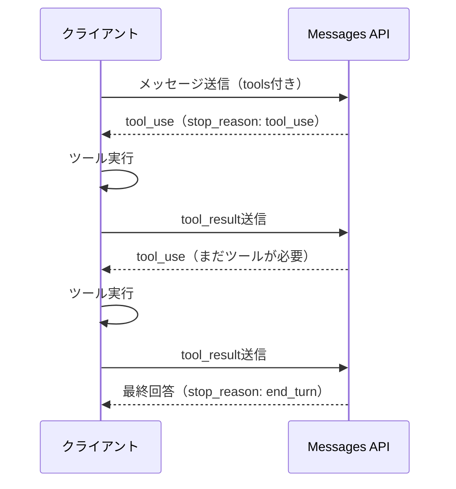
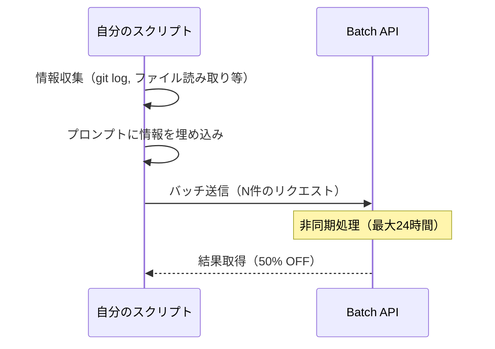

## 背景

[Claude Certified Architect](https://anthropic.skilljar.com/claude-certified-architect-foundations-access-request)について[こちらのGitHubでまとめられた学習ガイドライン](https://github.com/paullarionov/claude-certified-architect/blob/main/guide_ja.md#%E7%AC%AC7%E7%AB%A0message-batches-api)を見ていたときのこと。Message Batches APIの章で、こんな記述を見かけた。

> マルチターンツール呼び出し | サポートされていない（1リクエスト = 1レスポンス）

率直に「それだと使いにくくないか？」と思った。マルチターンができないなら、Batch APIの活用場面はかなり限られてしまうのではないか。気になったので、公式ドキュメントを読んで実際のところを調べてみた。

## 公式ドキュメント上は「サポートされている」

ところが、Anthropicの[Batch Processing公式ドキュメント](https://platform.claude.com/docs/en/build-with-claude/batch-processing)を読むと、こう書いてある。

> Messages APIに対して行えるあらゆるリクエストをバッチに含めることができます。以下が含まれます:
> - Vision（画像認識）
> - Tool use（ツール使用）
> - System messages（システムメッセージ）
> - **Multi-turn conversations（マルチターン会話）**
> - Any beta features（ベータ機能）
>
> （日本語訳）

「Multi-turn conversations」が明示的にサポート対象として記載されている。学習ガイドには「サポートされていない」と書いてあるのに、公式ドキュメントには「サポートされている」と書いてある。一見すると矛盾しているように見える。

## Claude Certified Architectガイドが言っていること

改めて認定ガイドの記述を確認すると、そこに書かれているのは「マルチターン**ツール呼び出し**」がサポートされていない、ということだった。「マルチターン」ではなく「マルチターンツール呼び出し」。この違いが重要だった。

## 「マルチターン」の意味が違う

結論から言うと、両方とも正しい。ただし「マルチターン」という言葉が指している内容が異なっている。

**マルチターン会話（Multi-turn conversations）** は、`messages`配列に過去の会話履歴を含めることを指す。たとえば「ユーザーが質問→アシスタントが回答→ユーザーが追加質問」という会話の流れを、リクエスト時点で組み立てて送る。これはリクエストのペイロードとして含めるだけなので、Batch APIでも問題なく動作する。

一方、**マルチターンツール呼び出し**は、いわゆるエージェントループのことを指す。Anthropicの[Tool Useドキュメント](https://platform.claude.com/docs/en/agents-and-tools/tool-use/how-tool-use-works)には、この仕組みが次のように説明されている。

> エージェントループの標準的な形は、stop_reasonに基づくwhileループである:
> 1. toolsの配列とユーザーメッセージを含むリクエストを送信する。
> 2. Claudeが`stop_reason: "tool_use"`と1つ以上の`tool_use`ブロックを返す。
> 3. 各ツールを実行し、出力を`tool_result`ブロックとして整形する。
> 4. 元のメッセージ、アシスタントの応答、`tool_result`ブロックを含むユーザーメッセージを添えて新しいリクエストを送信する。
> 5. `stop_reason`が`"tool_use"`である限り、ステップ2から繰り返す。
>
> （日本語訳。[原文](https://platform.claude.com/docs/en/agents-and-tools/tool-use/how-tool-use-works)）

つまり、Claudeがツールの実行を要求し、クライアントがそれを実行して結果を返し、Claudeがその結果を受けてさらに処理を続ける、という往復のループが発生する。Claude Codeなどのエージェントがファイルを読んだりコマンドを実行したりできるのは、この仕組み。

Batch APIでこのループが成立しない理由は明快で、リクエストを送信したら、結果が返るまで最大24時間かかる可能性があり、その間にクライアントから`tool_result`を差し込む仕組みがないからだ。公式ドキュメントにも以下の記載がある。

> システムは各バッチを可能な限り高速に処理し、ほとんどのバッチは1時間以内に完了します。バッチの結果には、すべてのメッセージが完了した時点、または24時間経過した時点のいずれか早い方でアクセスできます。
>
> （日本語訳。[原文](https://platform.claude.com/docs/en/build-with-claude/batch-processing)）

整理すると以下のようになる。

| 用語                       | 意味                                   | Batch API    |
| -------------------------- | -------------------------------------- | ------------ |
| マルチターン会話           | messagesに会話履歴を含める             | サポートあり |
| マルチターンツール呼び出し | tool_use → 実行 → tool_result のループ | サポートなし |

## じゃあどう使うのか

ではBatch APIはどういう場面で使えるのか。[学習ガイドには「朝のレビュー用に夜間に生成される技術的負債レポート」](https://github.com/paullarionov/claude-certified-architect/blob/main/guide_ja.md#%E5%95%8F%E9%A1%8C11%E3%82%B7%E3%83%8A%E3%83%AA%E3%82%AAclaude-code-for-ci)というユースケースが紹介されている。

最初にこれを見たとき「技術的負債レポートを生成するなら、ソースコードを読んだりgit logを取得したりする必要があるのでは？ツールが使えないなら無理では？」と思った。

Batch APIの正しい使い方は、必要な情報を**事前に自分で集めて、プロンプトに埋め込む**というものだ。具体的にはこういう流れになる。

1. 自分のスクリプトでファイル読み取り・git操作等を行い、分析対象の情報を収集する
2. 収集した情報をプロンプトに埋め込んでバッチリクエストを構築する
3. Batch APIに投げる

Claudeにファイルを読ませるのではなく、自分で読んでからClaudeに渡す。ツール実行が不要になるので、Batch APIの制約に引っかからない。そして、通常のAPI料金の50%で処理できる。

以下のシーケンス図で、通常のMessages APIを使ったエージェントループと、Batch APIの使い方の違いを比較する。

### Messages API（エージェントループ）

### Batch API

Messages APIではクライアントとAPI間で何度も往復が発生するのに対し、Batch APIでは送信と結果取得の間にやりとりが存在しない。そのかわり、情報収集はすべて送信前に自分で完了させておく必要がある。

## まとめ

Batch APIにおける「マルチターンができない」は、会話履歴を含められないという意味ではない。エージェントループ、つまり`tool_use`と`tool_result`を往復させる対話的な処理が構造的に不可能である、という意味だ。

Batch APIは「入力が完結した大量のタスクを、非同期で安く処理する」ための仕組みであり、Claude Codeのようなエージェント型の処理とは設計思想が異なる。そのため必要な情報は事前に自分で収集し、プロンプトに埋め込んだ状態でリクエストを構築する必要がある。
