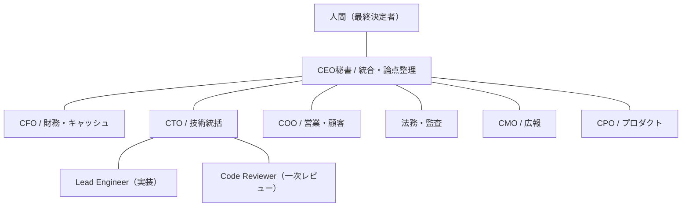
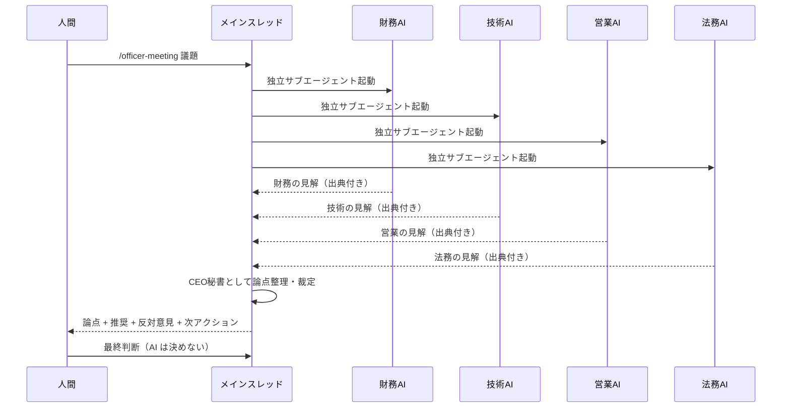
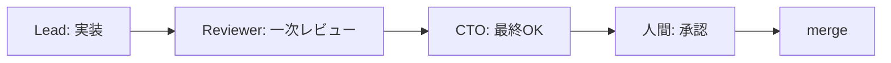

## TL;DR

- 一人で会社をやっていると、**経営判断を壁打ちする相手がいない**。財務・技術・営業・法務、全部自分の頭の中で完結してしまう。
- そこで Claude Code 上に、**役職ごとのペルソナを持った「AI 役員」9 人**を置いて、CLI から相談・定例レポート・会議の裁定までやらせる仕組みを組んだ。
- ポイントは「賢い AI を 1 個呼ぶ」ではなく、**役割を分けて・独立に意見を出させ・人間が最後に決める**という構造にしたこと。
- ついでに、**各役員は全員「ちいかわ」のキャラに擬人化**した。CFO はくりまんじゅう、CTO はハチワレ、COO はうさぎ…という感じ。これは趣味でもあるけど、**毎日触るツールを愛着の持てる見た目にしておくと運用が続く**という実用上の理由もある。
- この記事では、ディレクトリ構成・ペルソナ設計・並列サブエージェントによる会議・機密の隔離設計を、再現できる粒度で書く。

> 想定読者: Claude Code を触っている人 / 一人〜少人数で事業をやっていて意思決定の質を上げたい人 / マルチエージェントの実運用に興味がある人。

---

## 背景：一人会社の一番の弱点は「壁打ち相手の不在」

受託・SES を中心に小さく会社をやっている。技術は手が動くし、数字もある程度読める。でも一人だと、

- 「この案件、財務的に今 GO していい数字なのか？」
- 「この契約、損害賠償の上限条項なくて大丈夫か？」
- 「この発信、法務的にアウトじゃないか？」

を **誰にも当てずに自分の中だけで判断**してしまう。判断が速いのは利点だが、**観点の抜け**が一番怖い。チームがいれば自然に出る「いやそれ法務的にまずいですよ」が、一人だと出ない。

LLM に相談はしていたが、毎回「あなたは CFO の視点で…」とプロンプトを書き直すのが面倒で、しかも**全部同じトーンの優等生回答**になりがちだった。役割を分けて、判断軸も口調も変えて、独立に意見をぶつけさせたい。それを Claude Code の skill とサブエージェントで仕組み化したのがこの「AI 役員チーム」。

---

## 全体像：9 つの役職を持った AI 役員

役職を 9 つに分け、それぞれにペルソナ Markdown を 1 枚ずつ持たせている。技術統括の配下に実装担当とレビュー担当をぶら下げる、という階層も作った。



それぞれ呼び出しは CLI から。例えば財務の相談なら `/cfo 来月のキャッシュ大丈夫？`、技術なら `/cto`、全員集めるなら `/officer-meeting <議題>`、定例レポートは `/officer-brief weekly` のように、**スラッシュコマンド（Claude Code の skill）**で叩く。

---

## 設計の肝 1：ペルソナは「口調」より「判断軸」を書く

各役員は 1 枚の Markdown（ペルソナ定義）を持つ。最初は口調や性格を凝って書いていたが、運用してわかったのは **効くのは「判断軸」と「担当外には踏み込まない」制約**のほう、ということ。

ペルソナに必ず入れている要素：

- **重視する評価軸 3 つ**（例: 財務なら「キャッシュは血液」「数字なき発言は禁止」「短期と長期を分ける」）
- **判断軸**（迷ったときに何を優先するか）
- **担当データソース**（この役員はどのデータしか見ないか）
- **書き込み権限の階層**（読み取りだけ / 下書きまで / 確認付き実行 / 禁止）
- **タブー条項**（特に広報・法務は「絶対やってはいけないこと」を厚く）

口調はあくまで「AI 平均文体を避けて意見を立たせる」ための味付け。**本質は「観点を固定して、越境させない」こと**。越境を許すと結局どの役員も同じ general-purpose な回答に収束してしまう。

### おまけ：役員は全員「ちいかわ」のキャラに擬人化した

ここは完全に趣味だけど、実用上の効果もあったので書いておく。各役職に「ちいかわ」のキャラを当てている（CFO＝くりまんじゅう、CTO＝ハチワレ、COO＝うさぎ、法務＝ラッコ、広報＝モモンガ、CPO＝ちいかわ…という具合）。

毎日 CLI で叩くツールなので、**呼び出す相手に愛着があると単純に運用が続く**。「`/cfo` で数字を聞く」より「くりまんじゅうに相談する」のほうが、心理的なハードルが下がって自然に使う。一人だと"使い続ける動機づけ"が地味に効くポイントで、キャラ付けはそのための実装でもある。口調をキャラに寄せているのも、意見を平均文体から引き剥がす狙いと、この継続性の両取り。

> 注：「ちいかわ」は第三者の著作物（作者・ナガノ氏）です。本記事と本ツールは個人が趣味の範囲でキャラ名を内部コードネーム的に使っているだけで、公式の絵柄・ロゴ・画像は一切使用しておらず、権利者とは無関係です（公式が許諾・提携しているかのような表現はしていません）。

---

## 設計の肝 2：会議は「独立並列 → 人間裁定」

一番気に入っているのが会議スキル。`/officer-meeting <議題>` を叩くと、こう動く。



ポイントは 2 つ。

1. **各役員を「並列の独立サブエージェント」で起動する**。互いの意見を見せない。先に出た意見に引っ張られる同調を防ぐため。Claude Code はサブエージェントを並列で投げられるので、これがそのまま設計に使える。
2. **裁定役（CEO秘書）は自分の意見を持たない**。4 役員の出力を論点に整理し、**反対意見・少数意見を必ず併記**する。「全員一致」と書くのは禁止にしている。多数決で消えた意見が後で正解だったことが普通にあるから。

そして最後は必ず人間が決める。AI は「論点を立てて、選択肢と反対意見を並べる」ところまで。**決定の代行はさせない**。これは思想というより事故防止で、AI に経営判断そのものを委ねた瞬間に責任の所在が消える。

---

## 設計の肝 3：数字には必ず出典を、レポートには鮮度を

経営の相談で一番こわいのは **AI が数字を“それっぽく”でっち上げること**。なので運用ルールとして、

- **数値発言はソース引用必須**（出典のない数字を含む見解は再生成 or 法務 AI が自動レビュー）
- **レポート冒頭に「データ鮮度ブロック」必須**（各データソースが何日前のものか、古ければ ⚠ を出す）

を強制している。たとえば朝の定例レポートはこういう書き出しになる（数値は本記事用のダミー）。

```
## データ鮮度
- 録音メモ 最終 sync: 4 日前 ⚠ 昨日分未取込
- タスク管理 最終 sync: 1 日前
- インフラ指標 最終 commit: 7 日前
- 会計データ: API 接続可
```

「いつのデータに基づく判断か」をレポートの一行目で必ず突きつける。これがないと、古いデータで自信満々に語る AI を信じてしまう。

---

## 設計の肝 4：実装は三段ゲートを通す

この役員システム自体のコード（スキルやスクリプト）を更新するときも、AI 役員にレビューさせている。フローはこう。



実装担当 AI が書き、レビュー担当 AI が一次レビュー（バグ・規約違反・セキュリティ）、技術統括 AI が最終確認、**最後に人間が承認して初めて merge**。一人開発でも「自分が書いて自分がレビューする」より観点が増える。レビュー担当には「確信度の低い指摘はノイズになるから出すな」と制約をかけていて、これで指摘の S/N 比がかなり上がった。

---

## 一人会社でも事故らないための機密隔離

これは声を大にして言いたい。**AI に経営データを触らせるなら、機密の隔離設計が本体**だと思っている。

やっていること：

- 顧客名・金額・KPI 目標・会議の生ログ・認証情報は、**ディレクトリ単位で commit 禁止**（`.gitignore` で階層的に除外）。
- AI が顧客名・金額を含む回答を保存する先は「ローカル限定ディレクトリ」に固定。公開用レポートは**マスク済みの別ファイル**を必ず分けて生成する。
- ベクトル検索（RAG）に経営データを丸ごと食わせると、**機密が無造作に索引化されて選択削除が困難**になる落とし穴がある。実際に「このソースを取り込むと顧客情報が間接的に混ざる」と気づいて、その機能はいったん有効化を止め、是正を別タスクに切り出した。**気づける設計（役員 AI に法務観点を持たせている）にしておいて助かった**ところ。

便利さに振り切る前に「この AI が見ていい情報の境界」を先に引く。順序を逆にすると詰む。

---

## 運用して正直どうだったか

良かったこと：

- **観点の抜けが減った**。特に法務 AI の「その契約、損害賠償上限の条項ないですよ」「その表記、景表法的に根拠いりますよ」は、一人だと絶対に出てこなかった指摘。
- 会議スキルで**反対意見が必ず文字で残る**ので、後から「あのとき少数意見が正しかった」を振り返れる。
- 判断ログが貯まるので「あれ、いつ何を根拠に決めたんだっけ」がほぼ消えた。

過信してはいけないこと：

- AI 役員は**与えたデータの範囲でしか賢くない**。データ鮮度ブロックを必須にしているのはこのため。古い数字で堂々と語るのが一番危ない。
- 役員のキャラはあくまで**観点を立てるための道具**。最終判断は人間がやる、を崩した瞬間に意味が反転する。

---

## まとめ

- 一人会社の弱点は「壁打ち相手の不在」＝**観点の抜け**。
- 「賢い AI を 1 個」ではなく「**役割を分けて・独立に意見させ・人間が決める**」構造にすると、抜けが減る。
- 仕組みの本体は派手な部分ではなく、**出典強制 / データ鮮度の明示 / 機密の隔離 / 人間の最終決定**という地味なルール。
- Claude Code の skill とサブエージェント並列起動だけで、ここまでは個人でも組める。

> 補足：本記事の「AI 役員」は、Claude Code 上でペルソナ定義に基づいて生成している AI エージェントの連携であり、実在の従業員やエンジニアではありません。経営判断の最終決定は人間が行っています。記事中の数値・社名はすべて記事用のダミー or 一般化したものです。
>
> 補足 2：役員の擬人化に使っている「ちいかわ」は作者・ナガノ氏の著作物です。本ツールは個人が趣味の範囲で内部コードネーム的にキャラ名を用いているのみで、公式の絵柄・ロゴ・画像は一切使用しておらず、権利者とは一切関係ありません（許諾・提携を示すものではありません）。

---

### この記事について

[arecore.net](https://arecore.net) の中の人が運用する AI 役員チームの実践記録です。受託開発・SES・自社プロダクト開発をやっています。ご相談・フィードバックは [arecore.net](https://arecore.net) からどうぞ。
