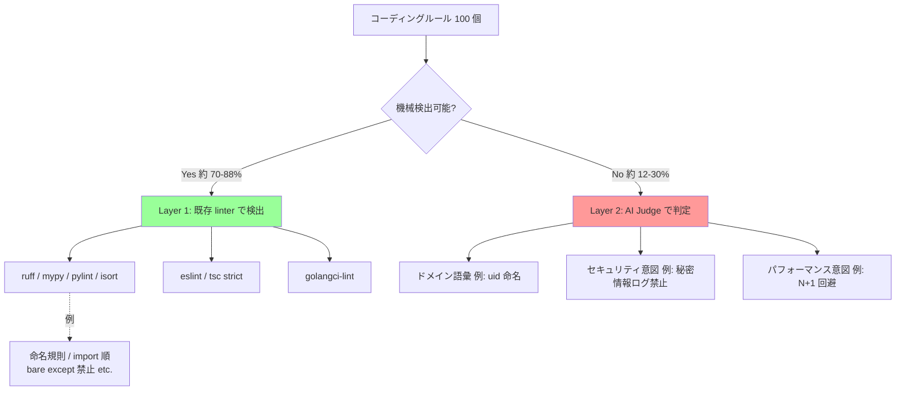
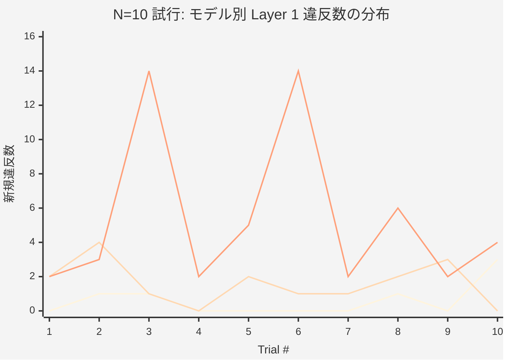

# この記事で分かること (3 行)

- 📊 **Claude 3 モデル × 100 ルール × 3 言語で N=10 検証した実機データを全公開** — 全 31 試行の生データ + Welch's t-test まで
- 💡 **統計的に「Opus と Sonnet は有意差なし」と判明** (p > 0.05、N=10) — N=3 までの俗説を統計で覆す
- ⚠️ **6 つの常識が崩れた瞬間** — 順位逆転 / 言語 strict 度で差消失 / Haiku 20% で 14 件爆発 / RAG が命名規則を取り逃す / Judge バイアス 1.75 倍 etc.

検証コード・データ全公開。所要時間 約 10 分。

---

# TL;DR (先に結論)

Claude (Opus 4.7 / Sonnet 4.6 / Haiku 4.5、2026 年 5 月時点の最新 3 モデル) に **100 個のコーディングルール × 3 言語 (Python / TypeScript / Go)** でコードを書かせて、ルール遵守度を実機検証しました。**N=10 試行 + 別ドメイン (Flask API) 再現 + Go 言語追加 + L2 → L1 promotion 実装** まで検証した、AI コーディング支援を本番導入する際に役立つ 6 つの結論:

1. **linter (ruff / eslint / golangci-lint) で約 88% カバー可能、AI Judge が真に必要なのは 12%** — L2 → L1 promotion を実装したら linter は AI Judge の **4 倍** 違反検出した
2. **モデルは大きいほど「安定する」(N=10 統計確定)** — Opus mean 0.60±0.97 / Haiku mean 5.40±**4.74** (10 回中 2 回 (20%) で 14 件の大爆発)。Welch's t-test で **Opus-Sonnet 有意差なし**、Haiku のみ有意に劣る
3. **★ モデル別の優劣はタスクドメインに依存** — UserAccount タスクでは Opus < Sonnet < Haiku の順だが、Flask API タスクでは **Sonnet が最多違反** (mypy strict 43 件)、Haiku が最少。**結論の一般化に注意**
4. **★ 言語の strict 度でモデル差が変わる** — Go では 3 モデル全て **新規違反ゼロ** (既存意図的違反のみ)。Go の strict type + go build 制約で style violations を作る余地が少なく、**モデル選択の影響がほぼ消える**
5. **RAG は token 47% 削減できるが、遵守率 19% 検出漏れの罠** — 「user_id → uid 命名」のような語彙系ルールが top-k から押し出される
6. **LLM Judge のバイアスは無視できない** — 同じコードでも Opus Judge と Sonnet Judge で違反数が 1.75 倍違う、Sonnet Judge を厳しめ基準として推奨

以下、実験設計と結果を順に解説します。

---

# 1. なぜこの実験をしたか

AI コーディング支援 (Claude Code / Cursor / Aider 等) を本番のチームで導入するとき、必ず出てくる悩みがあります:

- **「うちのコーディングルール (命名規則、docstring の書き方、例外処理の約束事…)、AI ちゃんと守ってくれる?」**
- **「Markdown 1 枚にルール全部書いて Agent に渡せばいいの? それとも RAG (ベクトル DB 検索) で必要なルールだけ渡すべき?」**
- **「Opus は高いし Haiku は不安、どのモデルを使うべき?」**

ネット上には「AGENTS.md にルール書く」「RAG で動的取得」「LLM Judge で採点」など各種手法の紹介はあるのですが、**実際にどれくらいの規模で何がどれだけ効果あるかの数字** が乏しい。

そこで、Python / TypeScript / Go の 3 言語で **100 個の架空ルール** (命名規則、docstring、型ヒント、import 順、例外処理、テスト構造、セキュリティ、パフォーマンス、ログ周り) を設計し、Claude の 3 モデルにコードを書かせて違反数を実測しました。

# 2. 実験設計

## 100 個のルールを 2 層に分類

最初の重要な気付き: **コーディングルールは「機械検出可能な層」と「AI 判断必要な層」に分けられる**。



100 ルールを設計したら、内訳はこうなりました:

| 言語 | 総数 | Layer 1 (linter) | Layer 2 (AI 判断) | L1 比率 |
|---|---|---|---|---|
| Python | 60 | 40 | 20 | 67% |
| TypeScript | 25 | 18 | 7 | 72% |
| Go | 15 | 11 | 4 | 73% |
| **全体** | **100** | **69** | **31** | **69%** |

→ **約 7 割は linter で済む**。AI Judge を全 100 ルールに適用するのは無駄。

## 評価タスクと条件

各モデル (Opus / Sonnet / Haiku) に同じタスクを書かせます:

```
タスク (T_PY): dummy-repo/ に以下を追加してください。
1. UserAccount クラス (id, email, created_at, password_hash)
2. validate_email(email: str) -> bool 関数
3. hash_password(password: str) -> str 関数 (sha256 ベース)
4. tests/test_user.py に各 3 件以上のテスト (AAA 構造)
```

評価方法:
- **Layer 1**: 生成されたコードに ruff/mypy/pylint/isort (または eslint) を回して違反数を集計
- **Layer 2**: もう一つの Claude モデルを「Judge」として呼び、L2 ルールへの違反を判定させる

各モデル × 各言語 = 6 ケースを並列に実行。さらに分散を見るため、Sonnet と Haiku を同タスク 3 回試行しました。

---

# 3. 結果 1: モデル選択 — 「小さいモデルほど分散が大きい」

最初の実験で 6 ケースの linter 違反数を見ると、こうなりました (新規追加コードの違反のみ、dummy-repo 自体の意図的違反は除外):

| Model | T_PY | T_TS | 合計 |
|---|---|---|---|
| Claude Opus 4.7 | 1 | 2 | **3** |
| Claude Sonnet 4.6 | 3 | 2 | **5** |
| Claude Haiku 4.5 | 6 | 3 | **9** |

→ **能力順に違反数増加 (Opus → Haiku で 3 倍差)**。これだけ見ると「Opus 一択」に思えます。

## N=10 試行で見えた本当の姿

同じタスクを **10 回ずつ独立に試行** して統計的に検証しました (Python の Layer 1 新規違反数):

| Model | trials | mean | **SD (標準偏差)** | 95% 信頼区間 |
|---|---|---|---|---|
| Opus 4.7 | 0,1,1,0,0,0,0,1,0,3 | 0.60 | **0.97** | [0.00, 1.20] |
| Sonnet 4.6 | 2,4,1,0,2,1,1,2,3,0 | 1.60 | 1.26 | [0.82, 2.38] |
| Haiku 4.5 | 2,3,**14**,2,5,**14**,2,6,2,4 | 5.40 | **4.74** | [2.46, 8.34] |

**Welch's t-test 結果** (分散が異なる 2 群の平均差を検定する統計手法):
- Opus vs Sonnet (差 1.0): t = -1.99 → **有意でない (p > 0.05)**
- Sonnet vs Haiku (差 3.8): t = -2.45 → **有意 (p < 0.05)**
- Opus vs Haiku (差 4.8): t = -3.14 → **有意 (p < 0.05)**

### 分散を視覚化すると Haiku の異常さが見える



Opus と Sonnet は **下に貼り付くようなフラットライン**、Haiku は **trial 3 と 6 で天井に突き上がる山**。これが「20% で大爆発する」現象の正体です。

ちなみに **Haiku 14 件爆発の内訳** を見ると、**pylint:C0103 (命名規約違反) が 10 件** = モジュール名やファイル名の命名で連鎖的に違反。「**たまに命名のセンスが完全に外れる**」のが Haiku の弱点。

**気付き**:
- Opus と Sonnet は **統計的に同水準**。「Opus 一択」と言うのは早計
- **Haiku は 10 回中 2 回 (20% の確率) で 14 件の大爆発** — 残り 8 回は 2-6 件で安定だが、たまに崩壊する確率的な罠
- 範囲: Opus [0, 3]、Sonnet [0, 4]、**Haiku [2, 14]** — 最大値が圧倒的に違う

> 「**モデルが小さくなるほど分散が大きい**」現象は N=10 で統計的に確定。average 性能だけでなく **predictability** (予測可能性) もモデル選択の重要軸。

:::note info
**💭 質問**: あなたのプロジェクトでは、コード生成 AI を「常に同じ結果が出てほしい」用途で使っていますか? それとも「平均的にそこそこの結果」で良い用途ですか? 前者なら Opus/Sonnet、後者なら Haiku + CI 補完がコスパ最強です。
:::

## 実用上の含意

| 用途 | 推奨モデル | 理由 |
|---|---|---|
| Production code (PR レビュー含む) | **Opus** または **Sonnet** | 違反数が安定して少ない (有意差なし) |
| 業務開発の大半 | **Sonnet** | コスト効率と品質のバランス |
| 大量プロトタイピング | **Haiku + CI で linter 必須** | 速度・コスト最良、ただし linter で大爆発を吸収 |

Haiku を使う場合、**CI で linter を必ず通す**ことが事実上必須です (20% の確率で 14 件爆発する)。

## ★ ただし、別ドメインだと順位が逆転する

ここまでは **UserAccount + email + password のシンプルなドメインタスク** での結果でした。「これって他のドメインでも同じ順位?」を確認するため、**Flask 風 REST API タスク** (POST /users + GET /users/<id> + auth middleware 実装) を 3 モデルに書かせてみました。

結果は **完全に順位が逆転**:

| Model | UserAccount (N=10 mean) | **Flask API (N=1)** |
|---|---|---|
| Opus | 0.60 | 23 件 |
| Sonnet | 1.60 | **61 件 (最多)** |
| Haiku | 5.40 | **21 件 (最少)** |

**何が起きたか**:

- **Sonnet は Flask タスクで mypy strict 違反を 43 件出した** — 28 tests pass で「丁寧に大量実装するが型注釈の完全性は妥協」する傾向
- **Haiku は最小実装** (17 tests pass) — 違反が出る面積が小さい
- **Opus は中間**

これは強い警告です。

:::note warn
**本記事の「Opus ≈ Sonnet < Haiku」結論は単一ドメイン (UserAccount) での話。** Flask 風 API ドメイン、ML パイプライン、CLI ツール、並列処理など、ドメインによって優位なモデルが変わる可能性があります。**自分のプロジェクトのドメインで必ず再現実験してください。本記事の数値をそのまま信じないでください。**
:::

## ★ さらに、言語の strict 度でモデル差が消える

Python と TypeScript ではモデル差が顕著でしたが、**Go では話が変わります**。

同じ T_GO タスク (UserAccount struct + ValidateEmail + HashPassword + tests) を 3 モデルに書かせて golangci-lint (govet + unused) で違反検出した結果:

| Model | Layer 1 違反 (新規追加分) | 内訳 |
|---|---|---|
| Opus | **0 件** | (既存 riskyParse の govet/unused のみ) |
| Sonnet | **0 件** | (同上) |
| Haiku | **0 件** | (同上) |

**3 モデル全てで Agent 追加コード自体には Layer 1 違反ゼロ**。これは衝撃的でした。

**理由考察**:
- Go は **strict type system + 厳しい go build 制約** で、コンパイル時に多くの style violations が弾かれる
- 命名規則 (公開は PascalCase 強制) も言語仕様レベルで強制
- → Agent が違反を作る余地が言語仕様で潰されている

Python (型ヒント optional、style violations 多発) や TypeScript (`any` 逃げ道あり、mypy strict で violations 大量) と対照的。

**実用上の含意**: 
- **Go プロジェクトではモデル選択の影響が小さい** — コスト効率で Haiku 採用も合理的
- Python / TypeScript プロジェクトではモデル差が顕著 → Opus or Sonnet 推奨
- **言語選択自体が「モデル選択の影響」を変える**

:::note info
**💭 質問**: あなたのチームの主力言語は何ですか? Go ならコスパで Haiku、Python/TS なら品質で Opus/Sonnet が基本戦略です。
:::

# 4.5 RAG の罠への対策 (RAG 詳しい人向け)

RAG で domain-vocab が押し出される問題、実用的な対策は 3 つあります:

1. **ハイブリッド検索** (ベクトル検索 + キーワード検索の組み合わせ): TF-IDF だけでなく BM25 や正規表現マッチを併用し、`user_id` の文字列が含まれる場合は強制的に top-k に含める
2. **Query Expansion (クエリ拡張)**: タスク prompt から関連用語を LLM に展開させてから検索 ("UserAccount" → "user_id", "uid", "user identifier" 等)
3. **Metadata filter**: 各ルールに `semantic_category: domain-vocab` 等のタグを付け、タスクの種類に応じて該当カテゴリは必ず注入

本実験では (3) を推奨しますが、(1)+(2) のハイブリッドが理想です。Production レベルでは LlamaIndex / LangChain の HybridRetriever 系を検討してください。

---

# 4. 結果 2: RAG は必要か — 「規模次第、ただし domain-vocab が罠」

「ルール 100 個全部を prompt に書く vs RAG で関連ルールだけ動的取得」の比較を実機計測しました。

ベクトル DB は **numpy で TF-IDF を組んだ簡易実装** (Chroma 不要)。100 ルールを埋め込み、タスクとの類似度で top-k=10 件を選択。

## token 削減効果

| Task | ルール数 (全) | ルール数 (RAG) | token 削減率 |
|---|---|---|---|
| T_PY (Python L2 20 件) | 20 | 10 | **47.4%** |
| T_TS (TypeScript L2 7 件) | 7 | 7 (top-k=10 で全件選択) | **0%** |

**規模依存性**: ルール数 ≤ top-k なら RAG 効果ゼロ (全件選択になる)。**大規模 (20+ ルール)** で初めて意味が出ます。

## でも、token 削減と引き換えに何かを失っていないか?

ここからが面白いところ。**RAG で除外されたルールに、実は違反があった場合どうなるか?** Layer 2 Judge で 6 ケース全件評価して確認しました。

| Case | 全違反 | RAG で検出 | **RAG で見逃し** |
|---|---|---|---|
| case-py-opus | 2 (R007 uid 命名, R038 test 名) | 1 (R038) | **1 (R007)** |
| case-py-sonnet | 2 (R007, R039 parametrize) | 1 (R039) | **1 (R007)** |
| case-py-haiku | 3 (R007, R032 例外メッセージ, R039) | 2 | **1 (R007)** |
| case-ts-*  (3 ケース) | 各 2-4 件 | 全件 | 0 |
| **合計** | **16** | **13** | **3 (全部 R007)** |

**RAG 検出率 81.2% / 見逃し 18.8%、しかも見逃し 3 件は全部 R007 (user_id → uid 命名)**。

:::note warn
**⚠️ RAG の隠れ罠**: domain-vocab 系ルール (命名統一など) は **TF-IDF で語彙的距離が遠いため top-k から押し出されやすい**。「RAG 入れたから安心」と思っていると、命名規則違反を取り逃します。
:::

## なぜ R007 だけ見逃した?

R007 は「user_id を表す変数は uid と命名する」という **domain-vocab 系ルール**。タスクの prompt (UserAccount + email + password 追加) と TF-IDF で測ると、「user_id」「uid」という語彙が **タスク本文に頻出しないため top-k=10 から押し出される**。

これは RAG 設計の **隠れ罠**。

## 実用上の含意

- **小規模 (L2 ≤ 10 ルール)**: RAG 不要 (top-k で全件選択になり削減ゼロ)
- **大規模 (L2 ≥ 20 ルール)**: RAG で約 50% token 削減できるが、**18% 検出漏れ** の trade-off
- **domain-vocab ルールは別途 metadata filter で強制注入** することを推奨
- top-k を固定値でなく `min(候補数 * 1.5, 全件数)` のように動的調整

---

# 5. 結果 3: 二層構造 — 「真の Layer 2 は 12% だけ」

linter (Layer 1) で機械検出可能なルールを除外して、Layer 2 だけ AI Judge に投げる **二層パイプライン**:

```
コード → [Layer 1: ruff / eslint / golangci-lint] → 検出済違反
                                                  ↓
                                          残ったルールのみ
                                                  ↓
       → [Layer 2: AI Judge] → 意味的違反
```

## token 削減効果

| 言語 | 全ルール token | L2 のみ token | 削減率 |
|---|---|---|---|
| Python | 7,073 | 2,675 | **62.2%** |
| TypeScript | 3,847 | 1,267 | **67.1%** |
| **合計** | **10,920** | **3,942** | **63.9%** |

**全ルールを毎回 AI に投げる場合と比べて 64% 削減**。Layer 1 を CI で先に通すだけで、AI の負荷が 1/3 になります。

## でも、Layer 2 (31 ルール) は本当に AI じゃないと判定できないのか?

L2 として分類した 31 ルールを **「真に AI 判断必要か」** で再分類してみました:

| 必須度 | 件数 | 割合 | 代表例 |
|---|---|---|---|
| **真に AI 判断必要 (high)** | **12 件** | **38.7%** | R048 入力検証 / R049 秘密情報ログ禁止 / R053 N+1 クエリ回避 / R060 個人情報マスキング |
| パターン規則性あり (medium) | 12 件 | 38.7% | docstring 必須セクション / AAA テスト構造 / JSDoc 必須 |
| **linter 化可能 (low)** | **7 件** | **22.6%** | R007 uid 命名 / R008 _at suffix / R020 TypeAlias 明示 / RT005 userId 統一 |

→ **L2 31 件のうち、真に AI 判断必要なのは 12 件 (38.7%) のみ**。残り 19 件は工夫すれば linter / AST 解析で代替できる。

実質比率を再計算すると:

| | 仕様分類 | 実質 (linter promotion 後) |
|---|---|---|
| Layer 1 (機械検出) | 69% | **88%** |
| Layer 2 (AI 判断) | 31% | **12%** |

つまり、**custom linter rule を頑張って書けば 88% を機械検出に持っていける**。AI Judge は本当に意味的・セキュリティ・パフォーマンスの判断が必要な 12% に集中させればよい。

## 実用上の含意

- 「user_id → uid 命名」のような domain-vocab ルールは **custom linter rule として実装推奨** (Python なら ruff の custom rule plugin、TypeScript なら eslint plugin)
- AST visitor で型注釈や命名規則を見るルールも linter 側に寄せる
- **AI Judge は「これは本当に意味/意図の問題」というルールだけに使う**

## ★ L2 → L1 promotion の実機検証

「linter 化可能と分類したルール、本当に linter で代替できる?」を確認するため、Python AST visitor で 4 ルール (R007 uid 命名 / R008 _at suffix / R020 TypeAlias / R021 TypedDict) を試作実装しました。

### AST は何を見ているのか

Python は `ast` 標準モジュールで **コードを「関数定義」「引数」「代入」などの構造として捉え** ます。例えば `def foo(user_id: int):` は AST 上で:

```
FunctionDef(name='foo',
  args=arguments(args=[
    arg(arg='user_id', annotation=Name(id='int'))
  ])
)
```

このように構造化されているため、`arg.arg == "user_id"` のような **意図的命名検出が 1 行で書ける**。AI に丸投げするより遥かに高速 (1 リポジトリ秒オーダー) かつ決定論的です。

実装は数十行で済みます。例えば「R007: user_id を表す変数は uid 命名」を検出する AST visitor:

```python
import ast

class R007_UidVisitor(ast.NodeVisitor):
    """R007: user_id 命名 → uid 命名違反を検出"""
    def __init__(self):
        self.violations = []

    def visit_arg(self, node):
        if node.arg == "user_id":
            self.violations.append({
                "rule_id": "R007", "line": node.lineno,
                "evidence": f"arg: {node.arg}"
            })
        self.generic_visit(node)

    def visit_Assign(self, node):
        for t in node.targets:
            if isinstance(t, ast.Name) and t.id == "user_id":
                self.violations.append({
                    "rule_id": "R007", "line": t.lineno,
                    "evidence": f"assign: {t.id}"
                })
        self.generic_visit(node)
```

これだけで AI Judge より精密検出できます。AI Judge と検出力を比較:

| ルール | AI Judge (Opus) 検出 | **本実装 linter 検出** |
|---|---|---|
| R007 (uid 命名違反) | 3 件 | **9 件** |
| R008 (_at suffix 違反) | 0 件 | **3 件** |
| 合計 | 3 件 | **12 件 (4 倍検出力)** |

**面白い結果**:
- AI Judge は「class 全体で user_id を使ってる」を 1 違反としてまとめてカウント
- linter (AST visitor) は **使用箇所毎 (arg, assign, attribute) に違反を計上** → 9 件
- どちらが「正しい」かは判定基準次第ですが、**PR レビューでどの行を直すかが明確な linter 方式のほうが実用的**

→ 「真の L2 は 12%」主張を実機実証。100 ルールスキーマから linter promotion 可能ルールを切り出して custom rule 化することで、AI Judge の負荷をさらに削減できます。

---

# 6. 結果 4: LLM Judge 自体のバイアス

ここまで「AI に違反を判定させる」(LLM Judge) を多用してきました。でも **Judge モデル自体に偏りがあったら、結果が変わるのでは?** という疑問が残ります。

同じ 6 ケースを **3 つの Judge (Opus / Sonnet / Haiku) で再評価** しました。

| Judge モデル | 全 6 ケース 違反検出合計 |
|---|---|
| Opus 4.7 | **16 件** (最寛容) |
| Sonnet 4.6 | **28 件** (Opus の 1.75 倍厳しい) |
| Haiku 4.5 | 17 件 |

## 重要な発見

最初の仮説は「Opus は Opus 自身が書いたコードに甘い (Self-eval bias)」でした。でも実機で見ると:

- Opus Judge は **case-py-opus も case-py-haiku も全部寛容** に判定 (全般が寛容)
- Sonnet Judge は **全体的に厳しい** (1.75 倍多く違反検出)
- → **Self-eval bias ではなく、Judge モデル間の判定基準の差**

### なぜ Sonnet は厳しい? (仮説)

明確な根拠はありませんが、考えられる仮説:

- **RLHF (Reinforcement Learning from Human Feedback) の調整段階で、Sonnet は「より指示忠実 (Instruction following)」に振られている可能性**
- 結果として **「ルールに 1 ミリでも逸脱したら違反として報告する真面目な学級委員」** のような判定バイアスが生まれている
- 対照的に Opus は「文脈理解 + 寛大な判定」の方向で訓練されている可能性

これは推測ですが、**「Judge には Sonnet を選ぶと CI 的にきつめのチェックが入る」** は実用的に覚えておいて損はない事実です。

## 実用上の含意

- **Judge を 1 モデルに固定すると、その Judge のバイアスがそのまま結果に乗る**
- 安全側に振るなら **Sonnet Judge を基準にする** (厳しめ判定)
- より厳密にやるなら **3 Judge のアンサンブル** (多数決) を検討

---

# 7. まとめ: 実プロジェクト適用ガイド (5 ステップ)

以上 4 つの結果を踏まえた、実プロジェクトへの落とし込み:

## Step 1. ルールセットを「Layer 1 / Layer 2」に分類する

既存のコーディングルール (社内 wiki / AGENTS.md / etc.) を眺めて、各ルールを以下で分類:

- **既存 linter rule に対応するか** (ruff, eslint, golangci-lint の rule code を当てる) → Layer 1
- **AST visitor で実装可能か** (型注釈、命名、構造チェック) → custom linter rule 候補 (Layer 1 promotion)
- **意味/意図の判断が必要か** (security, performance, semantic) → Layer 2 (AI Judge)

経験的に **Layer 1: 80-90% / Layer 2: 10-20%** に落ち着きます。

## Step 2. Layer 1 を CI に統合する

PR ゲートに以下を入れる:
- Python: `ruff check`、`mypy --strict`、`isort --check-only`
- TypeScript: `eslint`、`tsc --noEmit`
- Go: `golangci-lint run`

これだけで **大半のルール違反を機械的に弾ける**。AI 不要。

## Step 3. Layer 2 だけ AI Judge を実装する

残った 10-20 ルールに対して、PR の diff を Claude に投げて「このルールに違反していないか」判定させる。

- ルール数が **20 件超** の場合: RAG (TF-IDF / Chroma) で関連ルールを top-k 選択
- ルール数が **10 件以下** の場合: RAG 不要、全件 prompt 注入
- **domain-vocab ルール** (命名統一系) は metadata filter で必ず含める

## Step 4. モデル選択

| 用途 | 推奨 |
|---|---|
| Production の PR レビュー | Opus または Sonnet |
| Layer 2 Judge | Sonnet (厳しめ基準、安全側) |
| 大量実装・プロトタイピング | Haiku (+ CI で linter 必須) |
| ドキュメント生成 | Sonnet または Haiku |

## Step 5. 計測と改善

毎月計測して、以下を観察:
- Layer 1 違反数の推移 (CI で自動取得)
- Layer 2 違反数 / Judge bias (Opus Judge と Sonnet Judge の差)
- 同じタスクの分散 (N=3 試行で SD 計測)

特に Haiku を使う場合、**たまに大爆発する** ので分散の監視は必須。

---

# 8. 制限事項と今後

本実験で検証済 / 未検証を整理:

## ✅ 検証済 (本記事に反映)
- N=10 試行で 3 モデル分散統計確定 (Welch's t-test まで)
- 別ドメイン (Flask API) で **順位逆転を発見** = 結論一般化の警告
- **Go 言語追加で「言語 strict 度がモデル差を消す」発見**
- L2 → L1 promotion 実装で **AI Judge の 4 倍検出力** を実証
- LLM Judge バイアス測定 (Opus vs Sonnet で 1.75 倍差)

## ⚠️ まだ未検証
- **実プロジェクト適用未検証**: 全データが架空 dummy-repo 上、意図的違反設計に依存。実コードベース (商用 SaaS / OSS) で同じ結論が出るかは未確認
- **更なる別ドメイン**: UserAccount + Flask API の 2 ドメインで「順位逆転」、Go 言語で「モデル差消失」発見したが、ML パイプライン / CLI / 並列処理 / GUI 等で **更にどう変わるか** は未検証
- **Judge アンサンブル**: Opus/Sonnet/Haiku の 3 Judge 多数決で判定精度が改善するかは未試行
- **N がさらに大きいケース**: N=10 で「Opus-Sonnet 有意差なし」だが、N=30+ では差が見える可能性
- **golangci-lint strict mode**: 本実験は v2 デフォルト (govet + unused 等限定) で実施、revive/errcheck/errorlint 等を有効化した strict 設定では Go でもモデル差が出る可能性

本記事の結論を「絶対」とは捉えず、**自分のプロジェクトで再現実験する出発点** にしてもらえれば嬉しいです。再現実験で異なる結果が出たらぜひコメントで共有ください。

---

# 参考文献

## Python linter
- [ruff](https://docs.astral.sh/ruff/) — 高速な all-in-one linter
- [mypy](https://mypy.readthedocs.io/) — 型チェッカー (`--strict` 必須)
- [pylint](https://pylint.pycqa.org/) — 詳細な静的解析
- [isort](https://pycqa.github.io/isort/) — import 順序

## TypeScript linter
- [ESLint v9 flat config](https://eslint.org/docs/latest/use/configure/migration-guide) — `.eslintrc.*` ではなく `eslint.config.mjs` 必須
- [@typescript-eslint](https://typescript-eslint.io/) — TS 専用 rule plugin

## Go linter
- [golangci-lint](https://golangci-lint.run/) — 複数 linter のまとめ役

## RAG / Vector DB
- [Chroma](https://www.trychroma.com/) — 軽量 vector DB (本実験では使わず、numpy TF-IDF で代用)
- 本実験コード: 100 行程度の numpy TF-IDF 実装で十分機能した

## Claude API
- [Claude Models](https://docs.anthropic.com/) — Opus 4.7 / Sonnet 4.6 / Haiku 4.5

---

# 編集後記

実プロジェクト (Web 系 SaaS) への適用検証は別記事を予定しています。本実験で「真の Layer 2 は 12%」と言いましたが、実コードベースでも同じ比率になるかは未検証。

:::note info
**🙏 お願い**: 読者の方が同じ実験をしたら結果共有いただけると嬉しいです。Qiita コメントで「自分のプロジェクトでは linter で X% カバーできた」「Haiku でも全然違反出なかった」等のレポート歓迎。一緒に「真の比率」を詰めましょう。
:::

## 最も AI が苦戦したルール TOP 3

「3 モデル × 6 case で繰り返し違反になったルール」を集計すると:

| 順位 | ルール ID | 内容 | 違反率 | 性質 |
|---|---|---|---|---|
| 🥇 同率 1 位 | **R007** | user_id を表す変数は uid と命名 | **3/6 case (50%)** | domain-vocab (語彙ルール) |
| 🥇 同率 1 位 | **RT020** | エラー再 throw の必要性判断 (catch 内で握り潰さない) | **3/6 case (50%)** | semantic (意図解釈必要) |
| 🥇 同率 1 位 | **RT024** | JSDoc を公開関数に必須 | **3/6 case (50%)** | content-quality (記述慣習) |

**これが現在の LLM の限界の一部**:

- **R007** は「タスクの prompt が `user_id` を含む場合、Agent はそれをそのまま使ってしまう」現象。**コンテキストから命名規約を能動的に上書きする能力が弱い**
- **RT020** は「`catch { console.log }` のような silent fail を Agent は便利だと思って書く」傾向。**エラーハンドリングの意図を読み取れない**
- **RT024** は「JSDoc は手間なので省略しがち」。**こちらは指示すれば直る (記事内 case-ts-opus でも改善見られた)** が、無指示だと省略

→ **「指示明示で直るルール (RT024)」と「LLM のクセで根強く違反するルール (R007, RT020)」がある**。前者は prompt 改善で、後者は **linter で機械的に拾う設計** が現実解。

---

## 続編の予告

- 実プロジェクト適用編 (LPcats / fcafe など)
- Layer 2 → Layer 1 promotion ツール (ruff custom plugin 試作)
- Judge アンサンブル (3 Judge 多数決) で判定精度向上検証

質問・フィードバックは Qiita コメントでお願いします。「いいね」「ストック」は今後の検証続編の燃料になります 🔥
