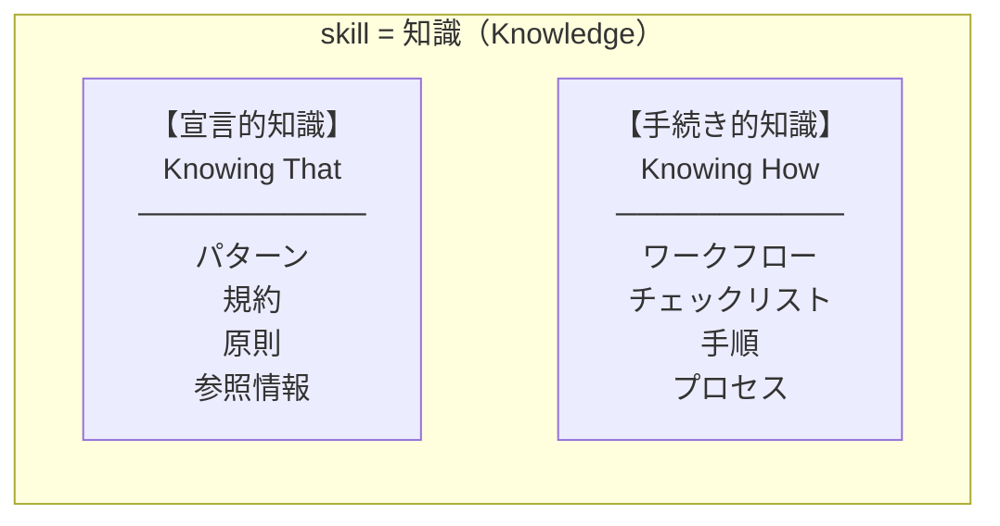

## 📌 はじめに

Anthropicが2025年10月にローンチした **Claude Skills**。表面的には「便利な機能パッケージ」に見えます。

しかし仕様をよく読み込むと、**人間とAIが共有する知識基盤の在り方そのもの** を再定義しようとする、かなり踏み込んだ思想設計であることに気づきました。

### 🎯 この記事のゴール

この記事では、Skillsの設計思想を **3つの問い** から読み解きます。

* スラッシュコマンドはなぜSkillsに統合されたのか？
* 「ユーザー起動」と「AI起動」を分ける意味はあるのか？
* そもそも、ワークフローは「知識」なのか「アクション」なのか？

結論を先に言っておきます。

:::note info
**Anthropicの設計は「主体で分けない、形式で分けない、知識として統合する」という、かなりラディカルな思想に基づいている。**
:::

### 👥 想定読者

* Claude Code / Claude Skills を触っていて、設計思想に興味がある方
* AIエージェント向けの社内ナレッジ基盤の構築を検討している方
* 「人間向けドキュメント」と「AI向けプロンプト」の関係に違和感を持っている方

### 🛠️ 動作環境・参照ソース

* Claude Code（2025年10月リリース版以降のSkills対応）
* 参照したAnthropic公式ドキュメント: [Extend Claude with skills](https://code.claude.com/docs/en/skills)
* 哲学的背景: Gilbert Ryle, *The Concept of Mind* (1949)

## 🎬 きっかけ：「これ、ディレクトリ分けなくていいの？」

最初に違和感を持ったのは、いくつかの大規模なClaude Codeコミュニティのリポジトリを眺めていたときでした。

`skills/` ディレクトリの中に、こんなものが **全部同じ階層で並んで** いたのです。

```text
skills/
├── python-patterns/         ← Pythonのイディオム集（参照する知識）
├── react-patterns/          ← Reactの書き方（参照する知識）
├── api-design/              ← API設計原則（参照する知識）
├── tdd-workflow/            ← TDDの手順（順番に実行するもの）
├── code-review-workflow/    ← コードレビュー手順（実行するもの）
├── security-review/         ← セキュリティチェックリスト
└── ...
```

率直に「**これ、性格が違うものが混ざってない？**」と思いました。

* `python-patterns` は、必要なときに **参照する** 静的な情報
* `tdd-workflow` は、ステップ順に **実行する** 動的なプロセス

前者は「知識」、後者は「ワークフロー」。これだけ性質が違うのに、なぜ同じディレクトリに並べるのか。分けたほうが管理しやすいのではないか。

そう思って公式ドキュメントを読みに行ったところ、こう書かれていました。

> Skills are knowledge modules that Claude Code loads based on context.

「knowledge modules」。**全部「知識」と呼んでいる**。

しかも、`/command-name` で起動する旧来のスラッシュコマンドについてはこう。

> Custom slash commands (`.claude/commands/*.md`) were simple prompt templates triggered by `/command-name`. **They have been effectively merged into Skills.**

「effectively merged」。事実上、Skillsに統合された。

ここで気づきました。これは単なる実装の整理ではなく、**思想的な統合** だと。

「分けなくていいのか」という私の問いに対して、Anthropicは「分けないことに意味があるんだ」と答えているように見えたのです。

そこから掘り下げていったのが、この記事の出発点です。

## 📜 Anthropic公式仕様の整理

統合後のSkillには、起動制御のための2つのフィールドが用意されています。

| frontmatter | 効果 |
|---|---|
| （指定なし） | デフォルト：ユーザーもClaudeも両方起動可能 |
| `disable-model-invocation: true` | ユーザーのみ起動可能（副作用持ち操作向け） |
| `user-invocable: false` | Claudeのみ起動可能（背景知識向け） |

公式ドキュメントの該当部分はこう書かれています。

> **By default, both you and Claude can invoke any skill.** You can type `/skill-name` to invoke it directly, and Claude can load it automatically when relevant to your conversation. Two frontmatter fields let you **restrict** this.

ここで重要なのは動詞です。**"restrict"（制限する）**。

つまり公式仕様の設計思想は、こう読めます。

* **デフォルト** = 両方有効（最大の自由度）
* **フィールド指定** = あえて制限をかける（restriction）

これは、よく読むと結構踏み込んだ宣言です。

## 💡 第一の洞察：「主体」で分けるのはもう古い

旧来のメンタルモデルでは、こういう分離がありました。

* **Commands** = 人間が起動するもの（人間専用UI）
* **Knowledge Base / Prompts** = AIが参照するもの（AI専用データ）

つまり「誰のためのものか」で分けていた。

ところが統合後のSkillでは、デフォルトで両方が呼び出せる。これは何を意味するか。

:::note info
**「知識というものは、人間だけのためのものではない。AIだけのためのものでもない。どの主体が呼び出すかは、知識ごとに後から決められる。」**
:::

呼び出す主体（人間かAIか）は、知識自体の性質を変えるものではない── これに気づいたとき、ちょっと鳥肌が立ちました。

### 🔍 制限フィールドの「存在意義」が思想の根拠

ここで重要なのは、`disable-model-invocation` と `user-invocable` という制限フィールドが **存在すること自体** が思想の根拠になっている点です。

もしAnthropicが「知識は誰のものでもない」と一辺倒に考えているなら、これらのフィールドは不要なはずです。

でも実際には、次のようなケースがあります。

* **デプロイ操作** は人間だけが起動すべき（AIの判断に委ねたくない）
* **レガシーシステムの背景知識** はAIだけが参照すれば良い（メニューに出ても人間は使わない）

このように、**「知識そのものは中立だが、特定の知識は特定の主体だけが扱うべきケースがある」** ことを明確に認めている。

つまり設計思想は、2つのレイヤーから成り立っています。

### レイヤー1：知識の本質（中立）

* 同じMarkdownを人間もAIも読む
* 同じskillを人間もAIも呼び出せる
* 「人間用ドキュメント」と「AI用プロンプト」を分けない

### レイヤー2：知識のアクセス制御（設計可能）

* デフォルトは両方アクセス可能
* 必要に応じて制限できる

## 🧠 第二の洞察：「形式」で分けるのも本質的ではない

ここで冒頭の問いに戻ります。

そもそも私が違和感を持ったのは、`python-patterns`（静的な参照情報）と `tdd-workflow`（順序的なプロセス）が同じディレクトリに並んでいることでした。

前者は「知識」と呼ぶのが自然です。一方、後者は「ワークフロー」と呼びたくなる。これは別物ではないのか？

ここで一度、哲学に立ち寄ってみます。

### 📚 知識の古典的二分類

人間の知識を扱う学問領域では、伝統的に知識は2種類に分類されてきました。哲学者 Gilbert Ryle が1949年に提示した古典的な議論です。

#### ① 宣言的知識（Declarative Knowledge）= "Knowing That"

* 「**何が**そうであるか」を記述する知識
* 例：「水は100℃で沸騰する」「Reactは仮想DOMを使う」
* 静的・命題的・参照可能

#### ② 手続き的知識（Procedural Knowledge）= "Knowing How"

* 「**どうやって**それを行うか」を記述する知識
* 例：「自転車の乗り方」「TDDの実践方法」
* 動的・順序的・実行可能

Ryleの核心的な主張はこうです。

> "Knowing how is not reducible to knowing that."

「やり方を知る」ことは「何かを知る」ことに還元できない。**けれども、両方とも知識である。**

### 🧩 Skillの全体像に当てはめると



:::note info
**「ワークフロー」は知識から外れた特別なものではなく、「手続き的知識」という形態の知識である。**
:::

Anthropic公式仕様のこの一文を、改めて見てください。

> Skills are knowledge modules that Claude Code loads based on context.

ここで言う "knowledge" には、宣言的知識も手続き的知識も **両方含まれている**。Anthropicは最初からそう設計しているのです。

そして、冒頭の私の違和感に答えが返ってきます。

`python-patterns` と `tdd-workflow` が同じディレクトリに並んでいたのは、設計の雑さではありませんでした。**「どちらも知識である」という哲学的に正しい認識** が、ディレクトリ構造に素直に表れていただけだったのです。

## 🎨 ここまでの設計思想を統合する

ここまでの2つの洞察を統合すると、Anthropicが Commands → Skills 統合で実現したかった世界観が見えてきます。

| 過去の二分法 | フラットな答え |
|---|---|
| skillはユーザー用？AI用？ | 両方用（**主体で分けない**） |
| skillは宣言的？手続き的？ | 両方ある（**形式で分けない**） |

ここから導かれる答えはこうです。

:::note info
**skillとは「主体や形式に依存しない、必要なときに引き出される知識のパッケージ」である。**
:::

つまりSkillという統一概念は、**人間とAIの境界、宣言的と手続き的の境界、その両方を解消する** 装置として設計されているのです。

## 🔧 実践への落とし込み

哲学的な議論を、現場で使える指針に落とし込みます。

### 基本方針：90%以上のskillは「制限なし」で作る

frontmatterは最小限にして、デフォルト動作（両方有効）を使うのが **Anthropic公式推奨の標準形** です。

```yaml
---
name: tdd-workflow
description: Use this skill when writing new features, fixing bugs, or refactoring code.
---
```

これで何の問題もありません。「中途半端」ではなく、「制限なしの完全な状態」です。

### 例外：制限が必要なケース

| ケース | フィールド | 例 |
|---|---|---|
| 本番デプロイ | `disable-model-invocation: true` | `/deploy-production` |
| Slack通知送信 | `disable-model-invocation: true` | `/notify-team` |
| 課金関連操作 | `disable-model-invocation: true` | `/charge-customer` |
| 内部コンテキスト供給専用 | `user-invocable: false` | `legacy-auth-system-context` |

判別基準は明確です。

**`disable-model-invocation: true` を足すべきなのは：**

* 取り消せない外部副作用がある
* Claudeが文脈で誤判断したら困る
* 必ず人間が明示的にトリガーを引くべき

**`user-invocable: false` を足すべきなのは：**

* skill名がスラッシュコマンドとして意味をなさない
* メニューに並んでいてもユーザーが混乱する

### コンテンツの性質と起動制御は別物

ここで強調したいのは、**「ワークフロー型だから人間専用」「知識参照型だから制限なし」みたいな対応関係は存在しない** ということです。

以下の4通りはどれも普通にあり得る組み合わせです。

| skill例 | コンテンツの性質 | 起動制御 |
|---|---|---|
| `python-patterns` | 知識参照型 | 制限なし（両方起動可） |
| `legacy-auth-context` | 知識参照型 | AI専用 |
| `tdd-workflow` | ワークフロー型 | 制限なし（両方起動可） |
| `/deploy-production` | ワークフロー型 | 人間専用 |

「コンテンツが何か」と「誰が起動できるか」は **別々に決める設計判断** です。「ワークフローっぽいから人間専用にしないと」みたいに連動させて考える必要はありません。

## 🌟 「全てを知識とみなす」設計の強さ

この設計の本当の強さは、合成と進化の容易さに表れます。

### 🤝 自然な合成ができる

```text
ユーザー: "新機能を実装したい"
  ↓
Claude が複数のskillを同時参照:
  - tdd-workflow（手続き的）→ 進め方
  - typescript-patterns（宣言的）→ 書き方
  - security-review（宣言的）→ 守るべきこと
  - api-design（宣言的）→ 設計原則
```

全部「skill」という同じ抽象で扱えるから、**自然に組み合わさる**。

### 🌱 自然な進化ができる

「次回からはこうすべき」という手続き的知識も、「これは知っておくべき」という宣言的知識も、**同じ仕組みで蓄積されていく**。

「やり方の蓄積」と「知識の蓄積」が、技術的に同じレイヤーで起こる。これは知識基盤として非常に強力な性質です。

## ⚠️ フラットに見ると、限界もある

絶賛だけだと公平でないので、批判的視点も入れておきます。

### 「全てを知識とみなす」設計の弱点

1. **副作用持ち操作との相性**: 「デプロイ手順」は手続き的知識ですが、それを実行することは副作用を伴うアクションです。知識と実行の境界が曖昧になりやすい
2. **検証可能性**: 宣言的知識は真偽が問えるが、手続き的知識は「正しく実行できるか」しか問えない
3. **粒度の問題**: 「ワークフロー全体」を1つのskillにするか、ステップごとに分解するかの判断が難しい

哲学的には統合できても、運用上は区別したほうが扱いやすいケースもあります。このあたりはまだ実践知が成熟していない領域だと感じます。

## 🎯 まとめ

### Anthropicの Skills 統合に込められた思想

:::note info
**「知識とは、人間でもAIでも、必要とする主体が必要なときに引き出せる共有資源である。ただし、どの主体が引き出すべきかは、知識ごとに設計者が決められる。」**
:::

この思想は、2つの境界を解消します。

1. **主体の境界**: 人間用ドキュメントとAI用プロンプトの分離を解消
2. **形式の境界**: 宣言的知識と手続き的知識の分離を解消

### 私たちが意識すべきこと

skillを書くということは、単に「Claude用のプロンプトを書く」ことではありません。**人間とAIが共有する知識基盤の一部を構築する** ことです。

そう考えると、SKILL.mdを書く態度も変わってきます。

* 人間が読んでも、AIが読んでも、同じように理解できるか
* 宣言的な情報と手続き的な情報を、適切に分離・統合できているか
* 主体ベースではなく、知識の性質ベースで設計できているか

これらは、AI時代の新しい技術文書作成の基本リテラシーになっていくはずです。

## 🙏 おわりに

「知識は誰のものか」「ワークフローは知識か」── この2つの問いに、皆さんはどう答えますか？

普段skillを書いている方、これから書いてみようと思っている方、あるいは社内のAIナレッジ基盤を整備しようとしている方の、設計判断の足がかりになれば嬉しいです。

「ここはこう考えるべきでは」「実際の運用ではこう困った」など、コメントや引用RPでぜひ議論させてください。

## 📚 参考リンク

* [Anthropic公式: Extend Claude with skills](https://code.claude.com/docs/en/skills)
* [Anthropic公式: Custom slash commands (Skills統合の経緯)](https://code.claude.com/docs/en/skills)
* Gilbert Ryle, *The Concept of Mind* (1949) - "Knowing How vs Knowing That"
