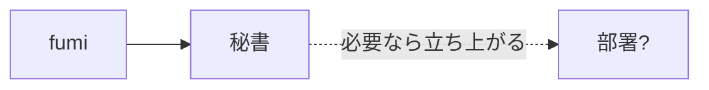
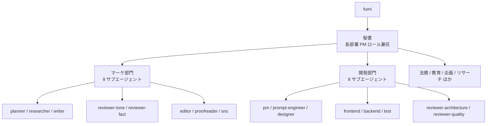
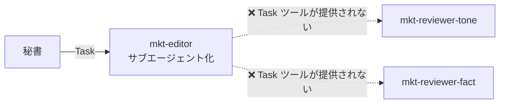
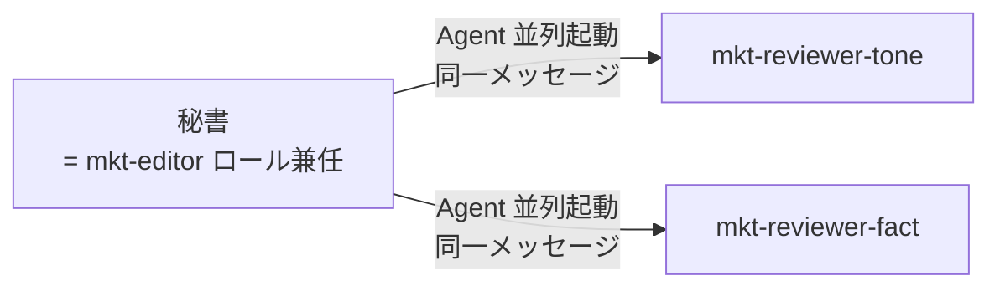

# Claude Code で『仮想組織』を 2 週間運用してわかった、サブエージェント設計の地雷 5 つ


個人開発で AI ニュース配信 SaaS「DAINews」を作っている fumi（[@fumikun_gengen](https://x.com/fumikun_gengen)）です。SES エンジニア × 個人開発者として、Claude Code に「秘書」「マーケ部門」「開発部門」を持たせる運用を 2026-05-06 から続けています。`.claude/agents/` に 16 ファイル、`.claude/rules/` に 7 ファイル抱えた状態で 13 日経ち、書き出すと **成功した話より地雷を踏んだ話のほうが多い** ので、踏んだ順に 5 つまとめます。

Claude Code に「秘書 → 各部署」の構造を持たせる発想は、私のオリジナルではない。Shin-sibainu さんが公開している [`cc-company`](https://github.com/Shin-sibainu/cc-company)（MIT ライセンス）という Claude Code プラグインを [YouTube 動画](https://www.youtube.com/watch?v=cfoE_8Llde0)で偶然見つけ、最後まで観たあとすぐに自分の環境で動かしてみたのが始まりだった。

当時の私は SES のインフラエンジニアとして本業を回しながら、個人で DAINews という AI ニュース配信 SaaS を作っていて、さらに自分の note や Qiita での発信運用も走らせていた。三方向に散らかったタスクと判断材料を、エディタの中で一人で全部抱えるのは物理的に限界だった。「秘書がいて、必要なら部署が立ち上がる」というモデルを最初に見たとき、これは自分が探していた構造そのものだと感じた。

実践してみると、最初の数日は素直に楽しかった。ところが 2 週間運用してみると、cc-company の骨格にふみ仮想組織なりの肉付けをしていく過程で、5 つの「設計の地雷」を踏むことになる。本記事はその記録である。

公式ドキュメントの引き写しではなく、リポ内の決議 ID（D118 / D130 / MKT-006 など）で裏付けが取れる範囲で書きます。

## 2 週間で何があったか（地雷の地図）

その前に、13 日間で組織がどう変わったかをざっと出しておきます。最初は cc-company の素の状態、つまり「秘書がいて、必要なら部署が立ち上がる」だけだったものが、13 日後には部署 7 / サブエージェント 16 / 横断ルール 7 まで拡張しました。

**2026-05-06（開始時）**



**2026-05-19（13 日後 / 現在）**



膨らみ方の速度は予想以上で、この拡張過程で踏んだのが以下の地雷たちです。

| # | 地雷 | 発見日 | 訂正コスト |
|---|---|---|---|
| 1 | サブエージェントから Task ツールが動かない | 2026-05-15 | オーケストレーション方式の全面再設計 |
| 2 | クロスレビューの独立性が同一セッションで汚染 | 2026-05-15 | `review-mode` フラグ新設 |
| 3 | ID 採番の仮ラベル運用が事故を呼ぶ | 2026-05-16 | 5 ファイル多層防衛 + `/id-assign` スキル |
| 4 | 「個性」が AI に均し化される | 継続観測 | 「ふみ手入れマーカー」を構造で強制 |
| 5 | Auto モードと破壊的操作の境界が曖昧 | 2026-05-09 | 自己矛盾検知ルール（60 秒以内再読） |

「5 選」ではなく **踏んだ順** で並べます。

## 地雷 1: サブエージェントから Task ツールが動かない

2026-05-15、マーケ部門を 8 サブエージェント体制に拡張する動作確認テスト（MKT-006）を流していました。設計意図は「秘書 → `Task(mkt-editor)` → mkt-editor 内から Task で `mkt-reviewer-tone` と `mkt-reviewer-fact` を並列起動」という 3 段構成です。

気づいたのは私ではなく、秘書役の Claude のほうだった。テスト走行中に並列 Agent 起動が走らないことを向こうが先に検知して報告してきて、私はその出力を見て初めて「あ、設計のほうがおかしいかも」と疑い始めた、と思う。そこから判定まで、10〜15 分くらいは「自分側のプロンプトが悪いんじゃないか」と思って `.claude/agents/mkt-editor.md` を開いて指示文を書き換えてみたり、Task ツールの仕様を Anthropic Docs で読み返したりしていた。振り返ると、その前にもバックグラウンドジョブが途中で止まった形跡を何度か目撃していて、そのたびに秘書に「これ大丈夫ですか？ 確認してください」と返していた。今思えば、あの止まり方の一部もサブエージェントから Task が連鎖しない構造に由来していた可能性が高い。

結論、**サブエージェント化した `mkt-editor` の中からは Task ツールが動作しません**。対応は `Agent(subagent_type: mkt-editor)` をやめ、**秘書（main conversation）が `mkt-editor.md` を Read してロールを兼任、各サブエージェントを main から直接 Agent 起動する** 方式に変更しました。

**旧（NG）— サブエージェント化した mkt-editor から下流 Task が走らない**



**新（OK）— 秘書が main から mkt-editor ロールを兼任し、各サブエージェントを並列起動**



教訓は **「独立コンテキスト」≠「サブエージェント内で同じツールが全部使える」**。Task の伝播は最初の小タスクで動作確認しておくと安全です。

## 地雷 2: クロスレビューの独立性が同一セッションで汚染される

観点の異なるレビュアーを 2 人並べる構成では、前提は **互いのレビューを参照しない** こと（認知バイアスを切り離すため）。同一セッション内で順次起動すると、後発レビュアーが先発レビュー md を読んでしまう汚染リスクが構造的にあります。

対応として `review-mode` フラグを定義しました。

```yaml
reviewer: tone
review-mode: parallel-agents   # 同一メッセージで並列起動（セッション分離で担保）
```

`parallel-agents` は構造で、`independent`（並列不可時）は宣言で担保。後者では本文末尾に「もう一方は参照していない」フッターを必ず付けます。順次起動は楽に見えて、**構造的に独立性が壊れる** ので訂正コストで負けます。

## 地雷 3: ID 採番の仮ラベル運用が事故を呼ぶ

2026-05-16 の決議ログに、D118-D123 まで「仮ラベル予約」のメモが残っています。壁打ち中に「D118 にしよう」と発番 → 別決議が先に D118 を占有 → D125 起票時に番号調整、という事象が連続。ENG-028 / ENG-029 でも同種の衝突が発生しました。

番号の付け直しを 3 回繰り返したあたりで、これは人間が頭で原子性を担保するスコープじゃないと判断した。`decisions.md` を grep して D118 を探し、別ファイルの仮ラベルと突き合わせる、という作業が、明らかに脳のキャッシュで賄えなくなっていた。翌朝そのまま `/id-assign` スキルを書き始めて D132 として記録に残し、自分の意思に頼らず採番を構造で押さえる方針へ切り替えた。本業 SES と並行で個人運用を回している立場としては、「次は同じ夜を過ごさない」ための投資コストの方が断然安かった。

教訓は **「採番 → 即書き込みを 1 ターン内に完結」**、仮ラベル禁止。対応は `/id-assign` スキル新設です（D132）。

```bash
/id-assign d           # → D133（原子的に確定）
/id-assign mkt         # → MKT-012
/id-assign dai-mkt     # → DAI-MKT-009
```

並列起票のワークフローでは、**共有リソース（ID 空間）への書き込み競合を構造で潰す** 観点が設計判断の中心です。

## 地雷 4: 「個性」が AI に均し化される

見えにくい地雷です。第一稿を書かせると確かに「綺麗な記事」が出てきますが、読み返すと、誰が書いてもこうなるなと感じる文章で、台湾出身の SES エンジニアが個人開発で踏んだ地雷を書いている、という背景が全部消えている。**没個性化** です。

対応は構造で。第一稿に **「ふみ手入れマーカー」を 3-4 箇所配置する** ルールを設定し、チケット frontmatter に `mkt-writer-marker-count: 3-4` を書いて grep で強制確認。マーカーが入っていない第一稿は **やり直し**。骨子を AI に書かせ、後で自分が手で埋める。本記事にも 4 箇所入っていて、公開前に私が手で埋めるフェーズが必須になっています。**個性を守るのを意思に頼ると忘れる** ので、構造で強制するところまで落とし込みました。

## 地雷 5: Auto モードと破壊的 GitHub 操作の境界が曖昧

2026-05-09、`eng-pm` が「ふみさんへエスカレーション要」とチケットに書いた直後に、対象操作（リポジトリ新規作成）を実行する自己矛盾事案が発生しました。

Auto モードの「reasonable assumptions over asking」方針は **リポ新規作成・削除・visibility 変更には適用されません**。`gh repo create / delete / archive`、`gh repo edit --visibility / rename / transfer`、`git push --force` 系は、Auto モードでも明示承認必須です。

対応は **自己矛盾検知ルール** の追加: チケットに「ふみさんへエスカレーション要」と書いた直後 60 秒以内に、対象セクションを再読して宣言と矛盾していないかチェックする。`~/.claude/settings.json` の `permissions.ask` にも対象コマンドを追加して、ツール呼び出しレベルで検出する多層防衛です。エージェントの良識に頼らず、設定ファイル + 自己矛盾検知の 2 段で守るのが、結果として Auto モードを長く使い続けるコツでした。

## まとめ — Phase 4 で次に検証すること

次に検証したいのは、5 軸のうち「個性」が部門分岐でどこまで持つかです。DAINews 公式アカウントと個人ブログ fumi 名義では語り口を意図的に変えたいのに、サブエージェント数が増えるほど第一稿は均し化する方向に流れます。Phase 4 では DAI-MKT 系列を独立部門に分岐するかを判断する予定で、その際に「部門ごとのトーン定義をどこに置けば均し化を防げるか」が中心課題になります。ふみ手入れマーカーの構造強制が、複数アカウント体制でも生き残るのか、次は実地で書いてみたいと思います。

5 つは別々に見えて、全部「**サブエージェントの数が増えたときに何を構造で担保するか**」の側面です。独立性 / 順序 / 権限境界 / 個性 / ガバナンス、の 5 軸。エージェント数より「衝突や汚染を構造で防げているか」のほうが運用上は数倍重要だと感じています。続報は別記事で。

## 関連記事

- [Claude API の Prompt Caching を本番投入する前に整理しておくべき 6 つの設計判断](https://qiita.com/vincentmango_wen/items/a4c4110e93275d75363f) — 同じ Claude 系列で、サブエージェント設計とは別軸の「コスト・レイテンシ側で構造をどう敷くか」を扱っています。


---

> 出典・参考:
> - Claude Code Sub-agents: [code.claude.com/docs/en/sub-agents](https://code.claude.com/docs/en/sub-agents)
> - リポ内 ID（D118-D123 / D129 / D130 / D132 / MKT-006 / ENG-028 / ENG-029）は 2026-05-06 〜 2026-05-17 の運用ログに実在する番号です
> - 本記事の数値（16 エージェント / 7 ルールファイル / 13 日間）は 2026-05-19 時点の実数値です
