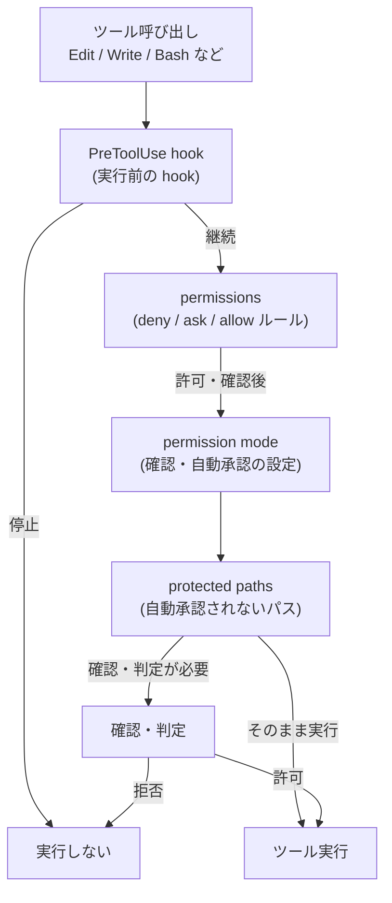
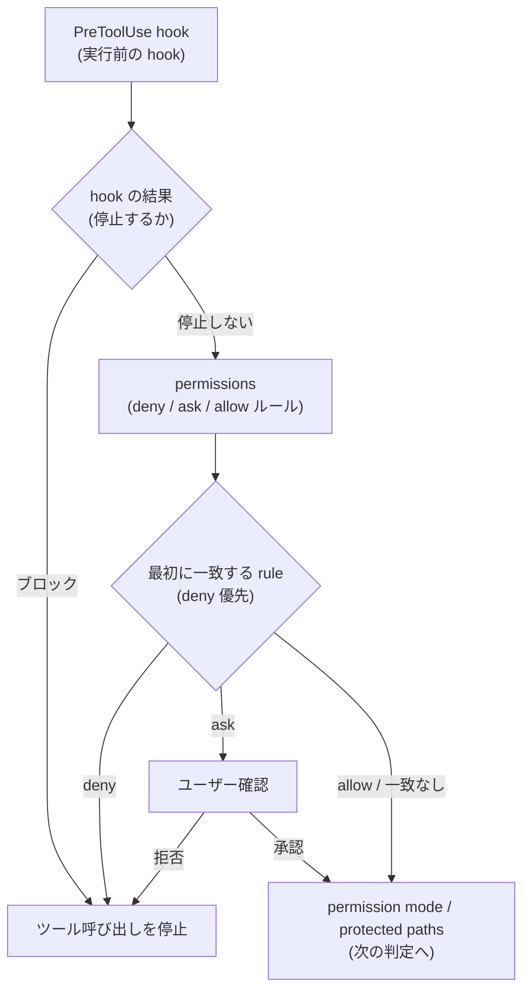

## はじめに

- Claude Code でファイル編集やコマンド実行を扱うとき、実行可否は 1 つの設定だけで決まらない。ツール呼び出しの前に止める hook、ツール利用ルールを定義する `permissions`、自動承認の例外になる protected paths が段階的に関係する。

- この記事では、Claude Code のツール実行可否がどの層で判断されるのかを、`PreToolUse` / `permissions` / `protected paths` の関係から整理する。

## 要旨

- ツール呼び出しは、まず `PreToolUse` で実行前に判定される。
- `PreToolUse` で止まらない場合も、`permissions` の拒否・確認ルールは残る。
- protected paths への書き込みは、通常の自動承認とは別に permission mode ごとの扱いを受ける。

## 全体像

## PreToolUse と permissions

`PreToolUse` hook は `permissions` より前に実行される。ここでツール呼び出しを止めることもできる。

- `permissions` は、Claude Code のツール利用ルール。ツールや引数に対して、拒否する、ユーザーに確認する、許可する、というルールを設定する。

- `PreToolUse` でツール呼び出しを止める方法には、command hook の終了コードで止める方法と、JSON 出力で止める方法がある。`exit 2` は前者にあたる。`exit 1` などの他の非ゼロ終了コードは、hook の実行失敗として扱われ、ツール呼び出し自体は続く。

- hook は先に実行されるが、その判断だけで最終決定されるわけではない。PreToolUse hook は permission prompt より前に実行され、hook の判断は permission rules を迂回しない。hook は前段の追加判定であり、`permissions` はその後に残るルール層。

## protected paths

- protected paths は、リポジトリ状態や Claude Code 自身の設定を保護するため、自動承認の対象から外されているパス。

次の3種類に大別できる。

- Git やエディタなど、リポジトリ状態に関わるメタデータ
- Claude Code 自身の設定や状態に関わるパス
- shell、ripgrep、MCP など、ツール実行環境に影響する設定ファイル

`.claude` は protected paths に含まれる。ただし、Claude が通常作成するコンテンツとして、`.claude/commands`、`.claude/agents`、`.claude/skills`、`.claude/worktrees` は例外として扱われる。

protected paths への書き込みは、permission mode ごとに扱いが分かれる。

| モード | protected paths への書き込み |
|---|---|
| `default` / `acceptEdits` / `plan` | ユーザー確認 |
| `auto` | classifier に送られる |
| `dontAsk` | 拒否 |
| `bypassPermissions` | 許可 |

## 参考

- [Hooks reference - Claude Code Docs](https://code.claude.com/docs/en/hooks)
- [Configure permissions - Claude Code Docs](https://code.claude.com/docs/en/permissions)
- [Choose a permission mode - Claude Code Docs](https://code.claude.com/docs/en/permission-modes)
