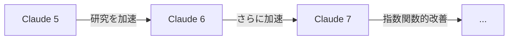

**「今のAIエージェントはスロップ（ゴミ）だ」**

そう言い切ったAI界の巨人が、4日後にAnthropicに入社した。

2026年5月19日、OpenAI共同創業者でありテスラAI部門の元責任者だった**アンドレイ・カーパシー**がAnthropicへの入社を発表。AIコミュニティは騒然となった。

なぜ、彼は古巣OpenAIではなく、Anthropicを選んだのか？

## 結論から言うと...

カーパシーの狙いは **「ClaudeでClaudeを作る」** ことだ。

これは単なる転職ではない。**AIが自分自身を改良する「再帰的自己改善」** の最前線に立つための決断だった。

## Karpathyが暴いた「Vibe Codingの限界」

カーパシーといえば、2025年に「Vibe Coding」という言葉を生み出した人物だ。

> 「プロンプトを投げて、なんとなく動くコードが出てくる」

しかし2026年5月、彼自身がその限界を暴露した。

```
「AIが書いたコードは...
- 非常にブロート（冗長）
- コピペだらけ
- 脆いアブストラクション
- 動くけど...本当にグロス（汚い）」
```

**Vibe Codingは死んだ。** 次は「Agentic Engineering」の時代だと彼は宣言した。

## なぜOpenAIではなくAnthropicなのか？

ここが今回の最大の謎だ。

カーパシーはOpenAIの共同創業者だ。普通なら古巣に戻るはずだ。しかし彼が選んだのはAnthropicだった。

:::note info
**3つの理由が浮かび上がる**

1. **Anthropicの「Claude to train Claude」アプローチ**
2. **Jack Clarkの「2028年末までにAI単独R&D」予測**
3. **3月のデモで「700の改善を2日で自動適用」した実績**
:::

特に注目すべきは3月のデモだ。カーパシーは自身が開発した自律エージェントで、**2日間で約700の改善を自動適用**することに成功した。これを彼は「エスケープ・ベロシティ（脱出速度）」と呼んだ。

つまり、**AIが人間の介入なしに自己改善を加速できるポイント**に到達しつつあるのだ。

## Anthropicで何をするのか？

カーパシーはNick Joseph率いるプレトレーニングチームに所属する。

彼のミッションは明確だ：

```
「現行のClaudeを使って、次世代Claudeの研究を加速する」
```

これが実現すると何が起きるか？



**複利効果**が発生する。各世代が、次の世代をより効率的に作り出す。

## 「ファイナルボス戦」が始まった

Anthropicの共同創業者Jack Clarkは、**「2028年末までに人間不要のAI R&Dが実現する確率は60%」** と予測している。

カーパシーの入社は、この予測を現実にするための布石だ。

あるAI研究者は匿名でこう語った：

> 「これはファイナルボス戦だ。フロンティアラボが再帰的自己改善の実現に向けて全速力で走っている。カーパシーの参加は、その戦いが本格化した証拠だ」

## 開発者への影響

では、私たち開発者は何をすべきか？

### 1. Vibe CodingからAgentic Engineeringへ移行せよ

```bash
# 古い方法（Vibe Coding）
claude "なんかログイン機能作って"

# 新しい方法（Agentic Engineering）
claude code --goal "OAuth2認証を実装" \
  --constraints "TypeScript, 型安全, テスト必須" \
  --verification "全テストパス + セキュリティスキャン"
```

### 2. 「監督者」としてのスキルを磨け

カーパシーの言葉を借りれば：

> 「美学、判断、センス、そして少しの監督 — これは依然として人間の仕事だ」

AIは「実行」を担当し、人間は「方向性」を担当する。この分業を理解せよ。

### 3. Claude Codeの新機能を使い倒せ

5月にリリースされた機能を活用しよう：

| 機能 | 用途 |
|:--|:--|
| `/goal` | 完了条件まで自律実行 |
| Agent View | 10体のAIを同時監視 |
| Claude Security | 脆弱性の自動スキャン |

## この移籍が意味すること

カーパシーの移籍は、単なる人材移動ではない。

**AIエージェント開発の「本命」がAnthropicであることを、業界最高峰の研究者が自らの行動で証明した**のだ。

OpenAIがCodexやGPT-5.5で攻勢をかける中、Anthropicは「AIが AIを作る」という次元の異なる戦いに挑んでいる。

2028年、本当に人間不要のAI R&Dが実現するのか？

カーパシーの選択は、その答えがYesに近づいていることを示唆している。

---

## まとめ

- **カーパシーが「AIスロップ」批判の4日後にAnthropicに入社**
- **目的は「ClaudeでClaudeを作る」再帰的自己改善の実現**
- **Vibe Codingは終わり、Agentic Engineeringの時代へ**
- **2028年までに人間不要のAI R&Dが60%の確率で実現**
- **開発者は「監督者」としてのスキルを磨くべき**

---

**あなたはまだVibe Codingで満足していますか？**

コメントで教えてください。いいねとストックもお願いします！

---

## 参考リンク

OpenAI co-founder Andrej Karpathy joins Anthropic's pre-training team | TechCrunch

https://techcrunch.com/2026/05/19/openai-co-founder-andrej-karpathy-joins-anthropics-pre-training-team/

Anthropic hires OpenAI co-founder Andrej Karpathy | CNBC

https://www.cnbc.com/2026/05/19/anthropic-hires-openai-cofounder-andrej-karpathy-former-tesla-ai-lead.html

Andrej Karpathy Joins Anthropic: What Happens Next | The Algorithmic Bridge

https://www.thealgorithmicbridge.com/p/andrej-karpathy-joins-anthropic-what

Karpathy, Who Called Today's AI Agents 'Slop,' Joins Anthropic | TechTimes

https://www.techtimes.com/articles/316852/20260519/karpathy-who-called-todays-ai-agents-slop-joins-anthropic-use-claude-build-next-claude.htm
