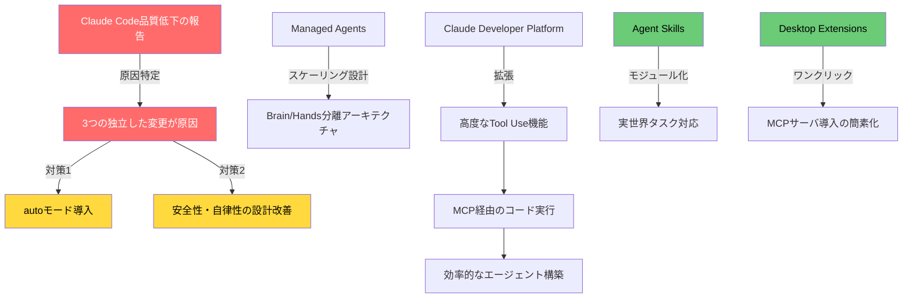
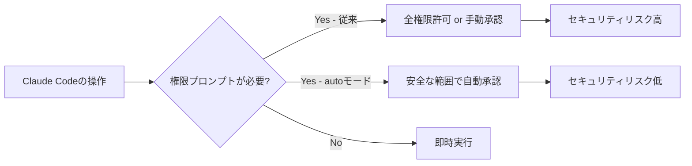
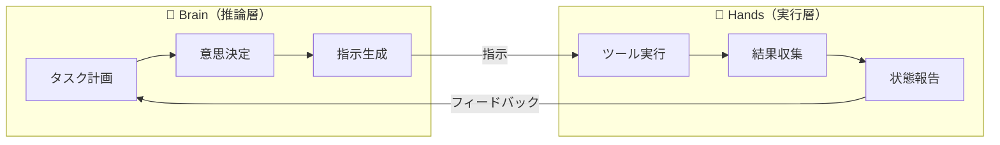
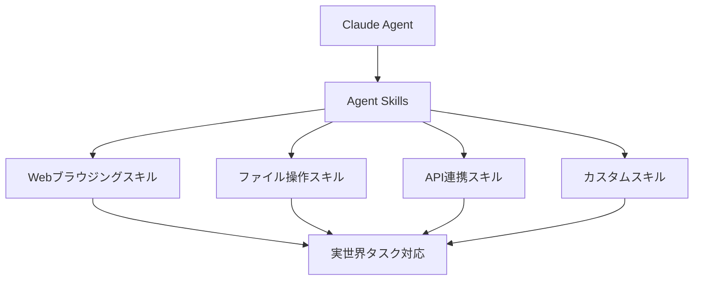
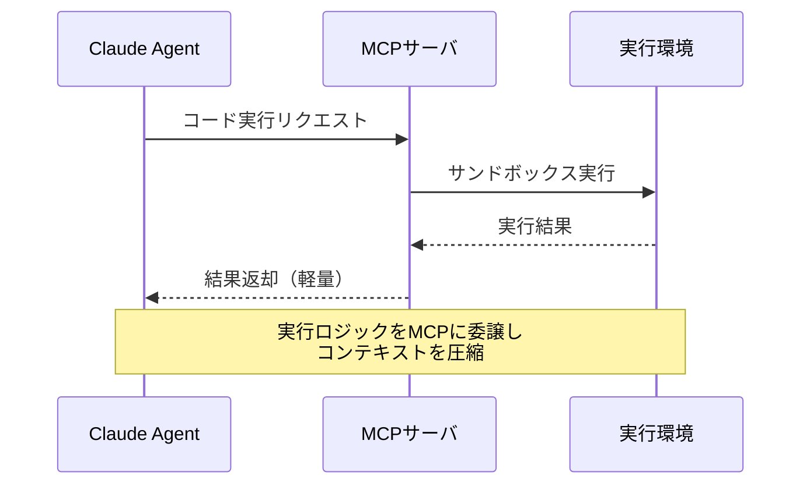

## はじめに

Anthropic Engineeringブログに掲載された最新情報を整理すると、**Claude Codeの品質低下問題**の原因が特定・公表されるとともに、安全性を高める**autoモード**の導入、エージェントを実世界タスクに対応させる**Agent Skills**、MCPを活用した効率的なエージェント構築など、開発者にとって重要なアップデートが相次いでいます。

この記事では、impact_scoreが高いもの（直接影響・要チェック）を中心に整理し、「何が変わったか」だけでなく「なぜ重要か」「どう対応すべきか」を具体的に解説します。

> **📌 影響を受ける人**
> - Claude Codeをプロダクションや日常業務で使っている開発者
> - Anthropic APIを使ってエージェントを構築している開発者
> - MCPサーバーを開発・運用しているエンジニア

---

## 変更の全体像

今回の主要アップデートの関係性を図で示します。



---

## 変更内容

### 重要度別サマリー

| 変更 | severity | impact | 対応要否 |
|------|----------|--------|---------|
| Claude Code品質問題の原因公表 | 🔴 high | 100 | 状況確認推奨 |
| Claude Code autoモード | 🔴 high | 70 | CLAUDE.md更新推奨 |
| Claude Codeの安全性・自律性向上 | 🔴 high | 70 | 設計指針の見直し |
| Claude Codeベストプラクティス | 🔴 high | 70 | ガイド参照推奨 |
| Desktop Extensions (MCP) | 🔴 high | 70 | 配布方法の見直し |
| Agent Skills | 🟡 high | 55 | CLAUDE.md更新推奨 |
| Claude Developer Platform Tool Use | 🟡 high | 40 | CLAUDE.md更新推奨 |
| MCPでのコード実行 | 🟡 high | 40 | 実装パターン参照 |
| Managed Agents Brain/Hands分離 | 🟢 high | 25 | 設計参考 |

---

## 詳細解説

### 1. Claude Code品質問題の原因公表（impact: 100）

Anthropicは最近報告されていたClaude Codeの品質低下について調査し、**3つの独立した変更が複合的に原因**となっていたことを特定・公表しました。

これは単なる障害報告ではなく、Anthropicが問題を透明性をもって説明した点で重要です。Claude Codeを業務利用している場合、特定の時期に品質が低下していたことを把握しておく必要があります。

> **⚠️ Breaking Change**
> Claude Codeをプロダクションのワークフローに組み込んでいる場合、過去の出力品質のばらつきが「モデルの問題」ではなく「インフラ変更の影響」だった可能性があります。

### 2. Claude Code autoモード（impact: 70）

従来、権限プロンプトをスキップするには「全権限を許可する」という方法しかなく、セキュリティ上のリスクがありました。**autoモード**では、より細かい粒度で権限バイパスを制御できるようになります。



**こんな人に影響がある:**
- CI/CDでClaude Codeを自動実行している開発者
- ヘッドレス環境でClaude Codeを動かしているチーム

> **💡 Tips**
> CLAUDE.mdの`Claude Code Settings`セクションにautoモードの設定を追記することで、チーム全体に設定を共有できます。

### 3. Managed Agents: Brain/Hands分離アーキテクチャ（impact: 25）

Managed Agentsを大規模運用するための設計パターンとして、**思考（Brain）と実行（Hands）の分離**が公式に解説されました。



この設計の利点は、スケーリング時にBrainとHandsを独立してスケールアウトできること、障害が局所化されること、テストが容易になることです。

### 4. Agent Skills（impact: 55）

**Agent Skills**は、Claudeエージェントに再利用可能なスキルをモジュールとして付与する仕組みです。Webブラウジング、ファイル操作、APIアクセスなど、実世界タスクへの対応能力をパッケージ化して提供します。



> **📌 影響を受ける人**
> エージェントに外部サービス連携やファイル操作を行わせているチームは、独自実装をAgent Skillsへ移行することでメンテナンスコストを削減できる可能性があります。

### 5. Desktop Extensions: ワンクリックMCPサーバ導入（impact: 70）

従来のMCPサーバ設定は設定ファイルの編集やCLI操作が必要で、エンドユーザーには敷居が高いものでした。**Desktop Extensions**により、Claude DesktopへのMCPサーバ導入がワンクリックで完了します。

| 項目 | 従来 | Desktop Extensions |
|------|------|-------------------|
| 設定方法 | 設定ファイル手動編集 | ワンクリック |
| 対象ユーザー | 技術者向け | 一般ユーザーも可 |
| インストール時間 | 数分〜十数分 | 数秒 |
| 設定ミスのリスク | 高 | 低 |

MCPサーバを開発・配布している開発者は、Desktop Extensionsへの対応を検討することで、ユーザーの導入障壁を大幅に下げられます。

### 6. MCP経由のコード実行（impact: 40）

MCPサーバを介したコード実行パターンを活用すると、エージェントのトークン効率・スループットを改善できます。



---

## 影響と対応

### すぐに取るべきアクション

**Claude Code利用者:**
1. **CLAUDE.mdのアップデート**: autoモード、Advanced Tool Use、Agent Skillsの設定セクションを追記する
2. **品質問題の時期確認**: 直近の出力品質の低下が報告された時期のアウトプットを再確認する
3. **autoモードへの移行検討**: 全権限許可で動かしている自動化があれば、autoモードへの移行を検討する

**MCPサーバ開発者:**
1. **Desktop Extensions対応**: エンドユーザー向けのMCPサーバはDesktop Extensions形式への対応を検討する
2. **コード実行パターンの見直し**: MCPサーバでコード実行を行う場合、トークン効率を意識したアーキテクチャを参考にする

**エージェント開発者:**
1. **Brain/Hands分離の検討**: 大規模エージェントはBrainとHandsを分離した設計へ移行を検討する
2. **Agent Skillsの活用**: 既存の自作ツールをAgent Skillsとして再構成できないか検討する

---

## コード例

### Before: 全権限許可（旧来の方法）

```bash
# 全権限を許可する必要があり、セキュリティリスクが高い
claude --dangerously-allow-all-tools
```

### After: autoモードの利用（新しい方法）

```bash
# autoモードで安全に権限プロンプトをバイパス
claude --auto

# または設定ファイルで指定
# CLAUDE.md に以下を追記
# ## Claude Code Settings
# - permission_mode: auto
```

### MCPサーバ経由のコード実行パターン

```python
# 従来: Claudeが直接コードを生成・返却（トークン消費大）
response = client.messages.create(
    model="claude-opus-4-7",
    messages=[{"role": "user", "content": "このデータを処理するPythonコードを書いて実行結果を返して"}]
)
# レスポンスにコード全文が含まれる → トークン消費大

# 改善: MCPサーバにコード実行を委譲
# MCPサーバ側でサンドボックス実行し、結果のみ返却
# Claudeのコンテキストにはコードではなく実行結果だけが入る
response = client.messages.create(
    model="claude-opus-4-7",
    tools=[{
        "type": "mcp",
        "server": "code-executor",
        "tool": "execute_python"
    }],
    messages=[{"role": "user", "content": "このデータを処理して結果を返して"}]
)
```

### Agent Skillsの利用例

```python
# Agent Skillsを使ったエージェント定義の概念例
agent = ClaudeAgent(
    model="claude-opus-4-7",
    skills=[
        "web-browsing",      # Webブラウジングスキル
        "file-operations",   # ファイル操作スキル
        "api-connector",     # API連携スキル
    ]
)

# スキルが自動的にツールとして提供される
result = agent.run("最新のニュースを収集してレポートを作成してください")
```

---

## まとめ

| テーマ | 要点 |
|--------|------|
| Claude Code品質問題 | 3つの独立した変更が原因と特定・公表済み |
| autoモード | 全権限許可より安全に権限バイパスが可能に |
| Managed Agents設計 | Brain/Hands分離でスケーラビリティ向上 |
| Agent Skills | 実世界タスク対応をモジュールで提供 |
| Desktop Extensions | MCPサーバのワンクリック導入が可能に |
| MCPコード実行 | トークン効率・スループット向上のパターン |

Anthropicは品質問題の透明な公表と同時に、安全性・自律性・スケーラビリティの向上に向けた取り組みを着実に進めています。**Claude Codeユーザーはまずautoモードへの移行とCLAUDE.mdの更新**を、**エージェント開発者はBrain/Hands分離とAgent Skillsの活用**を検討するのが優先度の高いアクションです。
