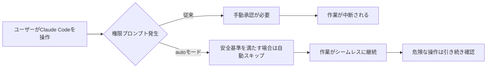
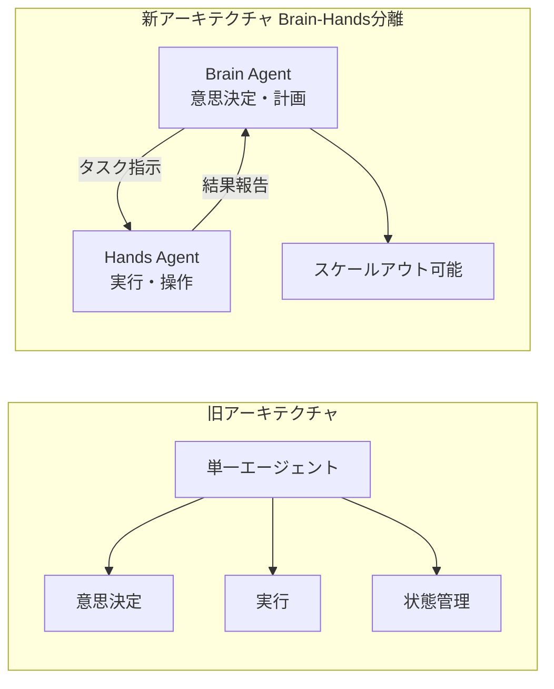
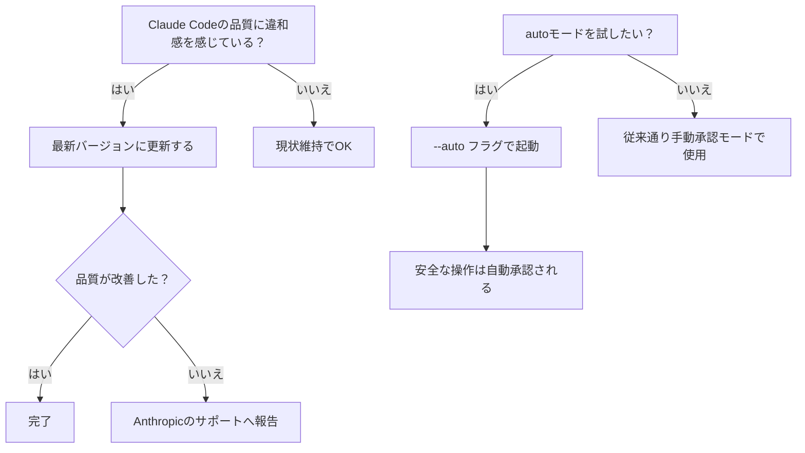

## はじめに

2026年5月、AnthropicはClaude Codeで報告されていた品質低下の原因を公式に特定し、ポストモーテム（事後分析）として公開しました。同時期に、Claude Codeの使い勝手を大幅に改善する **autoモード** も導入されています。

この記事では、**Claude Codeを日常的に使っている開発者**に向けて、これらの変更が何を意味するのか、どう対応すべきかを解説します。

> **📌 影響を受ける人**
> - Claude Codeを使ってコーディング支援を受けている開発者
> - Managed Agents APIを使ってエージェントシステムを構築している開発者
> - Claude APIを本番環境で運用しているエンジニア

---

## 変更の全体像

今回の主要な変更は3つの観点から整理できます。

```mermaid
graph TD
    A[Claude Code 品質問題の報告] --> B{原因調査}
    B --> C[独立した3つの変更を特定]
    C --> D[変更1: 内部パラメータ調整]
    C --> E[変更2: プロンプト処理の変更]
    C --> F[変更3: モデル更新]
    D --> G[品質低下]
    E --> G
    F --> G
    G --> H[ポストモーテム公開・修正対応]

    I[Claude Code autoモード導入] --> J[権限プロンプトを安全にスキップ]
    J --> K[自律性向上]
    J --> L[安全性維持]

    M[Managed Agents スケーリング設計] --> N[脳と手の分離アーキテクチャ]
    N --> O[意思決定 Brain]
    N --> P[実行 Hands]
```



---

## 変更内容

### 1. Claude Code品質問題ポストモーテム（重要度: 高）

Anthropicは、ユーザーから寄せられた「Claude Codeの回答品質が下がった」という報告を調査し、**3つの独立した変更**が原因であることを特定しました。

| 観点 | 内容 |
|------|------|
| 問題の発生時期 | 2026年5月頃 |
| 原因の数 | 3つの独立した変更 |
| 影響範囲 | Claude Code全般 |
| 公式対応 | ポストモーテム公開・改善策の実施 |
| ユーザーアクション | 現時点では不要（Anthropic側で対処） |

Anthropicが原因を公開したことは珍しく、今後の透明性向上への取り組みとして注目されます。

> **⚠️ Breaking Change ではないが要注意**
> 品質問題は修正対応中ですが、過去数週間のClaude Codeの出力に違和感があった場合、それはモデルやツール側の問題だった可能性があります。今後のアップデートで品質が改善される見込みです。

---

### 2. Claude Code autoモード（重要度: 中・直接影響）

2026年3月25日、Claude Codeに **autoモード** が導入されました。これは操作中に表示される権限確認プロンプトを、安全性を維持しながらスキップできる新機能です。



**autoモードの特徴:**
- 安全と判断される操作のみ自動承認
- ファイル削除や外部通信など危険な操作は引き続き確認を求める
- CI/CDパイプラインや自動化スクリプトとの相性が向上

> **💡 Tips**
> autoモードはバックグラウンドで長時間実行するタスクや、繰り返しの多いリファクタリング作業で特に効果を発揮します。初めて使う場合は、ローカル環境で動作を確認してから本番ワークフローに組み込むことを推奨します。

---

### 3. Managed Agentsのスケーリング設計（重要度: 高）

2026年4月8日に公開された設計パターン記事では、**「脳と手の分離（Decoupling the Brain from the Hands）」** というアーキテクチャが紹介されました。



| 比較項目 | 旧アーキテクチャ | 新アーキテクチャ |
|----------|----------------|----------------|
| スケーラビリティ | 低い（単一エージェントに集中） | 高い（Handsを並列化可能） |
| 意思決定の複雑さ | 実行と混在 | 独立して最適化可能 |
| 障害の影響範囲 | 全体に波及 | Hands単体に限定 |
| 推奨ユースケース | 小規模タスク | 長時間・大規模タスク |

---

## 影響と対応

### Claude Codeユーザーへの対応



**今すぐやること:**
1. Claude Code を最新バージョンにアップデートする
2. 品質問題が継続している場合はAnthropicに報告する
3. autoモードを試してみる（長時間タスクで特に有効）

### Managed Agentsを使っている開発者への対応

Brain-Hands分離パターンは**新しい設計パターンの提案**であり、既存コードの破壊的変更ではありません。ただし、以下のケースでは移行を検討する価値があります：

- エージェントが長時間タスク（30分以上）を実行している
- 複数の実行ステップが直列で処理されており、並列化できていない
- エージェントの一部障害が全体に影響している

---

## コード例

### autoモードの使用（Before/After）

**Before（従来の対話型モード）**
```bash
# 実行中に権限プロンプトが表示され、手動承認が必要
claude-code "テストを全件実行してリファクタリングせよ"
# → 途中でプロンプトが表示され、手動でy/nを選択する必要がある
```

**After（autoモードを使用）**
```bash
# 安全な操作は自動承認され、作業がシームレスに進む
claude-code --auto "テストを全件実行してリファクタリングせよ"
# → 安全と判断された操作は自動承認、危険な操作のみ確認を求める
```

### Brain-Hands分離のコンセプト実装例

**Before（単一エージェント）**
```python
import anthropic

client = anthropic.Anthropic()

def run_agent(task: str):
    # 意思決定と実行が混在
    response = client.messages.create(
        model="claude-opus-4-7",
        max_tokens=4096,
        messages=[{"role": "user", "content": task}],
        tools=[read_file_tool, write_file_tool, execute_tool]
    )
    return response
```

**After（Brain-Hands分離）**
```python
import anthropic

client = anthropic.Anthropic()

def brain_agent(task: str) -> list[dict]:
    """意思決定のみ担当。実行はしない。"""
    response = client.messages.create(
        model="claude-opus-4-7",
        max_tokens=4096,
        system="あなたはタスク計画専門のエージェントです。実行手順を詳細に計画してください。",
        messages=[{"role": "user", "content": task}],
    )
    # 実行ステップのリストを返す
    return parse_steps(response.content[0].text)

def hands_agent(step: dict) -> str:
    """実行のみ担当。判断はしない。"""
    response = client.messages.create(
        model="claude-haiku-4-5-20251001",  # 実行は軽量モデルで十分な場合も
        max_tokens=2048,
        messages=[{"role": "user", "content": f"以下を実行してください: {step}"}],
        tools=[read_file_tool, write_file_tool, execute_tool]
    )
    return response.content[0].text

def run_scaled_agent(task: str):
    steps = brain_agent(task)
    # Handsを並列実行できる
    results = [hands_agent(step) for step in steps]
    return results
```

> **💡 Tips**
> Brain AgentにはOpus 4.7などの高性能モデルを使い、Hands AgentにはHaiku 4.5などの軽量・高速モデルを使うことでコストと速度を最適化できます。

---

## まとめ

| 変更 | 重要度 | ユーザーへの影響 | 対応 |
|------|--------|----------------|------|
| Claude Code品質問題ポストモーテム | 🔴 高 | 品質低下が報告されていた | 最新版に更新 |
| autoモード導入 | 🔴 高 | 自律的なタスク実行が向上 | `--auto`で試用 |
| Brain-Hands分離パターン | 🟡 中 | 大規模エージェント設計に影響 | 新規設計時に参考に |
| Opus 4.6 eval awareness | 🟡 中 | ベンチマーク結果の解釈に注意 | 評価設計の見直し |

Anthropicがポストモーテムを公開したことは、開発者コミュニティに対する透明性の観点から評価できます。Claude Codeを使っている方は、まず**最新バージョンへの更新**を行い、autoモードを一度試してみることをお勧めします。Brain-Hands分離パターンは長期的なエージェント設計の参考として、新規プロジェクト立ち上げ時に検討してみてください。
