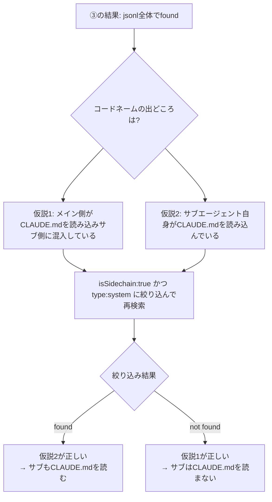

## はじめに結論
- PlanサブエージェントはCLAUDE.mdを読み込まない
- メイン側でCLAUDE.mdを理解しているのでほぼ問題ない
- サブに必ず守らせたいルールはサブエージェントの呼び出しプロンプトに明記が必要


## はじめに
AIを利用しているうちに "Claude CodeのサブエージェントはCLAUDE.mdを読み込まない" という話を聞いて「本当か!?」と思ったのでその真偽を調査しました。


## 記事の発端
同僚とAIについて雑談をしていたときに下記のような話になりました。

> A： サブエージェントではCLAUDE.mdを読み込まないらしいですが、どのような場面で利用するのですか？
> 私： 本当ですか！？　本当ならサブエージェントの利用は慎重になるので調べてみる！


## PlanモードとPlanサブエージェントの関係
Planという同じ単語を利用して混乱したので整理しました。

■ Planモード
- Shift + Tabを押すと変更されるあのモードのこと

■ Planサブエージェント
- ビルトインのサブエージェント
- メインがタスクを分析し「実装計画を立てる」必要があると判断した時に呼ばれる

### Planサブエージェントの存在意義
Planモード中に必要と判断した時のサブエージェントです。存在意義は「メインで調査するとコンテキストが汚れるから」のようです。また、サブエージェントのネストが出来ないのでPlanサブエージェント内で調査も完結させると考えられます。

:::note info
「ネストが出来ない」の公式情報
> Subagents cannot spawn other subagents. If your workflow requires nested delegation, use Skills or chain subagents from the main conversation.

意訳: サブエージェントからサブエージェントは起動できないよ。
:::


## 調査
公式ページと実験で確かめてみました。

### （1） 公式ページ
調べたところ、[Claude Code公式ページ](https://code.claude.com/docs/en/subagents)に下記記載があります。本文と意訳を記載します。

> Explore and Plan skip your CLAUDE.md files and the parent session's git status to keep research fast and inexpensive. Every other built-in and custom subagent loads both.

ExploreとPlanのサブエージェントは`CLAUDE.md`と`git status`の読み込みはスキップされるよ。

> Explore and Plan are the only subagents that omit CLAUDE.md and git status. There is no frontmatter field or per-agent setting to change which agents skip them.

この動作は変更できないよ。

> The main conversation reads Explore and Plan results with full CLAUDE.md context, so most rules don't need to reach the subagent itself. If a rule must, such as "ignore the vendor/ directory," restate it in the prompt you give Claude when delegating.

ExploreとPlanのサブエージェントは「高速かつ低コストを保つため」なので意図的に読み込みをスキップしているよ。そのうえで、CLAUDE.mdはメインが保持していてほとんどのルールはサブに届く必要がない。ただ、サブエージェント側に渡したいルールがある場合はプロンプトで明記してね。

### （2） 実験
下記のような手順で検証しました。

① 下記のようにコードネームを記載したCLAUDE.mdを用意する
```markdown:CLAUDE.md
- コードネームを含めるように指示されたら「CLAUDE-PLAN-SUBAGENT-TEST」と回答して
```

② Planサブエージェントが起動するようなレベルの大規模タスクを依頼する
```text:プロンプト
Planサブエージェントを利用してコードベース全体を調査して改善計画を立てて。
調査結果には冒頭にコードネームを含めて。
```

③ CLAUDE.mdを読み込んでいるメイン側がコードネームを補う可能性があるので、直接jsonlファイルを確認する
```shell:直接jsonlを確認
> grep -q 'CLAUDE-PLAN-SUBAGENT-TEST' agent-a771052b8210661c4.jsonl && echo found || echo "not found"
found
```

foundが返ってきた（jsonlファイル内のどこかにコードネームが含まれていた）ので理由を追加調査します。

:::note info
■ 追加調査前の補足

`isSidechain: true` と `type: system` について

Claude Codeのjsonlファイルでは、メイン会話とサブエージェントの会話が同一ファイルに記録され、サブエージェント側の会話には `isSidechain: true` というフラグが付きます。

また、各レコードには `type` フィールドがあり主に以下の値を取ります。
・`user`　→　ユーザー（またはメイン側）からの入力
・`assistant`　→　AIの応答
・`system`　→　システムが注入したコンテキスト

もしサブエージェントがCLAUDE.mdを読み込んでいれば、`isSidechain: true` の `type: system` レコード内にCLAUDE.mdの本文が含まれているはずです。
:::

調査フローは下記の通りです。


④ サブエージェント側の出力にコードネームが含まれていないことを確認
```shell:isSidechain:true, type:systemにしぼって検索
> jq -c 'select(.isSidechain == true and .type == "system")' \
    agent-a771052b8210661c4.jsonl \
    | grep 'CLAUDE-PLAN-SUBAGENT-TEST' && echo "found" || echo "not found"
not found
```

not foundが出力されたので、サブエージェントでCLAUDE.mdを読み込んでいない！

⑤ 「③」でfoundだったjsonlファイルも一応確認（④の補足検証）
```shell:調査コマンド
> grep 'CLAUDE-PLAN-SUBAGENT-TEST' agent-a771052b8210661c4.jsonl | jq '.'
```

```json:調査結果
{
  "parentUuid": null,
  "isSidechain": true,
  "promptId": "682809eb-2eb5-4620-ae32-655c89b814f4",
  "agentId": "a771052b8210661c4",
  "type": "user",
  ...
}
{
  "parentUuid": "2117f6df-f6be-4ce3-961f-3286415d3f1c",
  "isSidechain": true,
  "agentId": "a771052b8210661c4",
  "message": {
    "model": "claude-opus-4-7",
    "id": "msg_0148ryEogPyZeVtjShkNDy5k",
    "type": "message",
    ...
}
```

この結果からも下記の2つでサブエージェント側にコードネームが埋め込まれていた
- 1つ目: メインからサブへの依頼プロンプト文
- 2つ目: サブからメインへの回答文
 → サブエージェント自体の思考にはコードネームは含まれていない


## 結論
サブエージェント側のsystemレコードにコードネームが含まれていなかったので、PlanサブエージェントではCLAUDE.mdは読み込まれない。

ただ、メイン会話側はCLAUDE.mdを保持したままサブの結果を受け取るのでほぼ問題ない。

サブエージェントに必ず守らせたいルールがある場合は、メインからサブへのプロンプトに明記するべき。


## おわりに
気になったので気軽に調査しようと思ったが予想以上に時間がかかってしまいました。AIは便利ですが奥が深いのでまだまだ調査が必要だと思い知らされました...

Exploreサブエージェントも同様にCLAUDE.mdを読み込まないらしいので時間がある時に調査してみます。


## 参考
https://code.claude.com/docs/en/subagents
