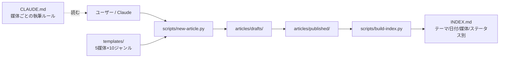

## はじめに

:::note info
当記事は生成AIによって執筆しています。内容の正確性には十分注意を払っていますが、誤った情報が含まれている可能性があります。実際にご利用の際は、公式ドキュメント等もあわせてご確認ください。
:::

複数の技術ブログ媒体に記事を出していると、媒体ごとの記法・トーン・frontmatter の違いが地味につらくなってきます。Qiita の `:::note info`、Zenn の `:::message`、note の「h2/h3 しか使えない」制約、はてなの `[:contents]`、Dev.to の Liquid tags…。Claude などの AI に書かせる場合も、プロンプトに媒体仕様を毎回貼り付けるのが面倒です。

この問題を解決するために、**5媒体 × 10ジャンル = 50テンプレート** と、Claude に媒体仕様を渡す `CLAUDE.md`、Python 標準ライブラリだけで動く管理スクリプトをワンセットにした **article-templates** を作って GitHub テンプレートリポジトリとして公開しました。

**対象読者**

- Qiita / Zenn / note / はてな / Dev.to など **複数媒体に記事を出している** 個人開発者
- Claude / Claude Code / Cursor で **記事執筆を効率化したい** 人
- 記事を Git で管理したい、ファイルベースの仕組みが好きな人

## TL;DR

- **何ができるか**：5媒体 × 10ジャンル = 50種類の Markdown テンプレートから記事を起こし、Claude に媒体仕様を守らせて執筆できる
- **誰向けか**：複数の技術ブログ媒体に記事を出していて、媒体ごとの記法差に毎回つまずいている個人開発者
- **依存**：Python 3.8+ のみ（PyYAML 不要）
- **すぐ試したい人**：[blackcats-lab/article-templates](https://github.com/blackcats-lab/article-templates) の「Use this template」から自分のリポジトリにコピー

## 作ったもの

- **名前**：article-templates
- **何ができるか**：5媒体（Qiita / Zenn / note / はてなブログ / Dev.to）× 10ジャンル = 50テンプレートから記事ファイルを起こし、ファイルベースで管理できる
- **URL**：[blackcats-lab/article-templates](https://github.com/blackcats-lab/article-templates)
- **リポジトリ**：[GitHub](https://github.com/blackcats-lab/article-templates)

GitHub テンプレートリポジトリとして公開しているので、ページ右上の **「Use this template」** ボタンから自分のリポジトリにコピーして使えます。手元に clone した後、Python があればすぐ動きます（依存ゼロ）。

## なぜ作ったか

複数の媒体に記事を出すうえで、毎回ぶつかっていた3つの問題があります。

1. **媒体ごとに記法が違う**：注釈ボックスの書き方も、frontmatter の有無も、見出し階層の制約もバラバラ
2. **媒体ごとに「読まれる文体」も違う**：Qiita は結論先出しの実用記事、Zenn は深掘り、note はストーリー寄り、はてなは主張系、Dev.to は英語でカジュアル
3. **AI に書かせるときも同じ問題が起きる**：プロンプトに媒体仕様を毎回貼り付けるのが手間で、貼り忘れると `####` を使ってしまったり、Zenn frontmatter の `topics` に空白を入れてしまったりする

そこで「テンプレート集 + Claude への執筆指示書（`CLAUDE.md`）+ ファイルベースの記事管理」を一リポジトリにまとめ、媒体仕様を毎回手で覚えなくていい状態にしました。

## 技術スタック

| カテゴリ | 採用技術 | 選定理由 |
|---|---|---|
| テンプレート形式 | Markdown | 5媒体すべての共通言語 |
| メタ情報 | YAML frontmatter | Zenn / Dev.to の公式仕様、それ以外は記事管理用に併用 |
| 自動化スクリプト | Python 3.8+ 標準ライブラリのみ | 依存ゼロ、`git clone` してすぐ動く |
| AI 連携 | `CLAUDE.md`（Claude Code / Cursor 対応） | プロジェクトルートの規約ファイルを参照するツールで自動読み込み |
| 配布形態 | GitHub テンプレートリポジトリ | 「Use this template」ボタンで誰でも開始可能 |

### 構成図



## 主要機能の実装

### 機能1: テンプレートから記事ファイルを生成（`scripts/new-article.py`）

媒体・ジャンル・slug を引数に渡すと、対応するテンプレートを元に記事ファイルを生成します。

```bash:bash
python scripts/new-article.py qiita 09_tried my-app --theme "個人開発,Next.js"
```

実行すると `articles/drafts/2026-05-26-my-app-qiita.md` が生成されます。Qiita 用ファイルの場合は **管理用 frontmatter（投稿時は削除）** が先頭に付き、その下にテンプレ本文（h1 タイトル + 媒体最適化済みの見出し構成）が並びます。

**ポイント**：生成された時点で、媒体ごとに最適化された見出し・プレースホルダー・独自記法のヒントが入っているので、ゼロから構成を考えなくて済みます。

### 機能2: `CLAUDE.md` による媒体仕様の集約

このリポジトリの肝は、ルートに置いた `CLAUDE.md` に5媒体すべてのルール（frontmatter 形式、独自記法、見出しの使い方、AI 注意書きの定型文、媒体間で書き直すときの変換マトリックス）を集約していることです。

Claude Code / Cursor のような **プロジェクトルートの規約ファイルを自動で読み込むツール** と組み合わせると、依頼は次のように短く済みます。

```text:依頼例
このリポジトリの CLAUDE.md を読んで、
articles/drafts/2026-05-26-my-app-qiita.md の本文を書いて。

題材：Next.js + Supabase で作ったタスク管理アプリ。
工夫したのは認証周り。実装で詰まったのは Row Level Security。
```

これだけで Claude が媒体仕様（Qiita なら `:::note info` で AI 注意書きを入れる、frontmatter は不要、コードブロックには言語指定、など）を守って本文を書いてくれます。媒体・ジャンルが決まっていない段階から「相談に乗って」と頼むこともでき、その場合 Claude が候補を提示してから `new-article.py` を実行 → 本文執筆まで一気通貫で対応してくれます。

### 機能3: 4軸インデックスの自動生成（`scripts/build-index.py`）

`articles/` 配下の記事をスキャンして、ルートの `INDEX.md` を再生成します。

```bash:bash
python scripts/build-index.py
```

出力される `INDEX.md` には **テーマ別 / 日付別 / 媒体別 / ステータス別** の4軸で記事一覧が並びます。執筆中（`drafts/`）と公開済み（`published/`）が物理的に分かれているので、ステータスでの絞り込みも自然です。

**ポイント**：YAML frontmatter のパーサーも自前で書いて、PyYAML すら入れていません。Python 3.8+ さえあれば動きます。

## 詰まったポイント

テンプレ作成・運用中に実際にぶつかった2点だけ共有します。

### 詰まり1: Zenn の `topics` に記号やスペースを入れてしまう

**症状**：Zenn frontmatter で `topics: ["Next.js", "C++"]` のようにドットや記号入りで書くと Zenn 側で受け付けてもらえません。

**原因**：Zenn の `topics` は **英数字とハイフン・アンダースコアのみ**（日本語は可）。`.` `+` `#` スペースはすべて NG です。

**解決策**：`CLAUDE.md` に変換例を明記しました。`Next.js` → `nextjs`、`C++` → `cpp`、`C#` → `csharp`、`Node.js` → `nodejs`、`.NET` → `dotnet`。Claude に書かせるときも、この対応表を読むだけで自動的に正しい形に直してくれます。

### 詰まり2: note の見出し階層を間違える

**症状**：note 用テンプレに `####`（h4）を入れたら、note 側で h3 に変換されてしまう（または無視される）。

**原因**：note は **h2 と h3 のみ** という仕様。

**解決策**：`CLAUDE.md` に絶対ルールとして書き、媒体間の書き直し変換マトリックスにも「→ note の場合は h4 以降を h3 に集約する」と明記しました。これで Claude が note 用に書き直す際にも崩れません。

## 工夫した点

- **媒体ごとに完全に書き分けたテンプレートにした**：「共通テンプレ + 機械的変換」ではなく、最初から媒体ごとに別ファイルとして持っています。記法だけでなく「読まれる文体」が違うので、機械的変換では対応しきれないという判断です
- **依存ゼロにした**：Python 標準ライブラリだけで動かしました。PyYAML すら入れていません。`git clone` した直後から動くのが個人開発では効きます
- **frontmatter は2層構造にした**：管理用（自分の管理のため）と、Zenn / Dev.to の公式 frontmatter（投稿時に必要）を併記する形にしました。投稿時に管理用だけ削れば済む設計です（Qiita / note / はてな は管理用ごと削除、Zenn / Dev.to は併記のまま投稿しても未知のキーは無視される）

## やらなかった／諦めたこと

- **SaaS / DB 連携**（Notion / Airtable で記事一覧を持つなど）：個人開発はツールを増やすほど続かないので、ファイルだけで完結させました
- **GitHub Actions での INDEX 自動更新**：仕組みは簡単に組めますが、今の規模なら手で `python scripts/build-index.py` を叩く方が速くて確実です
- **媒体ごとの自動投稿スクリプト**（AtomPub / Forem API）：将来やりたいですが、まずはテンプレと管理の部分を固めるのが優先でした

## 開発を通して学んだこと

- **同じ内容でも、媒体が変わると最適な書き方が変わる**：媒体ごとにテンプレを分けてみて初めて実感しました。Qiita 版を note にそのまま貼っても刺さりません
- **`CLAUDE.md` に媒体仕様を集約するだけで、AI 執筆の精度が大きく上がる**：プロンプトを毎回作り込まなくても、規約ファイルに集約して「読んで」で済みます。Claude Code / Cursor のような規約ファイルを自動読み込みする環境ではさらに摩擦が減ります

## 今後やりたいこと

- **Hashnode を6媒体目として追加**：Dev.to と構造が近いのでテンプレ流用しやすそう
- **個人ブログ（Astro / Next.js）用のテンプレ追加**：プラットフォーム非依存の「本拠地」を持てる
- **AtomPub / Forem API を使った自動投稿スクリプト**：手動投稿の手間をさらに減らす

## まとめ

- 個人で複数媒体に記事を出すための **5媒体 × 10ジャンル = 50テンプレート** を Claude と組み合わせて使えるようにした
- `CLAUDE.md` に媒体仕様を集約することで、AI に「読んで書いて」と頼むだけで媒体ルールを守ってもらえる
- 依存ゼロ・ファイルベースで、個人で続けやすい構成にした
- 次は Hashnode 対応と、自動投稿スクリプトに手を伸ばしたい

「Use this template」ボタンから誰でもすぐ使い始められるので、複数媒体に書きたい方は触ってフィードバックをいただけると嬉しいです。

## この記事自身について

:::note info
当記事も `article-templates` のテンプレート（`templates/qiita/09_tried.md`）から `scripts/new-article.py` で生成し、ルートの `CLAUDE.md` を Claude に読ませて執筆しました。ドッグフーディングの一例として参考にしてください。
Zenn 版も同じ仕組みで先に執筆・公開しています：[Claudeで5媒体に記事を書くテンプレート集を作ってみた（Zenn）](https://zenn.dev/blackcats_lab/articles/334408f784652b)
:::

## 参考

- リポジトリ：[blackcats-lab/article-templates](https://github.com/blackcats-lab/article-templates)
- Zenn 版（同じネタを Zenn 向けに書いたもの）：[Claudeで5媒体に記事を書くテンプレート集を作ってみた](https://zenn.dev/blackcats_lab/articles/334408f784652b)
- [Zenn CLI ガイド](https://zenn.dev/zenn/articles/zenn-cli-guide)
- [Dev.to エディタガイド](https://dev.to/p/editor_guide)
- [はてなブログ ヘルプ](https://help.hatenablog.com/)
