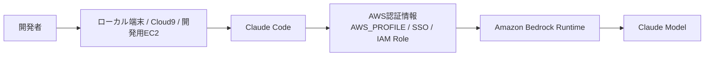
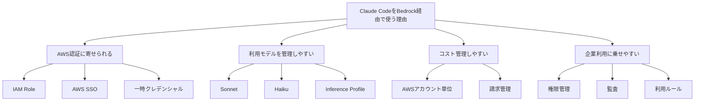
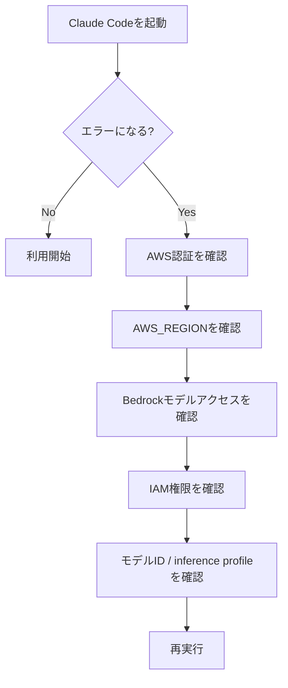
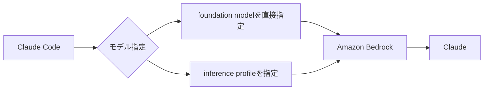
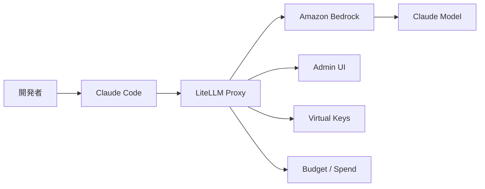
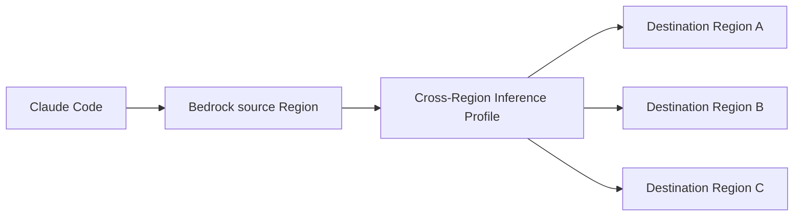
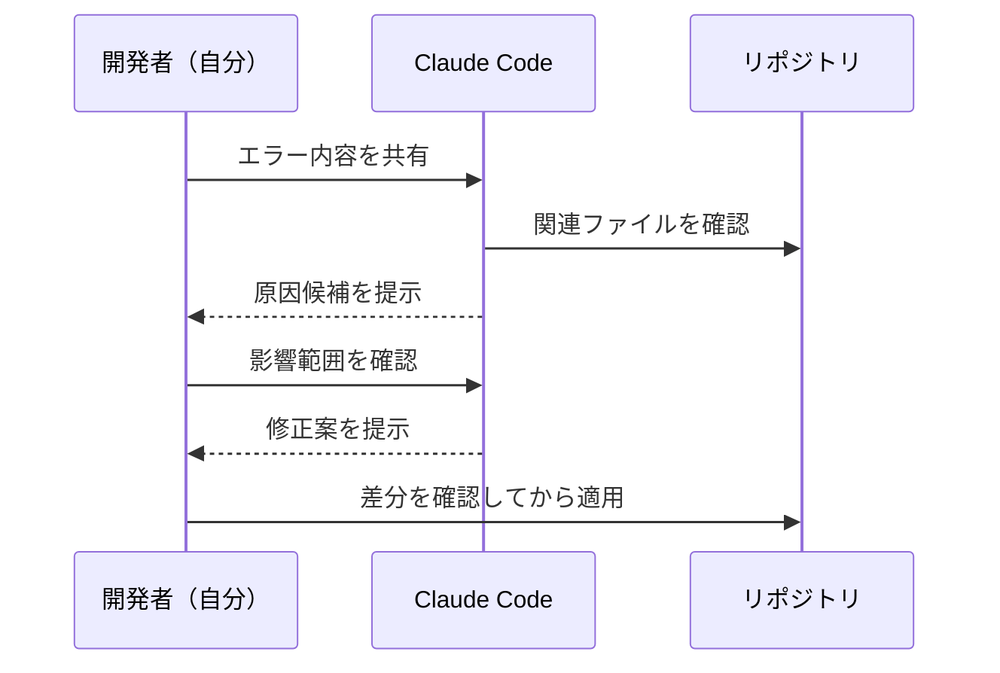
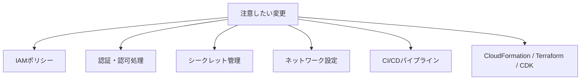
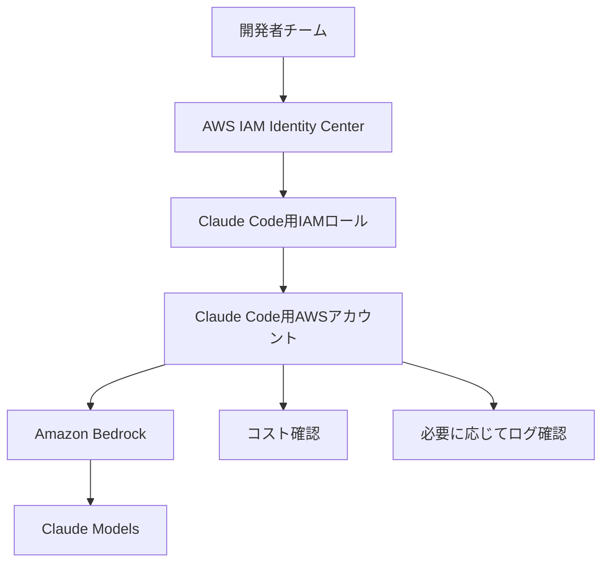
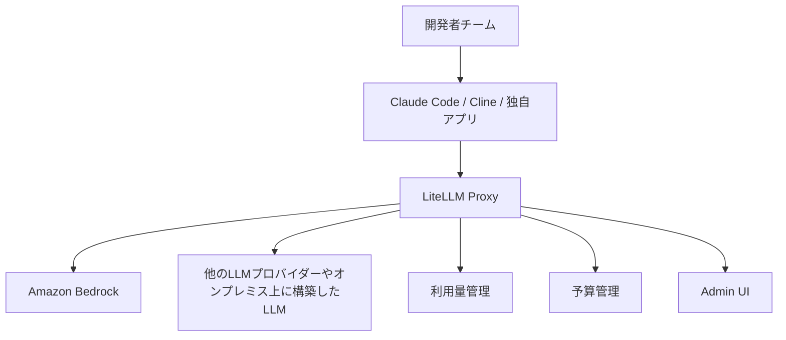

## はじめに

前回の記事では、Amazon BedrockでClaudeを業務利用する場合に、IAM、SCP、Guardrails、ログ監査などをどう組み合わせるかを整理しました。

今回はその続きとして、もう少し実践寄りに **Claude CodeをAmazon Bedrock経由で使ってみる** というテーマで書きます。

Claude Codeは、ターミナルやVSCodeのエクステンション等で使えるAIコーディングエージェントです。
コードを書いてもらったり、既存コードを読んでもらったり、エラー原因を調べさせたり幅広い用途で利用できます。

ただ、業務利用を考えると、こんな不安はないでしょうか。

* 個人のAPIキーで使わせてよいのか
* 会社のAWS環境下で管理できるのか
* Claude Codeがどのモデルを使っているのか分かるのか
* Bedrock経由にすると何がうれしいのか
* 実際に設定するとき、どこでつまずきやすいのか
* チーム単位でモデルや利用量を管理できるのか

個人的には、Claude Codeを業務で使うなら、Amazon Bedrock経由にする選択肢はかなり有力だと思っています。

理由はシンプルで、**Claude CodeをAWSの認証・権限・課金・監査の枠組みに乗せやすくなるから** です。

この記事では、前回のような統制設計そのものにはあまり深く入りすぎず、実際にClaude CodeをAmazon Bedrock経由で使う場合の構成、設定方法、つまずきやすいポイント、チーム利用時に考えておきたいことを整理します。

また、補足として、**LiteLLMを挟んでLLM利用を管理する構成** にも少し触れます。

LiteLLMについては、この記事では「こういう選択肢もある」くらいの位置づけにとどめます。別途、LiteLLMに関する記事も投稿する予定です。

---

## この記事で書くこと・書かないこと

前回の記事と内容がかぶらないように、この記事では以下に寄せます。

### 書くこと

* Claude CodeをBedrock経由で使う構成
* 最初に設定する環境変数
* AWS認証まわりでつまずきやすい点
* モデルID / inference profile の考え方
* LiteLLMを使ったモデル利用管理の考え方
* 実際にどういう使い方が便利だったか
* チーム展開するときに決めておきたいこと

### あまり書かないこと

* SCPによる組織全体の強制制御
* Guardrailsの詳細設計
* CloudTrailやModel invocation loggingの詳細な監査設計
* Bedrock全体のガバナンス設計
* LiteLLM Proxyの詳細な構築手順

このあたりは前回記事や別記事の範囲に近いため、今回は必要なところだけ触れます。

---

## 全体像

まず、Claude CodeをBedrock経由で使う構成はざっくり以下のようなイメージです。



普通にClaude Codeを使う場合は、AnthropicのAPIキーを使う構成もあります。
一方でBedrock経由にすると、Claude CodeのリクエストがAWS側のBedrock Runtimeに向かいます。

つまり、開発者から見るとClaude Codeを使っているだけですが、裏側ではAWS認証情報を使ってBedrockを呼び出す形になります。

ここがかなり重要だと思います。

Claude Codeを「便利なAIツール」としてだけ見るのではなく、**AWS上の生成AI利用の一部** として扱えるようになります。

---

## Bedrock経由にするとうれしいこと

Claude CodeをBedrock経由で使うメリットは、個人的には以下のあたりだと思います。



特に大きいのは、**AWS認証に寄せられること** です。

個人のAPIキーを各開発者に配って管理するよりも、AWS SSOやIAMロールを使った方が、組織利用では扱いやすい場面が多いと思います。

たとえば、退職者・異動者の権限停止、利用者ごとの権限差分、検証用アカウントと本番系アカウントの分離などは、AWSの既存運用に乗せやすいです。

---

## まず必要な設定

Claude CodeでBedrockを使うには、まず以下の環境変数を設定します。

```bash
export CLAUDE_CODE_USE_BEDROCK=1
export AWS_REGION=us-east-1
```

公式ドキュメントでも、Bedrock連携を有効化するために `CLAUDE_CODE_USE_BEDROCK=1` と `AWS_REGION` を設定する形が案内されています。

個人的には、AWSプロファイルも明示しておく方が分かりやすいと思います。

```bash
export AWS_PROFILE=bedrock-dev
export AWS_REGION=us-east-1
export CLAUDE_CODE_USE_BEDROCK=1
```

AWS SSOを使う場合は、先にログインします。

```bash
aws sso login --profile bedrock-dev
```

そのうえでClaude Codeを起動します。

```bash
claude
```

Claude Codeの中で、状態確認をする場合は以下を使います。

```text
/status
```

ここで、Bedrock経由で動作しているか、どのモデルを使っているかを確認します。

---

## 最初につまずきやすいポイント

実際に設定してみると、Claude Codeそのものよりも、AWS側の設定でつまずくことが多いと思います。

初歩的ですがはまりポイントは以下です。



### 1. AWS認証ができていない

まず確認したいのは、AWS CLIで認証できているかです。

```bash
aws sts get-caller-identity --profile bedrock-dev
```

これが失敗する場合、Claude Code以前にAWS認証ができていません。

SSOを使っている場合は、以下を実行します。

```bash
aws sso login --profile bedrock-dev
```

会社端末やプロキシ環境では、SSOログインまわりで地味につまずくのはどの会社でもあるあるではないでしょうか。
この場合、Claude Codeを起動する前に、手動で `aws sso login` を済ませておくのがよいと思います。

---

### 2. AWS_REGIONを設定していない

AWS CLIのconfigにリージョンを書いているので大丈夫、と思いがちですが、Claude CodeのBedrock連携では `AWS_REGION` を明示した方が安全です。

```bash
echo $AWS_REGION
```

空であれば、以下のように設定します。

```bash
export AWS_REGION=us-east-1
```

ここは意外と見落としやすいです。

---

### 3. Bedrock側でClaudeモデルを有効化していない

Bedrockでは、使いたいモデルへのアクセスを有効化しておく必要があります。

たとえばClaude Sonnetを使いたい場合、Amazon BedrockのModel access / Model catalog側で対象モデルが利用可能になっているか確認します。

AWSアカウントを作っただけでは、すべてのモデルが最初から使えるわけではありません。

ここで有効化していないと、IAM権限が正しくても呼び出しに失敗します。

---

### 4. IAM権限が不足している

Claude CodeからBedrockを呼び出すには、Bedrockのモデル呼び出し権限が必要です。

検証用としては、まず以下のようなアクションが必要になります。

```json
{
  "Version": "2012-10-17",
  "Statement": [
    {
      "Sid": "AllowClaudeCodeBedrockInvoke",
      "Effect": "Allow",
      "Action": [
        "bedrock:InvokeModel",
        "bedrock:InvokeModelWithResponseStream",
        "bedrock:ListInferenceProfiles",
        "bedrock:GetInferenceProfile"
      ],
      "Resource": "*"
    }
  ]
}
```

もちろん、本番利用やチーム展開では `Resource: "*"` のままにするのではなく、使うモデルやinference profileに絞る方がよいと思います。

ただ、最初から絞り込みすぎると、原因切り分けが難しくなります。
個人的には、まず検証環境で広めに許可して疎通確認し、その後に絞っていく進め方が現実的だと思います。

---

## モデルIDとinference profileで迷いやすい

Claude CodeをBedrock経由で使うときに、かなり迷いやすいのが **モデルID** と **inference profile** です。

Bedrockでは、モデルを直接指定する場合もあれば、inference profileを指定する場合もあります。



特に新しいClaudeモデルでは、オンデマンド呼び出しではなく、inference profileの指定が必要になることがあります。

この場合、以下のようにモデルを明示します。

```bash
export ANTHROPIC_MODEL='us.anthropic.claude-sonnet-4-5-20250929-v1:0'
```

実際のモデルIDは利用するリージョンや時期によって変わるため、Bedrockコンソールまたは公式ドキュメントで確認してください。

個人的には、チームで使う場合は `sonnet` のようなざっくりした指定よりも、**利用するモデルIDを明示的に固定する** 方がよいと思います。

理由はシンプルで、ある日突然モデルの解決先が変わってしまうと、利用者や環境によって「動く人」と「動かない人」が出てしまう可能性があるためです。

ただし、最近はモデルの移り変わりもかなり早いので、気づいたら使っていたモデルがレガシーモデル扱いになっている、ということも普通にありそうです。
そのため、モデルIDを固定して終わりではなく、少し大変ではありますが、AWS Healthのイベント通知などで、モデルの提供状況や変更予定のアナウンスは定期的に見ておいた方がよいと思います。

---

## 補足：LiteLLMを挟んでモデル利用を管理する考え方もある

ここまで、Claude CodeからAmazon Bedrockを直接呼び出す構成で説明してきました。

一方で、チームや組織で複数のLLMを使う場合は、**Claude CodeとBedrockの間にLiteLLMを挟む** という考え方もあります。

LiteLLMは、OpenAI、Anthropic、Amazon Bedrock、Azure OpenAIなど、複数のLLMプロバイダーを統一的なインターフェイスで扱うためのAI Gateway / Proxyです。

ざっくり構成にすると、以下のようなイメージです。



Bedrockを直接呼び出す構成では、Claude CodeがAWS認証情報を使ってBedrockにアクセスします。

一方でLiteLLMを挟む場合は、Claude CodeはLiteLLM Proxyを呼び出し、LiteLLM側がバックエンドのBedrockやその他LLMプロバイダーへルーティングする形になります。

Claude Code公式ドキュメントでも、LLM Gatewayを使う構成について説明されており、Gateway側ではAnthropic Messages形式、Bedrock InvokeModel形式、Vertex rawPredict形式など、Claude Codeが利用するAPI形式を正しく扱う必要があります。

LiteLLMを挟むと、たとえば以下のような管理がしやすくなります。

* 利用者ごとにVirtual Keyを発行する
* チームごとに利用可能なモデルを分ける
* モデルごとの利用量を確認する
* 利用者・チーム単位で予算上限を設定する
* Admin UIで利用状況を確認する
* Bedrock以外のLLMプロバイダーもまとめて扱う

比較すると、以下のようなイメージです。

| 観点       | Bedrock直接利用     | LiteLLM経由                |
| -------- | --------------- | ------------------------ |
| 認証       | AWS認証情報を利用      | LiteLLMのVirtual Keyなどを利用 |
| モデル管理    | IAMやBedrock側で管理 | LiteLLM側でも管理可能           |
| 利用量確認    | AWS側のログ・請求で確認   | LiteLLM側のSpendでも確認可能     |
| 複数LLM対応  | Bedrock中心       | Bedrock以外もまとめやすい         |
| 構成のシンプルさ | シンプル            | LiteLLMの運用が必要            |

個人的には、最初の検証ではBedrock直接利用で十分だと思います。

ただ、以下のような要件が出てきたら、LiteLLMを挟む構成も検討価値がありそうです。

* Claude Code以外にもClineや独自アプリからLLMを使いたい
* Bedrock、Azure OpenAI、オンプレミス環境に構築したLLM利用等を統合管理したい
* 利用者ごとにAPIキーを分けたい
* チームごとに使えるモデルを変えたい
* 予算や利用量をLiteLLM側でも見たい
* 将来的にモデルのルーティングやフォールバックも考えたい

ただし、LiteLLMを挟むと便利になる一方で、LiteLLM Proxy自体の運用、認証、可用性、ログ管理も考える必要があります。

そのため、この記事の範囲では「Claude CodeからBedrockを直接使う」構成を基本にしつつ、組織的にLLM利用を広げる段階ではLiteLLMのようなAI Gatewayを検討する、くらいの位置づけがちょうどよいと思います。

---

## クロスリージョン推論も意識した方がよい

BedrockのClaudeモデルを使っていると、`us.` や `apac.` のようなプレフィックスが付いたinference profileを見かけることがあります。

これはクロスリージョン推論と関係します。

クロスリージョン推論では、リクエスト元リージョンから、inference profileで定義された複数の宛先リージョンのいずれかにリクエストがルーティングされます。

ざっくり図にすると以下のようなイメージです。



ここで注意したいのは、AWS OrganizationsのSCPなどでリージョン制限をしている場合です。

前回記事のテーマに近いので詳細は深掘りしませんが、Bedrockのクロスリージョン推論を使う場合、**どのリージョンにリクエストがルーティングされる可能性があるか** は事前に確認した方がよいと思います。

個人検証では正直あまり気にしない部分ですが、データレジデンシの観点から企業利用では重要な論点になりえます。

---

## 実際に便利だと感じた使い方

ここからは、少し体験談寄りです。

Claude Codeを使っていて便利だと感じたのは、「コードを書いてくれる」ことはもちろんですが、既存コードを読んだり、調査の入口を作ったり、ドキュメント化したりする用途でもかなり強い、という点です。

特に歴史のあるプロジェクトでは、リポジトリが複数に分かれていたり、ディレクトリ階層が深かったりして、全体像を把握するだけでもかなり大変です。

その点、Claude Codeはマルチリポジトリの構造を見ながら、どこに何がありそうか、どの処理がどこにつながっていそうかを整理してくれるので、理解の入口を作るうえでとても便利で、業務でも日々助けられています。

---

### 1. 初見のリポジトリを理解する

初めて見るリポジトリでは、まず以下のように聞くと便利です。

```text
このリポジトリの構成を説明してください。
主要な処理の流れと、最初に読むべきファイルを教えてください。
```

自分でいきなり全ファイルを追うよりも、最初に全体像を作ってもらえるのが助かります。

特に、Lambda、CloudFormation、CDK、Terraform、CI/CD定義などが混在しているリポジトリでは、入口を探すだけでも時間がかかります。

Claude Codeにまず地図を作ってもらうと、その後の調査がかなり楽になります。

---

### 2. エラー調査の壁打ちに使う

エラーログを貼って、関連しそうなファイルを見てもらう使い方も便利です。

```text
このエラーの原因を調査してください。
関連しそうなファイルを確認して、原因候補を複数出してください。
修正案は、影響範囲も含めて説明してください。
```

このとき、いきなり修正させるのではなく、まずは **原因候補を出してもらう** のがよいと思います。

Claude Codeも完ぺきではないので、自分の場合は一例ですが以下順番でステップバイステップで進めていくのがよいと思っています。



Claude Codeに「変更して」と頼む前に、まず「調査して」「候補を出して」と頼むことがポイントです。

---

### 3. テスト観点を出してもらう

テストコードの作成も相性がよいです。

```text
この関数の単体テストを作成してください。
正常系、異常系、境界値を含めてください。
既存のテストコードの書き方に合わせてください。
```

自分でゼロからテスト観点を考えるよりも、最初のたたき台を作ってもらえるのが便利です。

ただし、生成されたテストコードが本当に意味のある検証になっているかは確認が必要です。

特に、モックの使い方や異常系の期待値は、雰囲気でそれっぽいコードが出てくることもあるので注意した方がよいと思います。カバレッジを網羅しているか、所定のテストツールを使った実装になっているか等、それぞれのプロジェクトで定めている開発ルールに即したテストであるかは注意してみる必要があります。

---

### 4. READMEや設計メモを作る

これまたかなり便利だと思ったのが、ドキュメント化です。

```text
この処理の概要をREADME向けに整理してください。
運用担当者が読む前提で、専門用語は必要最小限にしてください。
```

また、開発者向けには以下のようにも依頼できます。

```text
このLambda関数の処理フローを、開発者向けの設計メモとして整理してください。
入力、主な処理、出力、例外処理に分けてください。
```

Claude Codeはコードを読んだうえで説明を作るのが得意なので、README、設計メモ、運用メモの初稿作成にはかなり向いていると思います。

---

## 逆に気をつけたい使い方

便利な一方で、何でも任せるのは危ないです。
特に以下は慎重に扱った方がよいと思います。



### IAMや認証まわりは特に慎重に見る

Claude CodeはIAMポリシーもそれっぽく生成してくれます。

ただ、IAMは少しの記述ミスで過剰権限になったり、逆に必要な処理が動かなくなったりします。

そのため、IAMや認証まわりは、Claude Codeに初稿を作ってもらうのはよいとしても、ここは特に人間が丁寧に確認すべきだと思います。

---

### 既存コードの文脈を完全には理解しない

Claude Codeはリポジトリ内の情報を読んでくれますが、プロジェクトの背景や社内事情まで完全に理解しているわけではありません。

たとえば、以下のような暗黙知は苦手です。

* なぜその実装になっているのか
* 過去の障害対応で入った暫定対応なのか
* 顧客要件であえてそうしているのか
* 運用チームとの約束で変更できない箇所なのか

そのため、Claude Codeの提案が技術的に正しそうに見えても、業務的には変えてはいけない場合があります。

ここは人間側のレビューが必要です。ベテランメンバーがいないと苦しいところではありますが・・・

---

### 入力する情報に気をつける

Bedrock経由にしたからといって、何でも入力してよいわけではありません。

Claude Codeでは、リポジトリ内のファイル、ログ、設定値を扱うことがあります。

以下のような情報が含まれないように注意が必要です。

* APIキー
* シークレット
* パスワード
* 個人情報
* 顧客名
* 本番環境の設定値
* 未公開の設計情報

ここはツールの問題というより、利用ルールの問題だと思います。

チーム展開する場合は、Claude Codeに入力してよい情報・避けるべき情報をあらかじめ決めておいた方がよいです。
特に、顧客機密情報を扱う場合には、顧客に対してAI利用の合意・Bedrockへのデータ入力の了承もいただく必要があるかと思うのでここは特に注意したいポイントです。

---

## チームで使うなら設定を共有したい

個人利用なら、各自が環境変数を設定すればよいです。

ただ、チーム利用では、各自がバラバラに設定すると管理が難しくなります。

たとえば、ある人はSonnetを使い、ある人はHaikuを使い、ある人は違うリージョンを使っている、という状態になると、トラブルシュートが面倒です。

チーム利用では、以下のような項目をそろえておくのがよいと思います。

| 項目       | 決めておきたいこと               |
| -------- | ----------------------- |
| AWSアカウント | Claude Code用アカウントを分けるか  |
| AWS認証    | SSOにするか、IAMロールにするか      |
| リージョン    | どのリージョンを使うか             |
| モデル      | Sonnet / Haikuなど、どれを使うか |
| モデルID    | 固定するか、エイリアスにするか         |
| LiteLLM  | 挟むか、まずはBedrock直接利用にするか  |
| ログ       | 何をどこまで残すか               |
| 入力ルール    | 何をClaude Codeに渡してよいか    |

個人的には、チーム利用では以下のような構成が扱いやすいと思います。



業務システムの本番アカウントと、Claude Code利用アカウントは分離したほうが、コストや権限管理の観点で運用しやすいかと思います。

一方で、複数のAIツールや複数のLLMプロバイダーを横断的に管理したい場合は、以下のようにLiteLLMを間に置く構成も考えられます。



もちろん、最初からここまで作り込む必要はないと思います。
まずはBedrock直接利用で小さく検証して、チーム展開や複数ツール対応が必要になった段階でLiteLLMなどのGateway構成を検討するのが現実的だと思います。

---

## 最小構成で試す手順

最後に、最小構成で試す手順をまとめます。

### 1. BedrockでClaudeモデルを有効化する

Amazon Bedrockのコンソールから、利用したいClaudeモデルを有効化します。

### 2. AWS認証を確認する

```bash
aws sts get-caller-identity --profile bedrock-dev
```

SSOの場合は、必要に応じてログインします。

```bash
aws sso login --profile bedrock-dev
```

### 3. 環境変数を設定する

```bash
export AWS_PROFILE=bedrock-dev
export AWS_REGION=us-east-1
export CLAUDE_CODE_USE_BEDROCK=1
```

### 4. 必要に応じてモデルを指定する

```bash
export ANTHROPIC_MODEL='us.anthropic.claude-sonnet-4-5-20250929-v1:0'
```

モデルIDは環境によって異なるため、実際に利用可能な値を確認してください。

### 5. Claude Codeを起動する

```bash
claude
```

### 6. 状態を確認する

```text
/status
```

---

## よくあるエラーと確認観点

### AccessDeniedException

IAM権限が不足している可能性があります。

確認するポイントは以下です。

* `bedrock:InvokeModel` が許可されているか
* `bedrock:InvokeModelWithResponseStream` が許可されているか
* 対象モデルまたはinference profileのResourceが許可されているか
* SCPやPermission Boundaryで明示的にDenyされていないか

---

### モデルが使えない

Bedrock側で対象モデルが有効化されていない可能性があります。

確認するポイントは以下です。

* BedrockのModel accessで対象Claudeモデルが有効化されているか
* 利用リージョンで対象モデルが使えるか
* 指定しているモデルIDが正しいか
* inference profileが必要なモデルではないか

---

### on-demand throughputがサポートされない

モデルを直接指定している場合に発生することがあります。

この場合は、inference profile IDを指定すると解消する可能性があります。

```bash
export ANTHROPIC_MODEL='us.anthropic.claude-sonnet-4-5-20250929-v1:0'
```

---

### SSOログインまわりで失敗する

企業端末やプロキシ環境では、SSO認証がうまくいかないことがあります。

その場合は、Claude Codeを起動する前に手動でログインします。

```bash
aws sso login --profile bedrock-dev
```

その後、同じプロファイルを使ってClaude Codeを起動します。

```bash
export AWS_PROFILE=bedrock-dev
claude
```

---

### LiteLLM経由でうまく動かない

LiteLLMなどのLLM Gatewayを挟む場合は、Bedrock直接利用よりも確認ポイントが増えます。

たとえば、以下のような観点です。

* Claude CodeからLiteLLM Proxyに到達できるか
* Claude Codeが期待するAPI形式をLiteLLM側が扱えているか
* 認証ヘッダーやリクエストボディが正しく中継されているか
* LiteLLM側で対象モデルが定義されているか
* LiteLLMからBedrockを呼び出すAWS認証情報が正しいか
* 利用者のVirtual Keyに対象モデルの利用権限があるか

なお、このあたりは別途記事にまとめたいと考えています。

そのため、最初からLiteLLMを入れるよりも、まずBedrock直接利用でClaude Codeが動くことを確認し、そのあとにGateway構成へ広げていく方が切り分けしやすいと思います。

---

## まとめ

Claude CodeをAmazon Bedrock経由で使うと、単に便利なAIコーディングエージェントを使えるだけではなく、AWSの認証や権限管理に寄せられるのが大きなメリットだと思います。

特に業務利用では、以下のような観点が重要になります。

* 個人APIキーではなくAWS認証に寄せる
* 利用するリージョンを明確にする
* モデルIDやinference profileを明示する
* まずは小さく検証し、あとから権限を絞る
* チーム利用では設定をそろえる
* Claude Codeに入力してよい情報のルールを決める
* 生成された変更は必ず人間がレビューする
* 複数LLMや複数ツールを管理したい場合はLiteLLMも選択肢に入れる

Claude Codeは、コードを書くツールとしても便利ですが、個人的には **コードを読んでもらう、調査の壁打ちをする、ドキュメント化する** といった使い方がかなり強いと感じています。

一方で、IAM、認証、CI/CD、IaCのような影響範囲が大きい変更は、Claude Codeの提案をそのまま適用するのではなく、人間が差分を確認してから反映するのがよいと思います。

Bedrock経由にすることで、Claude CodeをAWSの管理下で使いやすくなります。
まずは個人検証から始めて、よさそうであればチーム利用に向けて認証、モデル、リージョン、ログ、入力ルールを整理していくのが現実的ではないでしょうか。

また、Claude Code以外のAIツールや複数のLLMプロバイダーも含めて管理したい場合は、LiteLLMのようなAI Gatewayを挟む構成も検討できます。
ただし、その分だけ構成要素は増えるので、まずはBedrock直接利用で小さく試し、必要に応じてGateway構成へ広げるのがよいと思います。

---

## 参考

### Claude Code on Amazon Bedrock
Claude CodeをAmazon Bedrock経由で使うための公式ドキュメントです。
環境変数、IAM権限、モデル指定、トラブルシュートなどがまとまっています。
[https://code.claude.com/docs/en/amazon-bedrock](https://code.claude.com/docs/en/amazon-bedrock)

### LLM gateway configuration - Claude Code Docs
Claude CodeでLLM Gatewayを利用する場合の公式ドキュメントです。
Gateway要件、認証設定、モデル選択、プロバイダーごとのエンドポイント設定などが説明されています。
[https://code.claude.com/docs/en/llm-gateway](https://code.claude.com/docs/en/llm-gateway)

### LiteLLM Docs
LiteLLMの公式ドキュメントです。
LiteLLM Proxy、Python SDK、複数LLMプロバイダーの統一インターフェイスについて確認できます。
[https://docs.litellm.ai/docs/](https://docs.litellm.ai/docs/)

### LiteLLM Virtual Keys
LiteLLM ProxyでVirtual Keyを使い、利用者ごとのSpendやモデルアクセスを管理するための公式ドキュメントです。
[https://docs.litellm.ai/docs/proxy/virtual_keys](https://docs.litellm.ai/docs/proxy/virtual_keys)

### LiteLLM AWS Bedrock Provider
LiteLLMからAmazon Bedrockを呼び出す場合の公式ドキュメントです。
[https://docs.litellm.ai/docs/providers/bedrock](https://docs.litellm.ai/docs/providers/bedrock)

### Amazon Bedrock inference profiles
Amazon Bedrockのinference profileに関する公式ドキュメントです。
クロスリージョン推論やapplication inference profileの考え方を確認できます。
[https://docs.aws.amazon.com/bedrock/latest/userguide/inference-profiles-use.html](https://docs.aws.amazon.com/bedrock/latest/userguide/inference-profiles-use.html)

### Supported Regions and models for inference profiles
Amazon Bedrockのinference profileでサポートされるリージョンやモデルを確認できます。
[https://docs.aws.amazon.com/bedrock/latest/userguide/inference-profiles-support.html](https://docs.aws.amazon.com/bedrock/latest/userguide/inference-profiles-support.html)

### Geographic cross-Region inference
US、EU、APACなど、地理的な境界を意識したクロスリージョン推論についての公式ドキュメントです。
[https://docs.aws.amazon.com/bedrock/latest/userguide/geographic-cross-region-inference.html](https://docs.aws.amazon.com/bedrock/latest/userguide/geographic-cross-region-inference.html)

### 【Mermaidの紹介】Qiitaでダイアグラム・チャートが簡単に書けるようになりました！
Qiita上でMermaidを使って図を表現するための参考記事です。
[https://qiita.com/Qiita/items/c07f3262d8f3b25f06c9](https://qiita.com/Qiita/items/c07f3262d8f3b25f06c9)
