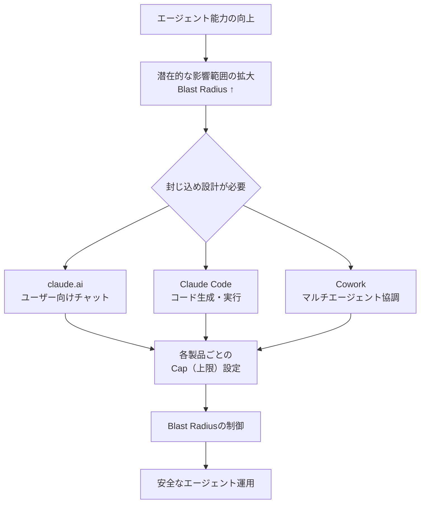
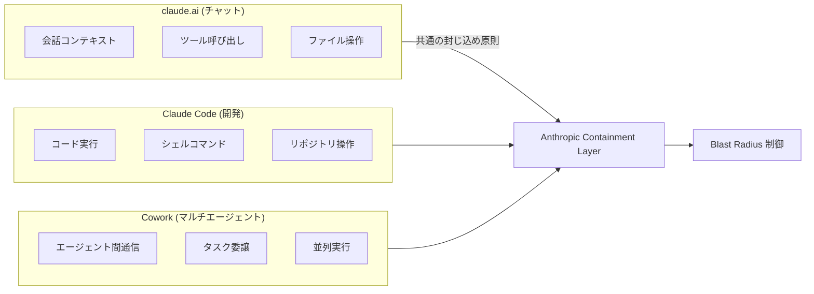
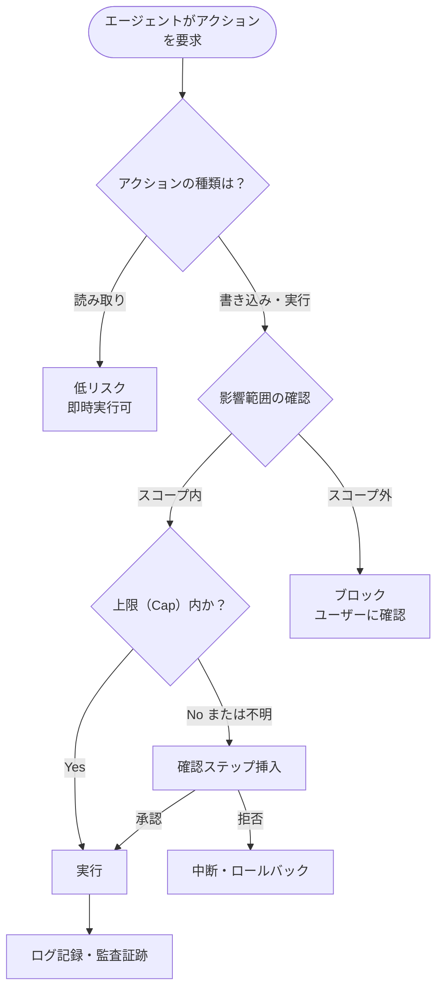

## はじめに

Anthropicのエンジニアリングブログに、**エージェントの「封じ込め（containment）」設計**に関する新記事「How we contain Claude across products」が公開されました（2026年5月26日）。

エージェントが高度になるほど、その誤動作や予期しない挙動が引き起こす**影響範囲（blast radius）**も拡大します。claude.ai・Claude Code・Coworkという3製品を横断して、Anthropicが実際の構築経験から得た封じ込め設計の知見がまとめられており、**自社でエージェントを開発・運用するすべてのエンジニアにとって重要な参考情報**です。

> **📌 影響を受ける人**
> - Claude API を使ってエージェントを構築している開発者
> - Claude Code を使った自動化ワークフローを設計・運用しているエンジニア
> - MCP（Model Context Protocol）を活用したツール連携を実装している人
> - AIエージェントのセキュリティ・安全性設計に関心のあるアーキテクト

---

## 変更の全体像

今回の記事公開が示す背景として、Anthropicが直面しているエージェント設計の課題を整理します。



3製品はそれぞれ用途・権限・リスクプロファイルが異なりますが、共通する封じ込めの原則のもとで設計されています。

---

## 変更内容

### 封じ込め（Containment）とは何か

エージェントの「封じ込め」とは、エージェントが実行できるアクションの**種類・範囲・影響を意図的に制限する**設計アプローチです。単純なサンドボックスとは異なり、エージェントの有用性を維持しながら最悪シナリオを防ぐための**上限設定（cap）**が核心にあります。

| 概念 | 説明 | 具体例 |
|------|------|--------|
| **Blast Radius** | 誤動作・悪用時の最大影響範囲 | ファイル削除の範囲、外部API呼び出し数 |
| **Cap（上限）** | 能力・リソースに設ける意図的な制限 | 1回のセッションで変更できるファイル数 |
| **Containment** | 上記を組み合わせた封じ込め設計全体 | 権限スコープ + レート制限 + 確認ステップ |

### 3製品にまたがるアーキテクチャ課題



それぞれの製品でリスクプロファイルが異なります：

- **claude.ai**: ユーザーが直接操作するため、誤操作・指示インジェクションのリスク
- **Claude Code**: シェルやファイルシステムへのアクセスを持つため、破壊的操作のリスク
- **Cowork**: エージェントが別のエージェントを呼び出すため、連鎖的な影響拡大のリスク

### 封じ込め設計の主要な考え方



---

## 影響と対応

### エージェント開発者が今すぐ確認すべきこと

この記事公開は直接的なAPI変更を伴うものではありませんが、**Anthropicが製品設計で採用している封じ込め原則は、自社エージェント開発の設計指針として活用できます**。

以下のチェックリストで自社のエージェント設計を見直してください：

- [ ] エージェントに付与している権限は**最小権限の原則**に従っているか
- [ ] 破壊的なアクション（削除・上書き・外部送信）の前に確認ステップがあるか
- [ ] 1回のエージェント実行で影響できる最大範囲（Blast Radius）を把握しているか
- [ ] エージェントのアクションログを記録・監査できるか
- [ ] マルチエージェント構成の場合、連鎖的な権限昇格が起きないか

### Claude Code を使っている場合

Claude Code は自律的にシェルコマンドを実行できるため、特に封じ込め設計が重要です。

> **⚠️ Breaking Change ではないが重要な設計考慮**
> Claude Code をCI/CDや本番環境で利用する場合、エージェントが実行できるコマンドの種類・対象ディレクトリ・外部ネットワークアクセスを明示的に制限することを強く推奨します。

---

## コード例

### Before: 権限を広く与えすぎた構成

```python
# ❌ 問題のある実装例：スコープが広すぎる
import anthropic

client = anthropic.Anthropic()

tools = [
    {
        "name": "execute_shell",
        "description": "任意のシェルコマンドを実行する",
        "input_schema": {
            "type": "object",
            "properties": {
                "command": {
                    "type": "string",
                    "description": "実行するコマンド（制限なし）"
                }
            },
            "required": ["command"]
        }
    }
]

# エージェントに制限なしのシェル実行権限を与えている
# Blast Radius = システム全体
```

### After: 封じ込め設計を適用した構成

```python
# ✅ 封じ込め設計を適用した実装例
import anthropic
import subprocess
import shlex
from pathlib import Path

ALLOWED_COMMANDS = {"ls", "cat", "grep", "find", "git"}
ALLOWED_WORKING_DIR = Path("/workspace/project")
MAX_OUTPUT_LINES = 100

def execute_shell_safe(command: str, working_dir: str) -> dict:
    """
    封じ込め設計を適用したシェル実行ラッパー。
    - 許可コマンドのホワイトリスト
    - 作業ディレクトリの制限
    - 出力サイズの上限
    """
    parts = shlex.split(command)
    if not parts or parts[0] not in ALLOWED_COMMANDS:
        return {
            "error": f"コマンド '{parts[0] if parts else ''}' は許可されていません",
            "allowed": list(ALLOWED_COMMANDS)
        }
    
    work_path = Path(working_dir).resolve()
    if not str(work_path).startswith(str(ALLOWED_WORKING_DIR)):
        return {"error": "指定ディレクトリはスコープ外です"}
    
    result = subprocess.run(
        parts,
        cwd=work_path,
        capture_output=True,
        text=True,
        timeout=30  # タイムアウトも設定
    )
    
    lines = result.stdout.splitlines()
    truncated = len(lines) > MAX_OUTPUT_LINES
    return {
        "output": "\n".join(lines[:MAX_OUTPUT_LINES]),
        "truncated": truncated,
        "exit_code": result.returncode
    }

client = anthropic.Anthropic()

tools = [
    {
        "name": "execute_shell",
        "description": (
            "制限されたシェルコマンドを実行する。"
            f"使用可能コマンド: {', '.join(ALLOWED_COMMANDS)}。"
            "作業ディレクトリは /workspace/project 以下のみ。"
        ),
        "input_schema": {
            "type": "object",
            "properties": {
                "command": {
                    "type": "string",
                    "description": "実行するコマンド"
                },
                "working_dir": {
                    "type": "string",
                    "description": "作業ディレクトリ（/workspace/project 以下）",
                    "default": "/workspace/project"
                }
            },
            "required": ["command"]
        }
    }
]
```

> **💡 Tips**
> `description` フィールドに制約を明示することで、Claude 自身がスコープ外の操作を試みにくくなります。モデルへの指示とシステム側の制限を**両方**実装するのが効果的です。

### マルチエージェント（Cowork 的構成）での封じ込め

```python
# マルチエージェント構成でのBlast Radius管理
from dataclasses import dataclass, field
from typing import Optional

@dataclass
class AgentCapConfig:
    """エージェントの上限（Cap）設定"""
    max_tool_calls: int = 20          # 1セッションの最大ツール呼び出し数
    max_file_writes: int = 5          # 最大ファイル書き込み数
    allow_external_network: bool = False  # 外部ネットワークアクセス
    allow_spawn_subagents: bool = False   # サブエージェント生成
    max_subagent_depth: int = 2       # エージェント連鎖の最大深度

@dataclass
class AgentSession:
    config: AgentCapConfig
    tool_call_count: int = 0
    file_write_count: int = 0
    depth: int = 0
    
    def check_cap(self, action: str) -> tuple[bool, Optional[str]]:
        """アクション実行前にCap（上限）を確認"""
        if action == "tool_call":
            if self.tool_call_count >= self.config.max_tool_calls:
                return False, f"ツール呼び出し上限（{self.config.max_tool_calls}回）に達しました"
        elif action == "file_write":
            if self.file_write_count >= self.config.max_file_writes:
                return False, f"ファイル書き込み上限（{self.config.max_file_writes}回）に達しました"
        elif action == "spawn_subagent":
            if not self.config.allow_spawn_subagents:
                return False, "サブエージェントの生成は許可されていません"
            if self.depth >= self.config.max_subagent_depth:
                return False, f"エージェント連鎖の深度上限（{self.config.max_subagent_depth}）に達しました"
        return True, None
```

---

## まとめ

今回のAnthropicブログ記事公開から得られる主なポイントを整理します。

| 観点 | 内容 |
|------|------|
| **背景** | エージェント能力の向上に比例してBlast Radiusも拡大する |
| **Anthropicの対応** | 3製品（claude.ai / Claude Code / Cowork）横断で封じ込め設計を実装 |
| **開発者への示唆** | 最小権限・Cap設定・確認ステップの3原則が封じ込め設計の核心 |
| **実装上のポイント** | システム側の制限とモデルへの指示の両面から制約を設ける |
| **マルチエージェント** | 連鎖的な権限昇格を防ぐため深度制限が特に重要 |

エージェントの「役に立つ能力」と「安全な制約」のバランスを取ることが、今後のエージェント開発における中心的な設計課題になります。Anthropicが実際の製品で得た知見は、自社エージェント開発の安全性向上に直接活用できる内容です。

詳細はAnthropicエンジニアリングブログの原文「How we contain Claude across products」を参照してください。
