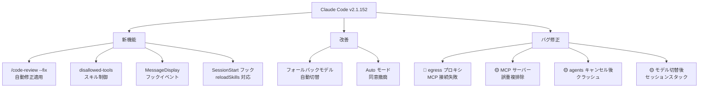
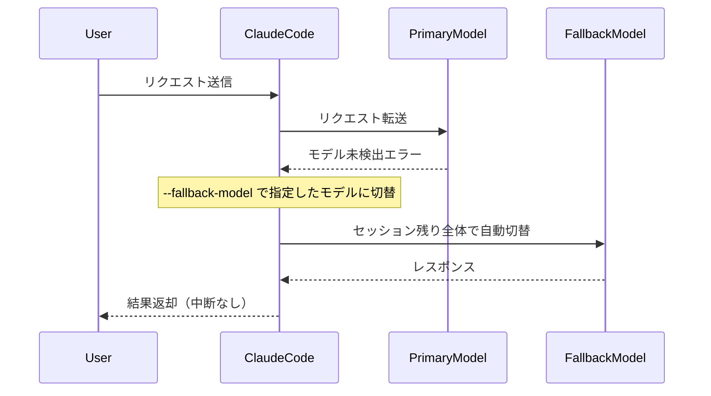

## はじめに

Claude Code v2.1.152 がリリースされました。このバージョンでは、コードレビューと修正を一体化した `/code-review --fix` の導入、フック機能の大幅拡張、MCP サーバー関連の重要なバグ修正など、開発ワークフローに直結する変更が多数含まれています。

特にエンタープライズ環境で Claude Code を利用している方、MCP サーバーをカスタム設定している方、スキルやフックを活用している方は必読です。

> **📌 影響を受ける人**
> - Claude Code でコードレビューワークフローを自動化している開発者
> - egress プロキシ環境でリモート MCP サーバーを使用しているチーム
> - スキル・フック機能でカスタムワークフローを構築している方
> - claude agents（マルチエージェント）を本番利用しているチーム

---

## 変更の全体像



---

## 変更内容

### 新機能

#### `/code-review --fix` によるレビュー結果の自動適用

コードレビューから修正適用までが一つのコマンドで完結するようになりました。`/simplify` も同じ動作のエイリアスとして統一されています。

| コマンド | 動作 |
|---|---|
| `/code-review` | レビュー結果を表示のみ |
| `/code-review --fix` | レビュー後、再利用・簡素化・効率化の提案をワーキングツリーに直接適用 |
| `/simplify` | `/code-review --fix` のエイリアス（同一動作） |

#### スキルの `disallowed-tools` フロントマター対応

スキル実行中に不要なツールをモデルの利用可能リストから動的に除外できるようになりました。意図しないツール使用を防止し、スキルの動作範囲を精密に制御できます。

```yaml
---
name: my-skill
description: "セキュリティレビュー専用スキル"
disallowed-tools:
  - Bash
  - Write
---
```

#### `MessageDisplay` フックイベント

アシスタントの出力テキストを表示時にリアルタイムで変換・非表示化できる新しいフックイベントです。

```javascript
// フック設定例
{
  "hooks": {
    "MessageDisplay": [
      {
        "matcher": "SECRET|TOKEN|PASSWORD",
        "hooks": [{ "type": "command", "command": "mask-secrets.sh" }]
      }
    ]
  }
}
```

**主なユースケース:**
- 機密情報（APIキー、トークン）のマスキング
- 出力テキストへのカスタムフォーマット適用
- 特定条件のメッセージの非表示化

#### `SessionStart` フックで `reloadSkills: true` が利用可能に

フックでスキルを動的にインストールした後、セッション内で即座に利用可能にできるようになりました。

```json
{
  "reloadSkills": true,
  "sessionTitle": "プロジェクト名 - カスタムスキルセット"
}
```

---

### 重要な改善

#### フォールバックモデルへの自動切替

プライマリモデルが利用不可の場合、リクエスト毎にエラーが発生していた問題が解消されました。



起動時に `--fallback-model` を指定しておくことで、プライマリモデルの障害やアクセス制限時でも作業が中断されません。

#### Auto モードのオプトイン同意が不要に

Auto モード利用時に必要だった事前同意ステップが撤廃されました。初回利用時の摩擦が軽減され、すぐに使い始められます。

---

### バグ修正

#### `severity: high` 相当

| ID | 内容 | 影響範囲 |
|---|---|---|
| change-033 | モデル・ログイン切替後に thinking-block シグネチャが残りセッションがスタックする問題 | モデル・ログイン切替を頻繁に行うユーザー全般 |

#### `severity: medium` 相当（要チェック）

| ID | 内容 | 影響範囲 | 重要度 |
|---|---|---|---|
| change-027 | egress プロキシ有効時にリモート MCP サーバーが接続失敗 | プロキシ環境 + MCP 利用者 | 🔴 直接影響 |
| change-030 | agents でキャンセル後に古い権限プロンプトを承認するとクラッシュ | マルチエージェント利用者 | 🟡 要チェック |
| change-024 | 同一コマンド・異なる環境変数の MCP サーバーが誤って重複排除される | カスタム MCP 設定者 | 🟡 要チェック |
| change-026 | プラグインレジストリ再構築後に git ブランチ追跡プラグインが更新を受け取れなくなる | git 追跡プラグイン利用者 | 🟡 要チェック |
| change-018 | 長時間セッションでターミナルスタイルが劣化する | 長時間連続使用者 | 参考 |

---

## 影響と対応

### egress プロキシ + MCP を使用している場合（change-027）

> **⚠️ Breaking Change 相当**
> v2.1.152 以前のバージョンを使用している場合、egress プロキシ環境でリモート MCP サーバーへの接続が一切失敗します。v2.1.152 以上にアップデートしてください。

```bash
# Claude Code のアップデート
npm install -g @anthropic-ai/claude-code@latest

# バージョン確認
claude --version
```

### 同一コマンドで複数 MCP サーバーを使用している場合（change-024）

環境変数の差異だけで区別している MCP サーバーが、これまで誤って1つに重複排除されていた可能性があります。v2.1.152 以降は正しく個別扱いされます。設定が正しく反映されているか確認してください。

```json
// 設定例：同一コマンドで異なる環境変数を持つ MCP サーバー
{
  "mcpServers": {
    "server-prod": {
      "command": "my-mcp-server",
      "env": { "ENV": "production" }
    },
    "server-staging": {
      "command": "my-mcp-server",
      "env": { "ENV": "staging" }
    }
  }
}
```

### マルチエージェント（claude agents）を使用している場合（change-030）

サブエージェントをキャンセルした後に残存する権限プロンプトを承認するとクラッシュが発生していました。v2.1.152 以降は修正済みですが、旧バージョンを使用している場合は注意が必要です。

---

## コード例

### Before/After: /code-review --fix ワークフロー

**Before (v2.1.151 以前)**

```bash
# レビューと適用が別操作
claude "/code-review"
# → レビュー結果を手動で読んで修正を手動適用...
```

**After (v2.1.152)**

```bash
# レビューから適用まで一発
claude "/code-review --fix"
# または
claude "/simplify"
# → レビュー実行 → ワーキングツリーに自動適用
```

---

### Before/After: フォールバックモデル

**Before**

```bash
claude --model claude-opus-4-7
# プライマリモデルが利用不可 → 全リクエストがエラー
# Error: Model not found
```

**After**

```bash
claude --model claude-opus-4-7 --fallback-model claude-sonnet-4-6
# プライマリが利用不可 → セッション全体でフォールバックモデルに自動切替
# Switched to fallback model: claude-sonnet-4-6
```

---

### SessionStart フック + reloadSkills の活用例

```javascript
// .claude/hooks/session-start.js
module.exports = async function sessionStart({ session }) {
  // 動的にスキルをインストール
  await installProjectSpecificSkills(session.projectPath);

  return {
    reloadSkills: true,  // 同一セッション内で即座に利用可能に
    sessionTitle: `${session.projectName} - カスタムスキルセット`
  };
};
```

---

## まとめ

Claude Code v2.1.152 の主要な変更点を整理します。

| カテゴリ | 変更 | 対応優先度 |
|---|---|---|
| 🔴 バグ修正 | egress プロキシ + MCP 接続失敗 | 即時アップデート推奨 |
| 🟡 バグ修正 | MCP サーバー重複排除の誤り | MCP カスタム設定者は確認 |
| 🟡 バグ修正 | agents キャンセル後クラッシュ | マルチエージェント利用者は確認 |
| 🆕 新機能 | `/code-review --fix` 自動適用 | コードレビューワークフロー改善に活用 |
| 🆕 新機能 | `disallowed-tools` スキル制御 | スキル開発者は積極活用 |
| 🆕 新機能 | `MessageDisplay` フック | 出力カスタマイズが必要な場合に活用 |
| ✅ 改善 | フォールバックモデル自動切替 | `--fallback-model` オプションの設定を検討 |
| ✅ 改善 | Auto モード同意撤廃 | 既存ユーザーは特に対応不要 |

egress プロキシ環境で MCP を利用しているチームは v2.1.152 への即時アップデートを推奨します。それ以外のユーザーも、`/code-review --fix` や `MessageDisplay` フックなど開発体験を向上させる新機能を積極的に試してみてください。
