## はじめに

前回までの記事では、Amazon BedrockでClaudeを安全に使うための統制設計と、Claude CodeをAmazon Bedrock経由で使う実践について整理しました。

今回はその続きとして、**LiteLLMを使ったLLM利用管理** について書いてみます。

Claude CodeやClineのようなAIコーディングツールを使い始めると、最初は「便利だな」で済みます。
ただ、チームや組織で使おうとすると、だんだん次のような話が出てくるのではないかと思います。

* 誰がどのモデルを使っているのか見たい
* チームごとに使えるモデルを分けたい
* APIキーを利用者ごとに分けたい
* 月ごとの利用量やSpendを見たい
* Amazon Bedrock、OpenAI、Azure OpenAIなどをまとめて扱いたい
* Claude Code、Cline、独自アプリから同じLLM基盤を使いたい
* モデルの切り替えをアプリ側に意識させたくない

個人的には、LLM利用が個人検証からチーム利用に広がるタイミングで、**AI Gateway的なものが欲しくなる** と感じています。

そこで候補になるのがLiteLLMです。

LiteLLMは、OpenAI、Anthropic、Amazon Bedrock、Azure OpenAI、Geminiなど、複数のLLMプロバイダーをまとめて扱えるAI Gateway / Proxyです。公式ドキュメントでも、LiteLLM ProxyはVirtual Key、cost tracking、Admin UIを備えたセルフホスト型のLLM Gatewayとして説明されています。
[https://docs.litellm.ai/docs/](https://docs.litellm.ai/docs/)

この記事では、LiteLLMの細かい構築手順を網羅するというより、**業務利用でLiteLLMを使うときに何を考えるべきか** を中心に個人的な考えを記載します。

---

## この記事で書くこと・書かないこと

### 書くこと

* LiteLLMを使うと何がうれしいのか
* Amazon Bedrockの前段にLiteLLMを置く構成
* Claude CodeやClineとの関係
* Virtual Keyによる利用者・チーム単位の管理
* Admin UIで見えるSpendの考え方
* モデル名を抽象化するメリット
* 業務利用で気をつけたい運用ポイント

### 書かないこと

* LiteLLMの構築手順
* ECS / EKS / EC2 / Dockerの構成
* PostgreSQLの設計
* SSO/SAML連携の詳細
* Guardrailsや監査ログの設計
* LiteLLM Enterpriseを前提とした高度な機能

今回は「実務で使うならどこを見るか」に寄せるために、これらについては記載しません。

---

## LiteLLMを一言でいうと

自分の理解では、LiteLLMは **LLM版のAPI Gateway / Proxy** に近いものです。

アプリケーションやAIコーディングツールはLiteLLMにリクエストを投げます。
LiteLLMは、そのリクエストを裏側のAmazon Bedrock、Anthropic、OpenAI、Azure OpenAIなどにルーティングします。

ざっくり図にすると以下のイメージです。

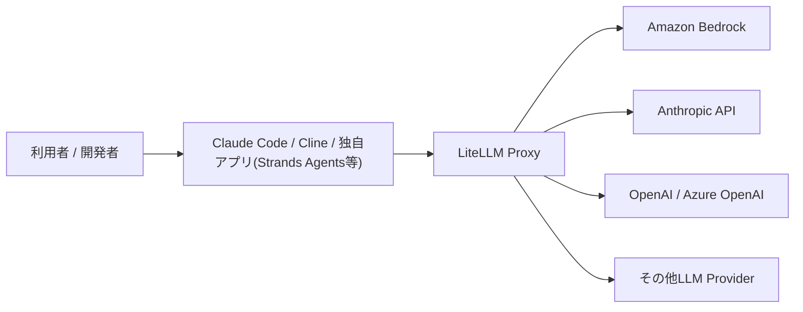

アプリケーション側から見ると、基本的にはLiteLLMに対してAPIを呼び出します。
裏側でどのLLMプロバイダーを使うかは、LiteLLM側の設定で切り替えられます。

これがかなり便利です。

たとえば、最初はAmazon BedrockのClaudeを使っていたけれど、検証用に別モデルも試したい、というケースがあります。
そのたびにアプリケーション側の実装を大きく変えるのは面倒です。

LiteLLMを挟んでおくと、アプリ側は同じような呼び出し方のまま、裏側のモデルを切り替えやすくなります。

---

## なぜBedrockだけではなくLiteLLMを挟むのか

Amazon Bedrockだけでも、ClaudeやAmazon Nova、Llama、Mistralなど複数のモデルを使えます。

それでもLiteLLMを挟みたくなる理由は、**LLM利用の入口をそろえたいから** です。

Bedrockを直接使う場合、AWS認証、IAM、リージョン、モデルID、inference profileなどを利用者やアプリケーション側で意識する必要があります。

一方でLiteLLMを挟むと、利用者やアプリケーションにはLiteLLMのエンドポイントとVirtual Keyを渡し、裏側のBedrock呼び出しはLiteLLM側で吸収できます。

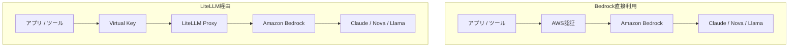

※Bedrock直接利用が悪いわけではないです。むしろ、最初の検証ではBedrock直接利用の方が構成上はシンプルです。自分も、いきなりLiteLLMを入れるより、まずはBedrock単体でモデル呼び出しができることを確認した方がよいと思います。

以下のような要件が出てくると、LiteLLMを挟む価値が出てきます。

* 利用者ごとにAPIキーを発行したい
* チームごとに使えるモデルを変えたい
* 各利用者やチーム毎の利用状況やSpendをLiteLLM側で統合的に確認したい
* Claude Code、Cline、独自アプリなど複数ツールから同じ入口を使いたい
* 複数のLLMプロバイダーを横断的に扱いたい
* 将来的にモデルの切り替えやフォールバックも考えたい

個人的には、**個人検証はBedrock直接、チーム展開はLiteLLMも検討** くらいの温度感がちょうどよいと思います。LiteLLMを独自にサービス化して全社導入している企業もあるのではないでしょうか。

---

## LiteLLMでできること

LiteLLMの公式ドキュメントでは、Proxy ServerとしてVirtual Key、予算管理、中央ログ、Guardrails、キャッシュ、Admin UIなどの機能が紹介されています。
[https://docs.litellm.ai/docs/](https://docs.litellm.ai/docs/)

実務目線で見ると、特に使いたくなるのは以下です。

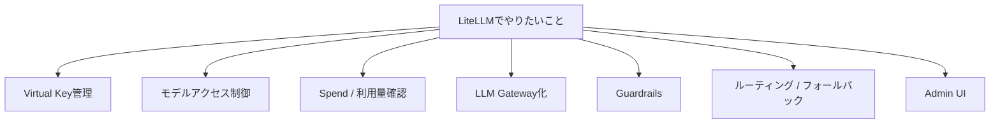

この中でも、最初に効いてくるのは **Virtual Key** と **Spend確認** だと思います。
加えて、チーム利用や組織利用を考えると、**Gateway層でGuardrailsを共通化できること** も重要です。  
アプリケーションごとに個別のチェック処理を実装するのではなく、LiteLLM Proxyを通るリクエストに対して共通の入力・出力チェックを差し込めるためです。

---

## Virtual Keyで利用者・チーム単位に管理する

LiteLLMのVirtual Keyは、LiteLLM Proxyにアクセスするためのキーです。

利用者やチームごとにVirtual Keyを発行し、キーごとに利用可能なモデル、予算、レート制限などを管理するイメージです。

公式ドキュメントでも、Virtual KeyによりProxyに対するSpend追跡とモデルアクセス制御ができると説明されています。
[https://docs.litellm.ai/docs/proxy/virtual_keys](https://docs.litellm.ai/docs/proxy/virtual_keys)

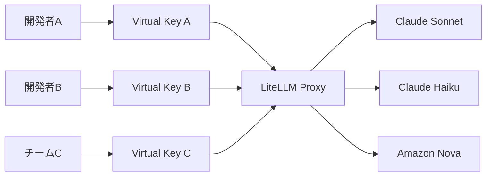

ここで大事なのは、Virtual Keyをどういう単位で発行するかです。

個人的には、最初から「全員共通キー」にするのは避けた方がよいと思います。

共通キーだと、利用量が増えたときに、誰がどの用途で使っているのか分かりづらくなります。
また、特定の利用者だけ止めたい場合にも扱いにくいです。

おすすめは、以下のどれかです。

| キー発行単位 | 向いているケース                   | 注意点          |
| ------ | -------------------------- | ------------ |
| 個人単位   | 利用者ごとのSpendを見たい            | キー数が増える      |
| チーム単位  | 部署・PJT単位で予算管理したい            | 個人単位の追跡は弱くなる |
| ツール単位  | Claude Code用、Cline用などで分けたい | 誰が使ったかは別途必要  |
| 環境単位   | dev / stg / prodで分けたい      | 利用者管理とは別軸になる |

実務では、**チーム単位 + ツール単位** くらいから始めるのが扱いやすいと思います。

たとえば以下のようなイメージです。

| Virtual Key             | 用途                | 利用可能モデル               |
| ----------------------- | ----------------- | --------------------- |
| `sk-team-a-claude-code` | チームAのClaude Code用 | Claude Sonnet / Haiku |
| `sk-team-a-app-dev`     | チームAの開発アプリ用       | Claude Haiku          |
| `sk-team-b-claude-code` | チームBのClaude Code用 | Claude Sonnet         |
| `sk-shared-rag-dev`     | RAG検証用            | Claude Sonnet / Nova  |

キーを分けておくと、後から利用量を見たり、利用範囲を絞ったりしやすくなります。

---

## Admin UIで見えるSpendはAWS請求額そのものではない

LiteLLMを使い始めると、Admin UIにSpendが表示されます。

これは便利なのですが、注意ポイントがあると思っています。

**LiteLLMのSpendは、基本的にはLiteLLM側で計算した利用額の見積もりです。AWS Cost ExplorerやAWS請求書の金額そのものではありません。**

LiteLLMのSpend Trackingのドキュメントでは、既知のモデルについてSpendを自動追跡し、キー・ユーザー・チーム単位で確認できると説明されています。また、コストはモデルごとのコスト情報に基づいて計算され、価格データを最新化することも案内されています。
[https://docs.litellm.ai/docs/proxy/cost_tracking](https://docs.litellm.ai/docs/proxy/cost_tracking)

つまり、Admin UIに表示されるSpendは、かなり便利な運用指標ではありますが、会計上の正式なAWS請求額として扱うのは避けた方がよいと思います。

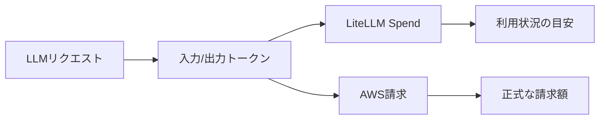

実務では、次のように使い分けるのがよさそうです。

| 観点  | LiteLLM Spend      | AWS請求             |
| --- | ------------------ | ----------------- |
| 用途  | 利用傾向の把握            | 正式な請求確認           |
| 粒度  | キー・ユーザー・チーム単位で見やすい | AWSアカウント・サービス単位   |
| 反映  | LiteLLM側の処理に依存     | AWS請求システムに依存      |
| 注意点 | モデル価格設定・トークン計算に依存  | 詳細な利用者単位の把握は工夫が必要 |

個人的には、LiteLLMのSpendは **「利用者・チーム別の傾向を見るための管理指標」** として使い、最終的な請求確認はAWS側で見るのがよいと思います。

これはかなり大事です。

Admin UIで `Spend(USD): 214.7405` のような数字が見えると、つい「AWSからこの金額が請求されるのか」と思ってしまいます。
ただ、実際にはLiteLLM側の計算値なので、請求確認とは分けて考える必要があります。

---

## モデル名を抽象化できるのが便利

LiteLLMを使って便利だと思うのが、**アプリケーション側に見せるモデル名を抽象化できる** ことです。

たとえば、アプリ側には `company-claude-sonnet` という名前を見せておき、LiteLLMの裏側ではBedrockの実際のモデルIDやinference profileを指定する、という使い方ができます。

これができると、アプリケーション側の設定をあまり変えずに、裏側のモデルを差し替えやすくなります。

たとえば以下のような運用ができます。

| アプリ側のモデル名               | LiteLLM裏側の実体          |
| ----------------------- | --------------------- |
| `company-claude-sonnet` | Bedrock Claude Sonnet |
| `company-claude-haiku`  | Bedrock Claude Haiku  |
| `company-cheap-model`   | コスト重視の軽量モデル           |
| `company-rag-model`     | RAG用途で使うモデル           |

もちろん、モデルの差し替えは慎重にやる必要があります。

同じClaude系でも、モデルが変われば出力傾向、コスト、レイテンシ、コンテキスト長が変わります。
そのため、いきなり本番用途の裏側モデルを差し替えるのではなく、まずは検証用のAliasで試すのがよいと思います。

---
## LiteLLMのGuardrails機能もチーム導入と相性がよい

LiteLLMをチーム導入で使う場合、Virtual KeyやSpend Trackingだけでなく、**Guardrails機能** も重要だと思います。

LiteLLMのGuardrailsは、LiteLLM Proxyを通るLLMリクエストに対して、入力チェック、出力チェック、PIIマスキング、プロンプトインジェクション検知などを差し込むための仕組みです。

公式ドキュメントでも、LiteLLM Proxy上でPrompt Injection DetectionやPII Maskingを設定するQuick Startが用意されています。
[https://docs.litellm.ai/docs/proxy/guardrails/quick_start](https://docs.litellm.ai/docs/proxy/guardrails/quick_start)

ざっくり図にすると、以下のようなイメージです。

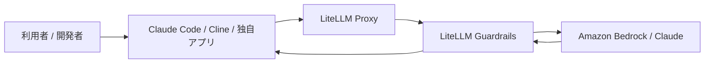

Bedrockを直接使う場合、Bedrock Guardrailsを使ってモデル入出力を制御できます。

一方でLiteLLMを挟む場合は、**LLM Gateway側で横断的にガードレールをかけられる** のがメリットです。

たとえば、Claude Code、Cline、独自アプリ、RAGアプリなど、複数のツールがLiteLLMを経由している場合でも、LiteLLM側で共通のチェックを差し込めます。

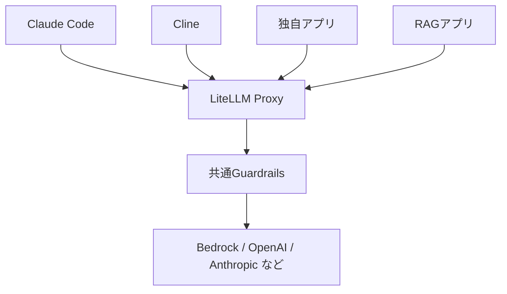

この構成にすると、アプリケーションごとに個別にガードレール処理を実装しなくても、Gateway層で一定の制御を共通化できます。

個人的には、LiteLLMをチーム導入する大きな理由の1つがここだと思います。

---

## Bedrock Guardrailsと組み合わせることもできる

LiteLLMでは、Bedrock Guardrailsを呼び出す構成も取れます。

LiteLLM公式ドキュメントでは、Amazon Bedrockの `ApplyGuardrail` APIを使って、LiteLLM ProxyからBedrock Guardrailsを利用する方法が紹介されています。
[https://docs.litellm.ai/docs/proxy/guardrails/bedrock](https://docs.litellm.ai/docs/proxy/guardrails/bedrock)

つまり、以下のような構成が考えられます。

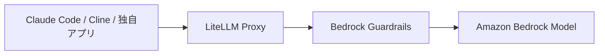

Bedrock Guardrailsは、Bedrock側で提供されるガードレール機能です。
コンテンツフィルター、拒否トピック、機密情報フィルター、コンテキストグラウンディングチェックなどを使って、生成AIアプリケーションの安全性を高めるために利用できます。

1本目の記事で書いたようなBedrock Guardrailsの考え方を、LiteLLM経由の構成にも持ち込めるのは大きいと思います。

特に、すでにAmazon Bedrockを中心にLLM利用を設計している場合、LiteLLMを入れたからといってBedrock Guardrailsを捨てる必要はありません。

むしろ、次のように役割分担すると考えやすいです。

| レイヤー               | 役割                            |
| ------------------ | ----------------------------- |
| LiteLLM Guardrails | 複数ツール・複数モデルに対するGateway共通のチェック |
| Bedrock Guardrails | Bedrockモデル利用時のAWSネイティブな安全制御   |
| アプリケーション側の制御       | 業務ロジックや画面・機能ごとの細かい制御          |

こう考えると、LiteLLM GuardrailsとBedrock Guardrailsは競合というより、**重ねて使える選択肢** だと思います。

---

## LiteLLM Guardrailsでできること

LiteLLM Guardrailsでは、設定や連携先によってさまざまなチェックを差し込めます。

代表的には、以下のような用途が考えられます。

| 用途                         | 内容                           |
| -------------------------- | ---------------------------- |
| Prompt Injection Detection | プロンプトインジェクションや脱獄プロンプトの検知     |
| PII Masking                | メールアドレス、電話番号、氏名などの個人情報をマスキング |
| Secret Detection           | APIキーやシークレットらしき文字列の検知        |
| Input Guardrail            | モデルに渡す前のユーザー入力チェック           |
| Output Guardrail           | モデルから返った応答のチェック              |
| Custom Guardrail           | 独自のPython処理などで業務要件に合わせたチェック  |

LiteLLMにはGuardrailsのQuick Startがあり、Proxyの `config.yaml` にGuardrailsを定義する形で設定できます。
[https://docs.litellm.ai/docs/proxy/guardrails/quick_start](https://docs.litellm.ai/docs/proxy/guardrails/quick_start)

また、LiteLLMではBedrock Guardrailsだけでなく、OpenAI ModerationやAporia、Lakera、Presidioなど、複数のガードレールプロバイダーとの連携も用意されています。
[https://docs.litellm.ai/docs/proxy/guardrails/openai_moderation](https://docs.litellm.ai/docs/proxy/guardrails/openai_moderation)

---

## カスタムGuardrailで業務要件に寄せられる

LiteLLMの面白いところは、既成のガードレールだけでなく、**カスタムGuardrail** も考えられるところです。

LiteLLMでは、リクエスト前後に処理を差し込むHookの仕組みがあります。公式ドキュメントでも、incoming requestを変更またはrejectするためのcallback hookが説明されています。
[https://docs.litellm.ai/docs/proxy/call_hooks](https://docs.litellm.ai/docs/proxy/call_hooks)

また、LiteLLM Guardrailsの公開リポジトリでは、pre-callまたはpost-callで実行されるPython関数としてカスタムコードGuardrailsを実装できることが説明されています。
[https://github.com/BerriAI/litellm-guardrails](https://github.com/BerriAI/litellm-guardrails)

業務利用では、汎用的なガードレールだけでは足りないことがあります。

たとえば、以下のような要件です。

* 特定の社内システム名を外部モデルに送らない
* 本番環境のアカウントIDらしき値を検知する
* APIキー形式に見える文字列をブロックする
* 特定プロジェクトのコード名をマスキングする
* 特定部署では高コストモデルの利用を禁止する
* RAGアプリでは、回答に引用がない場合は返さない
* 特定の業務カテゴリ以外の質問は拒否する

このような要件は、Bedrock Guardrailsだけで完結しない場合もあります。

その場合、LiteLLM側でカスタム処理を挟めると、かなり柔軟に対応できます。

個人的には、チームや組織でLiteLLMを使うなら、最初から高度なGuardrailを作り込む必要はないと思います。

ただ、将来的に「この情報は送らない」「このモデルはこの用途では使わせない」「この応答は返さない」といった業務ルールをGateway側に寄せられるのは、かなり大きなメリットです。

---

## Guardrailsを入れるときの注意点

一方で、Guardrailsを入れればすべて安全になるわけではありません。

ここは少し冷静に見た方がよいと思います。

### 1. 過検知・誤検知が起きる

ガードレールを強くしすぎると、本来許可したいリクエストまでブロックされることがあります。

特にClaude CodeやClineのような開発者向けツールでは、ログ、エラー、設定ファイル、疑似シークレット、テストデータなどを扱います。

たとえば、テスト用の文字列がシークレットとして検知されたり、セキュリティ診断コードが危険な内容としてブロックされたりする可能性があります。

そのため、最初から強いブロックを入れるより、まずはログ・検知・通知から始めて、影響を見ながらブロックに切り替える方が現実的だと思います。

個人的に使ってみた感想としては、AWSアカウントIDがクレジットカード番号と判定されマスクされてしまったりと地味に困る場面がありました・・・

### 2. レイテンシが増える

Guardrailsは、LLM呼び出しの前後にチェック処理を挟むため、多少なりともレイテンシが増えます。

Claude Codeのように対話的に使うツールでは、レスポンスが遅くなると開発体験に影響します。

入力チェックだけにするのか、出力チェックも入れるのか、どのモデル・どのツールに適用するのかは、そこまで問題にならない気もしますが、用途ごとに考えた方がよいです。

### 3. Guardrailsの責任範囲を過信しない

Guardrailsは重要ですが、万能ではありません。

入力ルール、IAM、SCP、ログ監査、利用者教育、コードレビューなどと組み合わせて初めて現実的な統制になります。

LiteLLM Guardrailsは、あくまでGateway層での制御です。

そのため、以下のような役割分担で考えるのがよいと思います。

| 制御                  | 主な役割                  |
| ------------------- | --------------------- |
| 利用ルール               | 何を入力してよいかを人に伝える       |
| IAM / SCP           | AWS側で利用できるモデルや操作を制御する |
| LiteLLM Virtual Key | 利用者・チーム単位で入口を分ける      |
| LiteLLM Guardrails  | Gateway層で入力・出力をチェックする |
| Bedrock Guardrails  | Bedrockモデルに対する安全制御を行う |
| ログ監査                | 後から利用状況や異常を確認する       |

---

## Amazon Bedrock連携の考え方

LiteLLMはAmazon Bedrock Providerに対応しています。

公式ドキュメントでは、BedrockのAnthropic、Meta、DeepSeek、Mistral、Amazonなどのモデルがサポートされていること、またBedrockリクエストにはboto3が必要であることが説明されています。
[https://docs.litellm.ai/docs/providers/bedrock](https://docs.litellm.ai/docs/providers/bedrock)

Bedrock連携のざっくりした流れは以下です。

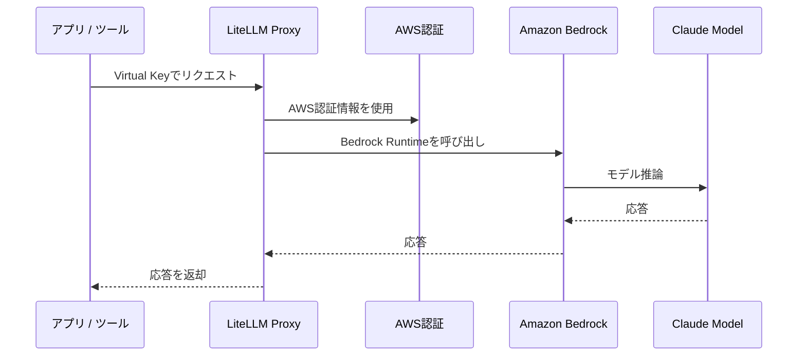

ここでポイントになるのは、AWS認証情報をどこに持たせるかです。

Bedrock直接利用では、各開発者やアプリケーションがAWS認証情報を持ちます。
一方でLiteLLM経由では、LiteLLM Proxy側にBedrockを呼び出すためのAWS認証情報を持たせる構成になります。

つまり、利用者にはAWS認証情報を渡さず、LiteLLMのVirtual Keyだけを渡す運用もできます。

これは便利ですが、その分LiteLLM Proxyの権限設計が重要になります。

LiteLLM Proxyに過剰なAWS権限を持たせるのではなく、Bedrock呼び出しに必要な権限に絞るべきです。
また、LiteLLMが稼働するEC2、ECS、EKSなどの実行基盤に付与するIAMロールも、必要最小限にした方がよいと思います。

---

## Claude CodeやClineとの関係

LiteLLMは、独自アプリだけでなく、Claude CodeやClineのようなAIコーディングツールの前段に置く構成でも使えます。

特にClaude Codeは、チームで使い始めると「誰がどれくらい使っているのか」「どのモデルを使わせるのか」が気になってきます。

2本目の記事ではClaude CodeからBedrockを直接呼ぶ構成を書きました。
今回のLiteLLM構成では、その間にGatewayを置くイメージです。

LiteLLM公式にも、Claude CodeからLiteLLM Proxy経由でClaudeモデルを呼び出すチュートリアルがあります。そこでは、中央集権的な認証、利用量トラッキング、コスト制御に触れられています。
[https://docs.litellm.ai/docs/tutorials/claude_responses_api](https://docs.litellm.ai/docs/tutorials/claude_responses_api)

ただし、AIコーディングエージェントやツールごとに期待するAPI形式が違うことには注意したいです。ここは結構なつまりポイントだと思います。

OpenAI互換APIで動くものもあれば、Anthropic Messages API形式を期待するものもあります。
そのため、「LiteLLMを立てれば全部すぐ動く」と考えるより、**使いたいツールごとに接続方式を確認する** のが安全です。

個人的には、以下の順番で確認するのがよいと思います。

1. LiteLLMからBedrockのClaudeを呼べるか
2. curlや簡単なPythonコードからLiteLLMを呼べるか
3. Clineや独自アプリからLiteLLMを呼べるか
4. Claude CodeからLiteLLM経由で呼べるか
5. Virtual KeyごとのSpendやモデル制御が効いているか

最初からClaude Codeまで一気に接続しようとすると、Bedrock側の問題なのか、LiteLLM側の問題なのか、Claude Code側の問題なのか切り分けが難しくなるためです。

---

## 構成パターン

LiteLLMをAWS上で動かす場合、構成はいくつか考えられます。

### パターン1：EC2上でLiteLLMを動かす

検証なら一番分かりやすいです。

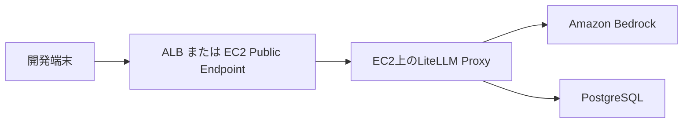

メリットは、構成がシンプルでトラブルシュートしやすいことです。
デメリットは、可用性や運用を自分で考える必要があることです。

検証や小規模利用ならEC2でも十分だと思います。勿論、PostgreSQLも含めてEC2上に構築するという構成も可能です。
ただし、組織利用に広げるなら、単一EC2に依存し続けるのは少し不安です。

---

### パターン2：ECS Fargateで動かす

組織利用を考えるなら、ECS Fargate + ALB + RDSのような構成が扱いやすいと思います。

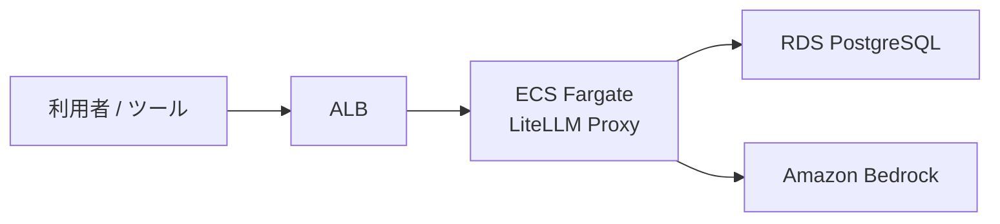

ECSにすると、コンテナとして管理しやすくなります。
RDS PostgreSQLを使えば、Virtual KeyやSpend Trackingの永続化もしやすいです。

LiteLLMのVirtual Key管理ではPostgreSQLが必要になるため、本格利用するならDBをどう持つかは早めに考えた方がよいです。公式ドキュメントでも、Virtual Keyのセットアップ要件としてPostgreSQLのDATABASE_URLやmaster keyが示されています。
[https://docs.litellm.ai/docs/proxy/virtual_keys](https://docs.litellm.ai/docs/proxy/virtual_keys)

---

### パターン3：閉域・社内向けLLM Gatewayとして動かす

企業利用では、LiteLLMをインターネット公開せず、社内ネットワークやVPN、閉域接続の中だけで使いたいケースもあると思います。

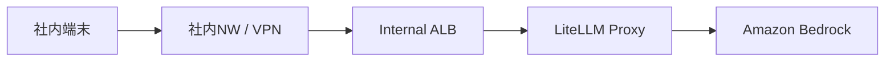

この構成にすると、LiteLLMのエンドポイントを社内向けに閉じられます。

ただし、開発者端末からLiteLLMに到達できるネットワーク設計、認証、証明書、プロキシ設定なども考える必要があります。

個人的には、企業利用ではこのあたりが意外と大変だと思います。
LiteLLM自体よりも、ネットワークや認証の方で時間を使うことがあります。

---

## LiteLLMを入れる前に決めておきたいこと

LiteLLMは便利ですが、入れればすべて解決するわけではありません。

むしろ、Gatewayを1つ増やすことになるので、決めるべきことも増えます。

導入前に最低限、以下は決めておいた方がよいと思います。

| 論点     | 決めること                             |
| ------ | --------------------------------- |
| 利用者    | 誰に使わせるか                           |
| 利用ツール  | Claude Code / Cline / 独自アプリなど     |
| モデル    | どのモデルを許可するか                       |
| キー管理   | 個人単位、チーム単位、ツール単位のどれで分けるか          |
| 予算管理   | Spend上限を設定するか                     |
| 認証     | LiteLLMのVirtual Keyだけでよいか、SSOも必要か |
| ネットワーク | 社内限定か、インターネット経由か                  |
| ログ     | 何を記録し、どこまで保持するか                   |
| 可用性    | 止まったとき業務影響があるか                    |
| 運用者    | 誰がキー発行・モデル追加・障害対応をするか             |

特に、**運用者を決める** のは大事です。

LiteLLMを入れると、利用者から以下のような問い合わせが来る可能性があります。

* キーを発行してほしい
* Spend上限を上げてほしい
* このモデルを使えるようにしてほしい
* Claude Codeがつながらない
* Clineでエラーになる
* Admin UIのSpendとAWS請求が合わない
* レスポンスが遅い
* 特定のモデルだけ失敗する

こういう問い合わせに誰が対応するのかを決めずに導入すると、便利なはずの基盤が運用負荷になってしまいます。

---

## 運用でハマりやすいポイント

ここからは、実務目線で気をつけたいポイントです。

### 1. LiteLLMのSpendとAWS請求を混同しない

先ほども書いた通り、LiteLLMのSpendは正式なAWS請求額そのものではありません。

Admin UIで見える数字は便利ですが、請求確認はAWS Cost ExplorerやCURなどで見る必要があります。

利用者にもAdmin UI画面を提供するのであれば、利用者向けにも以下のように説明しておくと誤解が少ないと思います。

> LiteLLMのSpendは、利用傾向を把握するための参考値です。正式なAWS請求額とは一致しない場合があります。

この一文は、かなり大事だと思います。

---

### 2. モデル名を分かりやすくしすぎると、裏側の実体が見えなくなる

`company-claude-sonnet` のようなAliasは便利です。

ただし、抽象化しすぎると、裏側でどのモデルを使っているのか分かりにくくなります。

そのため、運用者向けには、Aliasと実モデルIDの対応表を持っておくのがよいと思います。

| Alias                   | 実モデル                  | 用途   | 備考           |
| ----------------------- | --------------------- | ---- | ------------ |
| `company-claude-sonnet` | Bedrock Claude Sonnet | 汎用   | Claude Code用 |
| `company-claude-haiku`  | Bedrock Claude Haiku  | 軽量処理 | コスト重視        |
| `company-rag-model`     | Bedrock Claude Sonnet | RAG  | 回答品質重視       |

利用者にはAliasだけ見せ、運用者は実体も把握する、という分け方です。

---

### 3. いきなり全モデルを開放しない

LiteLLMを入れると、複数プロバイダー・複数モデルをまとめて扱えるようになります。

便利なのですが、最初から何でも使えるようにすると、コストやセキュリティの管理が難しくなります。

最初は以下のように絞るのがよいと思います。

| 用途          | 許可モデル         |
| ----------- | ------------- |
| Claude Code | Claude Sonnet |
| 軽量な補助処理     | Claude Haiku  |
| 検証用         | 一部の検証モデルのみ    |
| 本番アプリ       | 承認済みモデルのみ     |

モデルを追加するときは、なぜ必要なのか、どの用途で使うのか、コストやデータの扱いに問題がないかを確認した方がよいです。

※これは別記事で書いた統制設計の話にもつながります。

---

### 4. Gateway自体が単一
