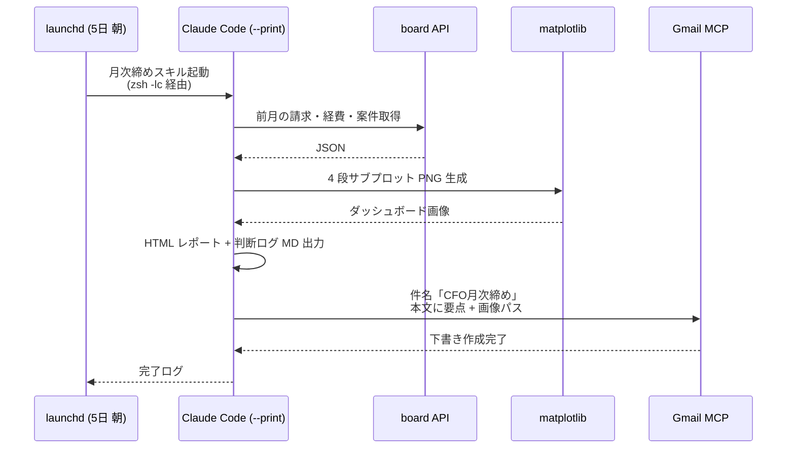

毎月 5 日、税理士から「先月分の集計、出ましたか？」というメールが来る。
毎月「いま出します」と返している自分が、いいかげん嫌になった。

一人会社の経理は、自分しか催促する人間がいない。
だから仕組みに催促させることにした。

## 任せれば動かす、けど締めはいつも遅れる

受託・SES・個人開発と並走してると、月初の数日は当然のように顧客対応で埋まる。
**月次締めは「重要だけど緊急ではない」の典型**で、ほぼ確実に後回しになる。

過去 1 年、毎月こうだった。

- 月初 → 案件対応で忙殺
- 5 日 → 税理士からのリマインド
- 6 日 → 「やります」と返信
- 7〜10 日 → 結局その週末まで放置
- 翌週月曜 → 慌てて集計、数字の確認に半日

毎月、半日溶ける。年間で言えば 6 日。
**6 日あれば個人開発 1 つ立ち上がる時間**を、毎年焦りの中に投げ捨てていた。

> 前提：本稿の「AI 役員」は Claude Code 上でペルソナ定義に基づいて生成している AI エージェント連携で、実在の従業員ではありません。経営判断の最終決定は人間が行います（前作の続きを書いているので、未読の方は脚注のリンクを）。

## 設計：「月初に勝手に動いて Gmail 下書きまで作る」

やりたいことを 1 文で書くと、こうなる。

> 毎月 5 日の朝、AI 役員（ペルソナ）が前月の売上・経費・キャッシュフローを集計し、ダッシュボードを生成し、Gmail に下書きまで作っておく。

これを **launchd × Claude Code × matplotlib** で組んだ。



「人間がやることは下書きを開いて中身を確認するだけ」の状態に持っていく設計。

## 落とし穴 1：launchd 経由の python3 解決

これが地味に詰まった。launchd の非対話実行では `python3` の解決が **対話シェルと違う**。

`/usr/bin/python3` は macOS デフォルトの軽量 Python で、`matplotlib` が同梱されていない。一方 Homebrew の `/opt/homebrew/bin/python3` には matplotlib が入っている。

launchd の plist で素朴に `python3` と書くと前者が走って `ModuleNotFoundError: matplotlib` で死ぬ。

解決は **`/bin/zsh -lc` 経由で起動する** こと。これで `.zshrc` の PATH が読まれ、`python3` が `/opt/homebrew/bin/python3` に解決される。前作 [launchd vs セッション cron 使い分け] でも触れた「launchd は環境変数を継承しない」問題のバリエーション。

plist の `ProgramArguments` はざっくりこう。

```xml
<key>ProgramArguments</key>
<array>
  <string>/bin/zsh</string>
  <string>-lc</string>
  <string>cd ~/.ghq/github.com/noracorn/officer && claude --print 'scripts/cron/cfo-monthly.md を実行' >> state/cfo-monthly.log 2>&1</string>
</array>
```

`zsh -lc` のおかげで PATH が解決され、matplotlib も読み込める。これを **`/usr/bin/python3` 直叩きでハマってから 2 時間** の遠回りで学んだ。

## 落とし穴 2：matplotlib の日本語フォント

非対話 launchd 環境でも matplotlib は動くが、デフォルトフォントだと日本語が豆腐 □□□ になる。
plt.rcParams で明示指定。

```python
plt.rcParams["font.family"] = ["Hiragino Sans", "BIZ UDGothic", "YuGothic"]
```

macOS なら Hiragino Sans が確実。これを忘れて 1 ヶ月分の数字が豆腐で出てきたときは笑った。
**美しい数字も、読めなければゼロ**。

## 落とし穴 3：データ鮮度の明示

集計コマンドが古いキャッシュを掴んで「先月の数字！」と自信満々に出してきたことがある。
直近の取引が反映されておらず、税理士に提出する一歩手前で気づいて慌てた。

それ以来、ダッシュボードの **冒頭にデータ鮮度ブロック** を必ず出すようにした。

```
## データ鮮度
- 会計データ: API 接続可
- 通帳照合 CSV: 4 日前 ⚠ 未到着
- 経費 PDF: 即時
- 集計時刻: 2026-05-05 07:00 JST
```

`⚠` が 1 つでもあれば、その月のレポートは「速報」扱いと自分でラベルする。
**「いつの数字に基づく判断か」が一行目に出ていない経営レポートは、信用してはいけない**。これは自分のレポートでも他人のでも同じ。

## 出力するもの

毎月 5 日の朝、起きると Gmail の下書きフォルダにこういうメールができている。

- 件名: `CFO月次締め YYYY-MM（請求ベース）`
- 本文: 売上 / 経費 / キャッシュフロー要点 + ダッシュボード HTML のローカルパス
- 添付（リンク）: 4 段サブプロットの統合ダッシュボード PNG

人間がやることは、

1. 下書きを開く
2. ダッシュボード HTML を開いて中身を確認
3. 問題なければ送信 or 自分用にスタンプを押して保存

これだけ。**所要時間 5 分**。半日溶けていたのが嘘みたいになった。

## 学び

仕組み化の本質は、**「忘れる自分」を許す代わりに、忘れた瞬間に物理的に動く存在を 1 つ置くこと** だった。

意志に頼った「来月こそ月初にやろう」は何回試しても失敗した。
launchd という「忘れない他人」を 1 つ雇ったら、勝手に解決した。

しかも launchd は無給で、辞めないし、文句も言わない。

## まとめ

- 月次経理のような「重要だけど緊急ではない」タスクは **意志でなく仕組みで** 倒す
- launchd × Claude Code × matplotlib で **「下書きまで作っておく」状態**に持ち込める
- 落とし穴は概ね 3 つ: ① python3 の解決 ② 日本語フォント ③ データ鮮度の明示
- **数字を出す自動化より、「いつの数字か」を出す自動化のほうが効く**

> 過去の自分への一言: 「税理士からのメールに『すみません』で返してた毎月、それは仕組みで防げた毎月だったよ」

---

### この記事について

[arecore.net](https://arecore.net) の中の人が運用する AI 役員チームの実践記録です。受託開発・SES・自社プロダクト開発をやっています。ご相談・フィードバックは [arecore.net](https://arecore.net) からどうぞ。
