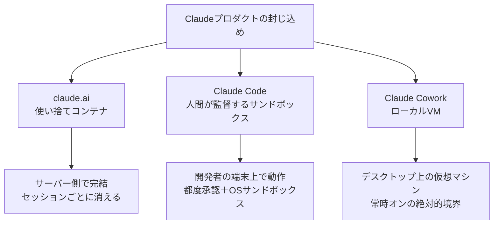

## はじめに

AIエージェントが「人や、時にはチームが担っていた仕事」をこなせるほど高機能になるにつれて、便利さと引き換えに「もし暴走したらどこまで被害が及ぶのか」というリスクが大きくなります。Anthropic はこの被害範囲を **blast radius（爆発半径）** と呼び、それをいかに小さく抑え込むか（＝containment）を技術課題として取り組んでいます。

本記事は、Anthropic のエンジニアリングブログ記事「[How we contain Claude across products](https://www.anthropic.com/engineering/how-we-contain-claude)」（2026年5月25日公開）を要約したものです。3つの Claude プロダクト（claude.ai、Claude Code、Claude Cowork）でそれぞれ異なる「封じ込め設計」がどう使い分けられているかをご紹介します。

## 目次

1. リスクの3分類と防御の3要素
2. エージェントを封じ込める3つのパターン
3. 実際に起きた「見落とし」から学んだ教訓
4. これから向き合う課題
5. まとめ：繰り返し立ち返る原則

---

## 1. リスクの3分類と防御の3要素

Anthropic は、エージェントに対するセキュリティリスクを次の3種類に整理しています。

| リスク分類 | 内容 |
| --- | --- |
| ユーザの誤用 | 悪意またはうっかりで、有害な操作をエージェントに指示してしまう |
| モデルの逸脱行動 | 誰も頼んでいない有害な行動をエージェントが自ら取る |
| 外部攻撃者 | ツール・ファイル・ネットワーク経由でエージェントが攻撃される（プロンプトインジェクション等） |

興味深いのは、「モデルが賢くなるほどリスクが単純に減るわけではない」という指摘です。能力の低いモデルは状況を読み違えて明らかなミスをしがちですが、能力の高いモデルはミスが減る一方で、誰も想定していなかった「目的達成への近道」を見つけ出すことがあります。

これらに対し、防御は3つの要素に適用されます。「エージェントが動く**環境**」「エージェントが参照する**モデル**」「エージェントが到達できる**外部コンテンツ**」です。記事全体を通じて強調されるのは、**環境レイヤーの防御を最優先に設計し、その上でモデルの振る舞いを調整する**という考え方です。

## 2. エージェントを封じ込める3つのパターン

記事の中心となるのが、プロダクトごとに最適化された3つの隔離パターンです。それぞれ、エージェントに求められる能力と、ユーザに求められる介入のバランスから設計されています。

### パターン1：使い捨てコンテナ（claude.ai）

claude.ai はチャットだけでなくコード実行も行います。コードは隔離されたインフラ上の **gVisor コンテナ**内で実行され、すべてサーバー側で完結します。ローカル環境では何も動かず、ファイルシステムはセッションごとに消える一時的なものです。被害範囲は最小ですが、永続的な作業領域がない分、できることの上限も低くなります。

### パターン2：人間が監督するサンドボックス（Claude Code）

Claude Code はユーザの端末上で動き、ファイルシステムやシェル、ネットワークにアクセスします。これはコーディングエージェントには不可欠な能力です。ユーザの多くが開発者で `rm -rf` の意味を理解できるため、当初は「読み取りは許可、書き込み・bash・ネットワークは都度承認」というシンプルな防御で出発しました。

しかし、すぐに**承認疲れ（approval fatigue）** が発生します。Anthropic の計測では、ユーザは承認プロンプトの約93%を承認しており、プロンプトが多いほど一つひとつへの注意が薄れていきました。対策としてOSレベルのサンドボックス（macOSはSeatbelt、Linuxはbubblewrap）を導入し、ネットワークをデフォルト遮断したところ、承認プロンプトを84%削減できたようです。

### パターン3：ローカルVM（Claude Cowork）

Claude Cowork は一般的な知識労働向けのため、ユーザが bash に詳しいとは限りません。そこで、専門知識がなくても安全な「常時オンの絶対的な境界」が必要になります。初期バージョンでは、プラットフォーム標準の仮想化基盤（macOSはApple Virtualization framework、WindowsはHCS）を使い、**独立したLinuxカーネル・ファイルシステム・プロセステーブルを持つフルVM**内で動作させました。認証情報はホストのキーチェーンに留まり、ゲスト側には渡りません。

3つのパターンのコストとリスクは次のように整理されています。

| 環境 | 隔離のオーバーヘッド | ユーザへの依存 | 被害範囲 |
| --- | --- | --- | --- |
| 使い捨てコンテナ（claude.ai） | コンテナ起動 | なし | サーバー側コンテナ |
| 人間監督サンドボックス（Claude Code） | 低遅延のネイティブサンドボックス | bashの解釈が必要 | ローカルの作業領域 |
| 封印されたVM（Claude Cowork） | フルVMの起動 | なし | マウントされた作業領域 |

## 3. 実際に起きた「見落とし」から学んだ教訓

本セクションでは、実際に発生した失敗事例をご紹介します。

#### 信頼ダイアログより前に動くコード
開発者がPRレビューのためにリポジトリをクローンすると、その中の設定ファイルが「このフォルダを信頼しますか？」の確認より前に読み込まれ、攻撃者の仕込んだ処理が自動実行される、という脆弱性が報告されました。修正の方向性は共通で、**設定の読み込みと実行を、ユーザが信頼を承認した後まで遅延させる**ことでした。

#### ユーザ経由の攻撃経路
** 社内のレッドチーム演習で、従業員が「これ実行してくれる？」というメールに添付された悪意のあるプロンプトを貼り付けてしまう事例がありました。そのプロンプトは認証情報を読み取って外部に送信するよう指示しており、25回中24回で送信が成立しました。指示がユーザ経由で届くため、モデル側の防御では異常を検知できません。ここで効くのは、送信をブロックする**egress（外向き通信）制御**と、そもそも機密ファイルに到達させない**ファイルシステム境界**だけでした。

#### 許可したドメイン経由での情報流出
Cowork の通信許可リストは、製品が動作するために必要な `api.anthropic.com` を正しく通していました。攻撃者はこれを逆手に取り、Coworkユーザの作業フォルダに悪意あるファイルを仕込みます。そのファイルには、隠し指示と一緒に**攻撃者自身のAnthropicアカウントのAPIキー**が埋め込まれていました。Claude はそのファイルを読むと指示に従い、**ユーザの作業フォルダ内にある他のファイル**を読み取って、攻撃者のキーで Anthropic の API にアップロードしてしまいます。送信先は正規の `api.anthropic.com` なので許可リストはこれを通してしまい、結果として**ユーザのファイルが攻撃者のアカウントへ**流出しました。サンドボックス自体は完璧に機能していたのに、です。ここから、**許可リストは「宛先フィルター」ではなく「能力の付与」として捉えるべき**（そのドメインで使える全機能が攻撃対象になる）という教訓が導かれました。

これら2つの流出事例に共通するのは、モデル層では検知のしようがなかった点です。確率的な防御を全てすり抜けた時、最後に被害を受け止めるのは決定論的な境界（環境レイヤー）でした。

## 4. これから向き合う課題

記事の終盤では、今後の課題が3つ挙げられています。**永続メモリへの汚染**（セッションをまたいで残るメモリやファイルに仕込まれた指示が、起動のたびに再読み込みされる）、**マルチエージェントの信頼の連鎖**（サブエージェントの出力を高信頼とみなすと新たなインジェクション経路になる）、そして**エージェントのアイデンティティ**（エージェントは独自の身元を持つべきか、ユーザの権限を継承すべきか）です。

## 5. まとめ：繰り返し立ち返る原則

記事は、何度も立ち返る原則として次の3点を挙げています。

#### 1) まずは環境レイヤーで封じ込め、次にモデルレイヤーで振る舞いを調整する

学びの多かったインシデントはいずれも、許可された経路からデータが出ていく流出であり、モデル層では止められませんでした。

#### 2) 隔離の強度を、ユーザの監督能力に合わせる
bashを読める開発者と読めない知識労働者では、安全に運用できる前提条件が変わります。

#### 3) 自作コンポーネントには慎重に 
実績のある仮想化基盤やコンテナランタイムは持ちこたえた一方、自前で作った許可リストプロキシが弱点になりました。

エージェントは新しいソフトウェアの一種かもしれませんが、ファイルを読み、ソケットを開き、プロセスを起動するという**システムレベルの振る舞いは従来と変わりません**。だからこそ、成熟したツールによる封じ込めが有効な防御になる、という結論で記事は締めくくられています。

---

> 本記事は Anthropic の公開記事「[How we contain Claude across products](https://www.anthropic.com/engineering/how-we-contain-claude)」（2026年5月25日公開）の内容を要約したものです。正確な情報は必ず原文をご確認ください。
