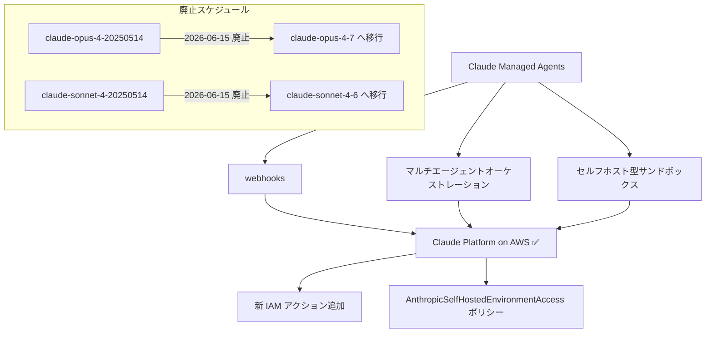
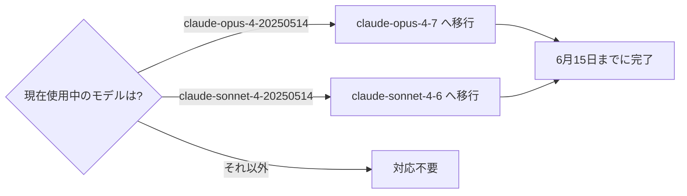

## はじめに

2026年5月29日、Anthropic から2つの重要なアップデートが発表されました。

1つ目は **Claude Managed Agents の主要機能が Claude Platform on AWS で正式利用可能** になったこと。webhooks・マルチエージェントオーケストレーション・セルフホスト型サンドボックスの3機能が揃い、AWS 環境でのエージェント開発が大幅に強化されます。

2つ目は **Claude Opus 4 廃止時の推奨移行先が変更** されたこと。Opus 4.8 への移行を計画していた方は注意が必要です。

> **📌 影響を受ける人**
> - AWS 上で Claude を使ったエージェントシステムを構築・運用している開発者
> - `claude-opus-4-20250514` または `claude-sonnet-4-20250514` を本番環境で利用している開発者

---

## 変更の全体像



---

## 変更内容

### 1. Claude Managed Agents が Claude Platform on AWS に対応

#### 新たに利用可能になった機能

| 機能 | 概要 |
|------|------|
| **Webhooks** | エージェントの実行状態や完了イベントを外部システムへプッシュ通知 |
| **マルチエージェントオーケストレーション** | 複数エージェントを協調・並列動作させるオーケストレーション基盤 |
| **セルフホスト型サンドボックス** | コード実行などをユーザー管理のサンドボックス環境で安全に実施 |

#### 必要な IAM 設定

AWS 環境でこれらの機能を利用するには、IAM ポリシーの更新が必要です。

- **新しい IAM アクション** の付与
- **`AnthropicSelfHostedEnvironmentAccess`** マネージドポリシーのアタッチ

> **⚠️ 注意**
> 既存の IAM ロールには `AnthropicSelfHostedEnvironmentAccess` ポリシーが含まれていません。セルフホスト型サンドボックスを使用する場合は必ず追加してください。設定漏れがあると、サンドボックス機能の呼び出し時に権限エラーが発生します。

---

### 2. Claude Opus 4 廃止時の推奨移行先が変更

> **⚠️ Breaking Change**
> `claude-opus-4-20250514` の推奨移行先が **Opus 4.8 → Opus 4.7** に変更されました。すでに Opus 4.8 への移行計画を進めていた場合は見直しが必要です。

#### モデル廃止と移行先まとめ

| 廃止モデル | 廃止日 | 旧推奨移行先 | **新推奨移行先** |
|------------|--------|-------------|----------------|
| `claude-opus-4-20250514` | 2026-06-15 | `claude-opus-4-8` | **`claude-opus-4-7`** |
| `claude-sonnet-4-20250514` | 2026-06-15 | `claude-sonnet-4-6` | `claude-sonnet-4-6`（変更なし） |



---

## 影響と対応

### AWS で Managed Agents を使っている場合

1. **IAM ポリシーの確認・更新**
   - 使用する機能（webhooks / オーケストレーション / サンドボックス）に対応する IAM アクションが付与されているか確認
   - セルフホスト型サンドボックスを使う場合は `AnthropicSelfHostedEnvironmentAccess` をアタッチ

2. **動作確認**
   - ステージング環境で各機能の疎通テストを実施してから本番へ反映する

### Opus 4 / Sonnet 4 を使っている場合

- **期限: 2026年6月15日** までにモデル ID を変更する
- Opus 4 を使用中の場合は `claude-opus-4-7` へ変更（Opus 4.8 **ではなく** Opus 4.7）
- Sonnet 4 を使用中の場合は `claude-sonnet-4-6` へ変更

> **💡 Tips**
> モデル ID をハードコードしている箇所を一括検索するには、`claude-opus-4-20250514` や `claude-sonnet-4-20250514` というリテラル文字列を grep するのが確実です。環境変数や設定ファイルにまとめていない場合は、この機会に外部化を検討しましょう。

---

## コード例

### Managed Agents — セルフホスト型サンドボックスの IAM ポリシー設定例

**Before（セルフホストサンドボックスが未許可）**

```json
{
  "Version": "2012-10-17",
  "Statement": [
    {
      "Effect": "Allow",
      "Action": [
        "anthropic:InvokeAgent"
      ],
      "Resource": "*"
    }
  ]
}
```

**After（セルフホストサンドボックス対応ポリシーを追加）**

```json
{
  "Version": "2012-10-17",
  "Statement": [
    {
      "Effect": "Allow",
      "Action": [
        "anthropic:InvokeAgent",
        "anthropic:CreateSandbox",
        "anthropic:ExecuteInSandbox"
      ],
      "Resource": "*"
    }
  ]
}
```

加えて、IAM ロールに `AnthropicSelfHostedEnvironmentAccess` マネージドポリシーをアタッチします。

```bash
aws iam attach-role-policy \
  --role-name YourAgentRole \
  --policy-arn arn:aws:iam::aws:policy/AnthropicSelfHostedEnvironmentAccess
```

---

### モデル移行のコード例

**Before**

```python
import anthropic

client = anthropic.Anthropic()

response = client.messages.create(
    model="claude-opus-4-20250514",  # 2026-06-15 廃止
    max_tokens=1024,
    messages=[{"role": "user", "content": "Hello"}]
)
```

**After**

```python
import anthropic

client = anthropic.Anthropic()

response = client.messages.create(
    model="claude-opus-4-7",  # 推奨移行先（4.8 ではなく 4.7）
    max_tokens=1024,
    messages=[{"role": "user", "content": "Hello"}]
)
```

> **💡 Tips**
> モデル名を環境変数で管理しておくと、次回の移行時にコードを変更せずに済みます。
>
> ```python
> import os
> MODEL = os.getenv("CLAUDE_MODEL", "claude-opus-4-7")
> ```

---

## まとめ

| # | 変更内容 | 対応期限 | 優先度 |
|---|----------|----------|--------|
| 1 | Claude Managed Agents の3機能が AWS で利用可能に | 随時 | 🟠 高（新機能活用） |
| 2 | Opus 4 廃止の推奨移行先が Opus 4.7 に変更 | **2026-06-15** | 🔴 緊急（廃止対応） |
| 3 | Sonnet 4 廃止・移行先は Sonnet 4.6（変更なし） | **2026-06-15** | 🔴 緊急（廃止対応） |

AWS でマルチエージェントシステムを構築している場合は、今回の3機能追加で構成の幅が大きく広がります。一方、Opus 4 / Sonnet 4 を使っている場合は **6月15日** という締め切りが迫っているため、早急な対応をおすすめします。特に Opus 4 の移行先は「4.8 ではなく 4.7」という点を見落とさないよう注意してください。
