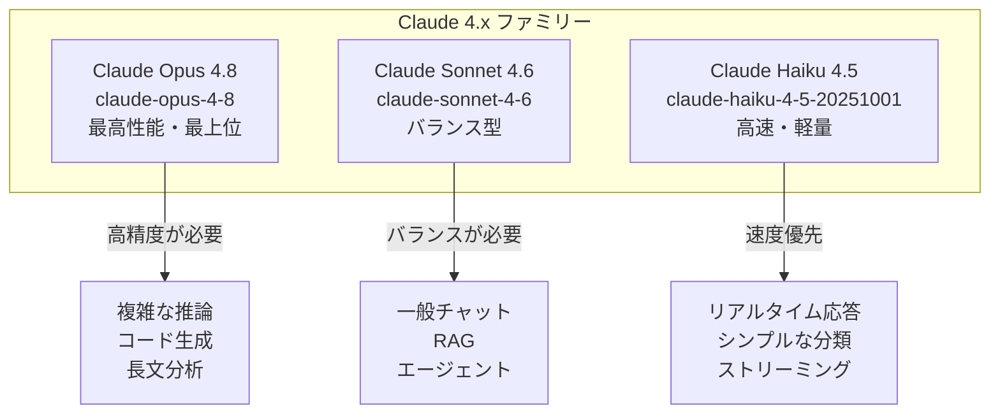
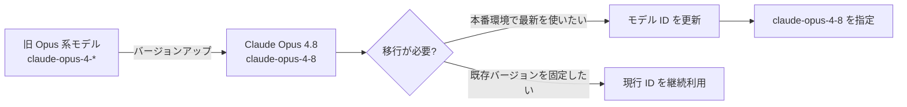
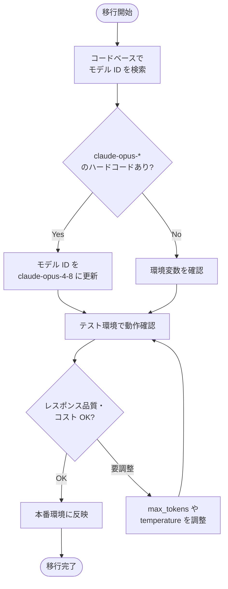

## はじめに

Anthropic が **Claude Opus 4.8** を発表しました。HackerNews では 1,600 以上のいいねを獲得し、開発者コミュニティから大きな注目を集めています。

Claude シリーズの最上位グレードである「Opus」の最新バージョンとして、複雑な推論・長文処理・高精度なコード生成など、要求水準の高いタスクに応える設計がなされています。本記事では、**Claude 4.x ファミリー全体の位置づけ**を整理しつつ、API への移行手順とコード例を解説します。

> **📌 影響を受ける人**
> - Anthropic API を使って Claude Opus 系モデルを呼び出しているアプリケーション開発者
> - Claude Code（Fast モード）を利用しているエンジニア
> - 高精度な推論・分析・コード生成タスクを Claude で処理しているチーム

---

## 変更の全体像

Claude 4.x シリーズは **Opus / Sonnet / Haiku** の 3 グレードで構成されており、Opus 4.8 はその最上位に位置します。



モデル選択の目安は「精度 vs コスト vs レイテンシ」のトレードオフです。Opus 4.8 は **最高精度**が必要なユースケースに適しています。

---

## モデルファミリーの比較

| モデル | モデル ID | ユースケース | 精度 | 速度 |
|--------|-----------|-------------|------|------|
| **Claude Opus 4.8** | `claude-opus-4-8` | 複雑な推論・高度なコード生成 | ★★★★★ | ★★★ |
| Claude Sonnet 4.6 | `claude-sonnet-4-6` | 汎用タスク・RAG・エージェント | ★★★★☆ | ★★★★ |
| Claude Haiku 4.5 | `claude-haiku-4-5-20251001` | 高速応答・軽量タスク | ★★★☆☆ | ★★★★★ |

> **💡 Tips**
> Claude Code の **Fast モード** (`/fast`) は Claude Opus を使用します。Fast モードはより高速な出力を提供しますが、小型モデルへのダウングレードは行いません。つまり Opus 4.8 の性能をそのまま活かしつつ速度を向上させることができます。

---

## 変更内容

### モデル ID の変更

最も重要な実装上の変更点は **モデル ID** です。Anthropic API 呼び出し時に指定する `model` パラメータを更新する必要があります。



### 影響を受ける実装パターン

- ハードコードされたモデル ID (`"claude-opus-4-8"` など)
- 環境変数でモデル名を管理しているアプリケーション
- Claude Code の設定ファイルでモデルを明示指定しているケース

---

## コード例

### Python (Anthropic SDK)

**Before: 旧モデル ID を使用**

```python
import anthropic

client = anthropic.Anthropic()

message = client.messages.create(
    model="claude-opus-4-6",  # 旧バージョン
    max_tokens=1024,
    messages=[
        {"role": "user", "content": "複雑な推論タスクを実行してください。"}
    ]
)
print(message.content)
```

**After: Opus 4.8 に更新**

```python
import anthropic

client = anthropic.Anthropic()

message = client.messages.create(
    model="claude-opus-4-8",  # 最新 Opus に更新
    max_tokens=1024,
    messages=[
        {"role": "user", "content": "複雑な推論タスクを実行してください。"}
    ]
)
print(message.content)
```

### 環境変数で管理する推奨パターン

本番環境では、モデル ID をコードにハードコードせず、環境変数で管理することを推奨します。

```python
import os
import anthropic

client = anthropic.Anthropic()

# モデルを環境変数で管理
MODEL = os.environ.get("CLAUDE_MODEL", "claude-opus-4-8")

message = client.messages.create(
    model=MODEL,
    max_tokens=2048,
    system="You are an expert software engineer.",
    messages=[
        {"role": "user", "content": "このコードをレビューして改善点を提案してください。"}
    ]
)
```

```bash
# .env または環境変数に設定
CLAUDE_MODEL=claude-opus-4-8
```

### TypeScript / Node.js

```typescript
import Anthropic from "@anthropic-ai/sdk";

const client = new Anthropic();

async function callOpus() {
  const message = await client.messages.create({
    model: "claude-opus-4-8", // 最新 Opus 4.8
    max_tokens: 1024,
    messages: [
      {
        role: "user",
        content: "高度な分析タスクを実行してください。",
      },
    ],
  });

  console.log(message.content);
}

callOpus();
```

### プロンプトキャッシングとの組み合わせ

Opus 4.8 は長いシステムプロンプトや大量のコンテキストを扱うケースが多いため、**プロンプトキャッシング**との組み合わせがコスト削減に有効です。

```python
import anthropic

client = anthropic.Anthropic()

# プロンプトキャッシングを有効化
message = client.messages.create(
    model="claude-opus-4-8",
    max_tokens=2048,
    system=[
        {
            "type": "text",
            "text": "あなたは高度な技術コンサルタントです。以下のドキュメントを参照して回答してください。\n\n" + large_document,
            "cache_control": {"type": "ephemeral"}  # キャッシュを有効化
        }
    ],
    messages=[
        {"role": "user", "content": "このシステムの設計上の問題点を指摘してください。"}
    ]
)
```

> **💡 Tips**
> プロンプトキャッシングを使うと、同一のシステムプロンプトを繰り返し送信するコストを大幅に削減できます。Opus 4.8 のような高性能モデルを使う際は特に効果的です。

---

## 影響と対応

### 移行チェックリスト



### 開発者が取るべき具体的なアクション

1. **モデル ID の更新**: `claude-opus-4-8` に変更
2. **動作テスト**: 主要なプロンプト・ユースケースで品質を確認
3. **コスト監視**: Opus は上位モデルのためトークン単価が高い。用途に応じて Sonnet 4.6 への切り替えも検討
4. **プロンプトキャッシング導入**: 長いコンテキストを使う場合はキャッシング設定を追加してコスト最適化

> **⚠️ Breaking Change**
> モデル ID を明示的に指定している場合、旧バージョンの Opus を参照したままになります。Opus 4.8 の機能・改善を活用するには**必ずモデル ID を更新**してください。

---

## まとめ

| ポイント | 内容 |
|----------|------|
| 新モデル ID | `claude-opus-4-8` |
| 対象者 | Anthropic API で Opus を使う開発者全般 |
| 必要なアクション | モデル ID の更新・動作確認 |
| コスト対策 | プロンプトキャッシング・用途別モデル選択 |
| Claude Code | Fast モード (`/fast`) は Opus を使用、性能維持のまま高速化 |

Claude Opus 4.8 は HackerNews でも高い注目を集めた Anthropic の最新フラッグシップモデルです。**移行自体はモデル ID を 1 行変更するだけ**ですが、コスト・品質・レイテンシのバランスを考慮してユースケースに合わせたモデル選択を行うことが重要です。

Opus 4.8 で精度を最大化しつつ、コスト効率の良い設計を目指しましょう。
