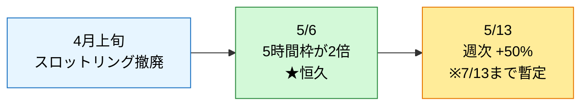

## はじめに
最近、Claude Code を使っていて「あれ、5時間制限に全然当たらなくない？」と感じませんか。気のせいではありません。2026年5月、Anthropic は Claude / Claude Code の利用上限を立て続けに引き上げました。本記事では、その緩和の中身を**公式ソースで裏取り**しつつ、私が Opus 4.8 を **$100 プラン（Max 5x）** でガッツリ回した**実データ**で「実際どれくらい余裕があるのか」を確かめます。


> **検証環境**: NVIDIA DGX Spark（GB10 / aarch64・Ubuntu 24.04）上の Claude Code v2.1.157。本記事のコマンドは基本的に OS 非依存ですが、aarch64 固有の差異が出る箇所だけ注記します。

## 要点

- 2026年5月、Claude Code の上限は **3段階** で緩和された（4月: スロットリング撤廃 → 5/6: 5時間枠2倍 → 5/13: 週次+50%）。
- 加えて **5/28 の Opus 4.8 ローンチでも、[ClaudeDevs](https://x.com/ClaudeDevs?s=20) が「Claude Code のレート制限を引き上げた」と明言**（effort 増によるトークン消費への対応）。
- **「5時間枠がなかなか減らない」体感の主因は 5/6 の「5時間枠2倍」（恒久措置）**。
- ただし **5/13 の「週次+50%」は 7/13 までの暫定措置**。ここは混同注意。
- 私の実ログ（このマシン）では5月だけで **約6.14億トークン**消費。うち **約98% はキャッシュ読み出し**。
- それでも今このアカウント（Max 5x／$100）は **5時間枠 6%・週次 16%** しか使っていない（後述 `/usage` の実測）。
- 自分の消費は **`/usage`（公式）** と **`ccusage`（サードパーティ）** で測れる。やり方も載せます。

## 何が起きたのか：2026年5月の「3連続」上限緩和

体感の「減らなさ」の裏には、実際に複数のアナウンスがありました。時系列で並べます。



### ① 4月上旬：ピーク時間帯のスロットリング撤廃

混雑する時間帯に速度や上限が絞られる挙動（Pro/Max・Claude Code）が撤廃されました。まず「遅くなりにくく」なったのがこの段階です。

### ② 5/6：5時間枠の上限が「2倍」に（★恒久）

Pro / Max / Team / シート型 Enterprise を対象に、**5時間ローリング枠の上限が2倍**になりました。Anthropic は背景として SpaceX / Colossus 1 由来の計算資源増強を挙げています。これは**恒久措置**としてアナウンスされており、**「5時間枠がなかなか減らない」という体感の主因**はここです。

> 出典（公式）: https://www.anthropic.com/news/higher-limits-spacex

### ③ 5/13：週次上限が「+50%」（※7/13までの暫定）

さらに週次上限が **+50%** されました。ただしこちらは公式（@ClaudeDevs）アナウンスで **7/13 までの暫定措置** とされています。延長されなければ失効する点に注意してください。

> 出典: https://apidog.com/blog/claude-code-weekly-limits-50-percent-increase-july-2026/

> ⚠️ **混同注意**: ②（恒久・5時間枠・2倍）と ③（暫定・週次・+50%）は別物です。本記事で何度か触れますが、**③の週次+50%は期間限定**です。

### 「しれっと」上がったの？

体感的には「いつの間にか緩くなってた」のですが、**事実としては各段階ともに公式アナウンスがあります**（こっそりではありません）。ニュースを追っていないと気づきにくかっただけ、というのが正確なところです。

### そもそも Max 5x（$100）の上限構造

- Max 5x は公式表現で「Pro の約5倍／セッション」。
- 構造は **5時間ローリング枠** ＋ **週次上限が2本**（「全モデル横断」＋「Sonnet系」）。週次はセッション開始から7日でリセット。
- **Claude（チャット）と Claude Code は同じ上限を共有**します。
- 参考までに2025年8月の発表時点（Max 5x）の週次目安は Sonnet 140–280h/週・Opus 15–35h/週でした。ただし**その後の +50% 反映後の具体的な数値は公式が出していない**ので、ここでは断定しません。

> 出典: [Maxプランとは（公式）](https://support.claude.com/en/articles/11049741-what-is-the-max-plan) / [週次上限の発端 2025/8（TechCrunch）](https://techcrunch.com/2025/07/28/anthropic-unveils-new-rate-limits-to-curb-claude-code-power-users/)

## 体験：Opus 4.8 を MAX($100)・複数エージェントで回した実感

私の生の感想はこうでした。

> Opus 4.8（1M context・max effort）を $100（Max 5x）で、複数エージェントを並行させてガッツリ触ってみたが、5時間制限すらなかなか減らない。今回のアップデートでトークン制限もしれっと引き上がったらしく、これはありがたい。ただ、推論時間は少し長くなった気がする。

この「**推論が長くなった気がする**」は気のせいではなく、**仕様どおり**です。順に説明します。

### Opus 4.8 と上限緩和：別タイミング、でも 4.8 自身もレート制限を上げた

整理すると、**5/6（5時間枠2倍）と 5/13（週次+50%）は、Opus 4.8 のリリース（5/28）とは別タイミング**の緩和です（どちらも計算資源増強の上に乗っていますが、混ぜると誤解します）。

ただし **Opus 4.8 のローンチ自体にも、Claude Code のレート制限引き上げが含まれていました**。@ClaudeDevs が X（5/28）でこう明言しています。

> Opus 4.8 defaults to high effort. For coding tasks, it spends similar tokens to the 4.7 default while delivering better performance. For difficult tasks and long-running async work, use xhigh. **We've increased rate limits in Claude Code to accommodate the increased token usage.**
>
> （訳：4.8 は既定で high effort。コーディングでは 4.7 既定と同程度のトークンでより高性能。難しい／長時間の非同期作業には xhigh を。**増えたトークン消費に合わせて、Claude Code のレート制限を引き上げた**）

同じ趣旨は公式アナウンス（Opus 4.8 の「A note on effort」）にも明記されています。

> We have increased rate limits in Claude Code to accommodate the higher token usage of higher effort levels.

つまり「推論を深くした分、上限も上げておいた」という設計で、**effort 増とレート制限引き上げはセット**で提供されたわけです。冒頭の「しれっとトークン制限も引き上がった」の正体の一つは、まさにこれでした。

### effort = 「考える深さ」。max は最深 = 最も遅い

Opus 4.8 には `low / medium / high / xhigh / max` の **effort（推論の深さ）** 設定があります。

- **4.8 のデフォルトは `high`**（4.7 は `xhigh` でした）。
- **`max` は最も深く考える設定＝レイテンシ最大**。

つまり私が `max effort` で回していたから「遅い」と感じたのは当然で、深く考えさせている対価です。

> 出典（公式docs）: [モデル設定](https://code.claude.com/docs/en/model-config) / [Claude Opus 4.8](https://www.anthropic.com/news/claude-opus-4-8)

### 速くしたいときの実用Tips

- **effort を下げる**（`max` → `high` / `medium`）。日常のコーディングなら `high` で十分速くて賢い。
- **Fast mode を使う**：出力が約2.5倍速になります（effort とは別軸の設定）。
- 1M context は Max 系だと **Opus が自動で 1M**（追加設定不要、200K超でも価格据え置き）。長い文脈を投げても上限的に困りにくいのも「減らない」体感に効いています。
- 「複数エージェントでガッツリ」派には、リサーチプレビューの **Dynamic workflows**（数百サブエージェントを並列に走らせる）も。並列度が上がるほど、後述するキャッシュ読み出しが効いてきます。

## 実データで検証：私はどれだけ Claude Code を回しているか

「上限が緩い」と言っても体感だけでは弱いので、**このマシンの実ログ**を見ます。使ったのは後述の `ccusage`。数字はすべて **Claude Code の利用分（このマシンのローカルログ）** です。

### 5月の消費（Claude Code・このマシン）

| 項目 | 値 |
|---|---|
| 総トークン | **約6.14億**（614,030,054） |
| └ キャッシュ読み出し | 601,610,025（**全体の約98%**） |
| └ 出力 | 2,897,295（約290万） |
| └ キャッシュ生成 | 9,493,868（約950万） |
| └ 純粋な入力 | 28,866（約2.9万） |
| API換算コスト | 約 **$429**（※後述：実支払いではない） |

ここで一番おもしろいのは **キャッシュ読み出しが約98%** という点です。つまり、**自分がキーボードで打ち込む入力（約2.9万トークン）はほぼ誤差**で、消費の大半は「過去の文脈を読み直す」プロンプトキャッシュの再読込です。エージェントを並行で回すほど、ここが効いてきます。


### 5時間枠の使われ方

- **ピークの5時間枠 ≈ 9,830万トークン**（API換算 ≈ $58相当）。1つの枠だけで、軽い日の「丸一日分」を軽く超えています。
- 最も重かった日は 5/20 ≈ **1.19億**、次いで 5/10 ≈ 1.15億。
- 月内の active な5時間ブロックは24個ほど。多くは小さく、合間に長いアイドルがある**バースト型**でした（数回の重いセッションに消費が集中）。
- モデルは opus-4-7 が主体で、5/29 以降 opus-4-8 へ移行、haiku-4-5 も少々。

### で、$100 の上限に対してどうなの？

正直に書くと、上の重い消費には**別アカウントで回していた時期のログも含まれる**ため、「$100 の上限に対して厳密に何%」とは言い切りません（ローカルログはアカウントをまたいで蓄積されるため）。

そこで、**いま動いている $100（Max 5x）アカウントの「本当の余裕」は公式の `/usage` で確認**します。

> **`/usage` の実測（このアカウント・Max 5x／$100・2026-05-30 取得）**
> - 現在の5時間枠: **6%**（リセット 14:50 JST）
> - 週次（全モデル横断）: **16%**（リセット 6/2 14:00 JST）
> - 週次（Sonnet系）: **9%**（リセット 6/2 14:00 JST）

実際、この記事を書いたセッションを丸ごと含めても、**現在の5時間枠の使用率はわずか 6%**。週次でも全モデル横断で 16% です。**「複数エージェントでガッツリ」回しても、$100 プランで1セッション本気で開発した程度では上限の足元にも届かない**、というのが公式の実数で見えました。

## 自分でも測ってみよう：`/usage` と `ccusage`

「自分はどれくらい使ってるんだろう」は2つの方法で測れます。

### 方法1：公式 `/usage`（CLI内）

Claude Code のプロンプトで `/usage` と打つだけです。主に次の3メーターが出ます。

- **現在の5時間枠**の使用%（＋リセット時刻）
- **週次（全モデル横断）**の使用%（＋リセット時刻）
- **週次（Sonnet系）**の使用%（＋リセット時刻）

5時間枠は**初回プロンプトから5時間のローリング**で、固定の「毎時0分リセット」ではありません（リセット時刻 = 初回プロンプト時刻 + 5h）。さらに最近は **「何が上限消費に効いているか」の内訳**（直近24h：サブエージェントを多用したセッションや重いスキルなど）や、**追加枠（Usage credits）の状況**も表示され、`d` / `w` で日次・週次の表示を切り替えられます。

公式の数字なので、**「自分のアカウントが実際どれだけ余っているか」を知るならまずこれ**です。

### 方法2：`ccusage`（サードパーティ・ローカル集計）

[`ccusage`](https://github.com/ryoppippi/ccusage)（@ryoppippi 製・MIT）は、**ローカルの `~/.claude/projects/*.jsonl` を読むだけ**のツールです。**外部送信なし・ログイン不要**で、トークンの内訳やコスト換算を出してくれます。

```bash
# 最新版をその場で実行（インストール不要）
bunx ccusage@latest

# Claude Code 分だけに絞る
bunx ccusage@latest claude daily     # 日別
bunx ccusage@latest claude monthly   # 月別
bunx ccusage@latest claude blocks    # ★5時間枠ごと（今回の肝）
bunx ccusage@latest claude blocks --json   # JSON で取得
```

`blocks` が今回いちばん役立ちます。**5時間枠ごと**にトークンと（推定）コストが並ぶので、「どの枠でどれだけ使ったか」「いまの枠はあと何%か」が一目で分かります。

> **aarch64 メモ**: DGX Spark（aarch64・Bun 1.3.9 / Node v22）でも `bunx ccusage@latest` は初回から問題なく動きました。x86 と差はありません。

#### ⚠️ ccusage の「$」を誤解しない

ccusage が出す金額は、**「もし従量課金（API）だったらこの料金」という換算値**です。**Max / Pro は定額なので、この $ は実際の支払いではありません**。私の「約$429」も、定額プランの中で動いている限り**追加請求はゼロ**です。あくまで「API換算でこれだけ働かせた」という指標として読んでください。

## 注意点（これは2026年5月末時点のスナップショット）

楽観的な記事ですが、フェアにいくつか釘を刺しておきます。

1. **週次 +50% は「7/13 までの暫定」**。恒久なのは 5/6 の「5時間枠2倍」のほうです。延長アナウンスがなければ週次は元に戻ります。
2. **`max effort` が遅いのは仕様**。速くしたいなら effort を下げるか fast mode。賢さと速さはトレードオフです。
3. **ccusage の $ は API換算**であって、定額プランの実支払いではありません。
4. **公式が具体的な上限数値を出していない部分がある**ため、本記事でも「何トークンで頭打ち」とは断定していません。正確な現在値は各自 `/usage` で確認を。
5. これは**2026年5月末時点のスナップショット**です。上限ポリシーは今後も変わり得ます。

## まとめ

- 2026年5月、Claude Code の上限は **4月スロットリング撤廃 → 5/6 5時間枠2倍（恒久）→ 5/13 週次+50%（7/13まで暫定）** と3段階で緩和された。
- 「5時間枠が減らない」体感の**主因は 5/6 の恒久2倍**。週次+50%は**期間限定**なので混同しない。
- いずれも**公式アナウンス済み**（「しれっと」だが、こっそりではない）。
- 「推論が長い」は **Opus 4.8 の effort 設定（max=最深=最遅）** によるもので仕様どおり。速くしたいなら effort↓ or fast mode。
- 自分の消費は **`/usage`（公式・アカウント実数）** と **`ccusage`（ローカル集計・$はAPI換算）** で測れる。
- 私の実ログでは5月だけで約6.14億トークン・**キャッシュ約98%**。それでも今の5時間枠は **6%**、週次は **16%** しか使っていません。今は確かに「幸せ」かもしれません。

## 参考リンク

- 5時間枠2倍 / SpaceX（公式）: https://www.anthropic.com/news/higher-limits-spacex
- Claude Opus 4.8（公式・「A note on effort」にレート制限引き上げの記載）: https://www.anthropic.com/news/claude-opus-4-8
- Opus 4.8 ローンチ時の「Claude Code レート制限引き上げ」（@ClaudeDevs / X・5/28）: https://x.com/ClaudeDevs/status/2060043211129909732
- モデル設定 / effort（公式docs）: https://code.claude.com/docs/en/model-config
- Max プランとは（公式）: https://support.claude.com/en/articles/11049741-what-is-the-max-plan
- 週次上限の発端 2025/8（TechCrunch）: https://techcrunch.com/2025/07/28/anthropic-unveils-new-rate-limits-to-curb-claude-code-power-users/
- 週次 +50%（7/13まで暫定）: https://apidog.com/blog/claude-code-weekly-limits-50-percent-increase-july-2026/
- ccusage: https://github.com/ryoppippi/ccusage
