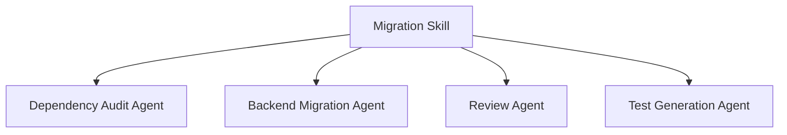
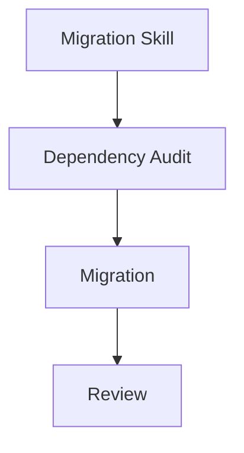

Claude Opus 4.8で発表された Dynamic Workflows が話題になっている。

ただ、最初に見たときは正直、

> 「前からsubagent + skillsでやっていたよね？」

という感想だった。

Claude Codeを普段使っている人なら、

- migration skill
- review agent
- dependency audit agent
- test generation agent

などを組み合わせて、役割分担するのは普通だったと思う。

なので最初は、

> 「multi-agent化しただけでは？」

という認識だった。

---

# 従来でもworkflowは組めていた

例えばrepository全体のmigrationをするときでも、



のようなworkflowを組んでいる人は多かったと思う。

つまり、「workflowが存在しなかった」わけではない。

---

# 従来の問題

問題は、workflow設計責務が人間側にあったこと。

例えば、

- どのsubagentを使うか
- reviewをどこで入れるか
- workflowをどう分割するか
- contextをどう切るか

を、人間が設計していた。

特に大規模repositoryになるほど、workflow自体の設計・維持コストが大きくなっていた。

---

# 実際のClaude Codeでの使い方

まずClaude Codeで、

```bash
/effort ultracode
```

を実行する。

これで、大規模タスク時にDynamic Workflowsを積極利用するモードになる。

---

# 従来の使い方

例えば以前なら、

Spring Boot migration skill

を自分で作り、その中で、

- dependency audit
- migration
- review
- test fix

などを明示的に組み合わせていた。

つまり、workflow設計者は人間だった。

---

# Dynamic Workflowsを使う場合

現在は、migration task自体をClaudeへ渡す。

例えば、

```text
Spring Boot 2.x → 3.x migrationをしたい。

まず repository 全体を確認して、
breaking changes と dependency 更新方針を整理して。

javax → jakarta の影響範囲を洗い出し、
PR分割案を提案して。

その後 backend 側から進めて、
テスト修正まで対応して。
```

のように依頼する。

---

# 従来との違い

以前なら、

- migration skill
- dependency audit subagent
- review workflow

などを、人間側で明示的に組み合わせる必要があった。

Dynamic Workflowsでは、migration task自体をClaudeへ渡すと、Claude側が必要なworkflowを組み立てながら進める。

例えば同じmigrationでも、

- dependency問題が中心
- CI問題が中心
- frontend影響が大きい
- backend変更が中心

など、repository状況によって必要なworkflowは変わる。

以前は、それを人間側でworkflow化していた。

Dynamic Workflowsでは、そのworkflow設計責務自体をClaude側へ寄せ始めている。

---

## なぜ「Dynamic Workflows」なのか

この「Dynamic」は、単にsubagentが増えたという意味ではなさそうだった。

以前のskills/subagent運用は、



のように、workflowを固定設計していた。

一方Dynamic Workflowsでは、

- repository構造
- dependency状況
- CI構成
- frontend/backend比率

などによって、workflow構成そのものを変えながら進める方向へ寄っている。

その意味で、今回の「Dynamic」は、workflowが実行時に変化する、という意味合いが強そうだった。

---

# 実際に触って認識が変わった

最初は、

> 「前からsubagentでやっていたよね？」

と思っていた。

ただ実際に触ると、変わっていたのはsubagent機能そのものではなく、workflow設計責務だった。

以前は、人間がworkflow設計者だった。

Dynamic Workflowsでは、その一部をClaude側へ委譲し始めている。

この視点で見ると、最初に感じていた違和感もかなり整理できた。

---

# どういうタスクで効果が出るのか

小規模修正では差分は小さい。

例えば、nullチェック追加程度なら従来と大差ない。

一方、かなり相性が良いのは、

- Spring Boot migration
- Java version upgrade
- dependency更新
- bug sweep
- 大規模refactor
- architecture review

のような、workflow設計が必要なタスクだった。
