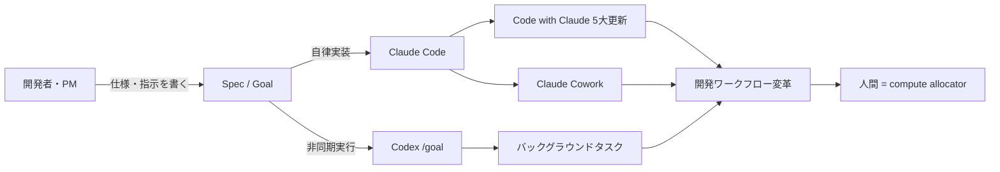
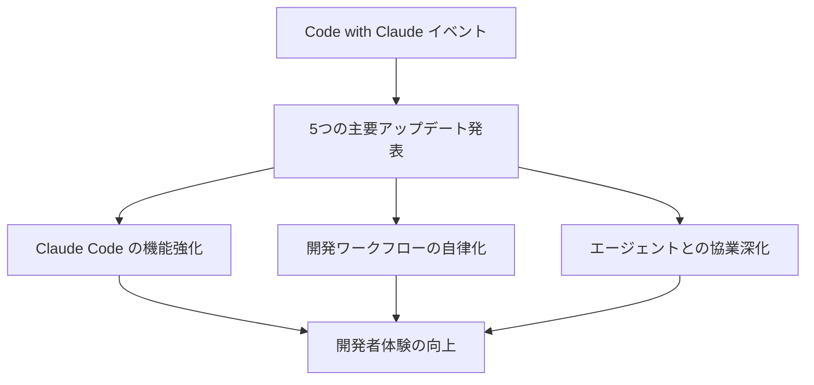
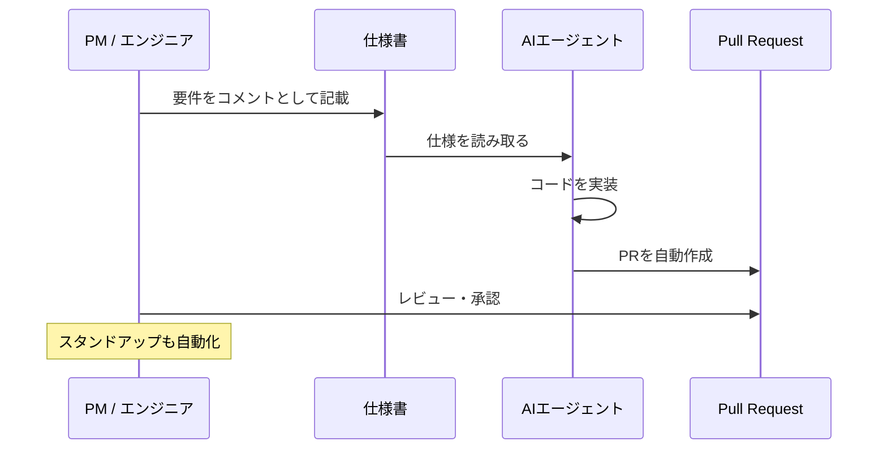

## はじめに

2026年5月末、AIコーディングツールの最前線で注目すべき発表が相次ぎました。Lenny's Newsletterで取り上げられた記事群から、開発者・PMにとって特に重要な情報を整理してお届けします。

今回の主なトピックは以下のとおりです：

- **Claude Opus 4.8** のリリースと初期評価
- **Code with Claude イベント**で発表された5つの主要アップデート
- **OpenAI Codex の `/goal` 機能**による非同期エージェント活用法
- AnthropicエンジニアによるClaude / Claude Coworkの実践事例
- 「HTMLは新しいMarkdown」というAI時代の開発哲学の転換
- Notionのスペックファースト（仕様駆動）開発ワークフロー

> **📌 影響を受ける人**
> - Claude Code / Claude を業務で使う開発者・エンジニア
> - AI駆動開発を導入中・検討中のチーム・PM
> - OpenAI Codex を利用しているエンジニア
> - AI時代のキャリアを考えているプロダクトビルダー

---

## 変更の全体像

複数のアップデートに共通するのは「AIエージェントが実装を担い、人間は設計・判断に集中する」という方向性です。Claude（Anthropic）とCodex（OpenAI）の両陣営でこの動きが加速しています。



「コンピュート割当者（compute allocator）」——Anthropicのエンジニアが使ったこの言葉は、AI時代の開発者の新しい役割を端的に表しています。

---

## 変更内容

### 1. Claude Opus 4.8 — 最新旗艦モデルの第一印象

**severity: high**

AnthropicのClaude Opus 4.8がリリースされました。Lenny's Newsletterでは実際に使用した著者の第一印象が公開されており、優れている点と期待に届かない部分の両面が率直にレビューされています。

| 評価軸 | 傾向 |
|---|---|
| 推論・思考力 | 旗艦モデルにふさわしい高水準 |
| Claude Codeとの連携 | 開発ワークフローで真価を発揮 |
| 総合印象 | 実用的だが「圧倒的に革命的」とまでは言い切れない面も |

> **💡 Tips**
> Opus 4.8 はAnthropicの最上位モデルです。コスト効率重視なら Sonnet 4.6、レスポンス速度重視なら Haiku 4.5 との使い分けを検討しましょう。API経由で利用する場合のモデルIDは `claude-opus-4-8` です。

---

### 2. Code with Claude — 5つの最大アップデート

**severity: high**

AnthropicがCode with Claudeイベントで開発者向けの5つの主要アップデートを発表しました。いずれも「Claude Codeを単なる補完ツールから、自律的な開発エージェントへ」という方向性で統一されており、AIコーディング支援の新たな可能性を示しています。



> **💡 Tips**
> Code with Claudeで発表されたアップデートは、Claude Codeを日常的に使っている開発者に最も大きな影響をもたらします。各アップデートの詳細は公式チャンネルで順次公開されていますので、Claude Codeユーザーは要チェックです。

---

### 3. Claude Cowork — AnthropicエンジニアFelix Riesebergの実践事例

**severity: medium**

Claude Coworkを開発したAnthropicエンジニア Felix Rieseberg が、Claudeを使った驚くべき実践例を公開しています。

**実演された3つの活用事例：**

| ユースケース | 概要 |
|---|---|
| 間取り図 → 3Dウォークスルー | フロアプランの画像からClaude Codeを使って3Dで内覧できるウォークスルーアプリを構築 |
| 約束の自動追跡 | 会話や文書中の「約束・コミットメント」をClaudeが自動で検出・追跡するシステム |
| 20ドルのハードウェア「buddy」 | 20ドル分のハードウェアを使って物理的なバディデバイスを制作。AIとフィジカルの融合 |

> **📌 注目ポイント**
> これらはいずれも「特定の専門スキルがなくても、AIと組み合わせることで実現できる」プロジェクトです。Felix氏が示しているのは「Claudeは道具ではなく共同制作者」という開発スタイルです。

---

### 4. OpenAI Codex の `/goal` 機能 — 眠っている間も動くエージェント

**severity: medium**

OpenAI Codexの `/goal` 機能は、エージェントが非同期でタスクを実行する仕組みです。指示を出してその場を離れても、エージェントが自律的に作業を続けます。

#### /goal を効果的に書くための6パートフレームワーク


| # | 要素 | 役割 |
|---|---|---|
| 1 | 目標 | 「何を」達成したいか |
| 2 | コンテキスト | 背景・前提・既存コードの情報 |
| 3 | 制約条件 | やってはいけないこと・触れてはいけないファイル |
| 4 | 出力形式 | 成果物の形（ファイル名、PR、コメントなど） |
| 5 | 品質基準 | 「良い」とみなす基準（カバレッジ、テスト通過など） |
| 6 | 完了条件 | エージェントが「完了」と判断する明確なサイン |

#### 3つの実用ユースケース

```mermaid
graph TD
    A[/goal で指示を出す] --> B[ユースケース1: 夜間バッチ処理]
    A --> C[ユースケース2: 並列タスク割当]
    A --> D[ユースケース3: 大規模リファクタリング]
    B --> E[翌朝に結果を確認]
    C --> F[複数エージェントが同時進行]
    D --> G[長時間処理を人間不在で完了]
```

---

### 5. HTMLは新しいMarkdown — 開発哲学の転換

**severity: medium**

AnthropicのClaude Codeエンジニア Thariq Shihipar が提唱するのは「HTMLがMarkdownの後継となる」という考え方です。

**背景にある考え方：**

- Claude CodeなどのAIが、静的なMarkdownドキュメントの代わりに**インタラクティブなマイクロアプリ**を生成できるようになった
- 仕様書やドキュメントも「読むもの」から「動くもの（生きたデザインシステム）」へ変化している
- 開発者は「コードを書く人」から「コンピュート（AIリソース）を割り当てる人」へ変化する

#### Before / After: ドキュメントの進化

**Before（Markdown時代）**
```markdown
# ユーザー登録API

## エンドポイント
POST /api/users

## リクエストパラメータ
- email: string（必須）
- password: string（必須、8文字以上）

## レスポンス
201 Created / 400 Bad Request
```

**After（HTML/マイクロアプリ時代）**
```html
<!-- Claude Codeが生成するインタラクティブな仕様書 -->
<!-- フォームで実際にAPIを叩いて動作確認できる -->
<api-playground endpoint="/api/users" method="POST">
  <field name="email" type="email" required />
  <field name="password" type="password" minlength="8" />
  <live-response />
</api-playground>
```

静的なテキストからそのまま動かして確認できる仕様書へ——これがAnthropicエンジニアの実践する「生きたデザインシステム」です。

---

### 6. Notionの仕様駆動開発 — 1コメントでPRが生まれる

**severity: medium**

NotionのRyan Nystromが実演した「スペックファースト（仕様駆動）開発」は、AIエージェント時代の開発ワークフローの一つの理想形を示しています。



**Notionの実践ポイント：**

| 従来のワークフロー | 仕様駆動ワークフロー |
|---|---|
| エンジニアが実装の詳細を考える | 仕様書へのコメント1つでPR生成 |
| スタンドアップで手動進捗報告 | スタンドアップを自動化 |
| コードレビューが主要なQAポイント | 仕様レビューが主要なQAポイント |
| 人間が実装を管理 | エージェントが実装、人間は思考に専念 |

---

### 7. AIのパラドックス — 自動化が増えるほど人が必要になる

**severity: medium**

Dan Shipperの論考「AIパラドックス」は、多くのPM・エンジニア・デザイナーのキャリアに関わる重要な視点を提供しています。

**核心的な主張：**

- ほとんどの仕事はCodexやClaude Codeの「内部で」行われるようになる
- しかし、**各エージェントには人間の監督と判断が必要**になる
- 結果として、PMとデザイナーの役割・需要は増加する
- CLI時代は終わり、AIエージェントが主役の開発環境へ移行する

> **💡 Tips**
> 「AIが仕事を奪う」という単純な議論より、「AIによって人間の役割がどう変わるか」に目を向けることが重要です。特にPM・デザイナーは「AIが何を作るべきか」を定義する役割としてむしろ需要が高まります。

---

### 8. Claude Code の料金A/Bテスト

**severity: medium / type: pricing**

コミュニティの議論の中で、Claude Codeが料金プランのA/Bテストを実施したという話題が上がっています。

> **⚠️ 注意**
> 現時点では料金プランの正式変更はアナウンスされていませんが、A/Bテストの実施は将来的な価格改定の可能性を示唆します。Claude Codeを業務利用しているチームは料金動向を継続的にウォッチしてください。

---

## 影響と対応

```mermaid
flowchart TD
    A[あなたの状況は?] --> B{現在のAIツール利用状況}
    B -->|Claude Code ユーザー| C[Code with Claude 5大更新を確認・試用]
    B -->|Codex ユーザー| D[/goal の6パートFWを習得]
    B -->|まだ未導入| E[Claude Code または Codex から試す]
    C --> F[Opus 4.8 へのアップグレードを検討]
    D --> G[バックグラウンドタスクを設定してみる]
    E --> H[スペックファースト開発を小さく始める]
```

| 対象者 | 推奨アクション | 優先度 |
|---|---|---|
| Claude Code ユーザー | Code with Claude 5大アップデートの内容を確認・試用する | 高 |
| Codex ユーザー | `/goal` の6パートフレームワークで非同期タスクを設定する | 高 |
| Claude Opus ユーザー | Opus 4.8 の実力評価を確認し、モデルの使い分けを見直す | 中 |
| PM・デザイナー | 仕様駆動開発のワークフローを自チームで試験導入する | 中 |
| Claude Code 料金担当 | A/Bテストの動向をウォッチし、料金プラン変更に備える | 中 |

---

## コード例

### Codex `/goal` の記述例（6パートフレームワーク）

```text
/goal
目標: src/api/users.py のユニットテストを新規作成する
コンテキスト: FastAPI製REST API。既存テストは tests/ に pytest 形式で格納されている。認証はJWT。
制約: 既存のテストファイルを変更しない。外部APIコールはモックする。
出力形式: tests/test_users.py を新規作成してPRを作成する。
品質基準: カバレッジ80%以上。空リスト・無効トークン・レート制限などのエッジケースを含む。
完了条件: pytest tests/test_users.py がエラーなく全件パスすること。
```

### Claude Code でのスペックファースト開発

```markdown
<!-- feature-spec.md -->
# ユーザーパスワードリセット機能

## 要件
- メールアドレスでリセットリンクを送信
- リンクの有効期限: 24時間
- 使用済みトークンは無効化

## 実装方針
- エンドポイント: POST /api/auth/reset-password
- トークン保存: Redis（TTL: 86400秒）

<!-- @claude: この仕様に基づいてPRを作成してください。テストも含めること。 -->
```

Claude Codeはこのコメントを読み取り、実装からPR作成までを自律的に進めます。

---

## まとめ

今回のLenny's Newsletter記事群から浮かび上がるのは、**「AIがコードを書き、人間がビジョンと判断を担う時代」の本格的な到来**です。

| トピック | ポイント |
|---|---|
| Claude Opus 4.8 | Anthropicの新旗艦モデル。実用的だが使い分けが鍵 |
| Code with Claude 5大更新 | 開発ワークフローを変えるAnthropicの注力機能群 |
| Codex `/goal` 機能 | 6パートFWで非同期エージェントを自在に活用 |
| Claude Cowork実践 | 間取り→3D・約束追跡・$20バディなど創造的活用事例 |
| HTML is new Markdown | 静的ドキュメントからインタラクティブな仕様書へ |
| 仕様駆動開発（Notion） | 1コメントでPR生成、人間は思考に専念 |
| AIパラドックス | 自動化が進むほどPM・デザイナーへの需要は増加 |

最も重要なのは「どのAIツールを選ぶか」ではなく、**「AIを活用したワークフロー全体をどう設計するか」**です。今すぐ `/goal` を試したり、スペックファースト開発を小さく始めてみることが、AI時代に先行する第一歩になるでしょう。
