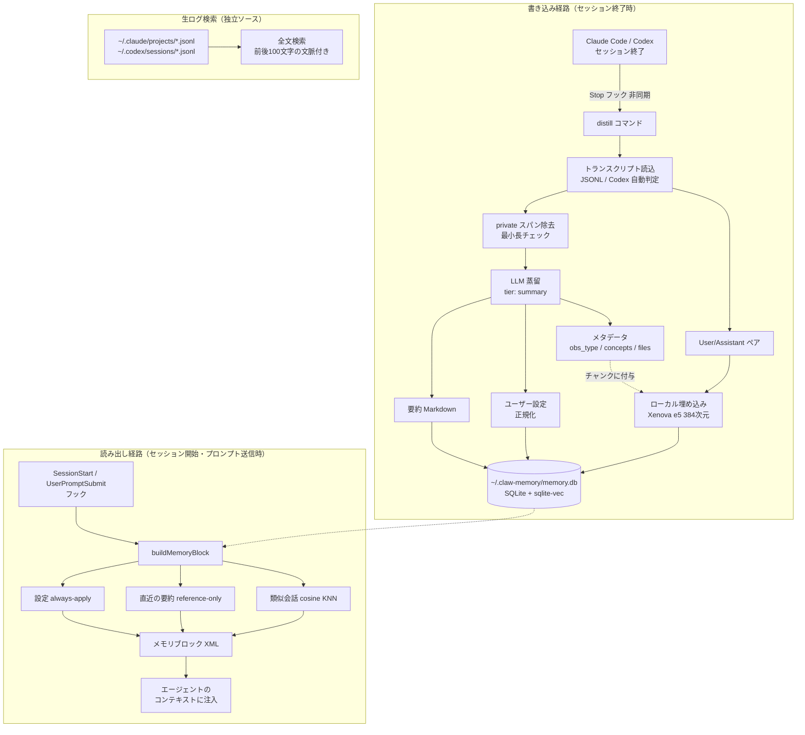
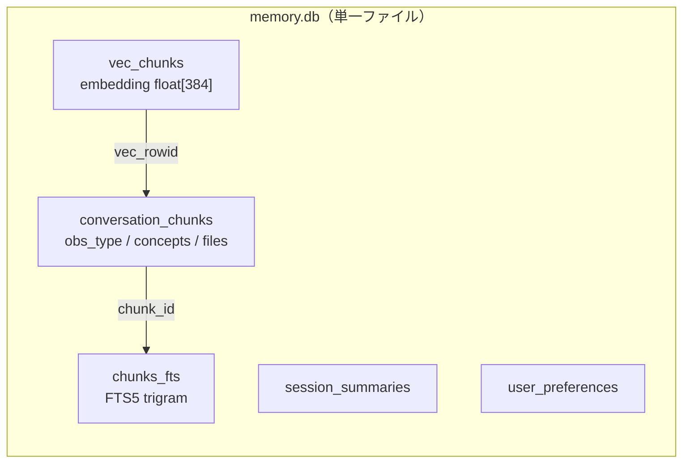

Claude Code には 2026年2月から Auto Memory が標準搭載され、デフォルトで有効になりました。`MEMORY.md` にエージェントが自分でメモを書き溜め、次のセッションで読み込んでくれます。「セッションをまたぐと全部忘れる」という時代は、ひとまず終わりつつあります。

では、もう長期メモリのツールは要らないのでしょうか。私はしばらく Auto Memory を使ってみて、ひとつの限界に気づきました。**履歴が増えるほど、標準メモリは「いま関係する過去」を出しにくくなる**という点です。

Auto Memory が毎回ロードするのは `MEMORY.md` の先頭200行（または25KB）までです。プロジェクトが育つほど、過去の重要なやり取りはこの天井の外へ押し出され、エージェントが「そのファイルを読みに行こう」と判断したときだけ参照されます。判断を外せば、その記憶は事実上ないのと同じです。常時使える記憶の総量が、コンテキストの天井で頭打ちになるわけです。

この「記憶の総量」と「コンテキスト消費」を切り離したくて、`claw-memory` というローカル完結型の長期メモリプラグインを作りました。発想は RAG（検索拡張生成）に近く、過去の全会話を埋め込みでベクトル化しておき、いまのプロンプトに意味的に近いものだけを引いて注入します。母数がいくら増えても、常時ロードは増えません。

本記事では、その仕組みをアーキテクチャレベルで詳しく解説します。実際に手を動かして試せるように、リポジトリとインストール手順も載せています。

- GitHub: https://github.com/nogataka/claw-memory
- npm: https://www.npmjs.com/package/@nogataka/claw-memory

:::note info
この記事は claw-memory v0.1.x 時点の実装をもとにしています。プレリリース段階のため、今後インターフェースが変わる可能性があります。最新情報はリポジトリをご確認ください。
:::

## claw-memory とは何か

一言でいうと、AIコーディングエージェント（Claude Code と Codex）に長期記憶を持たせる MCP サーバーです。設計上のこだわりは「ローカル完結」に置きました。

- 常駐デーモンが不要です。
- Python ランタイムが不要です。
- 外部のベクトルDB（Pinecone や Weaviate 等）が不要です。
- データはマシンの外に出ません。例外はセッションを要約する LLM 呼び出しだけで、これも利用者が選べます。

動作環境は Node.js 20 以上です。記憶の保存先は `~/.claw-memory/memory.db` という1つの SQLite ファイルにまとまっており、ベクトルもこの中に格納します。

### 解決したかったこと

AIエージェントの「記憶」を実現する方法はいくつかあります。たとえば `CLAUDE.md` のような設定ファイルに手で書き溜める方法もありますし、外部のベクトルDBサービスに会話を蓄積する方法もあります。それぞれに利点があり、claw-memory のやり方が常に最適だと主張するつもりはありません。

ただ、私の場合は次の点を重視しました。

- 設定ファイルの手動メンテナンスは続かないので、セッションから自動で記憶を抽出したい。
- 業務コードを扱うことが多く、会話内容を外部サービスに送りたくない。
- セットアップで Docker や Python 環境を要求されると、複数マシンへの導入が面倒になる。

この3点を満たそうとした結果、「ローカルの SQLite に全部入れる」「埋め込み計算もローカルで完結させる」「外に出すのは要約のための LLM 呼び出しだけ」という設計に落ち着きました。

## Auto Memory（標準機能）との違い

Auto Memory がデフォルトで動く今、一番気になるのは「標準機能で足りないのか」という点だと思います。結論を先に書くと、claw-memory は Auto Memory を置き換えるものではなく、Auto Memory が原理的に苦手な領域を埋めるものだと考えています。

両者の設計を並べると、記憶の「引き出し方」が根本的に違います。

| 観点 | Auto Memory（標準） | claw-memory |
|------|---------------------|-------------|
| 想起の方式 | `MEMORY.md` 先頭200行/25KB を毎回ロード（固定インデックス） | プロンプトごとに意味の近い会話を検索して注入（RAG型） |
| スケール | 常時使える記憶が天井で頭打ち | 母数が増えても常時ロードは増えない |
| 検索 | 構造なしMarkdownを丸ごと参照 | type / 概念 / ファイル / 日付でフィルタ可能 |
| 対象エージェント | Claude Code のみ | Claude Code と Codex の両方 |
| 導入前の履歴 | 対象外 | 生ログ全文検索で遡れる |

ここでは、私が実際に「標準だけだと厳しい」と感じた場面を、具体例で訴求します。

### 例1：3か月前のバグ知見を、天井を越えて引っ張り出す

これが claw-memory の一番大きな価値だと考えている部分です。

ある日、`ECONNRESET` が SSE 接続で散発するバグを時間をかけて直したとします。原因は「プロキシのアイドルタイムアウト」で、解決は「ハートビート送出」でした。Auto Memory はこれを `MEMORY.md` かトピックファイルに記録します。

3か月後、似た症状にまた遭遇します。このときの挙動の差が分かれ目です。

- Auto Memory: その知見が `MEMORY.md` 先頭200行に残っていれば拾えます。ただし3か月分のメモに押し出されてトピックファイル側へ移っていれば、エージェントが「そのファイルを開こう」と判断しない限り参照されません。公式ドキュメントでは、`MEMORY.md` の固定ロードとトピックファイルのオンデマンド読み込みが説明されており、いまのプロンプトとの意味的な近さで並べ替える索引については触れられていないためです。
- claw-memory: いまの症状（`ECONNRESET` + SSE）の埋め込みと近いチャンクが、母数に関係なく上位に来ます。蓄積が半年分でも1年分でも、引ける関連度は劣化しません。

```text
（プロンプト）SSEで時々コネクションが切れるんだけど原因分かる？
↓ claw-memory が cosine 近傍で過去会話を注入
<relevant-past-conversations instruction="reference-only">
  - [2026-03-12] User: SSEがECONNRESETで切れる
    Assistant: プロキシのアイドルタイムアウト。15秒ごとのハートビートで解消
</relevant-past-conversations>
```

「記憶の総量」と「コンテキスト消費」が切り離されている、というのはこういう意味です。

### 例2：「バグ修正の会話だけ」を構造で絞り込む

claw-memory は蒸留時に各会話へ観測タイプ（`bugfix` / `feature` / `decision` など）と概念キーワード、参照・編集ファイルをメタデータとして付けています。

そのため `memory_search` で、こうした絞り込みができます。

```text
memory_search(query="認証まわり", type="bugfix", file="src/auth/")
→ 認証まわりの「バグ修正」だけ、しかも src/auth/ を触った会話に限定
```

Auto Memory のトピックファイルは非構造のMarkdownなので、「過去のうち決定事項（decision）だけ」「特定ファイルを触った会話だけ」という機械的な絞り込みは効きません。しかも `memory_search` はまず id とタイトルと日付だけの軽い索引を返し、本当に要るものだけ `memory_get` で本文を引くので、コンテキストの消費も最小限に抑えられます。

### 例3：Codex で解決した話を、Claude Code 側で思い出す

Auto Memory は Claude Code 専用で、リポジトリ単位です。私は同じプロジェクトを Claude Code と Codex で行き来することがあり、ここが地味に困っていました。

claw-memory は両方のセッションを同じ `memory.db` に蒸留するので、記憶がエージェントをまたぎます。

- 昨日 Codex で「このAPIのレート制限は429リトライ＋指数バックオフで対応」と決めた。
- 今日 Claude Code で同じAPIを触る → その決定が `memory_recall` で出てくる。

「どっちのエージェントで話したか」を覚えておく必要がなくなります。

### 例4：claw-memory を入れる前の会話まで遡る

`memory_search_logs` は `~/.claude/projects` と `~/.codex/sessions` の原本ログを直接全文検索します。蒸留していないセッションも、claw-memory を導入する前の履歴も対象です。

```text
memory_search_logs(query="Stripeのwebhook署名検証", sources=["claude-code","codex"])
→ 過去どこかで話した webhook 検証の実装を、前後100文字の文脈付きで列挙
```

「いつか話した気がするけど、どのセッションか思い出せない」を救うのがこの機能です。Auto Memory は記録したメモが対象で、原本ログを遡る検索ではありません。

### 重複する部分は正直に

一方で、「会話から自動で記憶を取る」という自動キャプチャ自体は、もはや claw-memory 固有ではありません。Auto Memory もデフォルトで設定やパターンを自動記録します。ここは機能が重なります。

そのため私は、両者を競合ではなく**役割分担**で捉えるのがよいと考えています。

- 明示ルールや常時効かせたい指示 → `CLAUDE.md`（人間が書く）
- 軽量な「最近の学び」の常時ロード → Auto Memory（標準）
- 履歴が増えても効く関連度検索・横断検索・原本検索 → claw-memory

両方を有効にする場合、注入が二重になってコンテキストを圧迫しないか、という観点だけは意識しておくと安全です。

## 2つの独立した記憶ソース

claw-memory には性質の異なる2つの記憶ソースがあります。これを分けている点が設計上のポイントです。

| ソース | 中身 | 対応ツール |
|--------|------|-----------|
| 蒸留DB（Distilled DB） | LLMで要約したセッション。要約・ユーザー設定・メタデータ付きの会話チャンクを保持し、セマンティック検索が可能 | `memory_recall`, `memory_search`, `memory_get` |
| 生ログ検索（Raw transcript search） | `~/.claude/projects` と `~/.codex/sessions` にある実際のログを全文検索。蒸留していないセッションも対象 | `memory_search_logs` |

蒸留DBは「整理された速い記憶」です。一方の生ログ検索は「保険」の位置づけで、claw-memory を入れる前の会話も含めて、原本ログが残っているものを大小文字無視の部分一致で全文検索できます（巨大なログファイルは対象外になります）。

両者を分けた理由は単純で、蒸留には LLM 呼び出しのコストがかかるため、すべてのセッションを完璧に蒸留できるとは限らないからです。蒸留が漏れても、生ログという原本が手元に残っていれば取りこぼしを拾えます。この「キュレーションされた索引」と「全文grep可能な原本」の二段構えが、実用上の安心感につながっています。

## 全体アーキテクチャ

まず全体像を図で示します。書き込み（記憶を作る）と読み出し（記憶を使う）の2つの経路、そして独立した生ログ検索の経路に分かれます。



各コンポーネントの実装は TypeScript で、ソースは `src/` 配下にまとまっています。役割ごとにファイルが分かれており、主要なものは次の通りです。

| ファイル | 役割 |
|---------|------|
| `src/cli.ts` | エントリポイント。全サブコマンドの定義 |
| `src/mcp/server.ts` | MCP サーバー本体。8つのツールを公開 |
| `src/core/distill.ts` | セッション蒸留パイプライン |
| `src/core/recall.ts` | 記憶ブロックの組み立て |
| `src/core/db.ts` | SQLite 初期化とスキーマ定義 |
| `src/core/vector-memory.ts` | ベクトルテーブルとFTS5の操作 |
| `src/core/embeddings.ts` | ローカル埋め込み（Xenova e5） |
| `src/core/llm.ts` / `providers.ts` | プラグ可能なLLM抽象化 |
| `src/core/logsearch/` | 生ログの全文検索 |
| `src/core/hooks.ts` | ライフサイクルフックの処理 |
| `src/ui/server.ts` / `page.ts` | 読み取り専用のWebビューア |

以降、データフローに沿って中身を見ていきます。

## 書き込み経路：セッションの蒸留

### きっかけはフック

セッションが終わると、Claude Code は `Stop` フックを呼びます。claw-memory はここで蒸留処理を起動しますが、ユーザーの操作をブロックしないよう非同期にしている点が工夫です。

具体的には、`src/core/hooks.ts` の処理が `spawn` で子プロセスを切り離し（detached、`stdio: ignore`）、バックグラウンドで蒸留を走らせます。利用者から見ると、セッションを閉じた瞬間に裏側で記憶が作られていく形になります。

無駄打ちを避ける仕組みも入れています。`distill_watermarks` テーブルにトランスクリプトの更新時刻（mtime）を記録し、内容に変化がなければ蒸留をスキップします（`--if-stale`）。これにより蒸留は増分的（incremental）に動き、同じセッションを二重に処理しません。

### 蒸留パイプラインの中身

蒸留の本体は `src/core/distill.ts` です。処理は大きく4段階に分かれます。

1. 前処理
   - `<private>…</private>` で囲まれた部分を除去します（`src/core/private.ts`）。これは保存にもLLM送信にも乗りません。
   - メッセージ数が2未満、または本文が100文字未満のセッションはノイズとみなして弾きます。
2. LLM蒸留（tier: `summary`）
   - 1回のLLM呼び出しで、要約・観測タイプ・概念キーワード・参照/編集ファイル・検出した設定をまとめて抽出します。
3. 保存（要約・設定）
   - 要約は `addSessionSummary()`、設定は `setPreference()` で、それぞれのテーブルに先に保存します（upsert）。これらは埋め込みを経由しません。
4. ベクトル化とチャンク保存
   - User/Assistant のペアごとにローカルで埋め込みを計算します。観測タイプ・概念・ファイル等のメタデータは、このチャンクに付与されます。
   - `chunkExists()` で既存チャンクとの重複を判定し、同じ内容はスキップします。
   - チャンクの書き込み（`vec_chunks` + `conversation_chunks` + `chunks_fts`）は1つのトランザクションでまとめて行い、3者の整合を保ちます。要約・設定の保存はこのトランザクションの外です。

LLMが返す構造は次のような内容です。要約は決め打ちの見出し構成にして、後から読みやすくしています。

```text
summary:        構造化Markdown（### 依頼 / 調査・判明 / 完了 / 次の一手）
obs_type:       discovery | bugfix | feature | decision | change | other
concepts:       技術キーワードの配列（3〜8個）
files_read:     参照したファイルパス
files_modified: 作成・編集したファイルパス
preferences:    検出したユーザー設定
```

`obs_type`（観測タイプ）と `concepts`（概念）を付けているのは、後段の検索でフィルタをかけられるようにするためです。「バグ修正の会話だけ」「特定の概念を含む会話だけ」といった絞り込みが効くようになります。

### 設定の正規化

ユーザー設定は表記揺れが激しい部分です。「言語」「lang」「preferred_language」はすべて同じ意味を指します。そこで `src/core/memory.ts` に正規キーとエイリアスの対応表を持たせ、検出した設定を正規化してから保存しています。

```typescript
CANONICAL_PREFERENCE_KEYS = [
  "language", "response_style", "detail_level",
  "code_style", "framework", "tone", "tools"
]

KEY_ALIASES = {
  preferred_language: "language",
  lang: "language",
  言語: "language",
  response_format: "response_style",
  回答スタイル: "response_style",
  // ...多言語のエイリアス
}
```

これにより、複数セッションで微妙に異なる表現で設定が検出されても、同じキーに集約されます。

## ストレージ：1つの SQLite に全部入れる

claw-memory のデータは `~/.claw-memory/memory.db` という単一の SQLite ファイルに集約されます。スキーマは `src/core/db.ts` で定義しており、主なテーブルは次の通りです。

```sql
projects             -- プロジェクトのマスタ
session_summaries    -- セッション要約（構造化Markdown）
user_preferences     -- ユーザー設定（正規化済み）
conversation_chunks  -- 会話チャンク本体 + メタデータ + 論理削除フラグ
vec_chunks           -- sqlite-vec の仮想テーブル（384次元ベクトル）
chunks_fts           -- FTS5 全文索引（trigram、日本語対応）
distill_watermarks   -- 増分蒸留用のタイムスタンプ
app_config           -- 汎用設定
```

ベクトルを別サービスに置かず SQLite の中に入れられるのは、`sqlite-vec` という拡張のおかげです。`vec_chunks` は `vec0` 仮想テーブルとして定義され、cosine 距離でのKNN（最近傍探索）をSQLだけで実行できます。



ベクトル・メタデータ・全文索引を分けつつ ID で連携させることで、「意味で探す」「キーワードで探す」「タイプや日付で絞る」を組み合わせられる構造にしています。

同時アクセスへの配慮も入れています。SQLite は WAL モードで開き、`busy_timeout` を設定しているため、MCPサーバーとWebビューアが同時に読み書きしても破綻しません。

## 埋め込みをローカルで完結させる

セマンティック検索には埋め込み（ベクトル化）が要りますが、ここを外部APIに頼ると「データが外に出ない」という設計が崩れます。そこで `@xenova/transformers` を使い、`Xenova/multilingual-e5-small`（384次元、多言語対応）をローカルで動かしています。実装は `src/core/embeddings.ts` です。

e5 系モデルの作法に従い、用途で接頭辞を分けています。

- 保存する文章: `passage: ` を前置（`embedPassage()`）
- 検索クエリ: `query: ` を前置（`embedQuery()`）

モデルは初回の蒸留時に約100MBがダウンロードされ、`~/.cache` 配下にキャッシュされます。一度落とせばオフラインで動きます。ロードは遅延初期化で、プロセス起動時ではなく最初に埋め込みを計算するタイミングで1回だけ走ります。以降は同じプロセス内で使い回すため、2回目以降は高速です。

:::note info
多言語モデルを選んだのは、日本語と英語が混在する私の会話ログでも検索精度を保ちたかったためです。英語専用モデルのほうが軽量な場面もあるので、用途次第で選択肢は変わると思います。
:::

## ハイブリッド検索

検索は `src/core/search.ts` で実装しており、セマンティック検索とキーワード検索を組み合わせます。

1. セマンティック: `vec_chunks` 上で cosine KNN を実行します（プロジェクトIDやメタデータでWHERE絞り込み）。
2. キーワード: FTS5 の trigram マッチを併用します。意味が近くなくても、固有名詞やエラーメッセージのような「単語そのもの」で当てたいケースを拾います。
3. 統合: 両者の結果をID単位で重複排除し、距離順に並べます。

ベクトル検索だけだと、型名やコマンド名のような短い固有表現を取りこぼすことがあります。逆にキーワード検索だけだと言い換えに弱いです。両者を足し合わせることで、実運用での取りこぼしを減らしています。

セマンティックヒットの厳しさは `MEMORY_SIMILARITY_MAX_DISTANCE`（cosine距離の上限）で調整できます。値を小さくするほど厳格になります。

## 読み出し経路：記憶の自動注入

### フックでコンテキストに差し込む

記憶は使われて初めて意味を持ちます。claw-memory は `SessionStart` と `UserPromptSubmit` のフックで `src/core/recall.ts` の `buildMemoryBlock()` を呼び、結果を標準出力に書き出します。この出力がエージェントのコンテキストに挿入される仕組みです。

注入されるブロックは XML 形式で、性質の違う2種類を明確に分けています。

```xml
<user-preferences instruction="always-apply">
  以下のユーザー設定は常に従ってください。
  - language: Japanese
  - response_style: detailed
</user-preferences>

<memory-context instruction="reference-only">
  <previous-session-summaries>
    - 直近セッションの要約...
  </previous-session-summaries>
  <relevant-past-conversations>
    - [日付] User: ... Assistant: ...
  </relevant-past-conversations>
</memory-context>
```

ポイントは `instruction` 属性です。設定は `always-apply`（常に従う）、過去の会話や要約は `reference-only`（参考にとどめ、そのまま復唱しない）と指示を分けています。すべてを「従うべき指示」として渡すと、エージェントが過去の会話を不自然にオウム返ししてしまうことがあるためです。背景知識と行動指示を区別することで、自然な振る舞いを狙っています。

### 関連度で絞る

注入する類似会話は無制限ではなく、`topK`（既定5件）と距離の上限で絞ります。プロジェクト単位で記憶を分離しているので、別プロジェクトの会話が混ざることもありません。これにより、コンテキストを圧迫せずに「効きそうな記憶だけ」を渡せます。

## MCPツール一覧

エージェントから明示的に呼べるツールは8つです。実装は `src/mcp/server.ts` にあります。

| ツール | 用途 |
|--------|------|
| `memory_recall(query, cwd?, topK?)` | すぐ読めるコンテキストブロックを返す。設定＋直近要約＋類似会話。タスク開始時に呼ぶ想定 |
| `memory_search(query, cwd?, limit?, type?, concept?, file?, dateFrom?, dateTo?)` | トークン軽量な索引（id＋タイトル＋日付＋type）。メタデータでフィルタ可能 |
| `memory_get(ids)` | 指定IDの本文とメタデータを取得 |
| `memory_remember(text, cwd?, sessionId?)` | フリーテキストのメモを永続保存 |
| `memory_distill(cwd?, sessionId? \| transcriptPath?)` | セッションを蒸留（LLMが必要。`sessionId` か `transcriptPath` のどちらかを指定） |
| `memory_get_preferences(cwd?)` | プロジェクトの設定を一覧 |
| `memory_search_logs(query, sources?, projectPath?, startDate?, endDate?, limit?, offset?)` | 生ログの全文検索 |
| `memory_forget(ids)` | チャンクを論理削除（検索・想起・ビューアから消える） |

`memory_search` と `memory_get` を分けているのは、トークン消費を抑える工夫です。まず軽い索引（IDとタイトルだけ）で候補を眺め、本当に必要なものだけ `memory_get` で本文を引きます。最初から全文を返さないことで、コンテキストの無駄遣いを避けています。

## プラグ可能な LLM バックエンド

蒸留にはLLMが必要ですが、ここを1社に固定したくありませんでした。`src/core/llm.ts` と `providers.ts` で抽象化し、環境変数 `CLAW_MEMORY_LLM_BACKEND` で4つから選べます。

| バックエンド | 認証 | 備考 |
|------------|------|------|
| `agent-sdk`（既定） | Claude CLI ログイン | APIキー不要。Pro/Max/Team/Enterprise のサブスクで動く |
| `codex-sdk` | Codex CLI ログイン | ChatGPT/Codex プラン。read-onlyで動作 |
| `anthropic` | `ANTHROPIC_API_KEY` | Messages API を直接叩く |
| `openai-compatible` | `CLAW_MEMORY_OPENAI_API_KEY` | Gemini / OpenRouter / LM Studio など |

APIキーを別途用意しなくても、すでにログイン済みの Claude や Codex のサブスクリプションをそのまま蒸留に使える点が、導入のハードルを下げていると思います。

蒸留は頻度が高い処理なので、tier ルーティング（`CLAW_MEMORY_TIER_SUMMARY` など）で安価なモデルに割り当てる、といった調整もできます。

### Agent SDK 利用時の落とし穴と対策

`agent-sdk` バックエンドには、実装上ハマった点があります。蒸留のためにエージェントを呼ぶと、それ自体が新しいセッションを生み、`Stop` フックがまた蒸留を呼ぶ……という無限再帰やフックの暴発が起こり得ます。

これを防ぐため、蒸留時のサブセッションは次の設定で隔離しています。

```typescript
settingSources: []                    // ~/.claude・プロジェクト設定を読み込まない（フック再入とビープ連発を防ぐ中心的措置）
permissionMode: "bypassPermissions"   // 権限プロンプトを出さない
maxTurns: 1, allowedTools: []         // ツールなしの単発呼び出し
```

再入を抑える中心は `settingSources: []` です。これを空にすることで、ユーザー自身のフック（たとえば Stop フックの効果音）や claw-memory 自身のフックが、蒸留のたびに生まれるサブセッションで発火するのを防ぎます。直近のコミットでも、この隔離が不十分だったために起きていたフックのビープ音連発を修正しました。自分自身を呼び出す構造を持つツールでは、こうした再入の制御が地味に効いてきます。

## 生ログ検索：蒸留の取りこぼしを拾う保険

蒸留DBとは独立した経路として、生ログの全文検索があります。実装は `src/core/logsearch/` 配下で、これは私が以前から使っていたログ横断検索ツールの考え方を移植したものです。

検索対象は次の2か所です。

```text
~/.claude/projects/*/*.jsonl    # Claude Code のトランスクリプト
~/.codex/sessions/**/*.jsonl    # Codex の rollout ログ
```

Claude Code と Codex ではログのJSON構造が異なるため、`parse.ts` でそれぞれのパーサーを持ち、`type` が `user` / `assistant` の発話だけを抽出します。ヒットした箇所には前後100文字の文脈を添えて返すので、検索結果だけで「何の話だったか」が大まかに分かります。

この経路の価値は、claw-memory をインストールする前の会話さえ検索できる点にあります。蒸留が走っていなくても、原本さえ残っていれば後から探せます。

## Webビューア

記憶の中身を目で確認したいときのために、読み取り専用のWebビューアを用意しています。`src/ui/server.ts` で実装しており、`hono` ベースの軽量サーバーです。

```bash
claw-memory ui --open        # http://localhost:4319
```

プロジェクト一覧、セッション要約、メタデータ付きの会話チャンク、設定を閲覧でき、生ログの全文検索もここから実行できます。

地味に便利なのが、Server-Sent Events（SSE）によるライブ更新です。SQLite の `PRAGMA data_version` を1.5秒間隔でポーリングし、別プロセスのMCPサーバーがDBを変更したことを検知すると、ビューアに更新イベントを送ります。エージェントが裏で記憶を書き込むそばから、ビューアの表示が変わっていく様子を眺められます。

なお、このビューアは起動したときだけ動きます。常駐プロセスは持たないので、見たいときに立ち上げる使い方になります。

## インストールガイド

ここからは実際に試す手順です。

### 前提条件

- Node.js 20 以上
- サブスク系LLMバックエンドを使う場合: ログイン済みの Claude Code CLI、または Codex CLI
- 初回の蒸留時に埋め込みモデル（約100MB）がダウンロードされます（`~/.cache` にキャッシュ）

### ステップ1：グローバルインストール

```bash
npm install -g @nogataka/claw-memory
```

グローバルに入れておくと、フックとMCPサーバーが即座に起動します。入れない場合は `npx -y @nogataka/claw-memory@latest` にフォールバックしますが、初回は遅くなります。

### ステップ2a：Claude Code（プラグイン、推奨）

Claude Code のプロンプトで次を実行します。

```text
/plugin marketplace add nogataka/claw-memory
/plugin install claw-memory
```

Claude Code を再起動すると、MCPサーバー（8ツール）とフック（`SessionStart` / `UserPromptSubmit` → 想起注入、`Stop` → 自動蒸留）が自動登録されます。手動設定は不要です。`/mcp` を実行して `claw-memory` が出れば成功です。

:::note info
プラグインを使わない場合は、`claw-memory install --claude-code` で `~/.claude/settings.json` にMCPサーバーとフックをマージできます。冪等で、変更前にファイルをバックアップします。
:::

### ステップ2b：Codex（プラグイン）

Codex も同じプラグイン形式に対応しています。`.codex-plugin/plugin.json` を同梱しているので、Codex プラグインとして入れると、MCPサーバーとライフサイクルフックの両方が設定されます。

```text
codex
/plugins
```

npm から入れた場合は、CLIで登録することもできます。

```bash
claw-memory install --codex
```

このコマンドは冪等に、`~/.codex/config.toml` へのMCPサーバー登録、`~/.codex/hooks.json` へのフックのマージ（既存フックは保持）、`memory-recall` スキルの設置、`AGENTS.md` への指示追記を行います。既存ファイルはバックアップされます。

過去のCodexセッションを後から取り込みたい場合は、次を使います。

```bash
claw-memory distill-codex --recent     # 直近セッションを蒸留（watermarkで重複排除）
claw-memory distill-codex --all        # 全件をバックフィル
```

### ステップ2c：ソースから（開発用）

```bash
git clone https://github.com/nogataka/claw-memory
cd claw-memory
npm install          # ネイティブの better-sqlite3 / sqlite-vec をビルド
npm run build        # tsc -> dist/
npm link             # 任意: claw-memory バイナリをPATHに通す
```

### 動作確認

インストール後、いつも通りにセッションを使い、終了します。しばらくして次でビューアを開くと、蒸留された記憶を確認できます。

```bash
claw-memory ui --open
```

プラグイン経由のみでインストールした場合は `claw-memory` バイナリがPATHにないため、`npx` 経由で起動してください。

```bash
npx @nogataka/claw-memory ui --open
```

## プライバシーと安全性

業務でも使うことを前提に、いくつか安全側に倒した設計を入れています。

- 完全ローカル: 保存と埋め込みはマシン内で完結します。外部に出るのは蒸留のLLM呼び出しだけで、どのバックエンドを使うかは利用者が選びます。
- `<private>…</private>`: この範囲は保存にもLLM送信にも乗りません。秘匿したい情報を会話中に囲んでおけます。
- `CLAW_MEMORY_EXCLUDED_PROJECTS`: 指定したパスは記録も想起もしません（カンマ/コロン区切り）。
- `memory_forget`: チャンクを論理削除します。検索・想起・ビューアから消えます。

機密情報を扱う場面では、除外パスの設定と `<private>` の併用をおすすめします。

## おわりに

claw-memory は「AIエージェントに記憶を持たせる」という課題に対して、ローカル完結という制約を自分に課して作ったツールです。SQLite に sqlite-vec を載せてベクトルまで1ファイルに収め、埋め込みもローカルで回し、外に出すのは要約のLLM呼び出しだけ、という構成に落ち着きました。

もちろん、この設計がすべての人に最適とは限りません。チームで記憶を共有したい場合はサーバー型のほうが向くでしょうし、超大規模なログにはより本格的なベクトルDBが必要になる場面もあると思います。それでも「個人の手元で完結する記憶」を求める方には、ひとつの選択肢になればと考えています。

実装はオープンソースで公開しています。気になった方はぜひ試してみてください。フィードバックや Issue も歓迎です。

- GitHub: https://github.com/nogataka/claw-memory
- npm: https://www.npmjs.com/package/@nogataka/claw-memory
