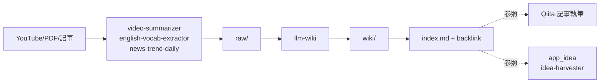

## 1. はじめに — Karpathy が示した「自分のための百科事典」

2026 年 4 月 3 日、Andrej Karpathy が X で約 1,500 語の Gist を公開しました。タイトルは "How I use LLMs to build my personal wiki"。**公開直後の 48 時間で 16M views 超**を記録した、いわゆる「自己更新型セカンドブレイン」のレシピです。

要約すると、彼の主張は次の通りです。

> 自分が触れた情報源（YouTube 動画、論文、本、議事録、ブログ記事）を **`raw/`** に放り込み、LLM エージェントが **`wiki/`** 配下に **構造化された百科事典ページ**（バックリンク・サマリ・関連ノート付き）を書き出す。人間は raw を増やすだけで、wiki は勝手に育つ。

実際 Karpathy 本人の Vault では、エージェントが **約 100 記事・40 万語**（書籍 1 冊分強）を自動生成しています。これは「セカンドブレイン論」の延長線上にありますが、特に違うのは **書く責任の主体が LLM 側に移っている** ことです。

Tiago Forte 流の PARA や、Zettelkasten の "permanent note" は **人間が書くこと** を前提にしていました。Karpathy パターンは **人間は素材を集めるだけでよい** と割り切ります。これは LLM のコンテキスト窓と推論コストが 2026 年に十分実用的になったからこそ成立する設計だと感じています。

## 2. パターンの本質 — `raw/` と `wiki/` の二層分離

Karpathy パターンを最小構成で書くと、Vault 直下にこの 2 つのフォルダがあるだけです。

```text
knowledge/
├── raw/        # 生ソース（YouTube字幕、PDF、記事クリップ、議事録、メモ）
│   ├── articles/
│   ├── videos/
│   ├── papers/
│   └── meetings/
└── wiki/       # LLM が書く構造化ノート（バックリンク・index 付き）
    ├── index.md
    ├── concepts/
    ├── people/
    └── tools/
```

この二層分離が **構造としての勝ち筋** を生む理由は 3 つあります。

第一に、**人間の責任が「素材投入」だけに減ります**。raw に何かを足すコストはほぼゼロで、ファイルをコピーする・URL を貼る・文字起こしを保存するだけで完結します。

第二に、**LLM の責任が「読み解いて構造化する」に集中します**。raw を読み、既存の wiki を読み、新しい wiki ページを作るか既存ページに追記するかを判断します。これは LLM が比較的得意なタスクです。

第三に、**過去の raw が腐りません**。後から別の切り口で wiki を書き直したくなっても、raw が残っていれば LLM に再生成させればよいだけです。要約だけ取って素材を捨てると、後で取り戻せなくなります。

Karpathy 本人は wiki 側に `index.md` を 1 枚持っており、そこからすべてのノートに `[[backlink]]` で辿れるようにしています。Obsidian なら、Vault 標準のグラフビューがそのまま使えます。

## 3. なぜ Cowork で再現するのか — Claude Code じゃなくて

Karpathy 自身は Claude Code でこれを回しています。GitHub には `NicholasSpisak/second-brain` や `charlie947/ai-second-brain` といった Claude Code 向けの公開実装もあります。

しかし **Cowork mode のほうがこのユースケースに向いている場面が多い** というのが、実際に両方を回した上での結論です。理由は次の 4 点。

**1. 「PC で発生する素材」をそのまま流せる UX**

Cowork はデスクトップアプリ常駐型なので、ブラウザで読んだ記事を保存したり、Zoom 録画を要約したり、PDF をドロップしたりするのが「ワンアクション」で済みます。Claude Code はターミナル中心なので、ファイル受け渡しが一段挟まります。

**2. フォルダ選択のワンクリック承認**

`request_cowork_directory` でユーザーがフォルダを明示的に許可するモデルは、Vault のように「いじってほしいフォルダが固定」なケースで運用が楽になります。CLI でパスを毎回打つよりも、誤爆リスクが低いです。

**3. 非エンジニア層に配布できる**

セカンドブレインを家族や同僚に薦めるとき、Claude Code のセットアップは現実的にハードルが高いです。Cowork はデスクトップアプリをインストールするだけで動きます。

**4. スキル機能の UI 統合**

Cowork は SKILL.md を発見・実行する UI が組み込まれています。「llm-wiki」「video-summarizer」のようなスキルを名前で呼び出せば、自然言語で操作できます。

逆に **Claude Code のほうが向いている** のは、Git 連携を強くしたい場合（コミット・プッシュまで自動化）、CLI から cron で夜間バッチで wiki を再生成したい場合、複数 Vault を切り替えたい場合などです。実運用では **「主戦場は Cowork、夜間バッチだけ Claude Code」** という併用が一番うまく回っています。

## 4. ハンズオン — Vault 構造を作る

まずは Obsidian Vault に Karpathy パターンを作ります。既存の Vault に追加しても良いですし、専用 Vault を新設しても問題ありません。筆者は既存 Vault 配下に `knowledge/` を切って、ここを完全に LLM 管理領域として隔離しています。

> **構造のバリエーションについて**
> 以下に示すのは Karpathy 原典に近い構造（`knowledge/raw/` と `knowledge/wiki/` を一つの管理領域にまとめる）です。実運用では `raw/` `video_summary/` `english_vocab/` などを Vault の root 直下に切り、`knowledge/` は LLM Wiki 本体だけに絞るバリエーションもあり、こちらは姉妹編記事「Obsidian × Claude スキルで作る個人ナレッジベース」で詳述しています。どちらが正解ということはなく、**「人間の責任範囲と LLM の責任範囲をフォルダで分ける」** という思想さえ守れば運用は回ります。

```text
Obsidian Vault/
├── knowledge/                  # ← LLM 管理領域（Karpathy パターン）
│   ├── raw/
│   │   ├── articles/           # Web記事クリップ
│   │   ├── videos/             # YouTube字幕・要約
│   │   ├── papers/             # 論文PDF・要約
│   │   ├── meetings/           # 議事録・Zoom文字起こし
│   │   └── english_vocab/      # 英語学習素材
│   ├── wiki/
│   │   ├── index.md            # ハブ。全ノートへのリンク
│   │   ├── concepts/           # 概念ノート（DDD, RAG, etc.）
│   │   ├── people/             # 人物ノート（Fowler, Karpathy, etc.）
│   │   ├── tools/              # ツール・サービスノート
│   │   └── log.md              # エージェントの作業ログ
│   └── README.md               # 運用ルール
├── Qiita/                      # 記事草案（人間が書く）
├── app_idea/                   # アイデア帳（人間 + LLM 両方）
└── presentation_slide/         # 発表資料（人間が書く）
```

ポイントは `knowledge/` 配下を **LLM の責任範囲、それ以外は人間の責任範囲** として明確に分けることです。Cowork でフォルダアクセスを許可するときも、`knowledge/` だけを許可するか、Vault 全体を許可するかを意識的に選びます。

`knowledge/README.md` には次のような運用ルールを書いておきます（これは LLM が読む契約書になります）。

```markdown
# knowledge Vault 運用ルール

## raw/ への追加
- 人間が自由に追加してよい。命名規則は `YYYY-MM-DD_slug.md`。
- 元 URL / 取得日 / メディア種別を必ず frontmatter に書く。

## wiki/ への変更
- 必ず LLM エージェント経由で行う。人間が直接編集しない。
- 1 ノート = 1 概念 or 1 人物 or 1 ツール。
- 全ノートに `[[backlink]]` を最低 1 つ含める。
- log.md にエージェントの全変更を時系列で追記。

## 削除
- raw は削除しない（追記のみ）。
- wiki は LLM が再生成する前提で書き直す（人間が手で消さない）。
```

## 5. ハンズオン — `llm-wiki` スキルで動かす

Vault が用意できたら、`llm-wiki` スキルを起動します。これは Anthropic が公開している標準スキルで、まさにこのパターンを公式に実装したものです。

筆者の Cowork での呼び出し例はこうなります。


すると llm-wiki スキルは次の手順を踏みます。

1. `raw/articles/2026-05-26_fowler-harness-engineering.md` を読む
2. 既存の `wiki/index.md` と関連しそうな wiki ページを読む
3. 新しい概念（"Harness Engineering", "Feedback Flywheel"）を `wiki/concepts/` に新規ページとして書く
4. `wiki/people/martin-fowler.md` を更新（書誌情報・関連ノートのバックリンク追加）
5. `wiki/index.md` に新規ノートへのリンクを追記
6. `wiki/log.md` に「2026-05-26 ingested fowler-harness-engineering」と記録

この一連の動作が、人間側からは **「ingest して」の一言で済みます**。Karpathy パターンが現実的に回り始めるのは、この **「呼び出しコストの低さ」** が成立してからです。

特に重要なのは **既存 wiki を読む** ステップ（手順 2）です。これがないと、同じ概念について重複ノートが量産されます（後述の "redundancy" 問題）。`llm-wiki` スキルは `index.md` をハブとして必ず読み直す設計になっており、これだけで重複生成がかなり抑えられます。

## 6. 既存の自作スキル群と連結する — `raw/` への投入を自動化

Karpathy パターンの **本当の威力** は、`raw/` への投入が **自動化されているとき** に出ます。手で raw を増やしている間は単なる「Obsidian + LLM」止まりですが、自動投入が回り始めると **「PC で発生した知識素材が、寝ている間に百科事典になる」** 体験に変わります。

筆者は次の 4 つの自作 Cowork スキルを `raw/` への自動投入ラインとして使っています。

### 6.1 `video-summarizer` — 動画 → `raw/videos/`

YouTube URL や mp4 ファイルを渡すと、`yt-dlp` で字幕取得（なければ Whisper で文字起こし）し、章ごとの要点・タイムスタンプ・Action items を Markdown で `video_summary/YYYY-MM-DD_slug.md` に保存します。

このスキルの保存先を `knowledge/raw/videos/` に向ければ、観た動画がすべて `raw/` に流れます。週次で `llm-wiki` を回せば、wiki 側に「観た動画から抽出された概念ノート」が育っていきます。

### 6.2 `english-vocab-extractor` — 字幕 → `raw/english_vocab/`

`video-summarizer` の英語動画版アタッチメント。字幕から CEFR B2 以上の中上級語・技術系・ビジネス用語を抽出します。これも raw として蓄積しておけば、wiki 側で「自分の語彙ノート」として横断検索できます。

### 6.3 `news-trend-daily` — IT トレンド → `raw/articles/`

毎朝 7 トピック（AI/LLM、開発一般、アーキテクチャ、Java 系、その他言語、セキュリティ、農業 DX）について Web 検索・GitHub Trending・arXiv を回してダイジェスト記事を生成します。Karpathy パターン文脈では、これが **「raw への日次自動投入」** の主役になります。

`news-trend-daily` は最後に `knowledge` リポジトリにコミット・プッシュまで自動化されています。「夜間に raw が増えて、朝起きると wiki も追記されている」状態を作れます。

### 6.4 `idea-harvester` — Web リサーチ → `app_idea/`

`raw/` ではなく `app_idea/` に直接書く別系統のスキルです。アプリ化できる課題・解決アイデアを 5〜10 個抽出してタイムライン式に追記します。Karpathy パターンとは独立ですが、wiki 側で「アイデアと概念ノートが相互リンクする」ようになると、思考の連結密度が一段上がります。

これらのスキルが揃うと、Karpathy パターンは次のフローで回り始めます。



**人間がやるのは右端の「Qiita 記事執筆」と「アイデアを app_idea に保存する判断」だけ**。それ以外は寝ている間に動いています。

## 7. やってみてわかった注意点 — 品質の谷・index 肥大化・redundancy

ここまで読むと万能に見えますが、3 ヶ月運用してみて確実にぶつかる落とし穴が 3 つあります。

### 7.1 品質の谷 — 「LLM が書いたっぽい」ノートが増える

`raw/` を雑に投入し続けると、wiki 側にも「とりあえずまとめた」だけのノートが量産されます。Karpathy 本人も Gist で **"the wiki is only as good as your raw is curated"** と書いています。

対策は 2 つ。

ひとつは **raw の frontmatter に `quality:` フィールドを付ける**（自分が後で読み返したいレベルを 1〜5 で）方法です。`llm-wiki` スキルに「quality 3 以上のみを ingest 対象とする」ルールを書いておくと、ノイズが減ります。

もうひとつは **月次で wiki を「人間が読むモード」で見直す**方法です。ぱっと見て「これ要らない」と感じたページを `wiki/_archive/` に動かします。LLM に削除させると元 raw も読み直されて再生成されるので、退避が安全です。

### 7.2 index 肥大化 — `index.md` が読まれなくなる

ノートが 100 を超えた頃から `index.md` の見出しが多すぎて、エージェントもユーザーも読まなくなります。Karpathy も「初期実装で最初にぶつかった」と書いています。

対策は **`index.md` を 2 階層に分ける**ことです。トップは「カテゴリ別の入口」（10 個程度）、各カテゴリの中で個別ノートにリンクします。`llm-wiki` には「index は 50 行を超えたら自動で分割する」ルールを書きます。

### 7.3 Redundancy — 同じ概念のページが複数できる

「DDD」「Domain-Driven Design」「ドメイン駆動設計」が別ページとして生まれてしまう問題です。`llm-wiki` のプロンプトに **「新規ページを作る前に必ず既存 wiki/concepts/ を全件タイトル走査する」** を入れます。それでも残ったらユーザーが月次で手動マージ（または LLM に「重複検出して」と頼みます）。

筆者は **「冒頭で `wiki/index.md` と `wiki/concepts/` の全タイトルを `LIST` してから書け」** という指示をスキルの SKILL.md に明示的に書いています。これだけで重複は 8 割減りました。

## 8. Cowork vs Claude Code の使い分け — 運用コストの違い

最後に、両方を回している立場から実務的な使い分けを整理します。

| 観点 | Cowork mode | Claude Code |
|---|---|---|
| 主な起動シーン | ブラウザで記事を読んでいて「これ raw に入れて」 | ターミナルで作業中に「wiki を再構築して」 |
| ファイル投入 | ドラッグ&ドロップ・フォルダ選択承認 | パス指定・パイプ |
| 自動化粒度 | スキル単位（人間が呼ぶ） | バッチ単位（`/loop` で常駐可） |
| Git 連携 | 弱い（手動コミット推奨） | 強い（PR まで自動化可） |
| 非エンジニアへの配布 | 〇（デスクトップアプリのみ） | △（CLI セットアップが必要） |
| 監査・規制 | 弱い（audit log なし） | 中（履歴がリポジトリに残る） |

筆者の実運用は **Cowork が日中の主戦場、Claude Code が夜間バッチ** という分担になっています。Cowork で raw に投入したものを、夜間に cron 経由で起動した Claude Code が `llm-wiki` を回して wiki に追記し、朝コミット・プッシュします。

これは Anthropic 公式が「Cowork は規制ワークロード向けではない」と明示していることともよく整合します。**「日常運用は Cowork、長時間バッチと監査が必要な処理は Claude Code」** という棲み分けは、Karpathy パターン以外にも応用できる思考枠だと感じています。

## 9. まとめ — 自分のための百科事典を持つ意味

Karpathy パターンを実装してわかった一番の発見は、**「読んで覚える」から「読んで `raw/` に放り込む」に行動が変わる** ことでした。覚えなくていいので情報摂取コストが下がり、結果的に **触れる情報量が 2〜3 倍に増えます**。

そして 3 ヶ月後、wiki 側に育った百科事典が **「自分の関心の地図」** になっていることに気づきます。これは検索エンジンでは得られない、自分用にチューニングされた知識空間です。

このパターンが面白いのは、**LLM が万能だから成立するのではなく、人間が「素材を集める」と「素材から学ぶ」を分離する設計だから成立する** ところにあります。書く責任を LLM に渡し、選ぶ責任を人間に残す。この役割分担は今後ますます重要になっていくと感じています。

Cowork mode はその役割分担を **デスクトップ常駐・スキル UI・フォルダ承認** という形で UX に落とし込んでいます。Claude Code が CLI として強力な一方で、Cowork は **「日常生活に溶け込ませる」** ことに特化しています。Karpathy パターンとの相性が良いと感じています。

まだ試していない人は、まず Obsidian Vault に `knowledge/raw/` と `knowledge/wiki/` を作って、`llm-wiki` スキルを起動するところから始めてみてほしいです。最初の 1 週間で raw に 10 ファイル入れば、wiki が育ち始める手応えがつかめるはずです。

---

## 参考リンク

### 一次情報

- [Andrej Karpathy の X 投稿（2026-04-03）](https://x.com/karpathy/status/2039805659525644595)
- [Andrej Karpathy の Gist（LLM Wiki ガイド、約 1,500 語）](https://gist.github.com/karpathy/442a6bf555914893e9891c11519de94f)

### 解説・派生実装

- [How I Took Karpathy's LLM Wiki and Built an AI-Powered Second Brain in Obsidian - AI Maker](https://aimaker.substack.com/p/llm-wiki-obsidian-knowledge-base-andrej-karphaty)
- [Andrej Karpathy's LLM Wiki: Build a Self-Updating AI Second Brain with Obsidian in 1 Hour - MindStudio](https://www.mindstudio.ai/blog/andrej-karpathy-llm-wiki-obsidian-ai-second-brain)
- [Build a Second Brain: Karpathy's LLM Wiki Method, Step by Step - Professor Glitch](https://www.askglitch.com/blog/build-a-second-brain)
- [NicholasSpisak/second-brain - GitHub（LLM-maintained PKB for Obsidian, Karpathy パターン）](https://github.com/NicholasSpisak/second-brain)
- [charlie947/ai-second-brain - GitHub（Karpathy-style, Claude Code skill）](https://github.com/charlie947/ai-second-brain)
