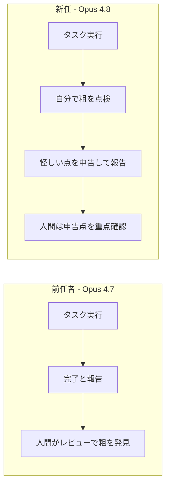
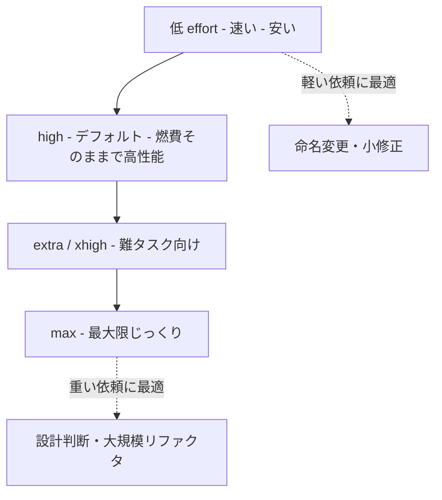
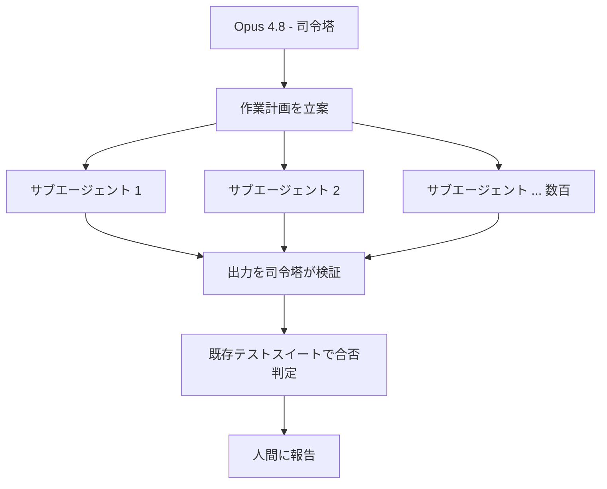

<font color="#00A1B3">**この記事の対象読者**</font>

- AIコーディング支援を日常的に使っていて、最新モデルの差分が気になる人
- 「またマイナーアップデートでしょ」と思いつつ、念のため中身を確認したい人
- effort制御やdynamic workflowsなど、新機能の使いどころを実務目線で知りたい人
- ベンチマークの数字だけでなく「で、結局なにが嬉しいの？」を日本語で読みたい人

**この記事で得られること**

- Claude Opus 4.8がOpus 4.7から何を変えてきたかの全体像
- 目玉機能（正直さの強化・effort制御・dynamic workflows）の意味と使い分け
- 価格・速度・APIの実務上のインパクト
- 触り始めるときのハマりどころと対処法

**この記事で扱わないこと**

- 他社モデルとの優劣を断定するランキング（ベンチは出典付きで紹介するに留める）
- Claude Mythos系の詳細（一般提供前のため触れる程度）
- プロンプトエンジニアリングの一般論

---

## 1. 「優秀な同僚」が静かにアップデートされた話

朝、いつものように[RTX5090](https://qiita.com/GeneLab_999/items/ab544a30c2d43eeb00bb)を積んだWindows機の前に座って、コーディング支援のモデル選択を眺めていたら、見慣れない名前が増えていた。Claude Opus 4.8。前バージョンのOpus 4.7が出てから、まだ41日しか経っていない[^1]。正直「えっ、もう？」と声が出た。

これまで私は、AIコーディング支援を<font color="#0383ED">**チームに新しく入った優秀な同僚**</font>のようなものだと捉えてきた。指示すれば動くが、たまに自信満々で間違えるし、こちらが粗を見つけてやらないといけない。便利だけど、最後はこちらがレビューする前提の存在。この記事を通して、その「同僚」という比喩でOpus 4.8を語っていく。一気に話が見えやすくなるはずだ。

で、結論から言うと、今回のアップデートでこの同僚、<font color="#12B278">**性格がだいぶ大人になった**</font>。派手な新スキルが増えたというより、仕事の進め方そのものが信頼できる方向に変わった、という手触りだった。

:::note info
本記事のスペックや機能の記述は、Anthropicの公式発表（2026年5月28日）および各メディア報道に基づく。ベンチマーク数値は出典を明記し、検証できていない数字は推測として書かないよう努めている。
:::

公式発表はこちら。

https://www.anthropic.com/news/claude-opus-4-8

まずは、この同僚が「地力」をどれだけ上げてきたのかから見ていこう。

---

## 2. 何が変わったのか ─ ベンチマークで見る地力アップ

新しい同僚を迎えたら、まず気になるのは「で、前任者より仕事できるの？」というところ。Anthropicの発表と各メディアの報道を整理すると、地力は着実に上がっている。

| 項目 | Opus 4.7 | Opus 4.8 | 出典 |
|------|----------|----------|------|
| エージェント型コーディング（SWE-Bench Pro） | 64.3% | 69.2% | 9to5Mac / MacRumors報道 |
| ツール併用の多分野推論 | 54.7% | 57.9% | 9to5Mac報道 |
| コンピュータ操作（Online-Mind2Web） | ─ | 84% | 公式テスター談 |

[SWE-bench Verified](https://qiita.com/GeneLab_999/items/a557780347f52a7cda49)系のエージェント型コーディング評価で、Opus 4.8は約69%を記録した。MacRumorsの報道によれば、この数値はGPT-5.5やGemini 3.1 Proを上回る一方、ターミナル操作系のコーディングではGPT-5.5がリードしているという[^2]。つまり<font color="#ED6300">**全領域で一人勝ち、というわけではない**</font>。ここは正直に書いておく。称賛記事だからといって、盛るのは同僚に対しても読者に対しても失礼だ。

それでも、コーディング・推論・コンピュータ操作・ナレッジワーク・金融分析と、複数の領域でまんべんなく前任者を上回っているのは事実で、地味だが堅実な底上げになっている。

:::note warn
上記の数値は公式発表ページの比較表（画像）および各メディア報道から拾ったものだ。評価ハーネス（採点環境）が違えば数値は変わる。公式の脚注でも、ターミナル系ベンチはハーネスによってスコアが動くことが明記されている。ベンチ数値は「条件付きの目安」として読むのが健全だ。
:::

ただ、今回の本当の見どころはベンチの数字そのものじゃない。Anthropicがリリースの先頭に持ってきたのは、もっと地味で、もっと効く話だった。それが「正直さ」だ。

---

## 3. 目玉その1: 正直さ ─ 「これ、根拠薄いです」と言える同僚

新人エンジニアあるあるで、いちばん困るのは「できてないのに、できたと言う」タイプだ。レビューしてみたら全然動いていない、でも本人は自信満々。こういう同僚、心臓に悪い。

Opus 4.8がもっとも強化したのは、まさにこの<font color="#12B278">**正直さ**</font>の部分だった。公式の表現を引用する。

> Opus 4.8 is around four times less likely than its predecessor to allow flaws in code it has written to pass unremarked.

和訳すると、

> Opus 4.8は、自らが書いたコードの欠陥を、何も言わずに見逃してしまう確率が、前世代に比べておよそ4分の1になっている。

「4分の1」というのが具体的でいい。完璧になったとは言っていない。<font color="#0383ED">**見逃しが減り、自分から「ここ怪しいです」と申告するようになった**</font>、という話だ。実際に触っていても、無理に「完成しました」と宣言せず、「この部分はテストできていないので確認してほしい」と添えてくることが増えた印象がある。

アライメント評価でも、向社会的な特性が新記録を出したと報告されている。

> reaches new highs on our measures of prosocial traits like supporting user autonomy and acting in the user's best interest.

和訳:

> ユーザーの自律性の尊重や、ユーザーの最善の利益のために行動するといった向社会的特性の指標で、新たな最高水準に達した。

さらに、欺瞞や悪用への加担といった望ましくない振る舞いの発生率が、前任のOpus 4.7より大幅に低く、現状でもっともよくアラインされたモデルであるClaude Mythos Preview[^3]と同水準まで下がったとされている。VentureBeatの報道では、約2,600回のシミュレート調査セッションに基づくミスアライメントのスコアが、Opus 4.7の2.5前後からOpus 4.8では1.9前後まで下がり、制限付き提供の[ClaudeMythos](https://qiita.com/GeneLab_999/items/2d1948b5f6d424798960)とほぼ並んだという[^4]。

これがなぜ嬉しいのか、図にするとこうなる。



レビューの起点が「人間が全部疑ってかかる」から「同僚が先に申告してくれる」に変わる。これは作業全体の信頼コストを下げる、地味だが本質的な改善だ。称賛したいのはここ。スコアの小数点以下より、こっちのほうがよほど効く。

:::note info
この「自分から不確実性を申告する」性質は、長時間まわしっぱなしにする非同期エージェント運用ほど効いてくる。誰も見ていない間に間違いを上塗りされるのが、自律エージェント最大の怖さだからだ。
:::

正直さの次は、その同僚に「どれくらい本気を出すか」を指示できるようになった話をしよう。

---

## 4. 目玉その2: effort制御 ─ 力の入れ具合を指示できる

優秀な同僚でも、全タスクに全力投球されると困ることがある。「ちょっとこの定数の名前変えといて」みたいな軽い依頼に、設計から見直して長考されたら、時間もコストも溶ける。逆に重い設計判断は、じっくり考えてほしい。

Opus 4.8のリリースに合わせて、claude.aiとCowork上で<font color="#0383ED">**effort（努力量）制御**</font>が使えるようになった。モデルセレクタの隣に、応答にどれだけ力を入れるかのコントロールが付く。これは全プランで利用できる。

- 高いeffort: より頻繁に、より深く考えてから答える。品質重視。
- 低いeffort: 速く返す。レート制限の消費もゆるやか。

Opus 4.8のデフォルトは<font color="#12B278">**high effort**</font>。Anthropicによれば、コーディングタスクではOpus 4.7のデフォルトと同程度のトークン消費で、より高い性能を出すという。つまり「同じ燃費で馬力が上がった」状態だ。

さらに上の設定も選べる。[Claude Code](https://docs.claude.com/en/docs/claude-code/overview)では「extra」（`xhigh`）と「max」が用意されていて、難しいタスクや長時間の非同期ワークフローには「extra」が推奨されている。高effort側はトークン消費が増えるため、Claude Code側のレート制限も引き上げられている。

effortと出力のイメージはこうだ。



これ、要は<font color="#12B278">**同僚に「今回は流しでいい」「今回は本気で頼む」と一言添えられるようになった**</font>ということ。マネジメント経験のある人ほど、この一言の価値がわかると思う。

:::note warn
effortを上げれば上げるほど良い、ではない。軽いタスクにmaxを指定すると、品質はほぼ変わらないのにトークンとレート制限だけ食う。タスクの重さにeffortを合わせるのが、財布にもレート制限にも優しい。
:::

そして、この同僚が一人で抱えきれない巨大タスクのために用意されたのが、次のdynamic workflowsだ。

---

## 5. 目玉その3: dynamic workflows ─ 数百人のチームを率いる同僚

ここまでは「一人の優秀な同僚」の話だった。dynamic workflowsは、その同僚に<font color="#0383ED">**チームを率いる権限を渡す**</font>機能だと考えるとわかりやすい。

research preview（研究プレビュー）として提供されるこの機能では、Claude Codeが作業計画を立て、単一セッションの中で数百の並列サブエージェントを走らせる。そして各サブエージェントの出力を自分で検証してから、人間に報告してくる。

公式が挙げている例がなかなか強烈で、Opus 4.8とdynamic workflowsを組み合わせたClaude Codeは、<font color="#ED6300">**数十万行規模のコードベース移行を、着手からマージまで一気通貫でこなせる**</font>という。しかも既存のテストスイートを合格基準として使いながら、だ。



[MCP](https://qiita.com/GeneLab_999/items/d1299630fc2c0325003b)的なエージェント拡張の流れを追ってきた人なら、これが「単発の賢いモデル」から「自律的に分業するチーム」への一歩だとわかるはずだ。並列で数百のサブエージェントを統率して、しかも自分で検証してから返す。<font color="#12B278">**チームリーダーとしての同僚**</font>、という比喩がしっくりくる。

:::note alert
dynamic workflowsはresearch previewで、Claude CodeのEnterprise / Team / Maxプラン向けの提供だ。全員がすぐ使えるわけではない点に注意してほしい。研究プレビュー段階の機能は仕様が変わりうる。
:::

機能の話が続いたので、ここで現実的な「お金と速度」の話に降りてこよう。

---

## 6. 価格と速度 ─ fast modeが3倍安くなった意味

どれだけ優秀な同僚でも、人件費が青天井なら雇い続けられない。ここがOpus 4.8の地味に効いてくるポイントで、<font color="#12B278">**通常利用の価格はOpus 4.7から据え置き**</font>だ。

| 項目 | 入力（100万トークン） | 出力（100万トークン） |
|------|----------------------|----------------------|
| 通常利用 | 5ドル | 25ドル |
| fast mode | 10ドル | 50ドル |

性能が上がって価格が同じ、というのは実質値下げに等しい。さらにfast modeは、従来モデルのfast modeに比べて<font color="#0383ED">**2.5倍の速度**</font>で動き、しかも<font color="#0383ED">**3倍安く**</font>なった。

fast modeのコストを単純化して式で見ておく。入力トークン数を $T_{in}$、出力トークン数を $T_{out}$（いずれも100万トークン単位）とすると、1回あたりの概算コスト $C$ は次のようになる。

```math
C = 10 \times T_{in} + 50 \times T_{out} \quad [\mathrm{USD}]
```

ここで効いてくるのが「3倍安い」という変化だ。従来同等の処理に対して、概算で

```math
C_{\text{new}} \approx \frac{1}{3}\, C_{\text{old}}
```

になっているとAnthropicは説明している。速さが要る対話的な用途で、コストが3分の1で2.5倍速いなら、これまで予算的に諦めていたリアルタイム用途が一気に現実的になる。<font color="#ED6300">**「速い同僚は高い」という前提が崩れた**</font>のが大きい。

:::note info
APIのモデル文字列は `claude-opus-4-8`。既存のOpusを使っているコードなら、モデル指定を差し替えるだけで試せる。価格据え置きなので、まず本番に近い小さなジョブで体感を比べてみるのがおすすめだ。
:::

加えて、開発者向けにはMessages APIの地味だが嬉しい改善も入った。次の実務セクションで触れる。

---

## 7. 実際に触るには（実用・コード・設定の使い分け）

ここからは、新しい同僚を実際にどう働かせるかの実務編だ。コピペで試せる形で置いておく。

### 7.1 まずはモデルを差し替えて呼ぶ

[Python](https://qiita.com/GeneLab_999/items/d2910c3c6dc1f4d78fb9)から[API](https://qiita.com/GeneLab_999/items/26c3998e243fce3df3f2)を叩く最小例。既存のOpus利用からの移行は、モデル名の差し替えが基本だ。

<details>
<summary>クリックでソースコードを展開（Python / Messages API最小例）</summary>

```python
import anthropic

client = anthropic.Anthropic()  # APIキーは環境変数 ANTHROPIC_API_KEY を推奨

resp = client.messages.create(
    model="claude-opus-4-8",   # ここを差し替えるだけ
    max_tokens=1024,
    messages=[
        {"role": "user", "content": "このコードのバグを指摘して、根拠も添えて"},
    ],
)

print(resp.content[0].text)
```
</details>

### 7.2 Messages APIの新機能 ─ 途中で指示を差し込める

今回の開発者向けアップデートで、<font color="#0383ED">**Messages APIがmessages配列の中にsystemエントリを受け付けるようになった**</font>。これまでシステム指示はトップレベルに固定で、途中で変えるのが面倒だった。新仕様では、タスクの途中でClaudeへの指示を更新できる。しかもプロンプトキャッシュを壊さず、ユーザーターンを挟まずに、だ。

エージェントを走らせている最中に、権限・トークン予算・環境コンテキストを動的に書き換える、といった使い方が想定されている。長時間まわすエージェントほど効いてくる改善だ。

<details>
<summary>クリックでソースコードを展開（messages配列内にsystemエントリを差し込むイメージ）</summary>

```python
# 注意: これはAPIの新挙動の概念を示す擬似例。
# 実際のフィールド仕様は公式ドキュメントを確認すること。
messages = [
    {"role": "user", "content": "リポジトリ全体をリファクタして"},
    # ... エージェントが作業を進める ...
    {"role": "system", "content": "残りトークン予算が逼迫。以降は最小diffで進めて"},
    {"role": "user", "content": "続けて"},
]
```
</details>

:::note warn
上記は新挙動の概念を示すための擬似コードだ。フィールド名やリクエスト形式の正確な仕様は、必ず公式ドキュメントで確認してほしい。
:::

最新の仕様はモデル概要ページが一次情報になる。

https://platform.claude.com/docs/en/about-claude/models/overview

### 7.3 effortの使い分け早見表

実務で迷いがちなeffortの選び方を、タスクの重さでまとめておく。

| タスクの重さ | 推奨 effort | 理由 |
|------------|-----------|------|
| 軽い修正・命名変更・整形 | low〜high（デフォルト） | 速度とコストを優先。品質差が出にくい |
| 通常の実装・バグ修正 | high（デフォルト） | 燃費そのままで性能が出る最適点 |
| 設計判断・難しいアルゴリズム | extra（xhigh） | じっくり考えさせる価値がある |
| 大規模リファクタ・長時間非同期 | extra〜max | 失敗の手戻りコストが高い場面 |

ここまで揃えば、初日からそれなりに働いてもらえる。ただ、新しい同僚には必ず最初のすれ違いがある。次でそれを潰しておこう。

---

## 8. よくあるハマりどころと対処

新メンバーを迎えた初週に起きがちなトラブルを、対処とセットで表にした。

| 症状 | 原因 | 対処 |
|------|------|------|
| モデル名が見つからないエラー | 文字列のタイポ | `claude-opus-4-8` を正確に指定（ハイフン区切り） |
| 想定よりトークン消費が多い | デフォルトがhigh effort | 軽いタスクはeffortを下げる。タスクに重さを合わせる |
| dynamic workflowsが使えない | プラン/提供範囲の制約 | Enterprise / Team / Maxプランか確認。research preview段階 |
| 「完成」と言わず確認を求めてくる | 正直さ強化による仕様 | バグではなく改善。申告点を優先的にレビューする |
| fast modeで品質が落ちた気がする | 速度優先モードの特性 | 品質重視の場面は通常モード+high effortに戻す |
| 旧Opus向けプロンプトが噛み合わない | 4.7のコメント冗長/ツール呼び出し癖が修正された | 4.7対策で入れていた回避プロンプトを一度外して試す |

最後の行は地味に重要だ。Opus 4.7にあったコメントの冗長さやツール呼び出しの問題は、Opus 4.8で修正されたとDevinを手がけるCognitionが公式コメントで述べている[^5]。<font color="#ED6300">**4.7時代に書いた回避用プロンプトが、4.8ではかえって邪魔をする**</font>可能性がある。乗り換えたら、まず素の状態で試すのが吉だ。前任者向けのマニュアルを新任に押し付けない、という当たり前の話でもある(;ﾟдﾟ)ﾎﾟｶｰﾝ。

---

## 9. 用語集

本文に出てきた用語を、初出の人向けにまとめておく。

| 用語 | 意味 |
|------|------|
| エージェント型コーディング | AIが自律的にツールを使い、コードの読み書き・実行・修正を進める評価/作業形態 |
| SWE-Bench Pro | 実際のソフトウェア課題を解けるかを測るコーディングベンチマーク |
| effort（努力量） | 応答にどれだけ深く考えるかを指定する制御。high / extra（xhigh）/ max など |
| dynamic workflows | Claude Codeが数百の並列サブエージェントを統率し、検証して報告する機能（研究プレビュー） |
| サブエージェント | 親エージェントの指示で個別タスクを担う子エージェント |
| fast mode | 速度優先の動作モード。Opus 4.8では従来比2.5倍速・3倍安 |
| アライメント | モデルの振る舞いを人間の意図や価値に沿わせること。安全性評価の中核 |
| ミスアライメント | 欺瞞や悪用への加担など、望ましくない振る舞い。低いほど良い |
| [Mythos Preview](https://qiita.com/GeneLab_999/items/2d1948b5f6d424798960) | Anthropicの最上位クラスのモデル。現在は限定提供 |

---

## 10. まとめ ─ 派手さより「信頼できる」が効く


Claude Opus 4.8を一通り触って称賛したいのは、新機能の華やかさではなく、<font color="#12B278">**同僚としての信頼性が上がったこと**</font>だ。要点を振り返る。

- ベンチは複数領域で前任者を着実に上回る。ただし全領域で一人勝ちではない
- 最大の進歩は正直さ。自分のコードの粗を見逃す確率が前世代比でおよそ4分の1に
- effort制御で「力の入れ具合」を指示できるようになった
- dynamic workflowsで、数百の並列サブエージェントを統率するチームリーダーになれる
- 価格は据え置き、fast modeは2.5倍速・3倍安。実質値下げ
- 4.7向けの回避プロンプトはいったん外して試すべき

個人的にいちばん刺さったのは、第3節の正直さだ。AIに「できました」と胸を張られて、レビューで全部疑ってかかる消耗を、何度味わってきたことか…orz。その同僚が「ここ自信ないです」と先に言ってくれるようになっただけで、共同作業の体感はガラッと変わる。

スコアの小数点以下を競う段階から、<font color="#0383ED">**安心して仕事を任せられるか**</font>という段階へ。Opus 4.8は、その地味で本質的な方向にきちんと歩を進めたアップデートだった。素直に脱帽、と言わざるを得ない。草。

なお、Anthropicは数週間以内にMythosクラスのモデルを全顧客へ提供する予定とも述べている。優秀な同僚の上に、さらに格上の存在が控えているわけだ。続報が出たら、また追いかけたい。

---

## 関連記事

最新の最上位モデルについてはこちら。

https://qiita.com/GeneLab_999/items/2d1948b5f6d424798960

エージェント拡張技術の基盤については、MCPの記事もどうぞ。

https://qiita.com/GeneLab_999/items/d1299630fc2c0325003b

ローカルでLLMを動かす話に興味があれば。

https://qiita.com/GeneLab_999/items/7f1bd2de313bdd7ca423

---

最新のAI・GPU・ローカルLLMの話はXでも発信しています。よかったらフォローを。

https://x.com/geneLab_999

[^1]: TechCrunchの報道による。Opus 4.7のリリースから41日後という、Anthropicとしては通常より速いアップグレード間隔だった。https://techcrunch.com/2026/05/28/anthropic-releases-opus-4-8-with-new-dynamic-workflow-tool/
[^2]: MacRumorsの報道による。SWE-Bench ProでGPT-5.5・Gemini 3.1 Proを上回る一方、ターミナル系コーディングではGPT-5.5がリードとされる。https://www.macrumors.com/2026/05/28/anthropic-claude-opus-4-8/
[^3]: Claude Mythos Previewは、サイバーセキュリティ上の理由から一般提供されておらず、Project Glasswingの一環で一部組織が利用している最上位クラスのモデル。
[^4]: VentureBeatの報道による。約2,600回のシミュレート調査セッションに基づくミスアライメントスコアで、Opus 4.7の約2.5からOpus 4.8では約1.9へ低下したとされる。https://venturebeat.com/technology/anthropics-claude-opus-4-8-is-here-with-3x-cheaper-fast-mode-and-near-mythos-level-alignment
[^5]: Anthropic公式発表ページに掲載されたCognition（Devin）のScott Wu氏のコメントによる。Opus 4.7で見られたコメントの冗長さとツール呼び出しの問題が修正されたと述べている。
