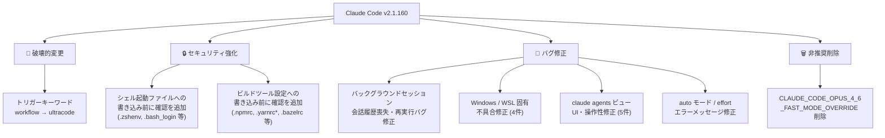
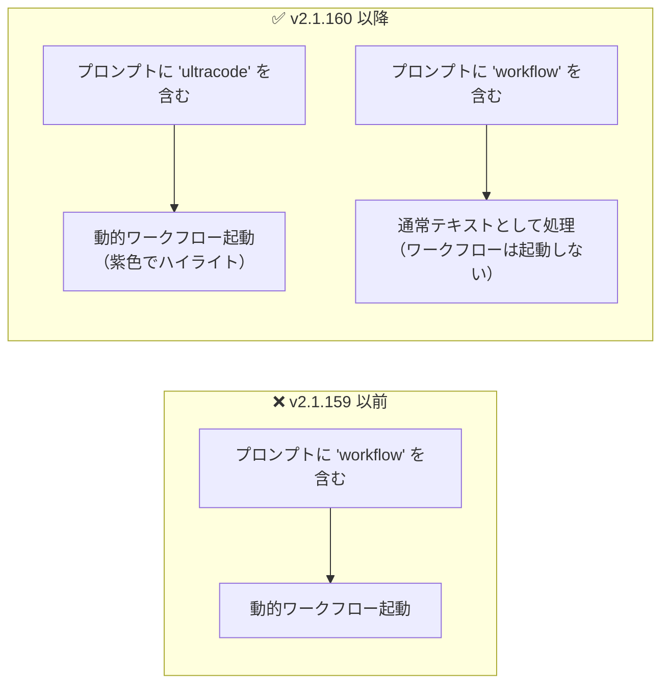

## はじめに

Claude Code v2.1.160 がリリースされました。本バージョンは日常的な利用に影響する**破壊的変更**を含んでいます。具体的には、動的ワークフローを起動するトリガーキーワードが `workflow` から `ultracode` に変更されました。

また、シェル起動ファイルやビルドツール設定への書き込み前に確認を求めるセキュリティ強化、バックグラウンドセッションの会話履歴喪失・再実行バグの修正、Windows/WSL 固有の不具合修正なども含まれます。

> **📌 影響を受ける人**
> - プロンプトに `workflow` というキーワードを含めて動的ワークフローを起動していた方
> - `CLAUDE_CODE_OPUS_4_6_FAST_MODE_OVERRIDE` 環境変数を設定していた方
> - `claude --bg` やバックグラウンドセッションを多用している方
> - Windows / WSL 環境で Claude Code を使っている方

---

## 変更の全体像



---

## 変更内容

### 🔴 破壊的変更: `workflow` → `ultracode` トリガーキーワード

動的ワークフロー（Dynamic Workflow）を起動するキーワードが変更されました。

| 項目 | 変更前 | 変更後 |
|------|--------|--------|
| トリガーキーワード | `workflow` | `ultracode` |
| UI ハイライト | なし | 紫色（violet）でハイライト |
| 従来の `workflow` という語 | ワークフロー起動 | 通常の文脈として処理 |

`workflow` という単語はもうワークフローをトリガーしません。自分の言葉でワークフローを依頼すること自体は引き続き可能ですが、**キーワードトリガーは `ultracode` のみ**になります。

---

### 🔒 セキュリティ強化: ファイル書き込み前の確認

**シェル起動ファイルへの書き込み前確認 (change-001)**

以下のファイルへの書き込みが検出された場合、ユーザーへの確認プロンプトが表示されるようになりました。

- `~/.zshenv`
- `~/.zlogin`
- `~/.bash_login`
- `~/.config/git/` 以下のファイル

これらのファイルは書き込まれると意図しないコマンドが実行される可能性があるためです。

**acceptEdits モードでもビルドツール設定は確認が必要 (change-002)**

従来 `acceptEdits` モードでは自動承認されていた編集のうち、コード実行権限を付与しうる設定ファイルについては確認が必要になりました。対象ファイルは以下の通りです。

- `.npmrc`
- `.yarnrc`、`.yarnrc.yml`
- `bunfig.toml`
- `.bazelrc`
- `.pre-commit-config.yaml`
- `.devcontainer/` 以下

> **⚠️ Breaking Change (運用上の注意)**
> `acceptEdits` モードで自動化しているワークフローがこれらのファイルを編集する場合、確認待ちで処理が止まります。スクリプトやCI環境での利用には注意が必要です。

---

### 🐛 バグ修正: バックグラウンドセッション (change-007)

バックグラウンドセッション関連の重大な不具合が複数修正されました。

| 不具合 | 状態 |
|--------|------|
| `claude agents` から完了セッションを復元するとチャット履歴が消え、元のプロンプトが再実行される | ✅ 修正済み |
| 夜間退避（overnight eviction）後に再アタッチしたバックグラウンドセッションが会話を失い、元のプロンプトを再実行する | ✅ 修正済み |
| 再開したバックグラウンドエージェントが `agents` リストで Completed と表示される | ✅ 修正済み |
| `claude --bg` がコールドスタート時に "socket missing" で失敗することがある | ✅ 修正済み |
| `claude rm` / `stop` 時に実行中シェルサブプロセスへ SIGTERM なしで SIGKILL が送られていた | ✅ 修正済み（SIGTERM → SIGKILL の順に変更） |

---

### 🐛 バグ修正: Windows / WSL 環境 (change-008)

| 不具合 | 修正内容 |
|--------|----------|
| WSL で copy-on-select が Windows クリップボードに書き込めない | OSC 52 → PowerShell interop に変更（MobaXterm 等の非対応端末に対応） |
| バックグラウンドセッション起動元ディレクトリが `claude rm` 後もデーモン終了まで削除できない | 修正済み |
| 高 CPU 負荷時に Esc・矢印キー・入力が反応しなくなる | 修正済み |
| ハイパーリンク対応端末で `file:///C:/...` リンクが壊れたパスに書き換えられる | 修正済み |

---

### 🐛 バグ修正: `claude agents` ビュー (change-009)

| 不具合 | 修正内容 |
|--------|----------|
| セッションリスト復帰時に数秒フリーズする | 自動アップデータの再チェック頻度を修正 |
| Apple Terminal・tmux でレンダリングアーティファクトが出る | 同期出力マーカーの送出条件を修正 |
| セッション直後のマウスホイールがトランスクリプトでなくプロンプト履歴をスクロールする | 修正済み |
| CJK IME 合成が入力キャレットではなく画面左下に表示される | 修正済み |

---

### 🗑️ 非推奨削除: `CLAUDE_CODE_OPUS_4_6_FAST_MODE_OVERRIDE` (change-005)

環境変数 `CLAUDE_CODE_OPUS_4_6_FAST_MODE_OVERRIDE` が削除されました。設定していても何も起こらない（no-op）状態です。利用している場合は設定を削除してください。

---

## 影響と対応

### 対応が必要な変更

**1. トリガーキーワードの更新（必須）**

動的ワークフローを利用していた場合、プロンプトの `workflow` を `ultracode` に変更してください。CLAUDE.md にワークフロー関連の記述がある場合も更新が必要です。

**2. 環境変数の削除（設定している場合のみ）**

```bash
# 不要になった環境変数を削除する
# .bashrc / .zshrc 等から以下の行を削除
export CLAUDE_CODE_OPUS_4_6_FAST_MODE_OVERRIDE=...
```

**3. acceptEdits モードの自動化スクリプトの確認**

`.npmrc` や `.yarnrc` 等のビルドツール設定ファイルを自動編集するスクリプトやワークフローが止まらないか確認してください。

---

## コード例

### Before / After: トリガーキーワードの変更



**プロンプト例:**

```
# Before（v2.1.159 以前）
このコードベース全体をレビューして。workflow で並列に進めてほしい。

# After（v2.1.160 以降）
このコードベース全体をレビューして。ultracode で並列に進めてほしい。
```

**CLAUDE.md の更新例:**

```markdown
# Before
動的ワークフローのトリガー: `workflow`

# After
動的ワークフローのトリガー: `ultracode`
```

> **💡 Tips**
> `ultracode` キーワードはプロンプト入力欄で紫色（violet）にハイライトされます。入力時に視覚的に確認できます。

---

## まとめ

Claude Code v2.1.160 の主な変更点をまとめます。

| 変更 | 重要度 | 対応要否 |
|------|--------|----------|
| トリガーキーワード `workflow` → `ultracode` | 🔴 高 | **必要** |
| シェル起動ファイル書き込み前に確認 | 🟠 中〜高 | 確認のみ |
| `acceptEdits` モードでビルドツール設定に確認 | 🟠 中〜高 | 自動化スクリプトを確認 |
| `CLAUDE_CODE_OPUS_4_6_FAST_MODE_OVERRIDE` 削除 | 🟡 中 | 設定している場合は削除 |
| バックグラウンドセッションの履歴喪失・再実行バグ修正 | 🟡 中 | 対応不要（恩恵のみ） |
| Windows / WSL の不具合修正 | 🟡 中 | 対応不要（恩恵のみ） |

最も優先して対応すべきは `workflow` → `ultracode` へのキーワード変更です。CLAUDE.md やプロンプトテンプレートを使い回している場合は特に確認してください。バックグラウンドセッションや Windows/WSL のバグ修正は、該当環境を利用している方にとって安定性の向上をもたらします。
