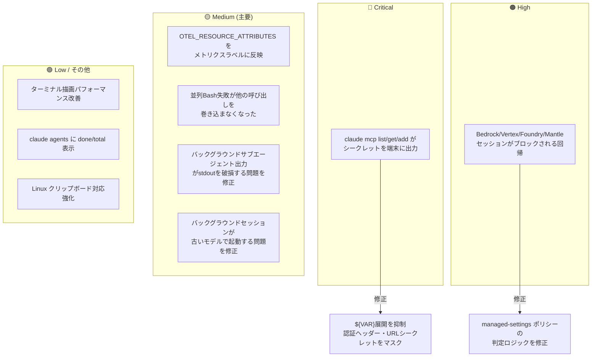
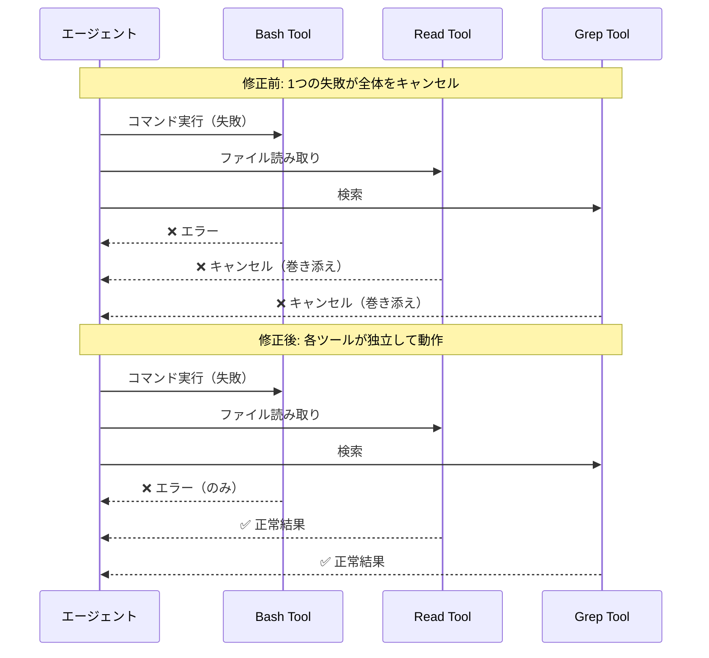
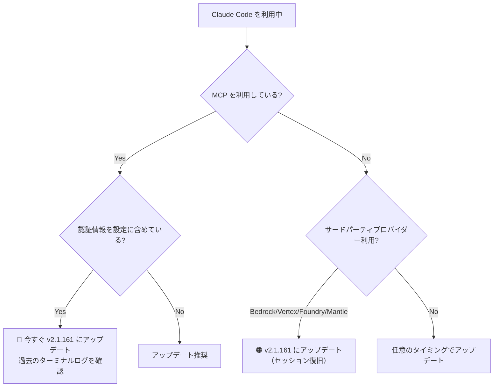

## はじめに

2026年6月3日、Claude Code v2.1.161 がリリースされました。今回のリリースには22件の変更（機能改善・バグ修正）が含まれており、中でも **2件の重要な修正** が開発者に直接影響を与えます。

1. **`claude mcp` コマンドが認証情報を端末に平文出力していたセキュリティ脆弱性の修正**（severity: critical）
2. **Bedrock / Vertex / Foundry / Mantle のセッションがブロックされる回帰バグの修正**（severity: high）

これらの修正は早急なアップデートを検討すべき内容です。本記事ではこれら重要な変更を中心に、今回のリリース全体を解説します。

---

## 変更の全体像



---

## 変更内容

### 変更一覧

| severity | ID | 種別 | タイトル | 対応要否 |
|---|---|---|---|---|
| 🔴 critical | change-014 | bugfix | claude mcp がシークレットを端末に出力 | **要対応** |
| 🟠 high | change-007 | bugfix | サードパーティプロバイダーセッションのブロック回帰 | **要対応** |
| 🟡 medium | change-001 | improvement | OTEL_RESOURCE_ATTRIBUTES をメトリクスラベルに反映 | 任意 |
| 🟡 medium | change-004 | improvement | 並列Bashの失敗が他ツールを巻き込まなくなった | 不要 |
| 🟡 medium | change-008 | bugfix | バックグラウンドサブエージェントのstdout破損修正 | 不要 |
| 🟡 medium | change-012 | bugfix | WindowsでBashフックが失敗する問題を修正 | 不要 |
| 🟡 medium | change-015 | bugfix | worktree分離のWorkflowエージェントがファイル編集できない問題 | 不要 |
| 🟡 medium | change-016 | bugfix | バックグラウンドセッションが古いモデルで起動する問題 | 不要 |
| 🟢 low | 他 | bugfix/improvement | UI改善・パフォーマンス向上・その他バグ修正 | 不要 |

---

## 重要な変更の詳細

### 1. claude mcp コマンドがシークレットを端末に出力していた（Critical）

> **⚠️ Breaking Change / セキュリティ修正**
> `claude mcp list`、`claude mcp get`、`claude mcp add` を実行した際、設定ファイル内のシークレット（APIキー、認証トークンなど）が端末に**平文で出力**されていました。ターミナルの履歴・ログ・スクリーンショットを通じた認証情報漏洩リスクがあります。

> **📌 影響を受ける人**
> - `claude mcp` コマンドを使用し、設定に `${VAR}` 形式の環境変数参照や認証ヘッダーを含めている方
> - ペアプログラミング・画面共有・CI ログ収集環境で Claude Code を利用している方

**修正内容:**
- `${VAR}` 形式の変数参照は展開されず、そのままの文字列として表示されるようになった
- 認証ヘッダー（`Authorization: Bearer xxxxx` 等）はマスク（`***`）して表示
- URL内のシークレット（`?api_key=xxxxx` 等）もマスク表示

---

### 2. Bedrock / Vertex / Foundry / Mantle のセッションブロック回帰（High）

> **⚠️ Breaking Change（v2.1.146 回帰）**
> managed-settings ポリシーの `forceLoginOrgUUID` / `forceLoginMethod` が組織ピンと併用されると、サードパーティプロバイダーのセッション確立をブロックしていました。v2.1.146 で混入した回帰です。

> **📌 影響を受ける人**
> - 組織管理ポリシー（managed-settings）を利用している Enterprise 環境
> - Amazon Bedrock、Google Vertex AI、Foundry、Mantle 経由で Claude Code を利用している組織

v2.1.161 への更新で正常にセッションが開始できるようになります。

---

### 3. 並列ツール呼び出しでのBash失敗が他の呼び出しを巻き込まなくなった（Medium）

これまで、同一バッチ内の Bash コマンドが1つ失敗すると、他のツール呼び出し（例: ファイル読み取りや検索）まで一緒にキャンセルされていました。今回の修正により、各ツールが独立して結果を返すようになりました。



---

### 4. OpenTelemetry メトリクスへのカスタムラベル付与（Medium）

`OTEL_RESOURCE_ATTRIBUTES` に設定した値が、メトリクスデータポイントのラベルとして付与されるようになりました。

**活用例:**

```bash
# 環境変数でチームやリポジトリ情報をラベルとして付与
export OTEL_RESOURCE_ATTRIBUTES="team=backend,repo=api-service,env=production"

# これにより Prometheus / Grafana 等でのクエリが可能になる
# 例: team="backend" でフィルタして API 利用量を集計
```

チーム別・リポジトリ別の Claude Code 利用量モニタリングが実現できます。

---

### 5. バックグラウンドセッションのモデル設定が正しく反映されるようになった（Medium）

`claude agents` から起動されたバックグラウンドセッションが、デーモン環境の古いモデルを使用していた問題が修正されました。`settings.json` で指定したモデルが確実に適用されます。

```json
// settings.json
{
  "model": "claude-opus-4-8"
}
```

この設定がバックグラウンドセッションにも正しく引き継がれるようになりました。

---

## 影響と対応



### アップデート方法

```bash
# npm でインストールしている場合
npm update -g @anthropic-ai/claude-code

# バージョン確認
claude --version
# => 2.1.161 以上であることを確認
```

> **💡 Tips**
> MCP の認証情報が過去に端末に出力されていた可能性がある場合、ターミナルログの確認と**影響を受けた可能性のある API キーのローテーション**を検討してください。

---

## コード例

### Before / After: claude mcp のシークレット表示

**修正前（v2.1.160 以前）:**
```bash
$ claude mcp list
my-server:
  url: https://api.example.com/mcp?token=sk-secret-abc123  # ← 平文で表示
  headers:
    Authorization: Bearer eyJhbGci...  # ← 平文で表示
```

**修正後（v2.1.161）:**
```bash
$ claude mcp list
my-server:
  url: https://api.example.com/mcp?token=***  # ← マスク
  headers:
    Authorization: Bearer ***  # ← マスク
```

**設定ファイルでの推奨パターン（変更なし）:**
```json
{
  "mcpServers": {
    "my-server": {
      "url": "https://api.example.com/mcp",
      "headers": {
        "Authorization": "Bearer ${MY_API_TOKEN}"
      }
    }
  }
}
```

`${MY_API_TOKEN}` は**展開されず**そのまま表示されるため、環境変数参照は引き続き安全に利用できます。

---

## まとめ

| 優先度 | 変更 | 対応 |
|---|---|---|
| 🔴 今すぐ | MCP シークレット漏洩修正 | アップデート ＋ キーローテーション検討 |
| 🟠 早急 | Bedrock/Vertex 等のセッション回帰修正 | アップデート |
| 🟡 確認 | 並列ツール実行の堅牢化 | 恩恵を自動で受ける |
| 🟡 活用 | OTEL メトリクスのカスタムラベル | `OTEL_RESOURCE_ATTRIBUTES` を設定 |
| 🟢 任意 | その他 UI・パフォーマンス改善 | アップデートで自動適用 |

Claude Code v2.1.161 はセキュリティ修正を含む重要なリリースです。特に MCP を使って外部サービスと連携している環境では、**早期アップデートと過去ログの確認**を強く推奨します。サードパーティプロバイダー利用中で v2.1.146 以降にセッション問題が発生していた組織は、このアップデートで解消されます。
