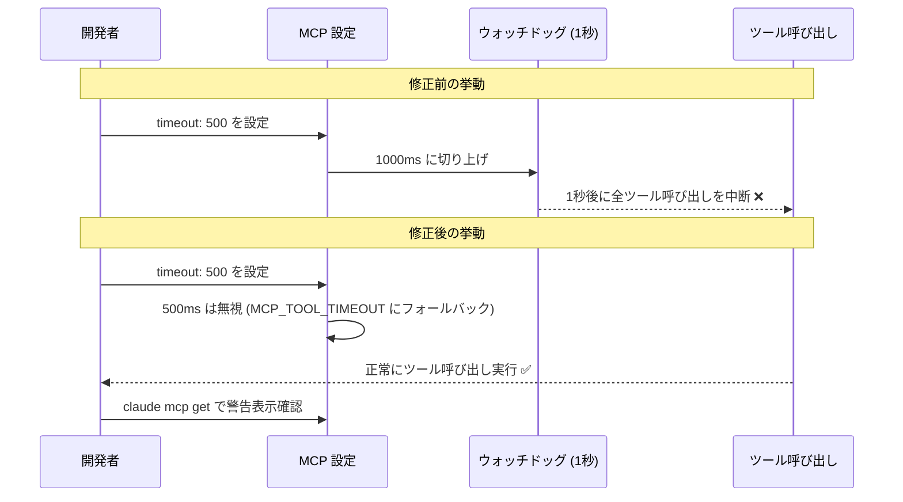
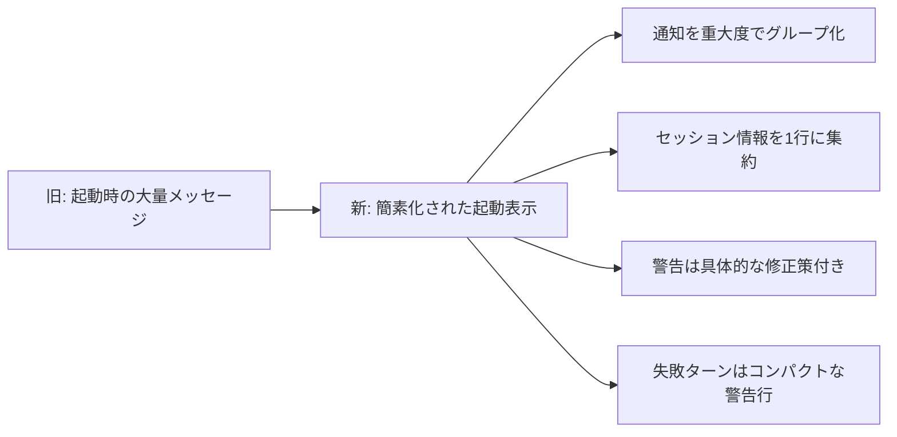

## はじめに

Claude Code v2.1.162 がリリースされました。このバージョンは**セキュリティ・権限制御に関わる重要なバグ修正**を複数含んでいます。特に WebFetch の権限ルール適用漏れや Windows 環境でのパス照合不具合は、アクセス制御の設計に影響する問題のため、該当環境を使っている開発者は確認が必要です。

また `claude agents` コマンドに関する大規模な不具合修正と、MCP タイムアウト設定の誤動作修正、起動表示の UX 改善なども含まれています。

> **📌 影響を受ける人**
> - Claude Code の `claude agents` でマルチエージェント開発をしている人
> - WebFetch に明示的な deny/allow ルールを設定している人
> - Windows 環境で Claude Code を使用している人
> - MCP サーバーの `timeout` を 1000ms 未満で設定していた人

---

## 変更の全体像

```mermaid
graph TD
    A[Claude Code v2.1.162] --> B[🔴 権限・セキュリティ修正]
    A --> C[🟡 claude agents 修正]
    A --> D[🟡 MCP 関連修正]
    A --> E[⚪ UX 改善]

    B --> B1[WebFetch 権限ルール適用漏れ修正]
    B --> B2[Windows パス照合不具合修正]
    B --> B3[Read deny が Glob/Grep 結果に未適用を修正]

    C --> C1[起動ハング修正]
    C --> C2[接続バウンス修正]
    C --> C3[Ctrl+V 貼り付け修正]
    C --> C4[waitingFor フィールド追加]
    C --> C5[表示幅切り詰め修正]

    D --> D1[1000ms 未満 timeout 誤動作修正]
    D --> D2[絵文字含む文字列の API 400 修正]

    E --> E1[起動表示の簡素化]
    E --> E2[Windsurf→Devin Desktop リブランド]
    E --> E3[/effort デフォルト永続化確認表示]
```

---

## 変更内容

### 重要度別の変更一覧

| 重要度 | 変更 | アクション要否 |
|--------|------|----------------|
| 🔴 High | WebFetch 権限ルールが事前承認ドメインに未適用 | **要確認** |
| 🔴 High | Windows でのパス照合失敗・Read deny 未適用 | **要確認** |
| 🔴 High | 読み取り専用設定ディレクトリで起動ハング | 不要（自動修正）|
| 🟡 Medium | MCP timeout < 1000ms が全ツール呼び出しを中断 | **要確認** |
| 🟡 Medium | `claude agents` 接続・入力・バックグラウンド複数不具合 | 不要（自動修正）|
| 🟡 Medium | 絵文字含む文字列で API 400 エラー（MCP） | 不要（自動修正）|
| 🟡 Medium | SDK/stream-json でターン開始直後の Esc が無視される | 不要（自動修正）|
| 🟢 Low | `claude agents --json` に `waitingFor` フィールド追加 | 不要 |
| 🟢 Low | 起動表示の簡素化・警告メッセージ改善 | 不要 |
| 🟢 Low | Windsurf → Devin Desktop リブランド対応 | 不要 |

---

## 影響と対応

### 1. WebFetch 権限ルール適用漏れ（High）

> **⚠️ Breaking Change（バグ修正による挙動変化）**
> 組み込みの事前承認ドメインへの `WebFetch` に対し、明示的な `deny` / `ask` / `allow` ルールが今まで無視されていました。v2.1.162 以降、明示的なルールが優先されます。

**修正前の挙動:**
- 組み込みの事前承認ドメイン（例: `github.com` 等）は自動で許可
- `WebFetch(domain:github.com)` に `deny` を設定しても無視される

**修正後の挙動:**
- 明示的な `deny` / `ask` / `allow` ルールが事前承認ドメインより優先される
- セキュリティポリシーを厳密に適用したい場合に正しく動作

**対応が必要なケース:**
- 事前承認ドメインへのアクセスを `deny` したい（今まで機能しなかったが、v2.1.162 から機能する）
- 逆に「意図せず `deny` を設定していた」場合は許可されなくなるので設定を見直す

---

### 2. Windows 環境のパス照合不具合（High）

> **⚠️ Windows ユーザーは特に注意**

Windows 環境では以下の 2 つの問題が同時修正されました:

1. **バックスラッシュ / 大文字小文字の違いで権限ルールが一致しない**
   - `~\projects\` や `\\server\share` 形式のパスがルールにマッチしなかった
   - ケースの違い（`C:\Users` vs `c:\users`）でも未マッチになっていた

2. **Read の deny ルールが Glob/Grep の検索結果からファイルを隠さない**
   - deny 設定したファイルでも Glob/Grep の結果に出現していた
   - 機密ファイルのパスを deny しても検索結果に漏れていた可能性あり

**Windows ユーザーへの確認事項:**
- 権限ルールに `~\` や `\\server\` 形式のパスを使っている場合、今まで機能していなかった可能性がある
- 意図的に deny していたファイルが Glob/Grep で表示されていなかったか確認する

---

### 3. MCP timeout < 1000ms の誤動作（Medium）



> **💡 Tips**
> 1000ms 未満の `timeout` 設定は v2.1.162 以降で無視されます。環境変数 `MCP_TOOL_TIMEOUT` またはデフォルト値が使われます。`claude mcp get` を実行すると注記が表示されます。

**対応:**
MCP サーバー設定の `timeout` が 1000ms 未満になっている場合は、設定を見直してください。

---

### 4. `claude agents` の大規模修正（Medium）

今回のリリースで最も多くの修正が入ったのが `claude agents` コマンドです。

修正された不具合一覧:

| 不具合 | 修正内容 |
|--------|---------|
| バックグラウンドサービス再起動後の接続バウンス | 再起動直後の attach がセッション一覧に跳ね返る問題を修正 |
| Ctrl+V 画像貼り付けが無反応 | ディスパッチ入力欄と返信ボックスで修正。画像なし貼り付け時はヒント表示 |
| ← でバックグラウンド化すると会話が消失 | 失敗行として一覧に残り Enter で復帰可能に |
| 送信失敗した返信が消失 | 次回セッション開始時にキューイング配信 |
| 実行中セッションを開く際の 5 秒停止 | 停止を解消 |
| ターミナル幅で表示が切り詰め | ターミナル幅全体を活用するように修正 |

また、新機能として `claude agents --json` の出力に `waitingFor` フィールドが追加されました。

---

## コード例

### `claude agents --json` の `waitingFor` フィールド

待機中のセッションが何によってブロックされているかをプログラムから確認できるようになりました。

**Before (v2.1.162 以前):**
```json
{
  "sessions": [
    {
      "id": "session-abc123",
      "status": "waiting",
      "name": "my-agent"
    }
  ]
}
```

**After (v2.1.162 以降):**
```json
{
  "sessions": [
    {
      "id": "session-abc123",
      "status": "waiting",
      "name": "my-agent",
      "waitingFor": "permission_prompt"
    }
  ]
}
```

**活用例:**
```bash
# 権限プロンプト待ちのセッションを抽出
claude agents --json | jq '.sessions[] | select(.waitingFor == "permission_prompt")'
```

---

### MCP timeout 設定の修正対応

**Before（誤動作していた設定）:**
```json
{
  "mcpServers": {
    "my-server": {
      "command": "my-mcp-server",
      "timeout": 500
    }
  }
}
```

**After（修正後の推奨設定）:**
```json
{
  "mcpServers": {
    "my-server": {
      "command": "my-mcp-server",
      "timeout": 5000
    }
  }
}
```

または環境変数で制御:
```bash
export MCP_TOOL_TIMEOUT=5000
```

---

### WebFetch 権限ルールの明示的な設定

**明示的な deny の例（v2.1.162 から正しく機能）:**
```json
{
  "permissions": {
    "deny": [
      "WebFetch(domain:internal.example.com)"
    ]
  }
}
```

---

## 起動表示の改善

v2.1.162 では起動時の表示がよりクリーンになりました:



- 「Claude in Chrome enabled」「marketplace installed」などの起動メッセージを削除
- モデル自動更新・チームオンボーディングのヒントはロゴ下の静かな通知として表示
- エンドポイントセキュリティの新バイナリスキャンを待つよう改善（従来は 5 秒で失敗していた）

---

## まとめ

Claude Code v2.1.162 の主なポイントは以下の 3 点です:

1. **権限制御の重要バグ修正**
   - WebFetch の明示的な deny/allow ルールが事前承認ドメインでも正しく機能するように
   - Windows 環境でのパス照合とファイル隠蔽が正常化

2. **`claude agents` の大幅改善**
   - 接続・入力・表示に関する 6 件以上の不具合を一括修正
   - `waitingFor` フィールドでブロック要因をプログラムから把握可能に

3. **MCP / LSP の安定性向上**
   - 1000ms 未満の timeout 設定が誤って全ツール呼び出しを中断する問題を解消
   - 絵文字含む文字列による API 400 エラーを修正

特に **Windows ユーザー** と **WebFetch に明示的な権限ルールを設定しているユーザー** は、挙動変化が生じる可能性があるため、アップデート後に設定と動作を確認することをおすすめします。
