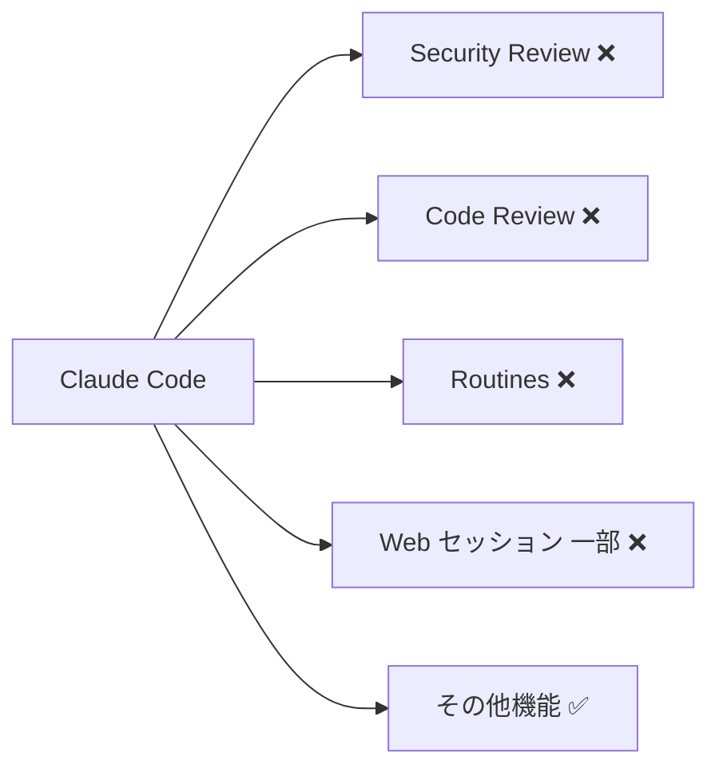

## はじめに

2026年6月3日、Anthropic のプロダクト群で2件のインシデントが立て続けに発生しました。1件は **Claude Opus 4.7 のエラー率上昇**（約28分）、もう1件は **Claude Code の複数機能が劣化**（約3時間）というものです。

いずれもすでに解決済みであり、ユーザー側での対応は不要です。しかし「なぜ把握しておくべきか」という観点から、本記事では2つのインシデントの全容を時系列で整理し、**Claude API や Claude Code に依存したシステムを運用する開発者が持つべき障害対応の知識**を解説します。

> **📌 影響を受ける人**
> - Claude API（特に Opus 4.7）をプロダクションで利用している開発者
> - Claude Code の Security Review・Code Review・routines 機能を業務フローに組み込んでいるチーム
> - Anthropic のサービス可用性をモニタリングしている SRE・インフラ担当者

---

## 変更の全体像

2件のインシデントは時間的に重なっており、Claude Code のインシデントが収束するタイミングで Opus 4.7 のインシデントも解決しています。

```mermaid
timeline
    title 2026-06-03 Anthropic インシデントタイムライン (UTC)
    04:17 : Claude Code サービス劣化を特定
             セキュリティレビュー・コードレビュー
             routines・一部 Web セッションが影響
    07:10 : Opus 4.7 エラー率上昇を検知
             調査開始
    07:28 : Opus 4.7 修正パッチを適用
             モニタリング継続
    07:36 : Claude Code インシデント解決
    07:38 : Opus 4.7 インシデント解決
```

Opus 4.7 は28分という短時間で収束した一方、Claude Code は約3時間20分にわたりサービスが劣化していました。同日の早朝（UTC）に集中して発生しており、個別の原因によるものと考えられます。

---

## 変更内容

### インシデント 1: Claude Opus 4.7 エラー率上昇

| 項目 | 内容 |
|---|---|
| **影響モデル** | Claude Opus 4.7 |
| **発生検知** | 2026-06-03 07:10 UTC |
| **修正適用** | 2026-06-03 07:28 UTC |
| **解決確認** | 2026-06-03 07:38 UTC |
| **実質ダウンタイム** | 約28分 |
| **ユーザー対応** | 不要（解決済み） |

Opus 4.7 はAnthropicの高性能モデルラインのひとつで、複雑な推論タスクやコーディング補助に幅広く使われています。今回はエラー率が一時的に上昇しましたが、修正適用からわずか10分でインシデントクローズに至っています。Anthropic 側の迅速な対応が見て取れます。

---

### インシデント 2: Claude Code サービス劣化

| 項目 | 内容 |
|---|---|
| **影響サービス** | Claude Code（複数機能） |
| **発生検知** | 2026-06-03 04:17 UTC |
| **解決確認** | 2026-06-03 07:36 UTC |
| **影響時間** | 約3時間19分 |
| **ユーザー対応** | 不要（解決済み） |

影響を受けた機能は以下の通りです。



Security Review と Code Review はチームの CI/CD パイプラインや Pull Request フローに組み込まれているケースも多く、この3時間はレビュー自動化が止まった組織もあったと想定されます。

> **⚠️ 注意**
> Routines はスケジュール実行される自動化タスクです。この時間帯に実行されるよう設定していたルーティンは失敗またはスキップされた可能性があります。ログを確認してください。

---

## 影響と対応

両インシデントとも解決済みのため、**今すぐ対応が必要な作業はありません**。ただし、今回のインシデントは「Claude API や Claude Code に依存するシステムがいかに脆弱になりうるか」を示す事例でもあります。以下の観点でシステムを見直すことを推奨します。

### チェックリスト

- [ ] **Anthropic ステータスページを購読しているか**
  `https://status.claude.com` でメール・Webhook 通知を設定する
- [ ] **API 呼び出しにリトライロジックが実装されているか**
  一時的なエラーに対してエクスポネンシャルバックオフを使用する
- [ ] **Claude Code の routines ログを確認したか**
  今回の障害時間帯（04:17〜07:36 UTC）に実行予定のルーティンが正常完了しているか確認する
- [ ] **フォールバック戦略はあるか**
  Opus 4.7 が使えない場合に Sonnet 4.6 などへ自動切り替えする仕組みがあるか

---

## コード例

### リトライとフォールバック付きの API 呼び出し

今回のような一時的なエラー増加に対して、以下のような実装パターンが有効です。

**Before（エラーハンドリングなし）**
```python
import anthropic

client = anthropic.Anthropic()

response = client.messages.create(
    model="claude-opus-4-7",
    max_tokens=1024,
    messages=[{"role": "user", "content": "Hello"}]
)
print(response.content)
```

**After（リトライ + フォールバックモデル付き）**
```python
import anthropic
import time

client = anthropic.Anthropic()

FALLBACK_MODELS = [
    "claude-opus-4-7",
    "claude-sonnet-4-6",  # Opus が落ちたときのフォールバック
]

def call_with_retry(prompt: str, max_retries: int = 3) -> str:
    for model in FALLBACK_MODELS:
        for attempt in range(max_retries):
            try:
                response = client.messages.create(
                    model=model,
                    max_tokens=1024,
                    messages=[{"role": "user", "content": prompt}]
                )
                return response.content[0].text
            except anthropic.APIStatusError as e:
                if e.status_code in (500, 503) and attempt < max_retries - 1:
                    wait = 2 ** attempt  # 1s → 2s → 4s
                    print(f"[{model}] attempt {attempt+1} failed, retrying in {wait}s...")
                    time.sleep(wait)
                else:
                    print(f"[{model}] failed after {max_retries} attempts, trying fallback...")
                    break
    raise RuntimeError("All models and retries exhausted")

result = call_with_retry("コードレビューをお願いします")
print(result)
```

> **💡 Tips**
> `anthropic` SDK は `max_retries` パラメータをクライアント初期化時に渡すことで自動リトライも可能です（`anthropic.Anthropic(max_retries=3)`）。ただし、モデルのフォールバックまでは行ってくれないため、クリティカルな用途ではカスタム実装を推奨します。

### Anthropic ステータスページへの Webhook 連携（概念例）

```python
# status.claude.com の Webhook を受け取る Flask エンドポイント例
from flask import Flask, request, jsonify

app = Flask(__name__)

@app.route("/anthropic-status", methods=["POST"])
def handle_status():
    payload = request.json
    if payload.get("status") in ("investigating", "identified"):
        # Slack や PagerDuty へアラートを送る
        notify_on_call(payload)
    return jsonify({"ok": True})

def notify_on_call(payload: dict):
    # 省略: Slack Incoming Webhook 等への通知処理
    pass
```

---

## まとめ

| インシデント | 影響範囲 | 影響時間 | 解決状況 |
|---|---|---|---|
| Opus 4.7 エラー率上昇 | Claude Opus 4.7 全体 | 約28分 | ✅ 解決済み |
| Claude Code サービス劣化 | Security Review / Code Review / Routines / 一部 Web セッション | 約3時間19分 | ✅ 解決済み |

今回の2件はいずれも **ユーザー側での対応は不要**ですが、Anthropic のサービスに依存するシステムを本番運用している開発者には以下を改めて確認することを推奨します。

1. **ステータスページの通知購読** — 障害をリアルタイムで把握する
2. **リトライロジックの実装** — 一時的なエラーをシステムが自律回復できるようにする
3. **フォールバックモデルの定義** — 特定モデルの障害が業務停止に直結しない設計にする
4. **Routines のログ確認** — 今回の障害時間帯の実行履歴をチェックする

Anthropic のインシデント対応は比較的迅速でしたが、クリティカルなビジネスロジックほど「外部 API は落ちるもの」という前提で設計することが長期的な信頼性につながります。
