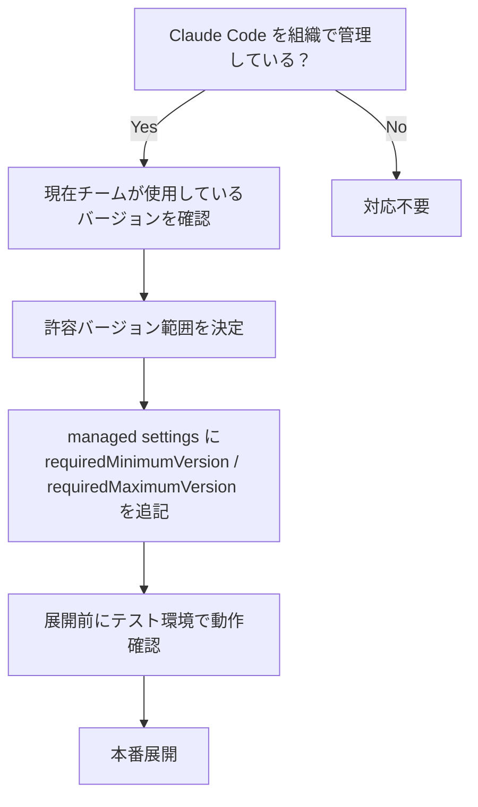

## はじめに

2026年6月5日、Anthropic が Claude Code の新バージョン **v2.1.163** および **v2.1.165** をリリースしました。

今回の目玉は、組織での運用管理を強化する**バージョン強制機能**の追加です。`requiredMinimumVersion` / `requiredMaximumVersion` を使うことで、エンジニアが古いまたは新しすぎるバージョンで Claude Code を起動することをブロックできるようになりました。加えて、`/plugin list` コマンドの追加、Stop/SubagentStop フックの改善、そして `claude -p` ハングや `$TMPDIR` 退行を含む多数のバグ修正が含まれています。

> **📌 影響を受ける人**
> - Claude Code を組織・チームで運用している管理者
> - CI/CD パイプラインで `claude -p` を使っている開発者
> - Bedrock / Vertex AI / Azure AI Foundry 経由で Claude を利用している開発者
> - MCP サーバーやカスタムフックを実装している開発者

---

## 変更の全体像

```mermaid
graph TD
    subgraph v2.1.163
        A[バージョン強制<br/>requiredMinimumVersion/<br/>requiredMaximumVersion] -->|組織ガバナンス| B[起動時バージョンチェック]
        B -->|範囲外| C[起動拒否 → 承認済みバージョンへ誘導]
        B -->|範囲内| D[正常起動]

        E[/plugin list コマンド] -->|--enabled / --disabled| F[プラグイン一覧表示]

        G[Stop/SubagentStop フック] -->|additionalContext 返却| H[フックエラーなしでターン継続]

        I[バグ修正] --> J[claude -p ハング修正]
        I --> K[$TMPDIR 退行修正]
        I --> L[Bedrock/Vertex/Foundry<br/>誤エラー修正]
        I --> M[権限・MCP・エージェント修正]
    end

    subgraph v2.1.165
        N[バグ修正と信頼性向上]
    end
```

---

## 変更内容

### 1. バージョン強制（requiredMinimumVersion / requiredMaximumVersion）

> **⚠️ Breaking Change（組織管理者向け）**
> マネージド設定でバージョン範囲を設定すると、範囲外の Claude Code は起動を拒否されます。既存の設定に追加する場合は、現在チームで使用しているバージョンを事前に確認してください。

| 設定キー | 説明 |
|---|---|
| `requiredMinimumVersion` | この値より古いバージョンの起動を拒否する |
| `requiredMaximumVersion` | この値より新しいバージョンの起動を拒否する |

組織で特定バージョンの Claude Code を強制展開したい場合や、セキュリティ審査済みのバージョン以外の使用を禁止したい場合に活用できます。

### 2. /plugin list コマンド

インストール済みプラグインを一覧表示できる `/plugin list` コマンドが追加されました。`--enabled` / `--disabled` フラグでフィルタリングが可能です。

### 3. Stop/SubagentStop フックの additionalContext 対応

`Stop` および `SubagentStop` フックが `hookSpecificOutput.additionalContext` を返すことで、フックエラー扱いにならずに Claude へフィードバックを渡しつつターンを継続できるようになりました。

### 4. 主なバグ修正一覧

| 修正内容 | 影響範囲 |
|---|---|
| `claude -p` がバックグラウンドコマンド終了後に無限ハングする問題 | CI/CD 利用者 |
| `$TMPDIR` が全コマンドで `/tmp/claude-{uid}` に上書きされる退行（v2.1.154 で混入） | bazel・EDR 保護環境の利用者 |
| `CI=true` かつ API キー未設定時に Bedrock/Vertex/Foundry で誤エラーが発生する問題 | クラウドプロバイダー経由の利用者 |
| Windows で OneDrive 配下などで `EEXIST` エラーが発生する問題 | Windows 利用者 |
| 組織の権限ルールが新規 config ディレクトリ起動中に適用されない問題 | マネージド設定利用者 |
| `claude agents` バックグラウンドセッションが再アタッチ後にタスクを失う問題 | エージェント利用者 |
| フックの `if: "Bash(...)"` 条件が `$()` や `$VAR` を含むコマンドで誤発火する問題 | フック実装者 |
| `$HOME` 経由の deny ルール（例: `Read(~/Desktop/**)` ）が Bash コマンドをブロックしない問題 | 権限設定利用者 |
| stdio MCP サーバーが `--resume` 時に `CLAUDE_CODE_SESSION_ID` を受け取れない問題 | MCP サーバー開発者 |

---

## 影響と対応

### 管理者向け：バージョン強制の設定手順



### CI/CD 利用者向け

`claude -p` のハング問題が修正されました（stdin クローズ後、約5秒でバックグラウンドシェルを停止）。v2.1.154〜v2.1.162 を使用しており CI が不安定だった場合は v2.1.163 以降へのアップデートを推奨します。

### Bedrock / Vertex / Foundry 利用者向け

`CI=true` 環境で `ANTHROPIC_API_KEY` を設定していないにも関わらず `ANTHROPIC_API_KEY required` エラーが出ていた場合、v2.1.163 で修正されています。

---

## コード例

### Before/After：Stop フックの additionalContext

**Before（v2.1.162 以前）**
```json
// hookSpecificOutput に additionalContext を返しても無視される
// フックがフィードバックを返すには exit code を使うしかなかった
{
  "exit_code": 1,
  "message": "処理を停止します"
}
```

**After（v2.1.163 以降）**
```json
// additionalContext を返すとフックエラーなしで Claude へフィードバックを渡せる
{
  "hookSpecificOutput": {
    "additionalContext": "デプロイ前にテストが失敗しています。修正してから再実行してください。"
  }
}
```

> **💡 Tips**
> `additionalContext` を使うと、フックを「エラー」として扱わず Claude のターンを継続させながら追加情報を渡せます。ポストプロセス的なチェックや、条件に応じた追加指示の注入に活用できます。

### バージョン強制の managed settings 設定例

```json
{
  "requiredMinimumVersion": "2.1.163",
  "requiredMaximumVersion": "2.1.165"
}
```

この設定を managed settings に追加すると、v2.1.163 〜 v2.1.165 の範囲外のバージョンでは Claude Code が起動時に拒否メッセージを表示し、承認済みバージョンへのアップデートを案内します。

### Skills の `\$` エスケープ構文

```bash
# v2.1.163 以前：数字の前にリテラルの $ を書けなかった
# v2.1.163 以降：\$ でエスケープできる
echo "バージョン: \$1.2.3"
# → バージョン: $1.2.3
```

---

## まとめ

| リリース | 主な内容 | 対応優先度 |
|---|---|---|
| **v2.1.165** | バグ修正・信頼性向上（詳細非公開） | 低（随時アップデート推奨） |
| **v2.1.163** | バージョン強制機能追加・多数のバグ修正 | **高（CI/CD・組織利用者は早期対応推奨）** |

v2.1.163 は組織ガバナンスの観点で重要な新機能を含みつつ、`claude -p` ハングや `$TMPDIR` 退行など実害の出ていたバグを多数修正しています。特に CI/CD で Claude Code を使っている環境や、Bedrock/Vertex/Foundry 経由で利用している場合は早めのアップデートをお勧めします。
