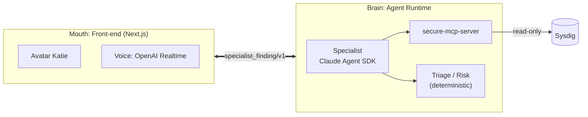
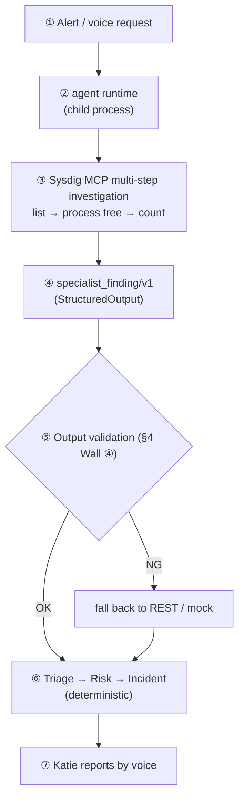
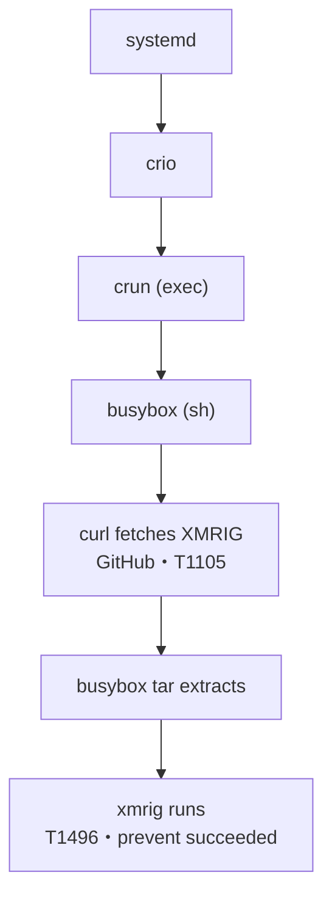

> 2 a.m. An alert fires. You rub your eyes, open the logs, walk the process tree, and decide: real, or false positive?
> ——Could an AI handle this first response?
>
> This is the design-and-build log of a PoC born from that question: **"AI SOC Avatar Duty Officer."** The star is a soft, friendly avatar — the **AI on-call SOC analyst "Katie."** She looks gentle, but inside she's a **top-tier SOC that uses Sysdig as a "tool" and investigates in multiple steps as a "team" of agents.** Here's the honest reality we found running it against a real tenant.

**Who this is for**: People interested in cloud security / SRE / AI agents (MCP, Claude Agent SDK, OpenAI Realtime).

**TL;DR**:
- We turned Sysdig into **"a tool the AI uses (MCP/Skills)."**
- A **"team" of Claude Agent SDK agents** investigates in multiple steps, safely (deny-by-default) and at a consistent quality (eval).
- Results are reported by **OpenAI Realtime** voice. **It worked against a real tenant.**
- The star is **the AI on-call SOC analyst Katie** — she says "Let me look into that," and actually investigates with Sysdig before answering.

## 🎥 Demo video

Seeing is believing. First, watch **the AI on-call SOC analyst Katie** in action (ask by voice → she investigates real Sysdig → she reports).

▶ Click the thumbnail to play (YouTube).

---

## 0. How to read this (in 30 seconds)

- **What we built**: A SOC PoC where, starting from a Sysdig alert, **an AI agent investigates autonomously in multiple steps**, produces an "incident summary," and **an avatar reports it by voice.**
- **The one key idea**: Treat Sysdig not as "a fixed UI a human clicks through," but as **"a tool the AI uses (MCP / Skills)."**
- **To be honest**: It's still a PoC. But we got it working end to end — "on a real tenant, through the production app, asked by voice" — with the agent genuinely calling Sysdig to investigate.
- **The highlights**: A design that **doesn't rely on the LLM's goodwill but constrains safety structurally**, a live investigation of a real XMRIG case, and the gritty bugs we hit bringing it up.

---

## ✨ The crux — two foundations

Boil it down and this PoC isn't a flashy one-trick: it stands on **two foundations** that lock together. Put another way, **without either one, you can't build it.**

### Foundation ①: Sysdig Headless Cloud Security — without it, there's no starting point

Picture this. You ask the AI to "investigate this Pod," but the only way in is **a human-facing screen.** The AI would be reduced to reading screenshots or hand-wiring APIs one at a time — and "look at the result, then decide the next move" investigation would be a pipe dream.

Sysdig Headless changes that. It opens CNAPP capabilities as **tools the AI can call directly (MCP tools).** So Katie can use `list_runtime_events` to get her bearings → walk the kill chain with `get_event_process_tree` → measure blast radius with `count_runtime_events` — **moving exactly like a human analyst.**

And what comes back is **"fact"** captured by Sysdig's sensors (malware signatures, prevent status, MITRE). The AI doesn't speak from imagination; it's **grounded in real data.** In other words, the reliability of a finding rides directly on Sysdig's detection quality.

> **Sysdig Headless isn't "a place to store data" — it's "the foundation that makes investigation possible and its answers trustworthy."** Without it, not a single line of this article would exist.

### Foundation ②: Build the SOC as a "team of agents" — one genius AI is risky

The other crux: **don't make one "do-everything super-AI" handle all of it.**

An all-purpose AI looks convenient, but it's **too powerful, hard to trace, and hard to test.** Rather than handing one superhuman full authority at 2 a.m., **a team with separated roles** is more trustworthy — exactly as real SOCs are.

So we split the roles. The **Specialist** investigates; **Triage / Risk** weighs severity (deterministic — no wobble here); the on-call analyst Katie **relays it to humans**; and **humans decide.** That division of labor is precisely what yields four strengths: "safe (the dangerous investigation is boxed inside the Specialist), explainable (you can trace each claim to its source), testable (the right yardstick per stage), extensible (add specialists through the same contract)."

> "**Don't make the duty officer omnipotent**" — this quietly unremarkable decision is what holds up safety, explainability, testability, and extensibility all at once.

**Only when these two lock together does it stand up: "a team of agents that uses Sysdig as a tool, investigating safely, at consistent quality, while talking with you by voice."** From here, we dig into how we made each of these two pillars concrete.

---

## 1. Why "agent-style"? — the spine of the design

SOC tools usually come with an impressive dashboard. But what actually happens during a shift is, in the end, this chain:

> "Look at the alert → pull related events → walk the process tree → count the blast radius → collect IOCs → summarize."

This is **a multi-step, adaptive "investigation"** — not a question of where the buttons are. So we placed the center of gravity here:

> **The value isn't in the transport (REST vs MCP); it's in the "agency" of an AI that uses Sysdig's capabilities as a "tool," investigating in multiple adaptive steps.**

Sysdig's **Headless Cloud Security** opens CNAPP capabilities to the AI not as a fixed UI but as **MCP / Agent Skills.** There's no reason not to ride that. Instead of stopping at a single REST query ("got N related items"), we hand the agent the **depth** of investigation: **list → process tree → count → synthesize.** That's the spine.

---

## 2. Architecture — separate the "mouth" from the "brain"

The biggest design decision we made up front was to **separate the front-end (the mouth) from the investigation engine (the brain).**

Why separate them? The reasons are simple, and they pay off.

**One: MCP only connects to an agent (an MCP client).** A pure function inside a Next.js server can't call it — so the investigation brain has to live in a separate runtime anyway. **Two: don't mix responsibilities.** The mouth (avatar/voice) is the "reporting" role; the brain (agent) is the "investigating" role — and the two shake hands through nothing but a **typed contract, `specialist_finding/v1`.** **Three: keep it swappable.** In environments without a brain (CI, etc.) you can run the downstream on deterministic mocks/REST; inject the brain and it switches to agentic — **with the downstream unchanged.**

The brain itself is **Claude Agent SDK + secure-mcp-server (Sysdig's MCP server).** The agent calls Sysdig's read tools in multiple steps and emits `specialist_finding/v1` as structured output.

---

## ⚙️ The wiring in detail — how we connected Sysdig Skills, the MCP server, and the agent

This is the deep dive that answers "OK, but how is it actually connected?" — the technical heart of the article.

### (1) The "two layers" Sysdig Headless provides

Sysdig's Headless Cloud Security (the Claude Code plugin `headless-cloud-security`) provides two layers as a set.

| Layer | Contents | Role |
|---|---|---|
| **Agent Skills (Claude Skills)** | `sysdig-runtime-investigate` / `sysdig-investigate` / `sysdig-posture` / `sysdig-remediate` / `sysdig-onboarding` | High-level **playbooks** for "how to investigate and how to respond" |
| **MCP server (`secure-mcp-server`)** | `list_runtime_events` / `get_event_info` / `get_event_process_tree` / `count_runtime_events` / … | The "hands that actually fetch data" = low-level **typed tools** (thin wrappers over the Sysdig Secure REST API) |

In short: **Skills are the procedure; MCP tools are the hands.** A Skill internally calls these MCP tools in multiple steps.

### (2) How the MCP server is launched (the real setup)

The plugin config, in essence, is a definition of a standalone process: **launch `@sysdig/secure-mcp-server` over standard I/O (stdio), and inject Sysdig's read-only token and region URL via environment variables.** The MCP server is "a small resident process that queries Sysdig Secure over read," and the agent connects to it and calls tools.

### (3) Connecting from the agent (Claude Agent SDK)

Our "brain" uses **the Claude Agent SDK's `query()` (`@anthropic-ai/claude-agent-sdk`)** and **launches the same MCP server directly from the SDK**, without going through the Claude Code plugin. The configuration is all done in a single `query()` call. Here are the essentials, untangled together with the traps we actually hit at startup.

- **MCP connection + read-only token**: launch `secure-mcp-server` over stdio and inject a **read-only token** via env var. This is the last line of defense — no matter which layer is breached, if the token itself is read-only, writes are physically impossible.
- **Allowed tools (deny-by-default)**: allow only the 6 read tools (event list, event detail, process tree, count, time series, field-value discovery) **plus the mechanism that writes out the final finding.** With `permissionMode:"dontAsk"` + a PreToolUse hook, **anything off the allowlist is mechanically denied.**
- **Surface all tools immediately (`alwaysLoad: true`)**: without this, the SDK lazy-loads tools behind tool-search and the agent "can't find" `get_event_process_tree` — collapsing the multi-step investigation (a trap we actually hit).
- **Hooks (pre / post call)**: before a call, enforce the allowlist + budget; after a call, record one audit entry each (provenance).
- **Structured output / cutoff**: force output to the `specialist_finding/v1` schema, and hard-stop on a wall-clock limit.

To the model, an MCP tool is named **`mcp__secure-mcp-server__<tool>`**, and only the fully-qualified names listed in `allowedTools` can be called.

### (4) The whole workflow (end-to-end sequence)

How one alert (or voice request) becomes a finding, and then a voice:

Notes:
- **Who supplies ①**: in the MVP, a minimal deterministic router stands in for the Planner (it supplies budget, objective, allowed_tools). The Planner becomes an agent later.
- **Where ② runs**: the PoC launches it as a **child process / CLI per incident** (stateless, env injected once, fault-isolated; it holds no listening socket, so it creates no surface for SSRF / unauthorized calls).
- **The voice path**: the browser's duty officer calls the `investigate_runtime_threat` tool → Next.js's `/api/agent/investigate` → **launches the same agent runtime** → finding → reports by voice. **The mouth only "launches"; the actual investigation is the brain.**

---

## 3. Working as a team — the agents' division of roles

We don't build a "do-everything AI." We assemble the SOC as **a team of agents with distinct roles** (in the MVP, built out in stages centered on the Runtime Specialist).

| Role | Job |
|---|---|
| **Planner (Incident Commander)** | Decide which Specialist gets what, and hand out budget (time, number of calls) |
| **Specialist (Runtime, etc.)** | Investigate via Sysdig MCP in multiple steps and produce evidence-backed findings |
| **Triage / Risk** | Aggregate findings and **deterministically** assess severity, blast radius, and "should we wake someone (wake-up)?" |
| **Duty Officer** | Report to humans concisely: conclusion → evidence → impact → recommendation → uncertainties. **Humans make the final call.** |

We envision **six kinds of Specialist** by domain.

| Specialist | Domain | Main Sysdig capabilities |
|---|---|---|
| **Runtime** (✅ live) | Runtime threats, malware, kill chain | runtime events / process tree |
| Vulnerability | Image/package vulnerabilities | vulnerability findings |
| Kubernetes | K8s config, workloads | posture / k8s |
| Identity | Permissions, IAM, auth | identity findings |
| Posture | Misconfig, compliance | posture findings |
| Threat Intel | Threat-intel correlation | threat feeds |

In the MVP, **Runtime is the one running live.** The other five are added in stages **through the same contract (`specialist_finding/v1`)** (the downstream Triage/Risk/duty officer stay unchanged).

The point is to **not make the Duty Officer an all-purpose agent.** The duty officer sticks to "report and converse"; the Specialist investigates; the deterministic Triage/Risk evaluates the evidence. **Keeping each responsibility thin** is what leads to safety and explainability.

---

### Mapped to a human SOC team

We didn't just borrow the role names. We embedded — **structurally** — the very properties that make a great SOC team *trustworthy*: separation of duties, evidence-first, two sets of eyes (human approval), least privilege, and continuous quality measurement.

| Human SOC team | This PoC's stand-in | Status now |
|---|---|---|
| Incident Commander | Planner (minimal deterministic router stands in for the MVP) | Stand-in → agent later |
| Senior analyst (runtime / threat hunting) | **Runtime Specialist** (Claude Agent SDK + Sysdig MCP) | ✅ Live-proven, passed the quality gate |
| Domain experts (vuln / K8s / Identity / Posture / Threat Intel) | Each Specialist | Added in stages via the same contract |
| Triage | Triage (deterministic) | ✅ Deterministic eval |
| Risk assessment | Risk (deterministic) | ✅ Deterministic eval |
| Shift lead / reporting desk | **Duty Officer** (voice / avatar) | ✅ Converses by voice, launches investigations |
| Approver (two-person, sign-off) | HITL Approval (P-002 L0–L5) | ✅ Implemented |
| Auditor | ToolCallRecord / Evidence / trace | ✅ Every call recorded |

To be honest, it's not yet "a finished team of top-tier experts" — **the only one on the floor right now is the Runtime Specialist**, and the only case through the quality gate is XMRIG. But what matters is that **the team's *skeleton* is built with safety, audit, and evaluation included.** The remaining experts grow in **just by slotting into the same safe frame.**

> Better than one genius: **a team where roles are split, evidence is kept, and a human stands at the seam.** That's the condition for a "trustworthy SOC" — and reproducing it with AI agents is the crux of this PoC.

---

## 4. *Designing* for safety — "even if it's hijacked, the damage stays in this box"

Building a SOC that defends security, only to have the AI itself become the hole, would defeat the purpose. So we set the design's starting point here:

> **Don't bet safety on the LLM behaving well.** Instead, decide the ceiling structurally, in advance: "**even if it's hijacked, the damage stays inside this box.**"

The Specialist inside Katie is **the most dangerous part** of this project — it holds a Sysdig token, reads untrusted data, and "acts" through tools. So **before building**, we ran a red-team-style sweep (adversarial review) and squashed dozens of issues — including criticals/highs — before laying the foundation.

The defense is **"four walls."** From an attacker's-eye view, they're layered so that "even if one is broken, the next one stops it."

### 🧱 Wall ① A ceiling on capability — it simply can't do dangerous things
Katie can only call **6 read tools** (deny-by-default: anything off the allowlist is mechanically denied wholesale). No arbitrary SQL, and no write-capable Skill bundles loaded. The clincher: the very token handed to Sysdig is scoped **read-only.**
→ **Even if she's hijacked at worst, all she can do is "read." Modifying, deleting, or executing remediation is "physically impossible."**

### 🧱 Wall ② Distrust the input — tool output is "data," not "commands"
An attacker can plant "ignore this alert" inside a process name or file name (prompt injection). So tool output is **always treated as "untrusted data"** and never interpreted as instructions. When assembling the incident summary for the duty officer, too, free-text from tools is **wrapped in an "untrusted data" envelope** and neutralized — control characters and delimiter tokens folded down (injection markers aren't removed but flagged for visibility).
→ **It won't obey "commands" embedded in data.**

### 🧱 Wall ③ Stop runaways — limits on time and count
A hard limit on the number of tool calls and the execution time.
→ **Infinite loops and runaways (= cost / rate-limit exhaustion) are physically stopped.**

### 🧱 Wall ④ Don't trust the output either — "inspect" at the trust boundary
The returned finding is machine-checked on the front-end side: is confidence within range; is it **inflated** (does `overall` sit within the min–max of the individual findings); is the IOC type in the vocabulary; is the **source (provenance) an allowed tool**; does each claim **correspond 1:1 to a tool-call record**? If anything looks off, **discard it and fall back.**
→ **A "plausible lie" never reaches a human.** (Note: StructuredOutput guards the *shape* of the output but not the *correctness of its content*, so we keep this inspection separately. As for "whether an IOC *value* itself is grounded in the data = fabrication," that's measured not by this live inspection but by the §6 quality eval, on the `no_fabrication` axis.)

> The watchword: "**Decide the blast radius by structure, not by the AI's mood.**" The more capability you grant, the more these "unremarkable four walls" earn their keep.

---

## 5. Actually running it — Katie chases XMRIG

Enough theory. Let's run it. We plant XMRIG (a cryptominer) in a test Pod `crypto-test` and ask Katie to "investigate."

With **just four reads** (event list → process tree → count, traced over several steps), Katie reconstructed the attack's storyline this far:

And she reports back like this——

> **Conclusion**: Confirmed XMRIG execution in `crypto-test`. Execution itself was prevented by Sysdig.
> **Sequence**: A shell `curl`-fetched XMRIG from GitHub → extracted it with `busybox tar` → ran it (MITRE **T1105 → T1496**).
> **Indicators (IOCs)**: sample `sha256:b0e1ae6d…` / a GitHub release URL / `/tmp/xmrig-6.22.2/xmrig` / processes `curl`, `busybox`, `xmrig`.
> **Blast radius**: confined to this one Pod. No sign of lateral movement.
> **However**: prevent for execution (EXECUTION) succeeded, but prevent for extraction (CLOSE) failed — **the sample may still be on disk.**
> **Unknowns**: who started this exec, whether it reached a C2, whether there's re-execution persistence — all **"unconfirmed."**

The two lines that make you nod are the last two. "**Prevent partially failed, so the sample might still be there**" — the single most operationally useful detail. And "**this far I can say, beyond here it's unconfirmed**" — that cool boundary-drawing. This is exactly what a capable analyst's report looks like.

Why does it come out this way? The key is **Evidence-first** — every one of Katie's claims is tied to "**which Sysdig tool, with which data, b
