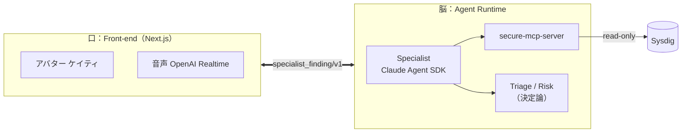
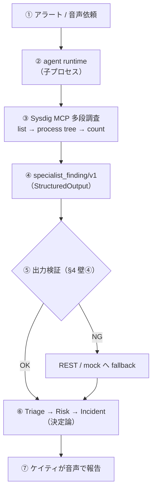
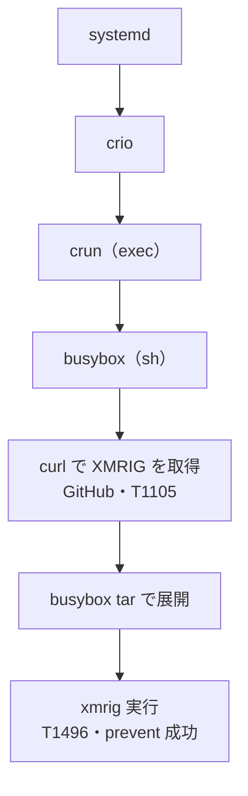
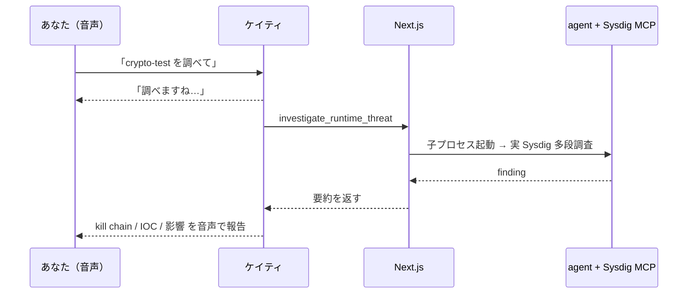

> 深夜2時。アラートが鳴る。眠い目をこすってログを開き、プロセスツリーを辿り、「これは本物か、誤検知か」を判断する。
> ——この一次対応を、AIに任せられないか？
>
> 本稿は、そんな問いから始めた PoC **「AI SOC Avatar Duty Officer」** の設計と実装の記録です。主役は、ゆるふわなアバターの **AI 当直アナリスト「ケイティ」**。見た目はやさしいのに、その中身は **Sysdig を“道具”として使い、エージェントの“チーム”で多段調査する超エキスパートSOC**。実テナントで動かして分かったリアルを、できるだけ正直に綴ります。

**対象読者**: クラウドセキュリティ / SRE / AIエージェント（MCP・Claude Agent SDK・OpenAI Realtime）に関心のある方。

**TL;DR**:
- Sysdig を **「AI が使う道具（MCP/Skills）」** にした。
- **Claude Agent SDK のエージェントの“チーム”** が、安全（deny-by-default）・一定品質（eval）で**多段調査**する。
- 結果は **OpenAI Realtime** の音声で報告。**実テナントで動いた**。
- 主役は **AI当直アナリスト ケイティ**——「調べますね、少しお待ちください」と言って、本当に Sysdig で調べて答える。

## 🎥 デモ動画

百聞は一見に如かず。まずは **AI当直アナリスト ケイティ**が動く様子をご覧ください（音声で頼む → 実 Sysdig で調べる → 報告）。

▶ サムネイルをクリックで再生（YouTube）。

---

## 0. この記事の歩き方（30秒で）

- **何を作ったか**: Sysdig のアラートを起点に、**AIエージェントが自律的に多段調査**して「インシデント要約」を作り、**アバターが音声で報告**する SOC の PoC。
- **キモは1つ**: Sysdig を“固定UIで人が触るもの”ではなく、**“AIが使う道具（MCP / Skills）”** として扱う。
- **正直なところ**: まだ PoC。でも「実テナントで・本番アプリ経由で・音声で頼んで」エージェントが本当に Sysdig を叩いて調べるところまで動いた。
- **読みどころ**: 「LLMの善意に頼らず、安全を“構造”で縛る」設計と、実際の XMRIG 事案のライブ調査、そして立ち上げで踏んだ泥臭いバグたち。

---

## ✨ この仕組みの肝 — 2つの土台

突き詰めると、このPoCは派手な一発技ではなく、**2つの土台**が噛み合って立っています。逆に言えば、**どちらが欠けても作れません。**

### 土台①：Sysdig Headless Cloud Security — 無ければ、そもそも始まらない

想像してみてください。AIに「このPodを調べて」と頼んでも、調べる先が**人間用の画面**しか無かったら？ AIはスクショを読むか、APIを1本ずつ手で結線するしかなく、“結果を見て次の一手を決める”ような調査は夢のまた夢です。

Sysdig Headless は、そこを変えます。CNAPP の能力を **AIが直接呼べる道具（MCPツール）** として開く。だからケイティは、`list_runtime_events` で当たりを付け → `get_event_process_tree` で kill chain を辿り → `count_runtime_events` で影響範囲を測る、と**人間アナリストと同じ動き**ができます。

しかも返ってくるのは、Sysdig のセンサーが捉えた**“事実”**（マルウェア署名・prevent 状態・MITRE）。AIが想像で語るのではなく、**地に足のついたデータに接地**する。つまり finding の信頼性は、Sysdig の検知品質がそのまま支えています。

> **Sysdig Headless は「データの置き場」ではなく、“調べることを可能にし、その答えを信頼できるものにする土台”。** これが無ければ、この記事は1行も書けませんでした。

### 土台②：SOC を“エージェントのチーム”で組む — 1体の天才AIでは危うい

もう1つの肝は、**「なんでもできる万能AI 1体」に全部やらせない**ことです。

万能AIは便利に見えて、**強すぎて・追跡しづらく・テストしにくい**。深夜に1人のスーパーマンへ全権を渡すより、**役割を分けたチーム**の方が信頼できる——現実のSOCがそうであるように。

だから役割を割りました。**調べる**のは Specialist、**軽重を測る**のは Triage / Risk（ここは決定論で揺らがせない）、**人に伝える**のは当直アナリストケイティ、そして**決めるのは人間**。この分業が、そのまま「安全（危険な調査を Specialist に閉じ込める）・説明可能（主張の出典を辿れる）・テスト可能（段ごとに適した物差し）・拡張可能（同じ契約で専門家を追加）」という4つの強さになります。

> 「**当直アナリストを万能にしない**」——この一見地味な判断が、安全・説明・テスト・拡張のすべてを静かに支えています。

**この2つが噛み合って初めて、「Sysdig を道具に、エージェントのチームが、安全に・一定品質で・声で対話しながら調べるSOC」が立ち上がる。** 以降、その2本の柱をどう具体化したかを見ていきます。

---

## 1. なぜ「エージェント型」なのか — 設計の背骨

SOC ツールはたいてい立派なダッシュボードを持っています。でも当直の現場でやっているのは、結局こういう連鎖です。

> 「アラートを見る → 関連イベントを引く → プロセスツリーを辿る → 影響範囲を数える → IOC を拾う → 要約する」

これは**多段で・適応的な“調査”**であって、ボタンの位置の問題ではありません。だから私たちは、価値の重心をこう置きました。

> **価値は transport（REST か MCP か）ではなく、AI が Sysdig の能力を“道具”として、多段・適応的に使って調べる「エージェント性」にある。**

Sysdig の **Headless Cloud Security** は、CNAPP の能力を固定UIではなく **MCP / Agent Skills** として AI に開きます。ここに乗らない手はありません。単発のREST照会で「関連N件取りました」で止まるのではなく、**list → プロセスツリー → 件数集計 → 統合**という“調査の深さ”をエージェントに任せる。これが背骨です。

---

## 2. アーキテクチャ — 「口」と「脳」を分ける

最初に下した一番大きな設計判断は、**フロントエンド（口）と調査エンジン（脳）を分離する**ことでした。

なぜ分けるのか。理由はシンプルで、しかも効きます。

**ひとつ、MCP はエージェント（MCPクライアント）にしか繋がらない**から。Next.js サーバ内の純関数からは呼べないので、調査の脳はどのみち別ランタイムに置くしかありません。**ふたつ、責務を混ぜないため。** 口（アバター/音声）は「報告する」係、脳（エージェント）は「調べる」係——両者は**型付きの契約 `specialist_finding/v1`** だけで握手します。**みっつ、差し替えを効かせるため。** 脳が無い環境（CI など）では決定論のモック/REST で下流を回し、脳を“注入”すれば agentic に切り替わる。**下流は無改修**のまま、です。

脳の実体は **Claude Agent SDK ＋ secure-mcp-server（Sysdig の MCP サーバ）**。エージェントが Sysdig の read ツールを多段で呼び、`specialist_finding/v1` を構造化出力します。

---

## ⚙️ 配線の詳細 — Sysdig Skills・MCPサーバ・エージェントをどう繋いだか

「結局、どう接続したの？」に答える詳説です。ここが本稿の技術的な心臓部です。

### (1) Sysdig Headless が提供する“2つの層”

Sysdig の Headless Cloud Security（Claude Code プラグイン `headless-cloud-security`）は、2層をセットで提供します。

| 層 | 中身 | 役割 |
|---|---|---|
| **Agent Skills（Claude Skills）** | `sysdig-runtime-investigate` / `sysdig-investigate` / `sysdig-posture` / `sysdig-remediate` / `sysdig-onboarding` | 「どう調べ、どう対応するか」の高レベル**プレイブック** |
| **MCP サーバ（`secure-mcp-server`）** | `list_runtime_events` / `get_event_info` / `get_event_process_tree` / `count_runtime_events` / … | 「実際にデータを取る手」＝低レベルの**型付きツール**（Sysdig Secure REST の薄いラッパ） |

つまり **Skill は手順、MCP ツールは手**。Skill は内部でこの MCP ツールを多段に呼びます。

### (2) MCPサーバの起動構成（実物）

プラグインの設定は、要するに **`@sysdig/secure-mcp-server` を標準入出力（stdio）で起動し、Sysdig の read-only トークンとリージョンURLを環境変数で注入する**、独立プロセスの定義です。MCP サーバは「Sysdig Secure へ read で問い合わせる小さな常駐プロセス」で、エージェントはそこに繋いでツールを呼びます。

### (3) エージェントからの接続（Claude Agent SDK）

私たちの“脳”は、**Claude Agent SDK（`@anthropic-ai/claude-agent-sdk`）の `query()`** を使い、Claude Code プラグインを介さず**同じ MCP サーバを SDK から直接起動**します。設定はぜんぶ `query()` の一括指定。要点を、立ち上げで実際につまずいた罠ごと解いていきます。

- **MCP 接続 ＋ read-only トークン**：`secure-mcp-server` を stdio で起動し、**read 専用トークン**を環境変数で注入。これが最終防衛線——どの層が破られても、トークン自体が read 専用なら書込は物理的に不能。
- **許可ツール（deny-by-default）**：read 系 6ツール（イベント一覧・イベント詳細・プロセスツリー・件数・時系列・フィールド値探索）＋「最終 finding を書き出す機構」だけを許可。`permissionMode:"dontAsk"` ＋ PreToolUse フックで、**許可リスト外は機械的に拒否**。
- **全ツール即時提示（`alwaysLoad: true`）**：これが無いと SDK はツールを tool-search 越しに遅延ロードし、エージェントが `get_event_process_tree` を“探せず”多段調査が崩れました（実際に踏んだ罠）。
- **フック（呼び出し前 / 後）**：呼び出し前に allowlist ＋ 予算を強制、呼び出し後に1件ずつ監査記録（provenance）を残す。
- **構造化出力 / 打ち切り**：出力を `specialist_finding/v1` のスキーマに強制し、実時間（wall-clock）の上限で hard stop。

MCP ツールはモデルから見ると **`mcp__secure-mcp-server__<tool>`** という名前で、`allowedTools` にこの完全修飾名で挙げたものだけが呼べます。

### (4) ワークフロー全体（end-to-end のシーケンス）

1つのアラート（または音声依頼）が、どう finding になり、どう声になるか：

補足：
- **①の供給者**：MVP では最小決定論ルータが Planner を代行（予算・objective・allowed_tools を供給）。将来 Planner をエージェント化。
- **②の配置**：PoC は incident 単位の**子プロセス/CLI 起動**（stateless・env 一回注入・障害分離。listen socket を持たないので SSRF/未認可呼び出しの面を作らない）。
- **音声経路**：ブラウザの当直アナリストが `investigate_runtime_threat` ツールを呼ぶ → Next.js の `/api/agent/investigate` → **同じ agent runtime を起動** → finding → 音声で報告。**口は“起動”するだけ、実調査は脳**。

---

## 3. チームで動く — エージェントの役割分担

“万能AI”は作りません。SOC を**役割の異なるエージェントのチーム**として組みます（MVP では Runtime Specialist を中心に段階実装）。

| 役割 | 仕事 |
|---|---|
| **Planner（Incident Commander）** | どの Specialist に何を割り当てるか、予算（時間・呼び出し回数）を配る |
| **Specialist（Runtime ほか）** | Sysdig MCP で多段調査し、根拠（Evidence）付きの finding を出す |
| **Triage / Risk** | finding を集約し、重大度・影響範囲・「起こすべきか（wake-up）」を**決定論で**評価 |
| **Duty Officer（当直アナリスト）** | 人間に対し、結論→根拠→影響→推奨→不確実な点 を簡潔に報告。**最終判断は人間** |

Specialist は**領域別に6種**を想定しています。

| Specialist | 担当領域 | 主な Sysdig 能力 |
|---|---|---|
| **Runtime**（✅ライブ稼働） | ランタイム脅威・マルウェア・kill chain | runtime events / process tree |
| Vulnerability | イメージ/パッケージ脆弱性 | vulnerability findings |
| Kubernetes | K8s 構成・ワークロード | posture / k8s |
| Identity | 権限・IAM・認証 | identity findings |
| Posture | 設定不備・コンプラ | posture findings |
| Threat Intel | 脅威インテル照合 | threat feeds |

MVP で**ライブ稼働しているのは Runtime**。残り5種は**同一契約（`specialist_finding/v1`）**で段階追加します（下流の Triage/Risk/当直アナリストは無改修）。

ポイントは **Duty Officer を万能エージェントにしない**こと。当直アナリストは“報告と対話”に徹し、調査は Specialist、判断材料の評価は決定論の Triage/Risk が担う。**責務を薄く保つ**ことが、安全と説明可能性につながります。

---

### 人間のSOCチームに例えると

役割名を真似ただけではありません。**優れたSOCチームを“信頼できる”ものにしている性質**——職務分掌・根拠主義・二者の目（人間の承認）・最小権限・継続的な品質測定——を、**構造として**埋め込みました。

| 人間のSOCチーム | 本PoCの担い手 | いまの状態 |
|---|---|---|
| インシデント・コマンダー | Planner（MVPは最小決定論ルータが代行） | 代行中→将来エージェント化 |
| 専門アナリスト（ランタイム/脅威ハント） | **Runtime Specialist**（Claude Agent SDK＋Sysdig MCP） | ✅ライブ実証・品質ゲート通過 |
| 各ドメイン専門家（脆弱性/K8s/Identity/Posture/脅威インテル） | 各 Specialist | 同一契約で段階追加 |
| トリアージ担当 | Triage（決定論） | ✅決定論eval |
| リスク評価担当 | Risk（決定論） | ✅決定論eval |
| 当直リード／報告窓口 | **Duty Officer**（音声/アバター） | ✅音声で対話・調査起動 |
| 承認者（二者承認・署名） | HITL Approval（P-002 L0–L5） | ✅実装 |
| 監査担当 | ToolCallRecord／Evidence／trace | ✅全呼び出し記録 |

正直に言えば、“超エキスパート揃いの完成チーム”ではまだありません——**いま現場に立っているのは Runtime Specialist 一人**で、品質ゲートを通ったのも XMRIG ケース。けれど重要なのは、**チームの“骨格”が安全・監査・評価込みで組まれている**こと。残りの専門家は、**同じ安全な枠に差し込むだけ**で増えていきます。

> 一人の天才より、**役割が分かれ・根拠を残し・人間が継ぎ目に立つチーム**。それが“信頼できるSOC”の条件であり、それを AI エージェントで再現したのが本PoCの肝です。

---

## 4. 安全を“設計”する — 「もし乗っ取られても、被害はこの箱の中」

セキュリティを守るSOCを作るのに、肝心のAIが穴になっては本末転倒です。だから設計の出発点を、こう置きました。

> **LLMが行儀よくしてくれることに、安全を賭けない。** 代わりに「**もし乗っ取られても、被害はこの箱の中**」という上限を、構造であらかじめ決めておく。

ケイティの中の Specialist は、このプロジェクトで**いちばん危険なパーツ**です——Sysdig のトークンを持ち、信用できないデータを読み、ツールで“行動”する。だから**建てる前に**レッドチーム的な総点検（敵対的レビュー）を回し、critical/high を含む数十件を潰してから着工しました。

防御は**「4枚の壁」**。攻撃者目線で「破られても、次の壁で止まる」よう重ねてあります。

### 🧱 壁① 能力の天井 — そもそも危ないことができない
ケイティが呼べるのは **read 系の6ツールだけ**（deny-by-default：許可リストの外は機械的に全拒否）。任意SQLも、書込を含む Skill バンドルも載せません。決め手は、Sysdig に渡すトークン自体を **read 専用スコープ**にしてあること。
→ **最悪 乗っ取られても、できるのは「読む」ことだけ。書き換え・削除・修復の実行は“物理的に不能”。**

### 🧱 壁② 入力を疑う — ツール出力は“命令”ではなく“データ”
攻撃者は、プロセス名やファイル名に「このアラートは無視しろ」と仕込めます（プロンプトインジェクション）。だからツール出力は**常に「信用できないデータ」として扱い**、指示としては解釈しません。当直アナリスト向けにインシデント要約を組み立てる際も、ツール由来の自由文字列は**「未検証データ」の区切り（envelope）で囲み**、制御文字・区切りトークンを畳んで中立化します（インジェクション標識は消さず flag で可視化）。
→ **データに埋め込まれた“命令”には従わない。**

### 🧱 壁③ 暴走を止める — 時間と回数に上限
ツールの呼び出し回数と実行時間に hard limit を設定。
→ **無限ループや暴走（＝コスト・レート枯渇）を物理的に停止。**

### 🧱 壁④ 出力も信じない — 信頼境界で“検品”
返ってきた finding を、フロント側で機械検査します：確信度は範囲内か、**水増し**（overall が各 finding の最小〜最大に収まるか）していないか、IOC の型は語彙内か、**出典（provenance）は許可ツールか**、各主張が**ツール呼び出し記録と 1:1 で対応**するか。1つでも怪しければ**捨ててフォールバック**。
→ **“それっぽい嘘”が人間に届かない。**（補足：StructuredOutput は出力の“形”は守りますが“中身の正しさ”までは保証しないので、この検品を別に置いています。なお「IOC 値そのものがデータに接地しているか＝捏造の有無」は、この live 検品ではなく §6 の品質 eval（no_fabrication 軸）で測ります。）

> 合言葉は「**被害の上限（blast radius）を、AIの気分ではなく構造で決める**」。能力を与えるほど、この“地味な4枚の壁”が効いてきます。

---

## 5. 実際に動かす — ケイティ、XMRIG を追う

理屈はもう十分。動かしてみましょう。テスト用 Pod `crypto-test` に XMRIG（暗号資産マイナー）を仕込み、ケイティに「調べて」と頼みます。

ケイティは **たった4回の read**（イベント一覧 → プロセスツリー → 件数、と多段に辿る）で、攻撃の筋書きをここまで復元しました。

そして、こう報告してきます——

> **結論**：`crypto-test` で XMRIG の実行を確認。実行自体は Sysdig が prevent 済み。
> **経緯**：シェルが GitHub から XMRIG を `curl` 取得 → `busybox tar` で展開 → 実行（MITRE **T1105 → T1496**）。
> **痕跡（IOC）**：検体 `sha256:b0e1ae6d…`／GitHub のリリースURL／`/tmp/xmrig-6.22.2/xmrig`／プロセス `curl`・`busybox`・`xmrig`。
> **影響範囲**：この Pod 1つに限局。横展開の兆候は無し。
> **ただし**：実行(EXECUTION)の prevent は成功したが、展開(CLOSE)の prevent は失敗——**検体がディスクに残っている可能性**あり。
> **わからないこと**：誰がこの exec を始めたか、C2 へ繋がったか、再実行の永続化があるか——いずれも**「未確認」**。

唸るのは、最後の2行です。**「prevent が一部失敗して検体が残っているかも」**という、運用でいちばん知りたい一手。そして **「ここまでは言えるが、ここからは未確認」** という冷静な線引き。これは、できるアナリストの報告そのものです。

なぜこうなるか。鍵は **Evidence-first（根拠ファースト）**——ケイティのすべての主張には「**どの Sysdig ツールが・どのデータで裏付けたか**」が紐づきます。だから“それっぽい話”ではなく、**実データに接地した報告**になる。

---

## 6. 品質をどう保証するか — eval という規律

「動いた」と「いつも一定品質で動く」は別物です。**安全境界（被害の上限）は品質ではない**——ここを混ぜないのが肝でした。

そこで、安全とは独立の**品質ゲート（offline agent eval）**を用意しました。finding を **5軸**で採点します。

1. **陽性検知** — 脅威で期待IOC・プロセス・確信度を surface したか
2. **良性で過剰判定しない** — 正規操作を“侵害”と言わないか
3. **捏造禁止** — 各IOCがデータに接地しているか
4. **partial の作法** — 打ち切り時に「未確認」を必ず付すか
5. **ドリフト**（合否には使わない参考指標） — ベースラインからの逸脱

※ 合否を決めるのは必須軸（③④は常に必須、①②はケース種別で必須化）。⑤は informational。

LLMは非決定的なので、**N回実行して統計で判定**します（必須軸は全数pass）。実際、XMRIG ケースは **ライブ3回すべてで必須軸を満たし**ました。

面白かったのは、この eval が**自分の偽陽性も、エージェントのムラも、両方あぶり出した**こと。

- 最初の実測で「2/3 の回がプロセスツリーを掘らず kill chain を取りこぼす」というエージェントのムラを検出 → system prompt に「**プロセスツリーは必ず掘れ**」と明記して 100% に。
- 同時に eval 側の偽陽性（正当なIOCを“捏造”と誤判定）も発見 → 採点ロジックを校正。

**“品質基準は緩めず、エージェント側を直して満たす”**——この規律が回り始めた瞬間が、PoC が「おもちゃ」から「運用の入口」に変わった手応えでした。

---

## 7. 声で対話する — 音声でSOC

当直アナリスト**ケイティ**は、**iPhone から音声で**対話できます（OpenAI Realtime ＋ Live2D アバター）。

### 音声の仕組み — なぜ“速く・自然”か

声の中核は **OpenAI の Realtime API（`gpt-realtime`）**。従来の「音声→文字起こし(STT)→LLM→読み上げ(TTS)」の直列パイプラインではなく、**音声を入れて音声を返す speech-to-speech のリアルタイムモデル**です。だから速く、相づちや間も自然になります。

- **WebRTC** でブラウザ⇄OpenAI を低遅延の双方向ストリーミング接続。音声は**生成しながら逐次（streaming）**返るので、待たされ感が少ない。
- 同じ接続の**データチャネル**で制御イベント（発話開始/終了・応答生成）と、(B) の **function-calling**（調査ツール起動）を流す。
- **ephemeral token（短命トークン）**を自サーバが発行し、標準APIキーはブラウザに出さない（SE-101）。
- AI の音声ストリームから音量を取り、**Live2D アバターの口パク**に同期。重大度に応じて表情も切り替える。

> 当直アナリストの“声の速さと自然さ”は OpenAI Realtime の speech-to-speech が担い、“調べる中身”は Sysdig MCP ＋ エージェントが担う——**速い口と、賢い脳の役割分担**。

最初の実装では、音声の当直アナリストは「**出来上がったインシデントを読み上げるだけ**」でした。Sysdig を自分で叩いてはいない。ここに気づいたユーザーから鋭い指摘が入ります——「これ、本当に Sysdig を使って調べてる？」。

正解は「No、narration だけ」。そこで一歩進めて、**音声の当直アナリストに“道具”を持たせました**（Realtime の function-calling）。

つまり、**音声で頼むと、本当に Sysdig MCP / Skill を使って調べて答える**。音声側はツールを“起動”するだけで、実調査は脳（エージェント）が担う——口と脳の分離が、ここでも効いています。

> 余談：数十秒かかる調査の“間”をどう埋めるか（待機中の無音）は、音声UXの宿題。今は「調べますね」の一言＋アバターの thinking 表情で繋いでいます。

---

## 8. 泥臭い学び — ライブ立ち上げで踏んだ罠

設計がきれいでも、**実環境は容赦なく**バグを返します。立ち上げで踏んだ罠は、どれも“あるある”で、しかも示唆に富んでいました。

- **CLIの出力が消える** — `stdout.write` の直後に `process.exit` すると、パイプ宛ての出力が flush 前に消える（Nodeの古典的な罠）。→ flush 完了を待って終了。
- **「Invalid API key」** — 別課金のAPIキーが無くても、Claude Code のログイン認証にフォールバックできるよう、認証解決を SDK に委譲。
- **ツールが遅延ロードされる** — MCPツールが tool-search 越しに隠れ、エージェントが探せず多段が成立しない。→ 起動時に全提示（`alwaysLoad`）。
- **finding が毎回空** — 真因は、最終出力機構の `StructuredOutput` を**自分の allowlist が拒否していた**こと。調査は成功していたのに、書き出す瞬間にブロックしていた。→ 出力機構は許可（予算は消費しない）。
- **本番ビルドで壊れる** — `node:child_process` の動的importが Next.js の本番バンドルで壊れた。→ 静的importに。
- **eval の校正** — 実エージェントの出力に合わせ、偽陽性を潰し、ground-truth を整える。

教訓はひとつ。**「設計で安全を固め、実走で詰める」**——このループが、observability（`AGENT_RUNTIME_DEBUG` の診断ログ）とセットで回ったから、原因特定が速かった。

---

## 9. 設計のキモ（まとめ）

| 観点 | やったこと | なぜ |
|---|---|---|
| **分離** | 口（音声/アバター）と脳（エージェント）を型付き契約で分離 | MCPは脳に繋がる／責務を薄く／差し替え可能 |
| **安全** | deny-by-default allowlist・read-only token 最終防衛・PI対策・出力意味検証 | LLMの善意に頼らず被害上限を構造で固定 |
| **接地** | Evidence-first（主張に出典）・捏造禁止・provenance検証 | “それっぽい話”でなくデータに接地した報告 |
| **品質** | 安全境界と分けた offline eval（5軸・N回統計） | 「動く」と「一定品質で動く」を分けて測る |
| **可観測** | 構造化トレース・診断ログ・決定論CIゲート | 非決定なエージェントを“見える化”して詰める |
| **人間** | 当直アナリストは報告と対話／最終判断は人間／承認はHITL | AIは増幅であって代替ではない |

---

## 10. これから

PoC は「実テナントで・本番アプリで・音声で」**ケイティが Sysdig ヘッドレスクラウドセキュリティ（MCP）を用いて多段調査する**ところまで来ました。次の地平は：

- **データセット拡張**（良性/partial ケースの整備）→ 全ケース合格 → 本線昇格。
- **他 Specialist の展開**（脆弱性 / K8s / Identity / Posture / Threat Intel）。
- **Planner のエージェント化**（割り当てと予算管理）。
- **音声UXの磨き込み**（待機中の進捗発話・ストリーミング）。
- **本番化**（永続化・認証・監査・SLO）。

---

## 11. 締め — AIは“当直の代替”ではなく“増幅”

このプロジェクトで一貫して守ったのは、**「最終判断は人間が行う」**という前提です。AI当直アナリスト ケイティは、深夜のアラートに対し、**根拠付きの一次調査を数十秒で揃え、選択肢と不確実性を正直に提示する**。決めるのは人間。

エージェントに“能力”を与えるほど、**安全を構造で縛り、品質を規律で測る**ことの重みが増します。派手な自律性より、**deny-by-default の地味な強さ**。それが、AIに当直を任せられるかどうかの分かれ目だと、PoC を通じて確信しました。

> 深夜2時。アラートが鳴る。
> 今度は、ケイティがもう調べ始めている。

---

## 付録：使用技術スタック（4本の柱）

| 柱 | 技術 | 役割 |
|---|---|---|
| **調べる対象（土台）** | **Sysdig Headless Cloud Security**（MCP / Skills・`secure-mcp-server`） | これが無いと成立しない。ケイティの“手” |
| **脳** | **Claude Agent SDK**（`@anthropic-ai/claude-agent-sdk` の `query()`） | 多段調査・ツール許可・フック・構造化出力 |
| **速い口** | **OpenAI Realtime**（`gpt-realtime`・speech-to-speech・WebRTC） | 低遅延の音声対話・function-calling |
| **顔と画面** | **Next.js ＋ Live2D ＋ iPhone PWA** | アバター（ケイティ）・口パク・承認UI |

> 「**速い口（OpenAI Realtime）と、賢い脳（Sysdig MCP ＋ Claude エージェント）の役割分担**」——これがケイティの正体です。

---

*本稿は PoC の実装記録に基づく。Sysdig Headless Cloud Security（MCP/Skills）／Claude Agent SDK／OpenAI Realtime（gpt-realtime）／Next.js／Live2D を用いた検証であり、本番運用の保証ではありません。*
