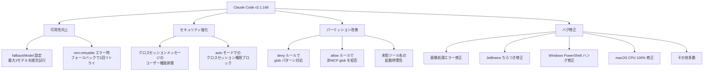
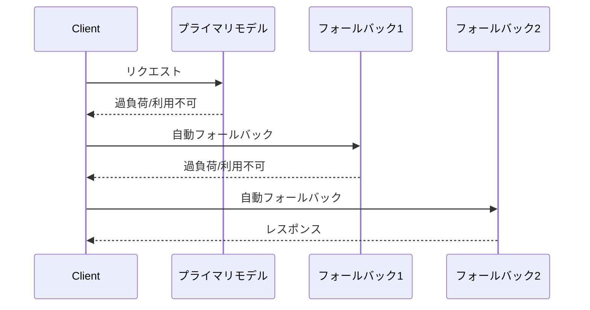
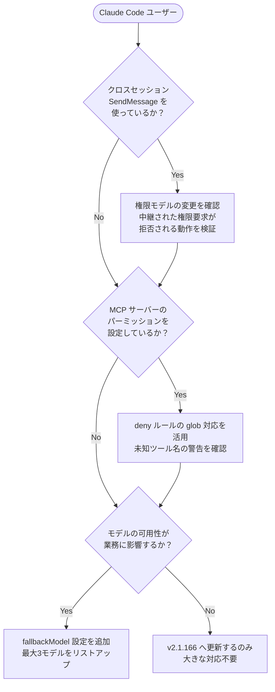

## はじめに

2026年6月6日、Anthropic は Claude Code v2.1.166 をリリースしました。このリリースは単なるバグ修正にとどまらず、**モデルの可用性を高める `fallbackModel` 設定**、**クロスセッションメッセージのセキュリティ強化**、**deny ルールの glob パターン対応**など、実運用で重要度の高い変更が多数含まれています。

Claude Code を日常的に使っている開発者・チーム管理者・MCP サーバー運営者にとって直接影響のある内容です。本記事では v2.1.166 の変更を中心に整理し、必要な対応を解説します。

> **📌 影響を受ける人**
> - Claude Code を CLI・SDK・エージェントとして利用している開発者
> - MCP サーバーを構築・運用しているエンジニア
> - Claude Code をチームで管理しているマネージャー・インフラ担当者
> - クロスセッション連携（SendMessage 経由）を活用しているユーザー

---

## 変更の全体像



---

## 変更内容

### 1. fallbackModel 設定（高優先度）

プライマリモデルが**過負荷・利用不可**の際に、最大3つのフォールバックモデルを順番に試行できるようになりました。これまでモデルが応答不能になると処理がそのまま失敗していましたが、この設定によって自動的に代替モデルへ切り替わります。

| 項目 | 詳細 |
|------|------|
| 最大フォールバック数 | 3モデル |
| 適用範囲 | インタラクティブセッション・CLI（`--fallback-model` オプションも対応） |
| フォールバックタイミング | プライマリモデルが過負荷・利用不可の場合 |
| non-retryable エラー時 | フォールバックモデルで1回リトライ |

> **💡 Tips**
> 認証エラー・レート制限・リクエストサイズ超過・トランスポートエラーはフォールバックされず即座に通知されます。意図しないリトライループを防ぐ設計になっています。

**フォールバックの試行フロー:**



---

### 2. クロスセッションメッセージのセキュリティ強化（高優先度）

> **⚠️ Breaking Change**
> 他の Claude セッションから `SendMessage` 経由で中継されたメッセージは、**ユーザー権限を持たなくなりました**。

これはプロンプトインジェクション攻撃や不正な権限昇格を防ぐための重要なセキュリティ強化です。

**変更前後の比較:**

| 項目 | 変更前 | 変更後 |
|------|--------|--------|
| 中継メッセージの権限 | ユーザー権限を継承 | 権限なし（剥奪済み） |
| 受信側の挙動 | 中継された権限要求を受理 | 中継された権限要求を拒否 |
| auto モードの挙動 | 許可する場合あり | ブロック |

クロスセッション連携を組み込んでいるシステムは、この変更による動作差異を検証してください。

---

### 3. deny ルールの glob パターン対応（中優先度）

パーミッション設定の `deny` ルールで、ツール名の位置に **glob パターン**が使えるようになりました。

```json
// すべてのツールを拒否する設定例
{
  "deny": [
    { "tool": "*" }
  ]
}
```

あわせて以下のルール変更も入っています：

- `allow` ルールでは **非MCP の glob を拒否**（誤設定防止）
- `deny` ルールで**未知のツール名が含まれる場合、起動時に警告**を表示

> **💡 Tips**
> これまで個別に列挙していた deny リストを `"*"` で一括拒否できるようになり、最小権限原則を実装しやすくなりました。

---

### 4. thinking トグルの改善

以下の設定で、Claude API 経由でデフォルトで thinking するモデルの thinking を無効化できるようになりました：

- `MAX_THINKING_TOKENS=0`
- `--thinking disabled`
- モデル別 thinking トグル

> **📌 注意:** サードパーティプロバイダへの影響はありません。Claude API 経由でのみ有効です。

---

### 5. バグ修正一覧

v2.1.166 では多数のバグが修正されています：

| カテゴリ | 修正内容 |
|----------|----------|
| 画像処理 | 処理不能画像での `"image could not be processed"` エラーと余分なトークン消費 |
| リモートセッション | 起動時の一時的バックエンド障害でセッションが永久停止する問題 |
| JetBrains IDE | 2026.1 以降のターミナルちらつき |
| キーボード | Kitty プロトコル使用ターミナルでの Shift+非ASCII文字の脱落 |
| Windows | PowerShell コマンド検証のハング |
| macOS | デーモン死亡後に `claude --bg-pty-host` が CPU 100% で残る問題 |
| voice モード | スタックした認証チェック |
| Managed settings | 不正エントリを含む場合に残りの有効ポリシー強制が無効化される問題 |
| MCP | `allowedMcpServers`/`deniedMcpServers` の `${VAR}` 参照が一致しない問題 |
| Worktree | git worktree に入ったバックグラウンドエージェントのクラッシュループ |
| UI | Ctrl+O トランスクリプトの thinking テキスト重複 |
| UI | `claude agents` 入力でのカーソル固定 |
| UI | Unicode 非対応ターミナルでのタスクリスト空行 |

---

## 影響と対応



### 対応チェックリスト

- [ ] `claude update` で v2.1.166 以降へアップデート
- [ ] クロスセッション連携を使っている場合は SendMessage 経由の権限動作を検証
- [ ] MCP パーミッションの deny ルールを glob で整理
- [ ] 高可用性が求められる場面では `fallbackModel` を設定
- [ ] managed settings に不正エントリがないか確認（ポリシー強制の問題修正に関連）

---

## コード例

### fallbackModel 設定の追加例

```json
// claude_config.json または設定ファイルに追記
{
  "model": "claude-opus-4-8",
  "fallbackModel": [
    "claude-sonnet-4-6",
    "claude-haiku-4-5-20251001"
  ]
}
```

### deny ルールで全ツールを拒否する例

```json
// Before: 個別に列挙
{
  "deny": [
    { "tool": "bash" },
    { "tool": "file_write" },
    { "tool": "web_fetch" }
  ]
}

// After: glob で一括拒否
{
  "deny": [
    { "tool": "*" }
  ]
}
```

### thinking を無効化する例

```bash
# 環境変数で無効化
MAX_THINKING_TOKENS=0 claude ...

# CLIオプションで無効化
claude --thinking disabled ...
```

---

## v2.1.167 について

同日リリースされた v2.1.167 は「バグ修正と信頼性の向上」のみの小規模リリースで、具体的な変更内容は公開されていません。v2.1.166 からの継続的な安定化パッチと考えられます。

---

## まとめ

Claude Code v2.1.166 の主要な変更点をまとめます：

| 変更 | 重要度 | 対応要否 |
|------|--------|----------|
| fallbackModel 設定（最大3モデル） | 高 | 可用性が求められる場合は設定推奨 |
| クロスセッションメッセージの権限剥奪 | 高 | SendMessage 利用者は必ず検証 |
| deny ルールの glob パターン対応 | 中 | MCP 運用者は設定を見直し |
| thinking 無効化の改善 | 中 | 必要に応じて設定 |
| 多数のバグ修正（JetBrains, Windows, macOS ほか） | 低〜中 | アップデートで自動解消 |

特にクロスセッション連携を利用しているシステムは **破壊的変更** が含まれるため、アップデート前に動作検証を行うことを強くお勧めします。
