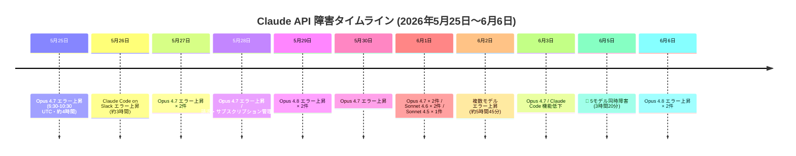
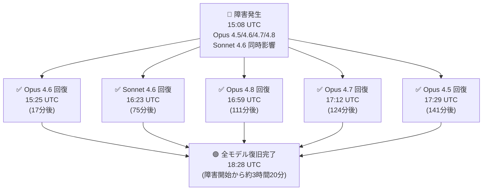
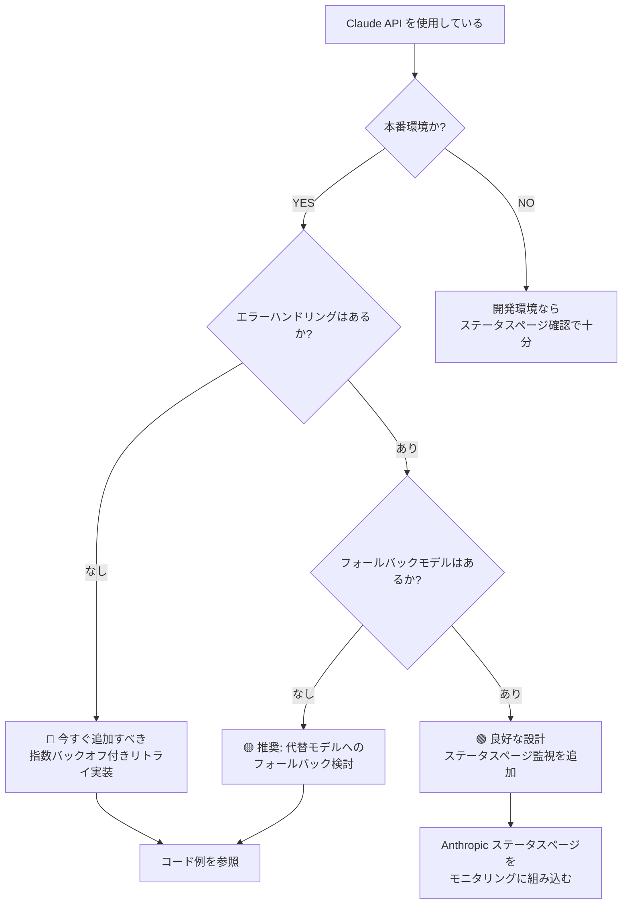

## はじめに

2026年5月25日〜6月6日の約2週間で、Anthropic の Claude API に**20件以上のインシデント**が記録されました。影響を受けたのは Claude Opus 4.5/4.6/4.7/4.8、Claude Sonnet 4.5/4.6 という主要モデル全般です。特に6月5日に発生した大規模障害では5モデルが同時に影響を受け、段階的な回復に3時間以上を要しました。

この記事では、Claude API を業務・プロダクトに組み込んでいる開発者に向けて、各インシデントの概要・影響範囲・回復パターンを整理し、障害時に取るべき対応策をまとめます。いずれのインシデントはすでに**解決済み**ですが、障害パターンを理解して冗長性を設計しておくことが重要です。

> **📌 影響を受ける人**
> - Claude API を本番環境で使用している開発者・企業
> - Claude Code（Slack 連携を含む）を業務フローに組み込んでいるチーム
> - Anthropic Console または claude.ai でサブスクリプション管理を行うユーザー

---

## 変更の全体像

### インシデント発生タイムライン



### 6月5日・大規模障害の回復フロー（最重要インシデント）



---

## 変更内容

### インシデント一覧（重要度順）

| 日時 (UTC) | 重要度 | 対象 | 影響時間の目安 | 備考 |
|---|---|---|---|---|
| 6月5日 15:08〜18:28 | 🔴 High | Opus 4.5/4.6/4.7/4.8, Sonnet 4.6 | 約200分 | 最大規模・5モデル同時 |
| 6月3日 04:17〜07:36 | 🔴 Medium | Claude Code 全般 | 約199分 | セキュリティ・コードレビュー機能含む |
| 5月28日 18:27〜19:05 | 🔴 Medium | claude.ai / Console 請求管理 | 約38分 | チャット・APIは正常 |
| 5月26日 01:56〜05:19 | 🔴 Medium | Claude Code on Slack | 約203分 | Slack連携のみ |
| 6月2日 06:04〜11:49 | 🟡 Medium | 複数モデル（詳細非公開） | 約345分 | 最長のダウンタイム |
| 5月25日 06:30〜10:30 | 🟡 Medium | Opus 4.7 | 約240分 | — |
| 6月6日 18:12〜18:55 | 🟡 Medium | Opus 4.8 | 約43分 | — |
| その他 | 🟡 Medium | Opus 4.7/4.8, Sonnet 4.6/4.5 | 数分〜60分 | 各1〜2件 |

### モデル別インシデント発生回数

| モデル | 発生件数 | 備考 |
|---|---|---|
| Claude Opus 4.7 | 8件 | 期間中で最多 |
| Claude Opus 4.8 | 5件 | 含む6月5日の大規模障害 |
| Claude Sonnet 4.6 | 3件 | 含む6月5日の大規模障害 |
| Claude Opus 4.5 | 2件 | 含む6月5日の大規模障害 |
| Claude Sonnet 4.5 | 1件 | — |
| Claude Opus 4.6 | 1件 | 6月5日の大規模障害のみ |
| Claude Code / Slack | 2件 | ツール機能障害 |
| 請求・Console | 1件 | サービス基盤障害 |

---

## 影響と対応

### 開発者が今すぐ取るべきアクション

この期間のインシデントはすべて解決済みですが、同様の障害が発生した際に備えた設計を見直すきっかけとしてください。



**具体的な対応チェックリスト:**

- [ ] **ステータスページの監視**: Anthropic の公式ステータスページを Slack や PagerDuty に連携する
- [ ] **指数バックオフ付きリトライ**: 5xx エラー受信時に自動でリトライ
- [ ] **タイムアウトの適切な設定**: ネットワーク障害とモデル障害を区別する
- [ ] **フォールバックモデルの設計**: Opus が落ちた場合に Sonnet へ自動切り替え
- [ ] **Circuit Breaker パターン**: 連続エラー時にリクエストを一時停止して回復を待つ

> **💡 Tips**
> 今回の障害で注目すべきは「6月5日の段階的回復」です。Opus 4.6 は17分で回復した一方、Opus 4.5 は141分かかりました。モデルによって回復タイミングが異なるため、複数モデルへのフォールバックは非常に有効です。

---

## コード例

### Before: エラーハンドリングなしの実装

```python
import anthropic

client = anthropic.Anthropic()

# 障害発生時にそのまま例外が上がってしまう
def call_claude(messages: list) -> str:
    response = client.messages.create(
        model="claude-opus-4-8",
        max_tokens=1024,
        messages=messages
    )
    return response.content[0].text
```

### After: リトライ・フォールバック付きの実装

```python
import anthropic
import time
import logging

logger = logging.getLogger(__name__)
client = anthropic.Anthropic()

# 優先順位付きのフォールバックモデルリスト
FALLBACK_MODELS = [
    "claude-opus-4-8",
    "claude-sonnet-4-6",  # Opus が落ちた場合のフォールバック
]

def call_with_retry(
    messages: list,
    max_retries: int = 3,
    base_delay: float = 1.0,
) -> str:
    """指数バックオフ付きリトライ + モデルフォールバック"""
    last_error = None

    for model in FALLBACK_MODELS:
        for attempt in range(max_retries):
            try:
                response = client.messages.create(
                    model=model,
                    max_tokens=1024,
                    messages=messages
                )
                if attempt > 0 or model != FALLBACK_MODELS[0]:
                    logger.info(f"成功: model={model}, attempt={attempt + 1}")
                return response.content[0].text

            except anthropic.APIStatusError as e:
                last_error = e
                # 5xx 系のみリトライ対象（4xx はリトライしない）
                if e.status_code < 500:
                    raise
                if attempt < max_retries - 1:
                    delay = base_delay * (2 ** attempt)
                    logger.warning(
                        f"エラー {e.status_code} (model={model}), "
                        f"{delay:.1f}秒後にリトライ ({attempt + 1}/{max_retries})"
                    )
                    time.sleep(delay)
                else:
                    logger.error(f"model={model} で最大リトライ到達、次のモデルへ")

            except anthropic.APIConnectionError as e:
                last_error = e
                logger.error(f"接続エラー (model={model}): {e}")
                break  # 接続エラーは即座に次のモデルへ

    raise RuntimeError(f"全モデルで失敗: {last_error}")


# 使用例
if __name__ == "__main__":
    result = call_with_retry([
        {"role": "user", "content": "Hello, Claude!"}
    ])
    print(result)
```

> **💡 Tips**
> `anthropic.APIStatusError` の `status_code` が `529`（Overloaded）の場合も 5xx として扱われ、リトライ対象になります。Anthropic が高負荷時に返す独自ステータスコードです。

---

## まとめ

| 観点 | 内容 |
|---|---|
| 期間 | 2026年5月25日〜6月6日（約13日間） |
| インシデント総数 | 20件（すべて解決済み） |
| 最重大障害 | 6月5日の5モデル同時障害（約3時間20分） |
| 最多影響モデル | Claude Opus 4.7（8件） |
| Claude Code への影響 | 2件（Slack連携含む） |
| 請求・Console への影響 | 1件（チャット・APIは正常） |

今回のインシデント群から得られる教訓は以下の3点です。

1. **Claude Opus 4.7/4.8 は特に頻繁にインシデントが発生した**: 最新・最高性能モデルほどリスクを考慮した設計が必要です
2. **6月5日の大規模障害はモデルごとに回復速度が異なった**: フォールバック設計の有効性が実証されました
3. **Claude Code の障害はモデル障害とは独立して発生した**: ツール機能と API の可用性は別々に監視する必要があります

本番環境で Claude API を使用している場合は、リトライロジックとフォールバックモデルの実装を最優先で検討してください。
