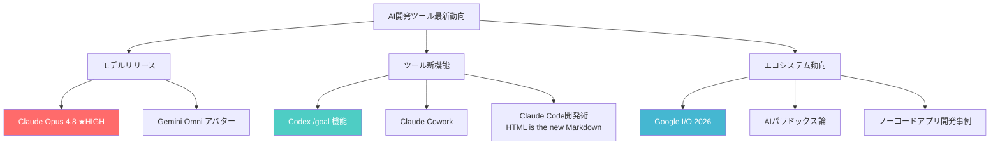
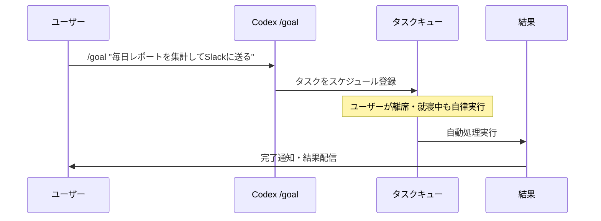
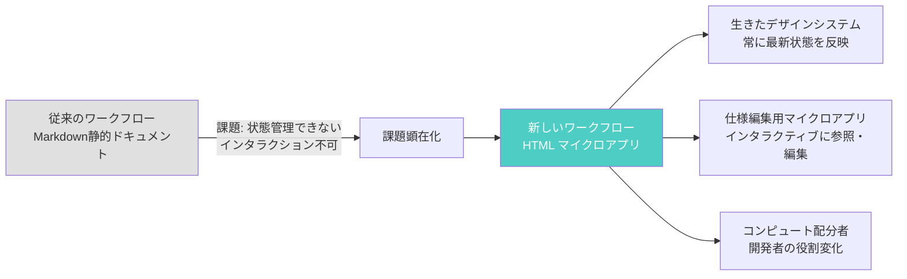

## はじめに

AI開発ツール界隈は2026年前半も大きな動きが続いています。**Claude Opus 4.8のリリースとレビュー**、**CodexのGoals自律機能**、**Gemini OmniのAIアバター**、**Google I/O 2026の発表内容**、そして**AnthropicエンジニアによるClaude Code開発術**など、注目度の高いトピックが相次いで共有されました。

本記事では、Lenny's Newsletterのエコシステムで報じられた複数のAI関連トピックを整理し、エンジニア・PM・非エンジニアのビルダーが今すぐ実践できる情報を提供します。

> **📌 影響を受ける人**
> - Claude API・Claude Codeを使っているエンジニア
> - OpenAI Codexで業務自動化を進めているPM・開発者
> - Google I/O 2026の発表を追いきれていない開発者
> - AI時代のキャリアや働き方を考えているすべての人

---

## 変更の全体像

今回カバーするトピックは「モデルリリース」「ツール新機能」「エコシステム動向」の3カテゴリに整理できます。



---

## 変更内容

### 1. Claude Opus 4.8：実力と弱点の第一印象レビュー

> **📌 影響を受ける人**
> Claude APIを利用しているエンジニア・研究者・ビジネスユーザー全員

Claude Opus 4.8がリリースされ、Lenny's Podcastネットワークのレビューでその第一印象が共有されました。複数エピソードで取り上げられるほど注目度の高いリリースです。

**評価サマリー：**

| 評価軸 | 内容 |
|--------|------|
| 優れている領域 | 複雑な推論・長文処理・実践的なタスク遂行 |
| 物足りない領域 | 使用感ベースで変動、継続的なベンチマーク比較が必要 |
| 総合注目度 | 高（リリース直後から複数メディアで特集） |
| 関連ツール | Claude Code、Claude Cowork との組み合わせで真価を発揮 |

AnthropicのエンジニアFelix Riesebergが紹介した**Claude Cowork**の実践的ユースケースも同時期に注目されています：

- **間取り図 → 3Dウォークスルー生成**：設計図をClaudeに渡すだけで3D体験コンテンツを自動生成
- **約束の自動追跡**：会話やメールから約束事を自動検出してリマインド
- **20ドルのハードウェア「buddy」製作**：低コストデバイスをAIで制御する物理コンパニオン

---

### 2. Codex /goal 機能：寝ている間も働くAIエージェント

> **📌 影響を受ける人**
> OpenAI Codexを使っている開発者・繰り返しタスクを自動化したいPM・エンジニア

Codexの新機能「/goal」は、**自律的にバックグラウンドで動作するエージェント機能**です。一度目標を設定すれば、ユーザーが作業していない間も処理が継続されます。



**実際に機能する目標を書くための6部構成フレームワーク：**

| 構成要素 | 説明 | 例 |
|---------|------|-----|
| **What（何を）** | 具体的なアウトプットを定義 | PRレビューサマリーを作成する |
| **When（いつ）** | トリガー条件またはスケジュール | 新しいPRがオープンされたとき |
| **Where（どこで）** | 対象データ・ツール・環境 | GitHubリポジトリ "my-org/my-repo" |
| **How（どのように）** | 処理の手順・優先順位 | 差分を解析しリスク・要点を箇条書き |
| **Who（誰に）** | 通知先・責任者 | #dev-reviewsチャンネルにメンション |
| **Why（なぜ）** | 成功の判断基準 | レビュー開始時間を短縮し見落としを防ぐ |

**実用ユースケース3選：**

1. **定期レポート自動生成**：データソースから毎朝ビジネスサマリーを作成
2. **コードレビュー自動化**：PR作成時に自動でレビュー実行・コメント投稿
3. **ドキュメント自動同期**：コード変更に合わせてREADME・仕様書を更新

---

### 3. AnthropicエンジニアのClaude Code開発術「HTMLは新しいMarkdown」

> **📌 影響を受ける人**
> Claude Codeを使っているエンジニア・仕様書やドキュメントを日常的に扱う開発者

AnthropicのClaude Codeエンジニア Thariq Shihiparが、注目すべき主張を展開しています：**「MarkdownはHTMLに置き換えられる」**。

この変化の背景と実践方法：



**3つの核心的な変化：**

- **仕様編集用マイクロアプリ**：MarkdownファイルではなくHTMLベースの小さなアプリで仕様を管理。インタラクティブな編集・参照・状態管理が可能になる
- **生きたデザインシステム**：静的ドキュメントから、常に最新状態を反映するHTML+JSの動的システムへ移行
- **「コンピュート配分者」としての開発者**：コードを書く人から、コンピュートリソースを適切に割り当てる意思決定者へ役割が変化

> **💡 Tips**
> Claude Codeで複雑な仕様を扱う際、Markdown形式よりもHTML形式で記述することでClaudeの文脈理解と出力精度が向上する可能性があります。仕様書のリッチ化を小さいスコープでPoC的に試してみてください。

---

### 4. Google I/O 2026の主要発表

> **📌 影響を受ける人**
> GoogleのAPI・サービスを利用している開発者

Google I/O 2026のDay 1発表が30分でまとめられ、「速いもの・不完全なもの・開発者が本当に注目すべきもの」という3軸で評価が共有されました。

**注目トピック：Gemini Omni AIアバター**

QRコードをスキャンして顔をクローン化し、**15分以内にハイプリール（宣伝動画）を生成**するワークフローが実演されました。


---

### 5. AIパラドックス：自動化が進むほど人間の役割が重要になる

Dan Shipperの論考で提示された「AIパラドックス」はエンジニア・PMの両者に強い示唆を与えます：

| 主張 | 内容 |
|------|------|
| 「ほとんどの仕事はCodexとClaude Code内で行われるようになる」 | CLI中心の時代から高レベルAI環境中心の時代へ移行 |
| 「CLIの時代は終わった」 | CodexやClaude Codeのような環境が主戦場になる |
| 「すべてのエージェントには人間が必要」 | AIが自律化するほど、監督・意思決定する人間の重要性が増す |
| 「PMとデザイナーに強気」 | AIが実装を担うほど「何を・なぜ作るか」を決める役割の価値が上がる |

---

## 影響と対応

### エンジニアが取るべきアクション

| トピック | 優先度 | 推奨アクション |
|---------|--------|---------------|
| Claude Opus 4.8 | **高** | 現在使用中のモデルとのベンチマーク比較を実施 |
| Codex /goal 機能 | **中〜高** | 定期タスクを/goalで自動化できるか棚卸し |
| Claude Code × HTML | **中** | 仕様書のHTML化をPoC的に小さく試す |
| Google I/O 2026発表 | **中** | 利用中のGoogle APIへの影響を確認 |

### PMが取るべきアクション

- **Codex Goalsの6部フレームワーク**を使い、繰り返しタスクの自動化ロードマップを作成する
- **ノーコード開発事例**（技術スキルゼロでのApp Store公開）を参考に、AI活用の民主化施策を検討する
- **AIパラドックス論**を踏まえ、AI時代における自チームの役割・バリューを再定義する

---

## コード例

### Codex /goal：6部フレームワークの記述例

```
/goal
What: PRレビューのサマリーをSlackに通知する
When: 新しいPRがオープンされたとき
Where: GitHubリポジトリ "my-org/my-repo" のすべてのPR
How: 差分を解析し、変更の要点・リスク・推奨レビュアーを箇条書きで整理する
Who: #dev-reviews チャンネルにメンション付きで投稿
Why: レビュー開始までの時間を短縮し、見落としを防ぐことで品質を維持する
```

### Claude Code × HTML仕様書：Before/After

**Before（従来のMarkdown）:**

```markdown
## ユーザー登録フロー
1. メールアドレスを入力
2. パスワードを入力
3. 確認メールを送信
```

**After（HTMLマイクロアプリ）:**

```html
<!DOCTYPE html>
<html lang="ja">
<head>
  <meta charset="UTF-8">
  <title>ユーザー登録フロー仕様</title>
  <style>
    [data-status="implemented"] { color: green; }
    [data-status="in-progress"] { color: orange; }
    [data-status="pending"] { color: gray; }
  </style>
</head>
<body>
  <h1>ユーザー登録フロー</h1>
  <ol id="steps">
    <li data-status="implemented">メールアドレスを入力</li>
    <li data-status="implemented">パスワードを入力</li>
    <li data-status="in-progress">確認メールを送信</li>
    <li data-status="pending">メール認証完了後にダッシュボードへリダイレクト</li>
  </ol>
  <p id="summary"></p>
  <script>
    const steps = document.querySelectorAll('[data-status]');
    const done = [...steps].filter(s => s.dataset.status === 'implemented').length;
    document.getElementById('summary').textContent =
      `進捗: ${done}/${steps.length} ステップ完了`;
  </script>
</body>
</html>
```

HTMLにすることで、Claude Codeが仕様の構造・実装ステータス・依存関係をより正確に把握でき、生成コードの品質が向上します。

---

## まとめ

2026年前半のAI開発ツール界隈を総括すると、以下の5点が際立ちます：

1. **Claude Opus 4.8**がリリースされ、実用水準の高いモデルとして複数の媒体で注目された
2. **Codex /goal機能**により「寝ている間も自律動作するエージェント」が実現可能になった
3. **AnthropicエンジニアはHTMLでMarkdownを置き換える**という新しい開発スタイルを実践している
4. **AIパラドックス**が示す通り、AIが高度化するほどPM・デザイナーなど「何を作るか」を決める役割の価値が増す
5. **技術スキルゼロでもApp Storeにアプリを公開できる**時代が実際に到来している

AI時代の開発者に求められるのは「コードを書く」スキルだけでなく、**「何を・なぜ作るか」を定義し、AIを適切に監督・配分するスキル**です。今回紹介したClaudeの新モデル、Codex Goals機能、そしてHTML-first仕様管理という考え方を取り入れて、AI時代の開発スタイルにアップデートしていきましょう。
